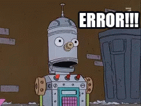

IntroR
================

## Introduction

This tutorial was prepared from [here - prepared by Zachary
Noel](https://github.com/Chilverslab/Lunch_and_Learn/tree/master/01_BasicR)
and partially following the book from Robert Colautti at Queen’s
University found here as [R Crash Course for
Biologists](https://github.com/ColauttiLab/RCrashCourse_Book).

### First things first

Learning coding takes time and repetition. It is like learning a
language. The more you use it the better you will be. In all of these
exercises please type out each line of code. It is important!

> **Physically typing out the code reinforces it in your brain.**

### Lets get started

A few housekeeping rules you should know:

- a ‘hash’ or ‘pound-sign’ starts a comment and will not be executed
- The sequence of key strokes *command enter* will run (i.e., compile) a
  line of code
- R is case sensitive. X does not equal x

### Learning objectives

- use basic mathematical operators in R
- know some data objects and how to index them
- install packages
- load your data into R from a .csv or .txt file

R is just a big calculator!! using the basic mathematical operators
like + - \* /

> **Physically typing out the code reinforces it in your brain.**

``` r
2 + 2  # returns 4
```

    ## [1] 4

``` r
2 - 2  # returns 0
```

    ## [1] 0

``` r
2/2  # returns 1
```

    ## [1] 1

``` r
2 * 2  # returns 4
```

    ## [1] 4

We can set values equal to things. When we do this we call the new thing
an **object**. There are many types of **objects**, which we will
explore soon.

For example, setting a atomic value (only one type = scalar) to an
object (scalar object) we do this with the *\<-* or *=* symbols. This

``` r
x <- 2  # highlighting the x and compile 
y = 3  # the preferred syntax is to use the '<-'. the '=' is to be used within a function, we will see this later
```

So, here we *saved* the value of 2 to the letter x and the value 3 to
the letter y.

Now we can do stuff with the x and y. R is a *fancy* calculator!!!

``` r
x + y  # returns 5
```

    ## [1] 5

``` r
x - y  # returns -1
```

    ## [1] -1

``` r
x/y  # returns 0.6666
```

    ## [1] 0.6666667

``` r
x * y  # returns 6
```

    ## [1] 6

We can also save scalar objects with non-numeric data. For example we
can set an object equal to a character string by do this by putting it
in quotes

``` r
name <- "Zach"
seven <- "7"
```

What if we try to add a character to a number?

``` r
seven + x
```

    ## Error in seven + x: non-numeric argument to binary operator



Will not work, R is a *smart* calculator

But why!! Lets debug. We will do this with some functions. But first we
need to know functions.

Remember **objects**?

Objects are manipulated with **functions**

Each function starts with a name and opens parentheses and you type what
you want to do to the object in the parentheses.

For example, we will use the function `class()` to know what type of
data is stored in the scalar objects `seven` and `x`.

``` r
class(seven)
```

    ## [1] "character"

``` r
class(x)
```

    ## [1] "numeric"

We can see that the output tells us that `seven` is a character type and
`x` is a numeric type. Under the rules of R we cannot add a number to a
character and this is why you get the error.

Ok now that we know what a function is we will introduce some new
functions.

Lets use the `c()` function i.e. *concatenate function* to create a
vector, or a bunch of scalar elements saved together in one **object**.

``` r
vec <- c(1, 2, 3, 4, 5, 6, 7)  # numeric vector 
vec <- c(1:7)  # same numeric vector as above, the ':' (colon) generates a sequence
vec <- 1:7  # also works without the concatenate function
vec2 <- c("Zach", "Jie", "Mitch")  # character vector 
vec3 <- c(TRUE, FALSE, TRUE)  # logical vector
```

We can index a vector by using brackets `[]`

``` r
vec2[2]  # returns the second element of vec2
```

    ## [1] "Jie"

Remember, R is a big calculator!!

``` r
vec + x  # will add the scalar x, elementwise to the vec object 
```

    ## [1] 3 4 5 6 7 8 9

We can also use some built in functions to calculate some basic summary
stats

``` r
mean(vec)  # mean
```

    ## [1] 4

``` r
sd(vec)  # standard deviation
```

    ## [1] 2.160247

``` r
sum(vec)  # sum
```

    ## [1] 28

``` r
median(vec)  # median
```

    ## [1] 4

``` r
min(vec)  # minimum 
```

    ## [1] 1

``` r
max(vec)  # maximum
```

    ## [1] 7

``` r
summary(vec)  #IQR - output depends on the data class
```

    ##    Min. 1st Qu.  Median    Mean 3rd Qu.    Max. 
    ##     1.0     2.5     4.0     4.0     5.5     7.0

``` r
abs(vec) # absolute value
```

    ## [1] 1 2 3 4 5 6 7

``` r
sqrt(vec) # square root (with subtraction)
```

    ## [1] 1.000000 1.414214 1.732051 2.000000 2.236068 2.449490 2.645751

``` r
log(vec) # natural log
```

    ## [1] 0.0000000 0.6931472 1.0986123 1.3862944 1.6094379 1.7917595 1.9459101

``` r
log10(vec) # log base 10
```

    ## [1] 0.0000000 0.3010300 0.4771213 0.6020600 0.6989700 0.7781513 0.8450980

``` r
exp(vec) # power of e
```

    ## [1]    2.718282    7.389056   20.085537   54.598150  148.413159  403.428793
    ## [7] 1096.633158

R also understands logical operators

- `>` greater than
- `<` less than
- `|` or
- `&` and
- `=` equals (used for assigning values from left to right)
- `==` exactly equal (for showing equality between values)
- `>=` greater than or equal
- `!=` not equal to

Now practice using logical operators

We can use logical operators to compare numbers

``` r
1 > 2 # greater than
```

    ## [1] FALSE

``` r
1 < 2 # less than
```

    ## [1] TRUE

``` r
1 <= 2 # less than or equal to
```

    ## [1] TRUE

``` r
1 == 1 # equal to
```

    ## [1] TRUE

``` r
1 == 2 | 1 == 1 # | means 'OR'
```

    ## [1] TRUE

``` r
1 == 2 & 1 == 1 # & means 'AND' 
```

    ## [1] FALSE

``` r
1 == 1 & 1 == 1
```

    ## [1] TRUE

We can also use logical operators to find things in objects

Consider the following vector *t*, which is a numeric vector

``` r
t <- 1:10  # numeric vector
```

We can find elements of *t* that fit our desire using logical operators

``` r
t[(t > 8) | (t < 5)]  # only the numbers that are greater than 8 or less than 5
```

    ## [1]  1  2  3  4  9 10

``` r
t[(t > 8) & (t < 10)]  # returns 9
```

    ## [1] 9

``` r
t[t != 2]  # returns elements of t that are not exactly equal to 2
```

    ## [1]  1  3  4  5  6  7  8  9 10

``` r
t[!t == 2] # multiple ways to do the same thing
```

    ## [1]  1  3  4  5  6  7  8  9 10

We can also ask R to report back things. Like if a number exists in a
vector.

``` r
1 %in% t
```

    ## [1] TRUE

Wow! awesome job. We will cover data types next and how to index them

### Data types

we will now explore more advanced data objects, we have already seen
scalar and vector we will explore *matrices* and *dataframes*. Other
data types like *lists* are useful for some purposes, but we will look
at them later.

#### Matrices

a matrix is an atomic object, meaning it can only contain one data
class, i.e. numeric, character, or logical

we can create a matrix by using the matrix function `matrix()`.  
if you do not know how to use a function you can navigate to the help
section or use the question mark `?` followed by the function name.

Example: `?matrix`

Lets create a matrix called `mat1` with 3 columns and 3 rows containing
the values 1, 2, and 3

``` r
mat1 <- matrix(data = c(1, 2, 3), nrow = 3, ncol = 3)
mat1 # output mat1 to the console
```

    ##      [,1] [,2] [,3]
    ## [1,]    1    1    1
    ## [2,]    2    2    2
    ## [3,]    3    3    3

We can have character matricies too

``` r
mat2 <- matrix(data = c("Zach", "Jie", "Tom"), nrow = 3, ncol = 3)
mat2 # output mat1 to the console
```

    ##      [,1]   [,2]   [,3]  
    ## [1,] "Zach" "Zach" "Zach"
    ## [2,] "Jie"  "Jie"  "Jie" 
    ## [3,] "Tom"  "Tom"  "Tom"

We can transpose the matrix with the `t()` function.

``` r
t(mat1) # turns rows into columns and columns into rows
```

    ##      [,1] [,2] [,3]
    ## [1,]    1    2    3
    ## [2,]    1    2    3
    ## [3,]    1    2    3

Next lets practice indexing, or moving through, a matrix.

We do this with brackets

``` r
mat1[1]  # returns the first element of the matrix i.e. row 1 column 1
```

    ## [1] 1

``` r
mat1[2]  # returns the second element of the matrix i.e. row 2 column 1 
```

    ## [1] 2

``` r
mat1[5]  # returns the 5th element of the matrix i.e. row 2 column 2
```

    ## [1] 2

R allows you to take a shortcut by specifying `[rows,columns]`

``` r
mat1[1, 3]  # returns the element in row 1 column 3
```

    ## [1] 1

if we leave the row or column space blank we will select

``` r
mat1[1, ]  # returns the first row 
```

    ## [1] 1 1 1

Ok great! Now that we know matricies, dataframes are very similar, but a
little more useful for our purposes because we can store different data
types (i.e., classes) into a dataframe. Indexing works the same way, and
with the `$`, which we will demonstrate below.

we can create a dataframe using the `data.frame()` function

``` r
df <- data.frame(mat1[,1], mat2[,1]) # created a data frame with the first columns of mat1 and mat2 and all rows
df # output to see in the console
```

    ##   mat1...1. mat2...1.
    ## 1         1      Zach
    ## 2         2       Jie
    ## 3         3       Tom

Now I don’t like the column headers so we can use the `colnames()`
function to rename them

``` r
colnames(df) <- c("value", "name")
df
```

    ##   value name
    ## 1     1 Zach
    ## 2     2  Jie
    ## 3     3  Tom

That’s better. Now lets work the the dataframe

indexing with data frames work the same as with matrices

``` r
df[1, ]  # returns the first row of the dataframe 
```

    ##   value name
    ## 1     1 Zach

``` r
df[, "value"]  # returns the first column
```

    ## [1] 1 2 3

However, dataframes are awesome because we we can introduce a new and
super easy way to index dataframes with the `$` opperator.

``` r
df$value # outputs the entire column named value, the result is a vector
```

    ## [1] 1 2 3

``` r
df$name # outputs the entire column named name, the result is a vector
```

    ## [1] "Zach" "Jie"  "Tom"

``` r
df$name[2] # Brackets help us output the second value in our name column
```

    ## [1] "Jie"

``` r
df$name[2:3] # Brackets help us output the second through the third value in our name column with a colon.
```

    ## [1] "Jie" "Tom"

We can use the `str()` function to see the data classes stored in our
data frame

``` r
str(df)
```

    ## 'data.frame':    3 obs. of  2 variables:
    ##  $ value: num  1 2 3
    ##  $ name : chr  "Zach" "Jie" "Tom"

We see we have a data frame with three observations and two variables.
The varaibles are named *value* and *name*. *value* contains a numeric
data class, where as *name* contains a character data class.

Since names is a character vector within the data frame R will also
return a levels statement this just indicates the groups of your data.
In other words we can subset our data.

``` r
df$value[df$name == "Jie"]  # returns 2, i.e. the element of var1 such that names = Jie 
```

    ## [1] 2

``` r
df[df$name == "Jie",] # returns all rows with the value Jie in the name column.
```

    ##   value name
    ## 2     2  Jie

Again, just like stated before there are multiple ways to do the same
thing in R

In this case we can also use the `subset()` function

``` r
subset(df, name == "Jie") # returns the same thing as above
```

    ##   value name
    ## 2     2  Jie

We can add columns to a dataframe to create a new variable

``` r
df$log_value <- log(df$value) # create a new column with the column header named "log_value" and create this variable with the log of the "value" column
df
```

    ##   value name log_value
    ## 1     1 Zach 0.0000000
    ## 2     2  Jie 0.6931472
    ## 3     3  Tom 1.0986123

### INSTALLING PACKAGES

Since R is an open source language, anybody can contribute and add/edit
a package packages are just extra code that is loaded into R to do
calculations that do not come with the basic R functions. In other
words. Packages just contain more functions to manipulate R objects.

There are several ways to install a package, including from github, from
R studio manually, from source. But I will teach the best and easiest
and most reproducible way to do this now using the `install.packages()`
function.

You instert the text in quotes of the package you want to install. We
will install the package `ggplot2`

``` r
install.packages("ggplot2")  # use quotes around the package name
```

You will see some output in the console and should get something that
says “the downloaded binary packages are in”. This just tells you where
the package source code is installed on your computer. You will rarely
need to ever actually know where that is, but know it is physically on
your computer.

There are thousands of R packages already out there. Several we will use
in this class are the following:

- [dplyr](https://dplyr.tidyverse.org/)
- [ggplot2](https://ggplot2.tidyverse.org/)
- [purrr](https://purrr.tidyverse.org/)

All of the above packages (and some others) can be installed using one
install called the tidyverse - [tidyverse](https://www.tidyverse.org/)

More packages that are useful - [lme4](https://github.com/lme4/lme4) for
mixed linear models -
[emmeans](https://cran.r-project.org/web/packages/emmeans/index.html)
for estimating marginal means

### Reading in data to R

Last thing we will do that covers the basics is reading in data from R

> **It is really really important you know how to do this.**

We will work with .txt files or .csv files

We can read in a .csv file with the `read.csv()` function by specifying
the path to the file.

To do this you will have to know where you are on your computer. We can
check this by knowing your working directory.

> **In an R project your working directory is the directory where your R
> project is saved!!**

``` r
getwd()
```

Now we can navigate to the filepath from our working directory to read
in the data.

``` r
csv <- read.csv("corr.csv", na.strings = "NA")
```
