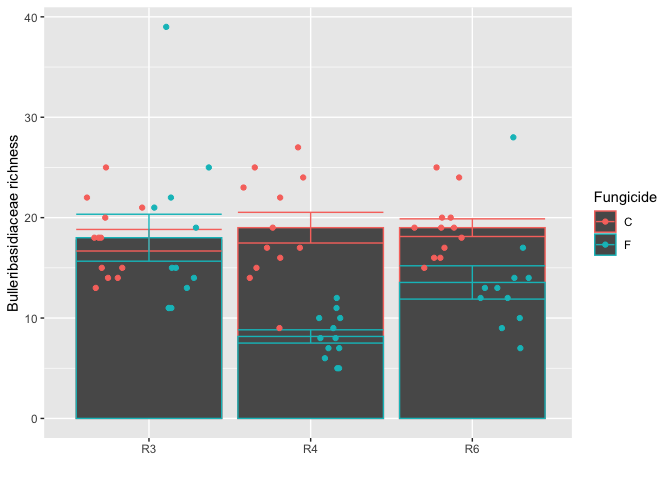

# Introduction to visualizations in R

In this tutorial we will learn the basics of R’s capabilities in data
visualization.

R has a basic built in plot feature, but honestly (in my opinion) does
not look great and is not worth spending too much time on. I will
demonstrate it a little below with a built in R dataset.

To load a built in dataset just type the function `data()` and the data
you want to load in from the list

``` r
data("mtcars")
```

The variables inside the cars dataset include:

- mpg = the mpg
- cyl = number of cylinders
- disp = displacement
- hp = gross horsepower
- drat = rear axle ratio
- wt = weight
- qsec = quarter mile time
- vs = engine shape V = 0 or Straight = 1
- am = Transmission type; 0 = auto, 1 = manual
- gear = number of forward gears
- carb = number of carburetors

We can see the structure of the dataframe using the `str()` function

``` r
str(mtcars)
```

    ## 'data.frame':    32 obs. of  11 variables:
    ##  $ mpg : num  21 21 22.8 21.4 18.7 18.1 14.3 24.4 22.8 19.2 ...
    ##  $ cyl : num  6 6 4 6 8 6 8 4 4 6 ...
    ##  $ disp: num  160 160 108 258 360 ...
    ##  $ hp  : num  110 110 93 110 175 105 245 62 95 123 ...
    ##  $ drat: num  3.9 3.9 3.85 3.08 3.15 2.76 3.21 3.69 3.92 3.92 ...
    ##  $ wt  : num  2.62 2.88 2.32 3.21 3.44 ...
    ##  $ qsec: num  16.5 17 18.6 19.4 17 ...
    ##  $ vs  : num  0 0 1 1 0 1 0 1 1 1 ...
    ##  $ am  : num  1 1 1 0 0 0 0 0 0 0 ...
    ##  $ gear: num  4 4 4 3 3 3 3 4 4 4 ...
    ##  $ carb: num  4 4 1 1 2 1 4 2 2 4 ...

Lets attempt our first plot using base R. We can do this with the
`plot()` function and the argruments `x` and `y` to make a basic scatter
plot.

``` r
plot(x = mtcars$wt, y = mtcars$mpg)
```

<!-- -->

We can see that as car weight increases, you get lower mpg.

There are lots of options for base R plotting. We can change the x and y
axes, change fonts, colors, shapes, and write custom legends. We do this
with specific options or parameters separated by commas.

For example. We can add on x and y labels, change the font and change
the shapes of the points.

``` r
plot(x = mtcars$wt, y = mtcars$mpg,
     xlab = "Car Weight", 
     ylab = "Miles per gallon", 
     font.lab = 6, 
     pch = 20) 
```

<!-- -->

This is an ok plot, and this can work. But there are lots of options
that can be implimented that may not be super easy in base R plotting.
For a more extensive tutorial on base R plotting please see the numerous
resources on the internet. An example is
[here](https://towardsdatascience.com/base-plotting-in-r-eb365da06b22)

Base R is great, but I really want to teach everyone `ggplot` because it
is the most used for visualization, the figures look great, and you can
really story tell with data using `ggplot`.

### `ggplot` basics

Also, there are so many options for `ggplot` and this tutorial is not
intended to cover them all. That is too much. It is intended to guide
students on the most useful visualizations for their data or the most
common types. For extensive options regarding `ggplot` and its use
please refer to the ggplot cheat sheet and other internet resources.
Remember google can be your friend if you know what you are looking to
plot.

The [ggplot ‘cheat
sheet’](https://raw.githubusercontent.com/rstudio/cheatsheets/main/data-visualization.pdf)
is a downloadable pdf that provides a good summary and quick-reference
guide for advanced graphics. Other useful cheat sheets are available
here: <https://www.rstudio.com/resources/cheatsheets/>

you will need to install the `ggplot2` package if you do not have it
installed.

# Load in packages you need

``` r
#install.packages("ggplot2")
library(ggplot2)
```

For ggplot we will go through the following things

- basic syntax
- layers (i.e., geoms)
- stats
- position adjustments
- scales
- facetting
- themes

Other things like axes and legend manipulations wont be covered here
just for time. Also, we will not get to all the possible geoms and
abilities of `ggplot`. The intention is to demonstrate some of the most
useful examples for our class population. But again, all things are just
a google away

### Basic syntax

`ggplot` operates by begining a call to `ggplot` using the function
`ggplot()`. If you did this you would see an empty plot!

``` r
ggplot()
```

<!-- -->
Whoa! you made a ggplot!

To plot actual data we need to use what is called aesthetic mappings and
tell it where to find the data. We do this by giving the dataframe name
and using the `aes()` function within the `ggplot()` function. This is
essentially where we put our x and y variables, along with some other
things, which we will get to.

``` r
ggplot(mtcars, aes(x = wt, y = mpg))
```

<!-- --> You
should now have a plot with the x and y axes on an empty ggplot.

### Adding data or layers

The second thing to know about `ggplot` is that it works in *layers*.
Just like an onion and just like shrek. 

The layers are called `geoms` and you access them by calling the geoms
separately and they will appear in order as layers on top of each other.

### Two continuous numerical variables

For example, lets add points using the geom - `geom_point()`. To do this
we need to know another thing about `ggplot` syntax, which is that we
use the `+` sign to *add* layers to plots.

``` r
ggplot(mtcars, aes(x = wt, y = mpg)) +
  geom_point()
```

<!-- -->

We can add different layers or geoms to the plot. For example, lets add
a layer for a trendline. We can do this using the `geom_smooth()`

``` r
ggplot(mtcars, aes(x = wt, y = mpg)) +
  geom_point() + 
  geom_smooth()
```

    ## `geom_smooth()` using method = 'loess' and formula = 'y ~ x'

<!-- -->
Notice when we do this there is an overal trend drawn based on the
default algorithm for ggplot.

We can draw the best fitting linear relationship using `geom_smooth()`
and adding some extra options into the `geom_smooth()` function.

``` r
ggplot(mtcars, aes(x = wt, y = mpg)) +
  geom_point() + 
  geom_smooth(method = lm, se = FALSE) 
```

    ## `geom_smooth()` using formula = 'y ~ x'

<!-- --> The
option method = lm (Linear Model) tells ggplot to find the best fit
linear relatinship. Then the option se = TRUE or FALSE tells whether to
draw the 95% confidence interval for predicted values along the best fit
line.

A good example of how the layering works is to now change the order of
the geoms in the plot.

``` r
ggplot(mtcars, aes(x = wt, y = mpg)) +
  geom_smooth(method = lm, se = FALSE) +
  geom_point() 
```

    ## `geom_smooth()` using formula = 'y ~ x'

<!-- --> Now
the points are in the forfront and the line was drawn in the background.

I don’t like that the x and y axes are not labeled with words so we can
change that with the `xlab()` and `ylab()` functions.

``` r
ggplot(mtcars, aes(x = wt, y = mpg)) +
  geom_smooth(method = lm, se = FALSE) +
  geom_point() +
  xlab("Weight") + 
  ylab("Miles per gallon")
```

    ## `geom_smooth()` using formula = 'y ~ x'

<!-- -->

There… not too bad. This plot looks good enough for a preliminary look
at some data.

#### Scales

But maybe to drive the point home we can put a scale option for point
size. We can alter the point size by using the size option in the aes.
We can also control specifically which geom we want to alter by putting
a new aes argument within geom_point for example.

``` r
ggplot(mtcars, aes(x = wt, y = mpg)) +
  geom_smooth(method = lm, se = FALSE) +
  geom_point(aes(size = wt)) +
  xlab("Weight") + 
  ylab("Miles per gallon")
```

    ## `geom_smooth()` using formula = 'y ~ x'

<!-- -->

Or we could do a color scale. When applied to a continuous variable the
legend generates a color gradient. But maybe we do not like the color
gradient. We can use the `scale_color_gradient()` function to alter the
colors and its gradients.

``` r
ggplot(mtcars, aes(x = wt, y = mpg)) +
  geom_smooth(method = lm, se = FALSE) +
  geom_point(aes(color = wt)) +
  xlab("Weight") + 
  ylab("Miles per gallon") +
  scale_colour_gradient(low = "forestgreen", high = "black")
```

    ## `geom_smooth()` using formula = 'y ~ x'

<!-- -->

There are so many other scale options. See them
[here](https://ggplot2.tidyverse.org/reference/#layers)

Some of the more useful options in my opinion are

- `scale_x_log10()` or `scale_y_log10()` plots your data on a log 10
  scale
- `scale_y_continuous(labels = scales::percent)` turns your proportion
  data into a percentage.

Lets see another example with a categorical type of data.

### Categorical + Numeric

This type of combination of data is perfect for visualizing the effects
of an ANOVA

Typically, we want to show and compare distributions to know if the mean
is different from one treatment to another.

We show this using many methods. Bars, boxplots, distributions, violin
plots, beehive plots, points and lines. The list goes on and on… and R
can do it all. Lets demonstrate some of the most useful forms of this
type of data visualization. Bars and boxplots.

For these examples we will use data used in this tutorial come from
[Noel et al. 2022](https://www.nature.com/articles/s43705-022-00103-w)

These data contain data from a microbiome project where fungicides were
applied to corn and soybean that have been managed under no-till or
conventionally tillage. We sequenced the leaf microbiome before
fungicides were applied, one week following fungicide application, and
one month following fungicides. We also sequenced non-sprayed plots as
controls. Then using the sequence data we counted the number of species
of fungi in the Bulleribasidiaceae family.

In this dataset we are interested to know if the number of
Bulleribasidiaceae species was reduced by the fungicide sprays, and how
crop management influenced the disturbance.

So we have the following variables to express on the plot:

- Date Sampled: (i.e., before, one week, and one month after fungicide)
- Crop: Corn or soybean
- richness (i.e., number of species) - RESPONSE (Y) VARIABLE
- Fungicide: Control vs. Fungicide sprayed
- Treatment or crop management: Conventional, or No-till

#### Read in the data

``` r
bull.richness <- read.csv("Bull_richness.csv")
```

we will start with the soybean data, so we need to subset the data.

``` r
bull.richness.soy.no.till <- bull.richness[bull.richness$Crop == "Soy" & 
                                     bull.richness$Treatment == "No-till",] # subset to soy data
```

#### Boxplots

Now lets plot a boxplot using the `geom_boxplot()` layer.

``` r
ggplot(bull.richness.soy.no.till, aes(x = GrowthStage, y = richness, color = Fungicide)) + 
  geom_boxplot() 
```

<!-- -->
This is cool. Looks like fungicide had an effect on the richness in
collection two and three

Lets give the plot custom x and y labels we can do that using `xlab()`
and `ylab()`

``` r
ggplot(bull.richness.soy.no.till, aes(x = GrowthStage, y = richness, color = Fungicide)) + 
  geom_boxplot() + 
  xlab("") + 
  ylab("Bulleribasidiaceae richness") 
```

<!-- -->

Maybe we want to actually show all of the datapoints to really show the
distribution of the data. We can do that using `geom_point()`, which
adds points to the plot, then we can tell it we want to “jitter” the
points to make a distribution of the points over the boxplot.

``` r
ggplot(bull.richness.soy.no.till, aes(x = GrowthStage, y = richness, color = Fungicide)) + 
  geom_boxplot() + 
  xlab("") + 
  ylab("Bulleribasidiaceae richness") +
  geom_point(position=position_jitterdodge(dodge.width=0.9)) 
```

<!-- --> So
we now introduced a new concept. Position. The position argument helps
resolve overlapping layers. Since the `geom_boxplot()` is naturally
separated by color (i.e., it is dodged position) we want to place points
over the boxplots and jitter their position so we have to use the
function `position_jitterdoge()`.

#### Bar chart.

Lets see the same data in a barchart with standard error bars. A very
common way to visualize data.

For this we can use the *stat* feature of ggplot. The *stat* feature
allows us to calculate common summary statistics and plot them from raw
data. For example we will use `stat_summary()` to plot the mean and
standard error.

``` r
ggplot(bull.richness.soy.no.till, aes(x = GrowthStage, y = richness, color = Fungicide)) + 
  stat_summary(fun=mean,geom="bar") +
  stat_summary(fun.data = mean_se, geom = "errorbar") + 
  xlab("") + 
  ylab("Bulleribasidiaceae richness") +
  geom_point(position=position_jitterdodge(dodge.width=0.9)) 
```

<!-- --> Oh…
well that doesn’t look good. We have to manually tell ggplot to dodge
the bars.

``` r
ggplot(bull.richness.soy.no.till, aes(x = GrowthStage, y = richness, color = Fungicide)) + 
  stat_summary(fun=mean,geom="bar", position = "dodge") +
  stat_summary(fun.data = mean_se, geom = "errorbar", position = "dodge") + 
  xlab("") + 
  ylab("Bulleribasidiaceae richness")
```

<!-- -->
Cool! except why is the color only the outline? Well. some ggplot layers
work on *colors* some work on *fill*. So we have to add a fill argument
since we are working with both fill geoms and colored geoms.

``` r
ggplot(bull.richness.soy.no.till, aes(x = GrowthStage, y = richness, color = Fungicide, fill = Fungicide)) + 
  stat_summary(fun=mean,geom="bar", position = "dodge") +
  stat_summary(fun.data = mean_se, geom = "errorbar", position = "dodge") + 
  xlab("") + 
  ylab("Bulleribasidiaceae richness") 
```

<!-- -->

#### Lines connecting means

Now, that’s not half bad! Except this really is a time series. Also, I
want to connect the time points with a line, while still showing the
distribution of data. We can do that using the stat_summary function of
ggplot just by changing the geom option in stat_summary and adding the
group option in the aes function.

``` r
ggplot(bull.richness.soy.no.till, aes(x = GrowthStage, y = richness, group = Fungicide, color = Fungicide)) + 
  stat_summary(fun=mean,geom="line") +
  stat_summary(fun.data = mean_se, geom = "errorbar", width = 0.5) +
  ylab("Bulleribasidiaceae \n richness") + 
  xlab("") 
```

<!-- -->

### Faceting

Faceting allows you to make separate plots for each subset of your data.
For example in the data we are working with we have treatment and crop
as other variables in the study. We wouldn’t necessarily want to make
separate plots for all of them.

We can access faceting using the function `facet_wrap()`

The syntax of the `facet_wrap()` is a little funky in that we use the
`~` “tilda” sign to say what variables we want to facet by. For example.

``` r
ggplot(bull.richness, aes(x = GrowthStage, y = richness, group = Fungicide, color = Fungicide)) + 
  stat_summary(fun=mean,geom="line") +
  stat_summary(fun.data = mean_se, geom = "errorbar", width = 0.5) +
  ylab("Bulleribasidiaceae \n richness") + 
  xlab("") +
  facet_wrap(~Treatment)
```

<!-- -->

Now we can see our data are separated by treatment and that appears as
titles above each plot. But we still need to add our crop in since now
our x axis contains all data for each crop and that’s not right.

``` r
ggplot(bull.richness, aes(x = GrowthStage, y = richness, group = Fungicide, color = Fungicide)) + 
  stat_summary(fun=mean,geom="line") +
  stat_summary(fun.data = mean_se, geom = "errorbar", width = 0.5) +
  ylab("Bulleribasidiaceae \n richness") + 
  xlab("") +
  facet_wrap(~Treatment*Crop)
```

<!-- --> ok
still not quite right since we still have all growth stages on the
xaxis.

We can avoid this by setting the option scales = “free”

``` r
ggplot(bull.richness, aes(x = GrowthStage, y = richness, group = Fungicide, color = Fungicide)) + 
  stat_summary(fun=mean,geom="line") +
  stat_summary(fun.data = mean_se, geom = "errorbar", width = 0.5) +
  ylab("Bulleribasidiaceae \n richness") + 
  xlab("") +
  facet_wrap(~Treatment*Crop, scales = "free")
```

<!-- -->

Or we can switch the order of the facet depending on which comes first.

``` r
ggplot(bull.richness, aes(x = GrowthStage, y = richness, group = Fungicide, color = Fungicide)) + 
  stat_summary(fun=mean,geom="line") +
  stat_summary(fun.data = mean_se, geom = "errorbar", width = 0.5) +
  ylab("Bulleribasidiaceae \n richness") + 
  xlab("") +
  facet_wrap(~Crop*Treatment, scales = "free")
```

<!-- -->

So that is a basic tutorial of `ggplot` and its functionalities. There
are way more advanced topics which we will explore in the advanced
visualizations series.
