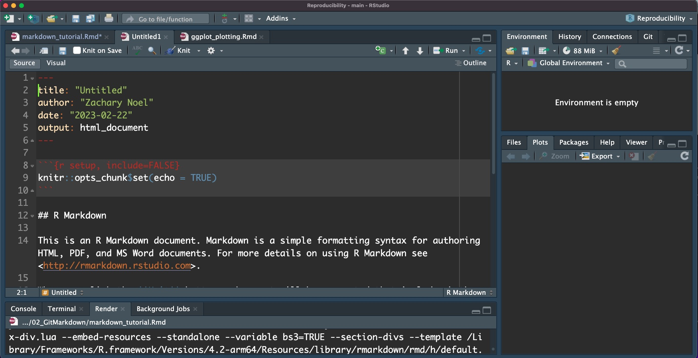
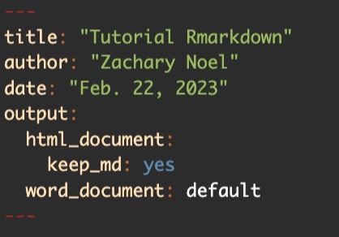
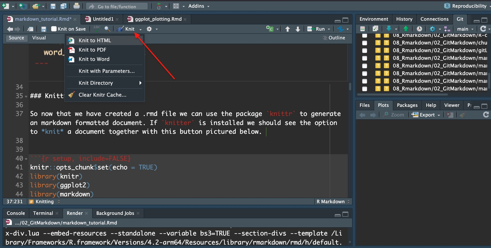
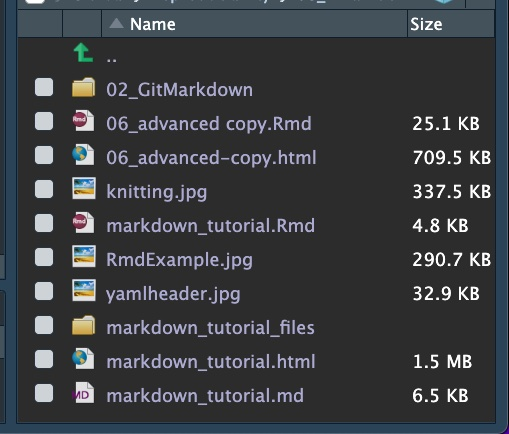
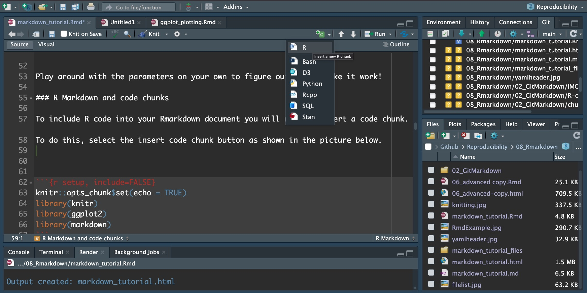
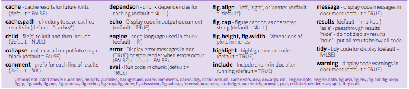

This tutorial will teach the basics of rmarkdown to teach how to 1) create R markdown documents, 2) some of the basic syntax for R markdown, 3) and include things like plots and pictures. 

Take a quick look at the video shown in the link below to learn a little more about what Rmarkdown can do and how its useful for reproducibility.

https://rmarkdown.rstudio.com/authoring_quick_tour.html


### Conceptual understanding

It uses `knitr`, `rmarkdown` and [`pandoc`](http://pandoc.org/).  Pandoc is a 
universal document converter, in our case, it goes from:

**Rmarkdown** => **markdown** => **document**

### Learning objectives

The following are the learning objectives for this tutorial

 - *yaml headers*
 - concept of knitting
 - where to write R code 
 - including a picture 
 - code chunk options
 - style in R markdown

### YAML headers and initial creation of an R markdown document. 

To start we need to know how to open an R markdown document. You do this in the same way you would open a new R script, but you should notice that when you open an R markdown it will not be blank. 

It should look something like this: 

In the top of the script it starts writing what is called a *yaml header*. This is an important concept because by default it will output an html file. This is useful for viewing on a webbrowser. However, it will not be useful for viewing on github. 

We can change the *yaml header* to output into an html document and into other outputs like word file, pdfs, and github markdown files or .md files for viewing on github. 

If we change the *yaml header* to be something looking like the figure here, we will generate html, keep the .md file for viewing on github, and we can generate a word document as well. 


### Knitting 

So now that we have created a .rmd file we can use the package `knittr` to generate an markdown formatted document. If `knitter` is installed we should see the option to *knit* a document together with this button pictured below. 


When we select to knit a document together and there are no errors in the code you can generate an html document, a word document, and/or a .md document. 



Play around with the parameters on your own to figure out how to make it work!

### R Markdown and code chunks

To include R code into your Rmarkdown document you will need to insert a code chunk. 
To do this, select the insert code chunk button as shown in the picture below. 


When we do this we should see an empty chunk that looks something like this
You can control the output of your chunks using different parameters:
```{r example, fig.align='center'}
#{r chunk_name, ...}

#Global parameters
#```{r setup, include=FALSE}
#knitr::opts_chunk$set(echo = TRUE)
#```

```



We can set chunks to show up in the resulting document by setting some options like `include=TRUE`
```{r, include=TRUE}
library(knitr)
library(ggplot2)
library(markdown)
```

We can include code and plots. 
```{r}
data("mtcars")
ggplot(mtcars, aes(x = wt, y = mpg)) +
  geom_smooth(method = lm, se = FALSE) +
  geom_point(aes(color = wt)) +
  xlab("Weight") + 
  ylab("Miles per gallon") +
  scale_colour_gradient(low = "forestgreen", high = "black")
```

## R Markdown formatting options

Section headers can be written after a number of pound signs, e.g.,

```markdown
# First-level header

## Second-level header

### Third-level header
```

#### Style and emphasis

```markdown
`*italic*`
```

*italic*

```markdown
`_italic_` 
```
_italic_

```markdown
`**bold**` 
```

**bold**

```markdown
`__bold__`
```

__bold__

Blockquotes are written after `>`, e.g.,

```markdown
> "I thoroughly disapprove of duels. If a man should challenge me,
  I would take him kindly and forgivingly by the hand and lead him
  to a quiet place and kill him."
>
> --- Mark Twain
```

> "I thoroughly disapprove of duels. If a man should challenge me,
  I would take him kindly and forgivingly by the hand and lead him
  to a quiet place and kill him."
>
> --- Mark Twain


### Lists

#### Unordered
Unordered list items start with `*`, `-`, or `+`, and you can nest one list within another list by indenting the sub-list, e.g.,

```markdown
- one item
- one item
- one item
    - one more item
    - one more item
    - one more item
```

The output is:

- one item
- one item
- one item
    - one more item
    - one more item
    - one more item

Ordered list items start with numbers (you can also nest lists within lists), e.g.,

```markdown
1. the first item
2. the second item
3. the third item
    - one unordered item
    - one unordered item
```

The output does not look too much different with the Markdown source:

1. the first item
2. the second item
3. the third item
    - one unordered item
    - one unordered item

### Links
Use plain address either as an actual link, within the text or linked to a word:
```
https://agriculture.auburn.edu/about/directory/faculty/zachary-noel/
<https://agriculture.auburn.edu/about/directory/faculty/zachary-noel/>
[Noel Lab](https://agriculture.auburn.edu/about/directory/faculty/zachary-noel/)

```

<https://agriculture.auburn.edu/about/directory/faculty/zachary-noel/>

[Noel Lab](https://agriculture.auburn.edu/about/directory/faculty/zachary-noel/)

### Images
you can embed images into the output. You will need to provide a file path to the image from the current rmd file. For ease just put the file in the same directory as your rmd file. 
```
#If you forgot the exclamation mark (!), it will become just a link

```


### Tables

Tables can also be formated using Rmarkdown. 
```
First Header  | Second Header
------------- | -------------
Content Cell  | Content Cell
Content Cell  | Content Cell
```

First Header  | Second Header
------------- | -------------
Content Cell  | Content Cell
Content Cell  | Content Cell

You can make this process simpler using knitr with `kable`:
```{r kable_example}
kable(head(mtcars, n = 5), digits = 3, format = "markdown")
```

When you click the **Knit**, it will render the document using the existing syntax.

__________

Rmarkdown is not nessary for full reproducibility, but it does ensure that someone downloading your code from github can understand what you are talking about. Someone downloanding your code should be able to just click *knit* and everthing should come together provided the same packages are installed. Also, it is fun to generate these files and after a while you will get the hang of doing it and writing in R markdown.

If you get really good you can generate presentations, books, and full websites using Rmarkdown. 

