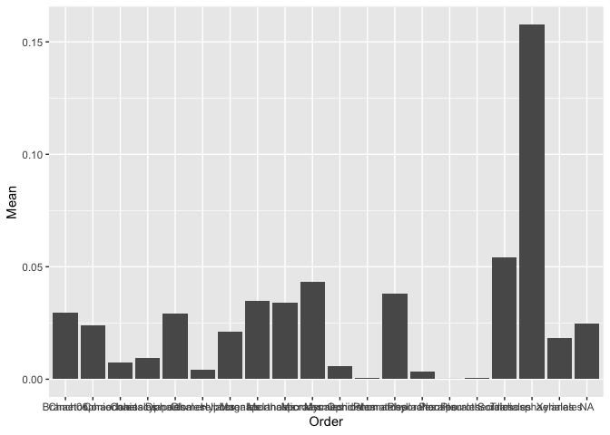
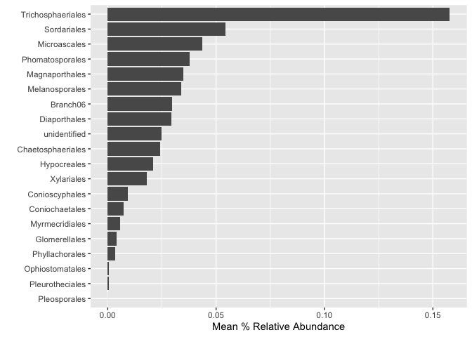
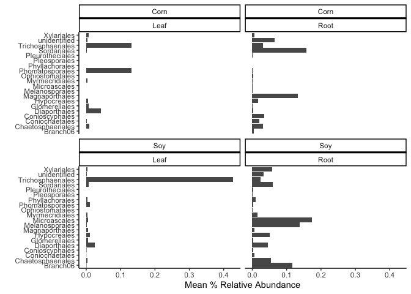
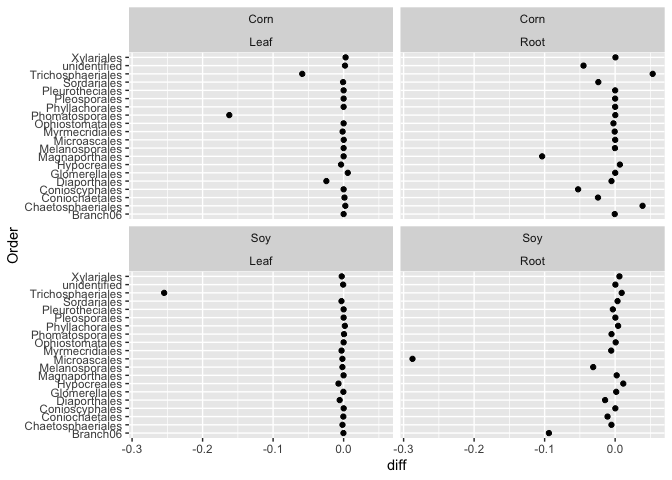

## Seemless data wrangeling 

The tidyverse is a bunch of packages and functions written by the same folks that manage Rstudio. The tidyverse builds upon base R to allow for easier use of large datasets. 

If you do not have the tidyverse installed please install it and load it `install.pakcages("tidyverse")`


```r
library(tidyverse)
```

```
## ── Attaching packages ─────────────────────────────────────── tidyverse 1.3.2 ──
## ✔ ggplot2 3.4.1      ✔ purrr   0.3.5 
## ✔ tibble  3.1.8      ✔ dplyr   1.0.10
## ✔ tidyr   1.2.1      ✔ stringr 1.5.0 
## ✔ readr   2.1.3      ✔ forcats 0.5.2 
## ── Conflicts ────────────────────────────────────────── tidyverse_conflicts() ──
## ✖ dplyr::filter() masks stats::filter()
## ✖ dplyr::lag()    masks stats::lag()
```

When you load in the tidyverse notice that it loads in 8 different packages. You will not have to load these individually. 

More info and cheet sheets can be found here: https://tidyr.tidyverse.org/index.html 

Lets demonstrate some of the most useful functionality of some tidyverse functions. **Note** that this tutorial does not cover everything and **self-learning** may be required for specific functionality. We will cover the following: 

  - Data wrangling & manipulation
    - mutate()
    - select()
    - filter()
    - the pipe %>% 
    - summarise() 
    - group_by()
  - Joining & pivotting 
  - Integration with plotting & statistics 

For this tutorial I will use the same microbiome dataset we used in previous classes for `ggplot`, except this dataset includes all fungi in the Phylum Ascomycota, not just one family. 

```r
microbiome.fungi <- read.csv("Microbiome.csv")
```

If we look at the structure of the data we can see that the dataset is 1,353,422 rows. This is too large for excel to handle. So we literally cannot use it in excel. 

```r
str(microbiome.fungi)
```

```
## 'data.frame':	1353422 obs. of  42 variables:
##  $ X                   : int  1242826 1320150 794589 1242688 1320170 1243099 1319917 1242871 1243075 1242973 ...
##  $ OTU                 : chr  "FOTU_7" "FOTU_9" "FOTU_44" "FOTU_7" ...
##  $ Sample              : chr  "Corn2017RootObjective2Collection2T2R5BFE1" "Corn2017RootObjective2Collection1T1R1ACD10" "Corn2017RootObjective2Collection1T1R2BFC12" "Corn2017RootObjective2Collection2T2R6BFB4" ...
##  $ Abundance           : num  0.997 0.996 0.993 0.989 0.984 ...
##  $ SampleID            : chr  "Corn2017RootObjective2Collection2T2R5BFE1" "Corn2017RootObjective2Collection1T1R1ACD10" "Corn2017RootObjective2Collection1T1R2BFC12" "Corn2017RootObjective2Collection2T2R6BFB4" ...
##  $ BarcodeSequence     : chr  "ATCGTCCGCG" "CAACGTGCTC" "CCTGTCCTAT" "ACTGCTATCG" ...
##  $ LinkerPrimerSequence: chr  "CAAGCAGAAGACGGCATACGAGAT" "CAAGCAGAAGACGGCATACGAGAT" "CAAGCAGAAGACGGCATACGAGAT" "CAAGCAGAAGACGGCATACGAGAT" ...
##  $ Region              : chr  "ITS" "ITS" "ITS" "ITS" ...
##  $ BC_plate            : int  1 3 3 1 3 1 3 3 3 1 ...
##  $ BC_name             : chr  "PCR_R_bc5" "PCR_R_bc268" "PCR_R_bc283" "PCR_R_bc26" ...
##  $ Crop                : chr  "Corn" "Corn" "Corn" "Corn" ...
##  $ Objective           : chr  "Objective 2" "Objective 2" "Objective 2" "Objective 2" ...
##  $ Collection          : int  2 1 1 2 2 2 2 2 2 2 ...
##  $ Compartment         : chr  "Root" "Root" "Root" "Root" ...
##  $ DateSampled         : chr  "5-Jul-17" "26-Jun-17" "26-Jun-17" "5-Jul-17" ...
##  $ GrowthStage         : chr  "V8" "V6" "V6" "V8" ...
##  $ Treatment           : chr  "T2" "T1" "T1" "T2" ...
##  $ Rep                 : chr  "R5" "R1" "R2" "R6" ...
##  $ sample_Sample       : chr  "B" "A" "B" "B" ...
##  $ Fungicide           : chr  "F" "C" "F" "F" ...
##  $ Target_organism     : chr  "Fungi" "Fungi" "Fungi" "Fungi" ...
##  $ Location            : chr  "Kellogg Biological Station" "Kellogg Biological Station" "Kellogg Biological Station" "Kellogg Biological Station" ...
##  $ Experiment          : chr  "LTER" "LTER" "LTER" "LTER" ...
##  $ Year                : int  2017 2017 2017 2017 2017 2017 2017 2017 2017 2017 ...
##  $ Phi2                : logi  NA NA NA NA NA NA ...
##  $ PhiNO               : logi  NA NA NA NA NA NA ...
##  $ PhiNPQ              : logi  NA NA NA NA NA NA ...
##  $ Relative.Chlorophyll: logi  NA NA NA NA NA NA ...
##  $ Sample_or_Control   : chr  "True Sample" "True Sample" "True Sample" "True Sample" ...
##  $ is.neg              : logi  FALSE FALSE FALSE FALSE FALSE FALSE ...
##  $ OTU_ID              : chr  "FOTU_7" "FOTU_9" "FOTU_44" "FOTU_7" ...
##  $ Kingdom             : chr  "Fungi" "Fungi" "Fungi" "Fungi" ...
##  $ Phylum              : chr  "Ascomycota" "Ascomycota" "Ascomycota" "Ascomycota" ...
##  $ Class               : chr  "Sordariomycetes" "Dothideomycetes" "Dothideomycetes" "Sordariomycetes" ...
##  $ Order               : chr  "Sordariales" "Pleosporales" "Pleosporales" "Sordariales" ...
##  $ Family              : chr  "Chaetomiaceae" "Didymellaceae" "Sporormiaceae" "Chaetomiaceae" ...
##  $ Genus               : chr  NA "Didymella" "Preussia" NA ...
##  $ Species             : chr  NA "Didymella sp." "Preussia sp." NA ...
##  $ Isolate             : chr  NA NA NA NA ...
##  $ Isolate_percent_id  : num  0 0 0 0 0 0 0 0 0 0 ...
##  $ BestMatch           : chr  "Chaetomiaceae" "Didymella sp." "Preussia sp." "Chaetomiaceae" ...
##  $ Taxonomy            : chr  "FOTU_7-Chaetomiaceae" "FOTU_9-Didymella sp." "FOTU_44-Preussia sp." "FOTU_7-Chaetomiaceae" ...
```

Lets start exploring the data. 

the first thing we can do is select only the columns we need since it seems that there are lots of columns that we may not need. 

#### `select()`

```r
microbiome.fungi2 <- select(microbiome.fungi, OTU, SampleID, Abundance, Crop, Compartment, DateSampled, GrowthStage, Treatment, Rep, Fungicide, Kingdom:Taxonomy)
```

Note the syntax. I listed all the column headers I wanted, but at the end I used `Kingdom:Taxonomy` because all these were in order and I can use the column to select them all. 

#### `filter()`

this is a convenient function that allows you to subset data fairly easily. However, I'm not sure how its much easier than other subset function

```r
head(filter(microbiome.fungi2, Class == "Sordariomycetes"))
```

```
##      OTU                                   SampleID Abundance Crop Compartment
## 1 FOTU_7  Corn2017RootObjective2Collection2T2R5BFE1 0.9970508 Corn        Root
## 2 FOTU_7  Corn2017RootObjective2Collection2T2R6BFB4 0.9886459 Corn        Root
## 3 FOTU_7 Corn2017RootObjective2Collection2T2R5ACD11 0.9786059 Corn        Root
## 4 FOTU_7  Corn2017RootObjective2Collection2T2R2BCA8 0.9634735 Corn        Root
## 5 FOTU_7  Corn2017RootObjective2Collection2T2R1CFB6 0.9592154 Corn        Root
## 6 FOTU_7 Corn2017RootObjective2Collection2T2R5CFD12 0.9567938 Corn        Root
##   DateSampled GrowthStage Treatment Rep Fungicide Kingdom     Phylum
## 1    5-Jul-17          V8        T2  R5         F   Fungi Ascomycota
## 2    5-Jul-17          V8        T2  R6         F   Fungi Ascomycota
## 3    5-Jul-17          V8        T2  R5         C   Fungi Ascomycota
## 4    5-Jul-17          V8        T2  R2         C   Fungi Ascomycota
## 5    5-Jul-17          V8        T2  R1         F   Fungi Ascomycota
## 6    5-Jul-17          V8        T2  R5         F   Fungi Ascomycota
##             Class       Order        Family Genus Species Isolate
## 1 Sordariomycetes Sordariales Chaetomiaceae  <NA>    <NA>    <NA>
## 2 Sordariomycetes Sordariales Chaetomiaceae  <NA>    <NA>    <NA>
## 3 Sordariomycetes Sordariales Chaetomiaceae  <NA>    <NA>    <NA>
## 4 Sordariomycetes Sordariales Chaetomiaceae  <NA>    <NA>    <NA>
## 5 Sordariomycetes Sordariales Chaetomiaceae  <NA>    <NA>    <NA>
## 6 Sordariomycetes Sordariales Chaetomiaceae  <NA>    <NA>    <NA>
##   Isolate_percent_id     BestMatch             Taxonomy
## 1                  0 Chaetomiaceae FOTU_7-Chaetomiaceae
## 2                  0 Chaetomiaceae FOTU_7-Chaetomiaceae
## 3                  0 Chaetomiaceae FOTU_7-Chaetomiaceae
## 4                  0 Chaetomiaceae FOTU_7-Chaetomiaceae
## 5                  0 Chaetomiaceae FOTU_7-Chaetomiaceae
## 6                  0 Chaetomiaceae FOTU_7-Chaetomiaceae
```

#### `mutate()`

Mutate allows us to quickly create new columns. Say we wanted to transform the Abundance column into a percentage  by multiplying by 100.

```r
head(mutate(microbiome.fungi2, Percent = Abundance*100))
```

```
##       OTU                                   SampleID Abundance Crop Compartment
## 1  FOTU_7  Corn2017RootObjective2Collection2T2R5BFE1 0.9970508 Corn        Root
## 2  FOTU_9 Corn2017RootObjective2Collection1T1R1ACD10 0.9955440 Corn        Root
## 3 FOTU_44 Corn2017RootObjective2Collection1T1R2BFC12 0.9927446 Corn        Root
## 4  FOTU_7  Corn2017RootObjective2Collection2T2R6BFB4 0.9886459 Corn        Root
## 5  FOTU_9  Corn2017RootObjective2Collection2T1R5BCC2 0.9835863 Corn        Root
## 6  FOTU_7 Corn2017RootObjective2Collection2T2R5ACD11 0.9786059 Corn        Root
##   DateSampled GrowthStage Treatment Rep Fungicide Kingdom     Phylum
## 1    5-Jul-17          V8        T2  R5         F   Fungi Ascomycota
## 2   26-Jun-17          V6        T1  R1         C   Fungi Ascomycota
## 3   26-Jun-17          V6        T1  R2         F   Fungi Ascomycota
## 4    5-Jul-17          V8        T2  R6         F   Fungi Ascomycota
## 5    5-Jul-17          V8        T1  R5         C   Fungi Ascomycota
## 6    5-Jul-17          V8        T2  R5         C   Fungi Ascomycota
##             Class        Order        Family     Genus       Species Isolate
## 1 Sordariomycetes  Sordariales Chaetomiaceae      <NA>          <NA>    <NA>
## 2 Dothideomycetes Pleosporales Didymellaceae Didymella Didymella sp.    <NA>
## 3 Dothideomycetes Pleosporales Sporormiaceae  Preussia  Preussia sp.    <NA>
## 4 Sordariomycetes  Sordariales Chaetomiaceae      <NA>          <NA>    <NA>
## 5 Dothideomycetes Pleosporales Didymellaceae Didymella Didymella sp.    <NA>
## 6 Sordariomycetes  Sordariales Chaetomiaceae      <NA>          <NA>    <NA>
##   Isolate_percent_id     BestMatch             Taxonomy  Percent
## 1                  0 Chaetomiaceae FOTU_7-Chaetomiaceae 99.70508
## 2                  0 Didymella sp. FOTU_9-Didymella sp. 99.55440
## 3                  0  Preussia sp. FOTU_44-Preussia sp. 99.27446
## 4                  0 Chaetomiaceae FOTU_7-Chaetomiaceae 98.86459
## 5                  0 Didymella sp. FOTU_9-Didymella sp. 98.35863
## 6                  0 Chaetomiaceae FOTU_7-Chaetomiaceae 97.86059
```

#### the pipe `%>%`

We can also combine multiple functions together. This is an important concept and is very powerful. It helps to try to visualize what you are doing to your data at each step. 

We will combine all previous steps into one large string of functions. 

When we do this we do not have to specify the data in each function. The data from the previous step is transfered to the next step. 

```r
microbiome.fungi %>%
  select(OTU, SampleID, Abundance, Crop, Compartment, DateSampled, GrowthStage, Treatment, Rep, Fungicide, Kingdom:Taxonomy) %>%
  filter(Class == "Sordariomycetes") %>%
  mutate(Percent = Abundance*100) %>%
  head()
```

```
##      OTU                                   SampleID Abundance Crop Compartment
## 1 FOTU_7  Corn2017RootObjective2Collection2T2R5BFE1 0.9970508 Corn        Root
## 2 FOTU_7  Corn2017RootObjective2Collection2T2R6BFB4 0.9886459 Corn        Root
## 3 FOTU_7 Corn2017RootObjective2Collection2T2R5ACD11 0.9786059 Corn        Root
## 4 FOTU_7  Corn2017RootObjective2Collection2T2R2BCA8 0.9634735 Corn        Root
## 5 FOTU_7  Corn2017RootObjective2Collection2T2R1CFB6 0.9592154 Corn        Root
## 6 FOTU_7 Corn2017RootObjective2Collection2T2R5CFD12 0.9567938 Corn        Root
##   DateSampled GrowthStage Treatment Rep Fungicide Kingdom     Phylum
## 1    5-Jul-17          V8        T2  R5         F   Fungi Ascomycota
## 2    5-Jul-17          V8        T2  R6         F   Fungi Ascomycota
## 3    5-Jul-17          V8        T2  R5         C   Fungi Ascomycota
## 4    5-Jul-17          V8        T2  R2         C   Fungi Ascomycota
## 5    5-Jul-17          V8        T2  R1         F   Fungi Ascomycota
## 6    5-Jul-17          V8        T2  R5         F   Fungi Ascomycota
##             Class       Order        Family Genus Species Isolate
## 1 Sordariomycetes Sordariales Chaetomiaceae  <NA>    <NA>    <NA>
## 2 Sordariomycetes Sordariales Chaetomiaceae  <NA>    <NA>    <NA>
## 3 Sordariomycetes Sordariales Chaetomiaceae  <NA>    <NA>    <NA>
## 4 Sordariomycetes Sordariales Chaetomiaceae  <NA>    <NA>    <NA>
## 5 Sordariomycetes Sordariales Chaetomiaceae  <NA>    <NA>    <NA>
## 6 Sordariomycetes Sordariales Chaetomiaceae  <NA>    <NA>    <NA>
##   Isolate_percent_id     BestMatch             Taxonomy  Percent
## 1                  0 Chaetomiaceae FOTU_7-Chaetomiaceae 99.70508
## 2                  0 Chaetomiaceae FOTU_7-Chaetomiaceae 98.86459
## 3                  0 Chaetomiaceae FOTU_7-Chaetomiaceae 97.86059
## 4                  0 Chaetomiaceae FOTU_7-Chaetomiaceae 96.34735
## 5                  0 Chaetomiaceae FOTU_7-Chaetomiaceae 95.92154
## 6                  0 Chaetomiaceae FOTU_7-Chaetomiaceae 95.67938
```

#### `summarise()`
We can use the `summarise()` function to find things like means and standard deviations/errors. 

```r
microbiome.fungi %>%
  select(OTU, SampleID, Abundance, Crop, Compartment, DateSampled, GrowthStage, Treatment, Rep, Fungicide, Kingdom:Taxonomy) %>%
  filter(Class == "Sordariomycetes") %>%
  mutate(Percent = Abundance*100) %>%
  summarise(Mean = mean(Percent)) %>%
  head()
```

```
##         Mean
## 1 0.02803439
```
So on average, Ascomycota makes up about 0.02% of the microbiome.

We can also connect multiple summary statistics here. 

```r
microbiome.fungi %>%
  select(OTU, SampleID, Abundance, Crop, Compartment, DateSampled, GrowthStage, Treatment, Rep, Fungicide, Kingdom:Taxonomy) %>%
  filter(Class == "Sordariomycetes") %>%
  mutate(Percent = Abundance*100) %>%
  summarise(Mean = mean(Percent), 
            n = n(), 
            sd.dev = sd(Percent)) %>%
  mutate(std.err = sd.dev/sqrt(n))
```

```
##         Mean      n   sd.dev     std.err
## 1 0.02803439 382260 0.854294 0.001381745
```

This is useful, but maybe we want to have summary statistics by group! We can also do this very easily using the `group_by()` function. 

```r
microbiome.fungi %>%
  select(OTU, SampleID, Abundance, Crop, Compartment, DateSampled, GrowthStage, Treatment, Rep, Fungicide, Kingdom:Taxonomy) %>%
  filter(Class == "Sordariomycetes") %>%
  group_by(Order) %>%
  mutate(Percent = Abundance*100) %>%
  summarise(Mean = mean(Percent), 
            n = n(), 
            sd.dev = sd(Percent)) %>%
  mutate(std.err = sd.dev/sqrt(n))
```

```
## # A tibble: 20 × 5
##    Order                  Mean      n   sd.dev   std.err
##    <chr>                 <dbl>  <int>    <dbl>     <dbl>
##  1 Branch06          0.0295      6094 0.477    0.00611  
##  2 Chaetosphaeriales 0.0241      7756 0.445    0.00505  
##  3 Coniochaetales    0.00747    16620 0.375    0.00291  
##  4 Conioscyphales    0.00936     2770 0.257    0.00489  
##  5 Diaporthales      0.0293     40996 0.715    0.00353  
##  6 Glomerellales     0.00400    12742 0.0920   0.000815 
##  7 Hypocreales       0.0210    119110 0.524    0.00152  
##  8 Magnaporthales    0.0348      8864 0.808    0.00859  
##  9 Melanosporales    0.0339      1108 0.637    0.0191   
## 10 Microascales      0.0435      5540 1.19     0.0160   
## 11 Myrmecridiales    0.00562     3324 0.0722   0.00125  
## 12 Ophiostomatales   0.000563    1662 0.0133   0.000325 
## 13 Phomatosporales   0.0379       554 0.549    0.0233   
## 14 Phyllachorales    0.00350     1662 0.0222   0.000546 
## 15 Pleosporales      0.0000400    554 0.000942 0.0000400
## 16 Pleurotheciales   0.000443    1108 0.0136   0.000409 
## 17 Sordariales       0.0543     73682 1.56     0.00573  
## 18 Trichosphaeriales 0.158       1108 0.609    0.0183   
## 19 Xylariales        0.0181     40442 0.417    0.00208  
## 20 <NA>              0.0248     36564 0.735    0.00384
```

We could also use the `arrange()` function to quickly sort our resultant data by a specific column

```r
# arrange from least to most
microbiome.fungi %>%
  select(OTU, SampleID, Abundance, Crop, Compartment, DateSampled, GrowthStage, Treatment, Rep, Fungicide, Kingdom:Taxonomy) %>%
  filter(Class == "Sordariomycetes") %>%
  group_by(Order) %>%
  mutate(Percent = Abundance*100) %>%
  summarise(Mean = mean(Percent), 
            n = n(), 
            sd.dev = sd(Percent)) %>%
  mutate(std.err = sd.dev/sqrt(n)) %>%
  arrange(Mean)
```

```
## # A tibble: 20 × 5
##    Order                  Mean      n   sd.dev   std.err
##    <chr>                 <dbl>  <int>    <dbl>     <dbl>
##  1 Pleosporales      0.0000400    554 0.000942 0.0000400
##  2 Pleurotheciales   0.000443    1108 0.0136   0.000409 
##  3 Ophiostomatales   0.000563    1662 0.0133   0.000325 
##  4 Phyllachorales    0.00350     1662 0.0222   0.000546 
##  5 Glomerellales     0.00400    12742 0.0920   0.000815 
##  6 Myrmecridiales    0.00562     3324 0.0722   0.00125  
##  7 Coniochaetales    0.00747    16620 0.375    0.00291  
##  8 Conioscyphales    0.00936     2770 0.257    0.00489  
##  9 Xylariales        0.0181     40442 0.417    0.00208  
## 10 Hypocreales       0.0210    119110 0.524    0.00152  
## 11 Chaetosphaeriales 0.0241      7756 0.445    0.00505  
## 12 <NA>              0.0248     36564 0.735    0.00384  
## 13 Diaporthales      0.0293     40996 0.715    0.00353  
## 14 Branch06          0.0295      6094 0.477    0.00611  
## 15 Melanosporales    0.0339      1108 0.637    0.0191   
## 16 Magnaporthales    0.0348      8864 0.808    0.00859  
## 17 Phomatosporales   0.0379       554 0.549    0.0233   
## 18 Microascales      0.0435      5540 1.19     0.0160   
## 19 Sordariales       0.0543     73682 1.56     0.00573  
## 20 Trichosphaeriales 0.158       1108 0.609    0.0183
```

```r
# arrange from most to least
microbiome.fungi %>%
  select(OTU, SampleID, Abundance, Crop, Compartment, DateSampled, GrowthStage, Treatment, Rep, Fungicide, Kingdom:Taxonomy) %>%
  filter(Class == "Sordariomycetes") %>%
  group_by(Order) %>%
  mutate(Percent = Abundance*100) %>%
  summarise(Mean = mean(Percent), 
            n = n(), 
            sd.dev = sd(Percent)) %>%
  mutate(std.err = sd.dev/sqrt(n)) %>%
  arrange(-Mean)
```

```
## # A tibble: 20 × 5
##    Order                  Mean      n   sd.dev   std.err
##    <chr>                 <dbl>  <int>    <dbl>     <dbl>
##  1 Trichosphaeriales 0.158       1108 0.609    0.0183   
##  2 Sordariales       0.0543     73682 1.56     0.00573  
##  3 Microascales      0.0435      5540 1.19     0.0160   
##  4 Phomatosporales   0.0379       554 0.549    0.0233   
##  5 Magnaporthales    0.0348      8864 0.808    0.00859  
##  6 Melanosporales    0.0339      1108 0.637    0.0191   
##  7 Branch06          0.0295      6094 0.477    0.00611  
##  8 Diaporthales      0.0293     40996 0.715    0.00353  
##  9 <NA>              0.0248     36564 0.735    0.00384  
## 10 Chaetosphaeriales 0.0241      7756 0.445    0.00505  
## 11 Hypocreales       0.0210    119110 0.524    0.00152  
## 12 Xylariales        0.0181     40442 0.417    0.00208  
## 13 Conioscyphales    0.00936     2770 0.257    0.00489  
## 14 Coniochaetales    0.00747    16620 0.375    0.00291  
## 15 Myrmecridiales    0.00562     3324 0.0722   0.00125  
## 16 Glomerellales     0.00400    12742 0.0920   0.000815 
## 17 Phyllachorales    0.00350     1662 0.0222   0.000546 
## 18 Ophiostomatales   0.000563    1662 0.0133   0.000325 
## 19 Pleurotheciales   0.000443    1108 0.0136   0.000409 
## 20 Pleosporales      0.0000400    554 0.000942 0.0000400
```

#### Connecting to plotting

These groups of functions and packages also all work together very nicely. For example, direct input into ggplot is possible. In which case you would not have to enter the data statement, you just need to start inputing your aesthetics.

```r
microbiome.fungi %>%
  select(OTU, SampleID, Abundance, Crop, Compartment, DateSampled, GrowthStage, Treatment, Rep, Fungicide, Kingdom:Taxonomy) %>%
  filter(Class == "Sordariomycetes") %>%
  group_by(Order) %>%
  mutate(Percent = Abundance*100) %>%
  summarise(Mean = mean(Percent), 
            n = n(), 
            sd.dev = sd(Percent)) %>%
  mutate(std.err = sd.dev/sqrt(n)) %>%
  ggplot(aes(x = Order, y = Mean)) +
  geom_bar(stat="identity")
```

<!-- -->

#### Dealing with NA values
This dataset the NA value means an unidenfied fungus. So for plotting we would want to change that to unidentified. We can deal with NA values nicely within the tidyverse. 

```r
microbiome.fungi %>%
  select(OTU, SampleID, Abundance, Crop, Compartment, DateSampled, GrowthStage, Treatment, Rep, Fungicide, Kingdom:Taxonomy) %>%
  filter(Class == "Sordariomycetes") %>%
  group_by(Order) %>%
  mutate(Percent = Abundance*100) %>%
  summarise(Mean = mean(Percent), 
            n = n(), 
            sd.dev = sd(Percent)) %>%
  
  mutate(std.err = sd.dev/sqrt(n)) %>%
  replace_na(list(Order = "unidentified")) %>%
  ggplot(aes(x = Order, y = Mean)) +
  geom_bar(stat="identity")
```

<!-- -->

Arrange for `ggplot()` using `fct_reorder()`

```r
microbiome.fungi %>%
  select(OTU, SampleID, Abundance, Crop, Compartment, DateSampled, GrowthStage, Treatment, Rep, Fungicide, Kingdom:Taxonomy) %>%
  filter(Class == "Sordariomycetes") %>%
  group_by(Order) %>%
  mutate(Percent = Abundance*100) %>%
  summarise(Mean = mean(Percent), 
            n = n(), 
            sd.dev = sd(Percent)) %>%
  
  mutate(std.err = sd.dev/sqrt(n)) %>%
  replace_na(list(Order = "unidentified")) %>%
  mutate(Order2 = fct_reorder(Order, desc(-Mean))) %>%
  ggplot(aes(x = Mean, y = Order2)) +
  geom_bar(stat="identity") + 
  xlab("Mean % Relative Abundance") +
  ylab("")
```

<!-- -->

Making it really sofisticated now by separating by crop and compartment and faceting

```r
microbiome.fungi %>%
  select(OTU, SampleID, Abundance, Crop, Compartment, DateSampled, GrowthStage, Treatment, Rep, Fungicide, Kingdom:Taxonomy) %>%
  filter(Class == "Sordariomycetes") %>%
  group_by(Order, Crop, Compartment) %>%
  mutate(Percent = Abundance*100) %>%
  summarise(Mean = mean(Percent), 
            n = n(), 
            sd.dev = sd(Percent)) %>%
  mutate(std.err = sd.dev/sqrt(n)) %>%
  replace_na(list(Order = "unidentified")) %>%
  mutate(Order2 = fct_reorder(Order, desc(-Mean))) %>%
  ggplot(aes(x = Mean, y = Order2)) +
  geom_bar(stat="identity") + 
  xlab("Mean % Relative Abundance") +
  ylab("") + 
  facet_wrap(~Crop*Compartment) +
  theme_classic()
```

```
## `summarise()` has grouped output by 'Order', 'Crop'. You can override using the
## `.groups` argument.
```

<!-- -->

#### Joining 

The join group of functions are super useful. Have you ever tried to match up data by rows based on some criteria? Its almost impossible without messing up over 10-15 rows of data. 

More info can be found here: https://dplyr.tidyverse.org/reference/mutate-joins.html 

But we can easily do this with the joining functions. They include:

  -left_join() 
    - Keep all rows of X and add matching rows from Y. Any rows in Y that don’t match X are excluded.
  -right_join() 
    - reverse of left_join()
  -inner_join() 
    - only keep rows that are common to both X AND Y, remove everything else. 
  -full_join()
    - Keep any columns that are in either X or Y
    
To try these out lets split our data into separate sets including taxonomy and metadata.

Here we are also sampling 100 random rows of our dataset using the `sample_n()` function

```r
taxonomy <- microbiome.fungi2 %>%
  select(OTU, Kingdom:Taxonomy) %>%
  sample_n(size = 100)

metadata <- microbiome.fungi2 %>% 
  select(OTU:Fungicide) %>%
  sample_n(size = 100)

left_join(taxonomy, metadata, by = "OTU") # notice the NAs in the metadata since some OTUs did not appear in the random sample. 
```

```
##           OTU Kingdom     Phylum           Class             Order
## 1    FOTU_819   Fungi Ascomycota            <NA>              <NA>
## 2   FOTU_1363   Fungi Ascomycota Dothideomycetes      Pleosporales
## 3   FOTU_3519   Fungi Ascomycota Dothideomycetes              <NA>
## 4   FOTU_1283   Fungi Ascomycota Dothideomycetes      Pleosporales
## 5    FOTU_218   Fungi Ascomycota Sordariomycetes        Xylariales
## 6   FOTU_6142   Fungi Ascomycota Sordariomycetes    Magnaporthales
## 7   FOTU_7033   Fungi Ascomycota Dothideomycetes      Pleosporales
## 8   FOTU_5024   Fungi Ascomycota Sordariomycetes      Diaporthales
## 9   FOTU_3789   Fungi Ascomycota            <NA>              <NA>
## 10  FOTU_4304   Fungi Ascomycota Sordariomycetes       Sordariales
## 11  FOTU_4956   Fungi Ascomycota Dothideomycetes      Pleosporales
## 12  FOTU_3030   Fungi Ascomycota Dothideomycetes Botryosphaeriales
## 13  FOTU_3982   Fungi Ascomycota   Leotiomycetes      Thelebolales
## 14  FOTU_5498   Fungi Ascomycota Dothideomycetes      Pleosporales
## 15   FOTU_213   Fungi Ascomycota            <NA>              <NA>
## 16  FOTU_4083   Fungi Ascomycota Dothideomycetes      Pleosporales
## 17  FOTU_4504   Fungi Ascomycota Sordariomycetes       Hypocreales
## 18  FOTU_3801   Fungi Ascomycota Sordariomycetes       Hypocreales
## 19  FOTU_4364   Fungi Ascomycota Sordariomycetes    Coniochaetales
## 20  FOTU_1800   Fungi Ascomycota Dothideomycetes      Pleosporales
## 21    FOTU_55   Fungi Ascomycota Dothideomycetes      Pleosporales
## 22  FOTU_3169   Fungi Ascomycota Sordariomycetes       Hypocreales
## 23  FOTU_5297   Fungi Ascomycota Sordariomycetes      Microascales
## 24   FOTU_191   Fungi Ascomycota            <NA>              <NA>
## 25  FOTU_5297   Fungi Ascomycota Sordariomycetes      Microascales
## 26  FOTU_5702   Fungi Ascomycota Sordariomycetes       Sordariales
## 27  FOTU_2614   Fungi Ascomycota Sordariomycetes       Hypocreales
## 28  FOTU_1989   Fungi Ascomycota Dothideomycetes      Pleosporales
## 29  FOTU_5879   Fungi Ascomycota Sordariomycetes       Hypocreales
## 30  FOTU_5798   Fungi Ascomycota Dothideomycetes      Pleosporales
## 31   FOTU_384   Fungi Ascomycota Dothideomycetes      Pleosporales
## 32  FOTU_1808   Fungi Ascomycota Sordariomycetes       Hypocreales
## 33  FOTU_3323   Fungi Ascomycota Sordariomycetes      Diaporthales
## 34  FOTU_3812   Fungi Ascomycota   Leotiomycetes        Helotiales
## 35  FOTU_5962   Fungi Ascomycota Dothideomycetes      Pleosporales
## 36   FOTU_110   Fungi Ascomycota Sordariomycetes       Sordariales
## 37  FOTU_2348   Fungi Ascomycota Saccharomycetes Saccharomycetales
## 38   FOTU_945   Fungi Ascomycota Sordariomycetes       Sordariales
## 39  FOTU_3085   Fungi Ascomycota Dothideomycetes      Pleosporales
## 40  FOTU_6413   Fungi Ascomycota Sordariomycetes       Hypocreales
## 41  FOTU_7130   Fungi Ascomycota            <NA>              <NA>
## 42  FOTU_2379   Fungi Ascomycota Dothideomycetes      Pleosporales
## 43   FOTU_450   Fungi Ascomycota Sordariomycetes    Coniochaetales
## 44  FOTU_2010   Fungi Ascomycota Dothideomycetes      Pleosporales
## 45  FOTU_4996   Fungi Ascomycota Dothideomycetes      Pleosporales
## 46  FOTU_4886   Fungi Ascomycota Dothideomycetes      Pleosporales
## 47  FOTU_5803   Fungi Ascomycota Dothideomycetes      Pleosporales
## 48   FOTU_778   Fungi Ascomycota Dothideomycetes      Pleosporales
## 49  FOTU_4550   Fungi Ascomycota Dothideomycetes      Pleosporales
## 50  FOTU_3738   Fungi Ascomycota Dothideomycetes      Pleosporales
## 51  FOTU_1818   Fungi Ascomycota Sordariomycetes        Xylariales
## 52  FOTU_4059   Fungi Ascomycota            <NA>              <NA>
## 53  FOTU_5103   Fungi Ascomycota Dothideomycetes              <NA>
## 54  FOTU_2616   Fungi Ascomycota Dothideomycetes      Pleosporales
## 55  FOTU_1078   Fungi Ascomycota Dothideomycetes      Pleosporales
## 56  FOTU_1488   Fungi Ascomycota            <NA>              <NA>
## 57  FOTU_4169   Fungi Ascomycota Dothideomycetes       Venturiales
## 58  FOTU_4261   Fungi Ascomycota Sordariomycetes        Xylariales
## 59  FOTU_3449   Fungi Ascomycota Dothideomycetes      Pleosporales
## 60  FOTU_3193   Fungi Ascomycota Sordariomycetes              <NA>
## 61  FOTU_1283   Fungi Ascomycota Dothideomycetes      Pleosporales
## 62  FOTU_7187   Fungi Ascomycota  Eurotiomycetes   Chaetothyriales
## 63  FOTU_1142   Fungi Ascomycota Sordariomycetes    Coniochaetales
## 64  FOTU_3012   Fungi Ascomycota Sordariomycetes              <NA>
## 65  FOTU_1452   Fungi Ascomycota Dothideomycetes              <NA>
## 66   FOTU_102   Fungi Ascomycota Sordariomycetes Chaetosphaeriales
## 67  FOTU_5427   Fungi Ascomycota            <NA>              <NA>
## 68  FOTU_3532   Fungi Ascomycota            <NA>              <NA>
## 69  FOTU_3271   Fungi Ascomycota   Leotiomycetes        Helotiales
## 70  FOTU_1434   Fungi Ascomycota Dothideomycetes      Pleosporales
## 71   FOTU_296   Fungi Ascomycota Sordariomycetes          Branch06
## 72  FOTU_2572   Fungi Ascomycota Dothideomycetes Botryosphaeriales
## 73  FOTU_1506   Fungi Ascomycota Sordariomycetes       Hypocreales
## 74  FOTU_7037   Fungi Ascomycota Sordariomycetes       Hypocreales
## 75  FOTU_5344   Fungi Ascomycota Dothideomycetes      Pleosporales
## 76  FOTU_2063   Fungi Ascomycota Sordariomycetes        Xylariales
## 77  FOTU_2557   Fungi Ascomycota            <NA>              <NA>
## 78  FOTU_6634   Fungi Ascomycota Dothideomycetes              <NA>
## 79  FOTU_5834   Fungi Ascomycota Dothideomycetes      Pleosporales
## 80  FOTU_6293   Fungi Ascomycota Dothideomycetes      Pleosporales
## 81  FOTU_2841   Fungi Ascomycota Dothideomycetes      Pleosporales
## 82  FOTU_5230   Fungi Ascomycota Dothideomycetes      Pleosporales
## 83   FOTU_298   Fungi Ascomycota   Leotiomycetes        Helotiales
## 84  FOTU_4014   Fungi Ascomycota Dothideomycetes      Pleosporales
## 85  FOTU_5652   Fungi Ascomycota Dothideomycetes       Venturiales
## 86  FOTU_5701   Fungi Ascomycota Sordariomycetes       Hypocreales
## 87   FOTU_400   Fungi Ascomycota Dothideomycetes      Pleosporales
## 88  FOTU_4951   Fungi Ascomycota   Leotiomycetes        Helotiales
## 89  FOTU_6808   Fungi Ascomycota   Leotiomycetes              <NA>
## 90  FOTU_3692   Fungi Ascomycota Dothideomycetes      Pleosporales
## 91   FOTU_834   Fungi Ascomycota Sordariomycetes       Sordariales
## 92  FOTU_1343   Fungi Ascomycota            <NA>              <NA>
## 93  FOTU_5612   Fungi Ascomycota Dothideomycetes      Pleosporales
## 94  FOTU_2530   Fungi Ascomycota Dothideomycetes              <NA>
## 95   FOTU_872   Fungi Ascomycota Sordariomycetes              <NA>
## 96   FOTU_576   Fungi Ascomycota Dothideomycetes      Pleosporales
## 97  FOTU_1720   Fungi Ascomycota Dothideomycetes      Pleosporales
## 98  FOTU_1612   Fungi Ascomycota  Eurotiomycetes   Chaetothyriales
## 99  FOTU_3966   Fungi Ascomycota Sordariomycetes        Xylariales
## 100 FOTU_1963   Fungi Ascomycota Dothideomycetes       Capnodiales
##                    Family             Genus               Species
## 1                    <NA>              <NA>                  <NA>
## 2                    <NA>              <NA>                  <NA>
## 3                    <NA>              <NA>                  <NA>
## 4       Phaeosphaeriaceae Setophaeosphaeria Setophaeosphaeria sp.
## 5           Sporocadaceae    Pestalotiopsis    Pestalotiopsis sp.
## 6         Magnaporthaceae  Magnaporthiopsis  Magnaporthiopsis sp.
## 7                    <NA>              <NA>                  <NA>
## 8           Diaporthaceae         Diaporthe         Diaporthe sp.
## 9                    <NA>              <NA>                  <NA>
## 10          Chaetomiaceae         Zopfiella         Zopfiella sp.
## 11                   <NA>              <NA>                  <NA>
## 12     Botryosphaeriaceae     Tiarosporella     Tiarosporella sp.
## 13       Pseudeurotiaceae         Hyphozyma         Hyphozyma sp.
## 14          Pleosporaceae        Curvularia        Curvularia sp.
## 15                   <NA>              <NA>                  <NA>
## 16                   <NA>              <NA>                  <NA>
## 17   Ophiocordycipitaceae              <NA>                  <NA>
## 18           Hypocreaceae       Monocillium       Monocillium sp.
## 19        Coniochaetaceae      Lecythophora      Lecythophora sp.
## 20                   <NA>              <NA>                  <NA>
## 21                   <NA>              <NA>                  <NA>
## 22                   <NA>              <NA>                  <NA>
## 23                   <NA>              <NA>                  <NA>
## 24                   <NA>              <NA>                  <NA>
## 25                   <NA>              <NA>                  <NA>
## 26          Chaetomiaceae              <NA>                  <NA>
## 27                   <NA>              <NA>                  <NA>
## 28                   <NA>              <NA>                  <NA>
## 29         Incertae_sedis       Sarocladium       Sarocladium sp.
## 30          Pleosporaceae        Alternaria        Alternaria sp.
## 31          Pleosporaceae            Edenia            Edenia sp.
## 32        Cordycipitaceae              <NA>                  <NA>
## 33          Diaporthaceae         Diaporthe         Diaporthe sp.
## 34                   <NA>              <NA>                  <NA>
## 35                   <NA>              <NA>                  <NA>
## 36          Chaetomiaceae              <NA>                  <NA>
## 37     Saccharomycetaceae         Lachancea         Lachancea sp.
## 38      Lasiosphaeriaceae              <NA>                  <NA>
## 39      Phaeosphaeriaceae   Ophiosphaerella   Ophiosphaerella sp.
## 40         Incertae_sedis        Acremonium        Acremonium sp.
## 41                   <NA>              <NA>                  <NA>
## 42          Pleosporaceae      Comoclathris      Comoclathris sp.
## 43        Coniochaetaceae      Lecythophora      Lecythophora sp.
## 44      Phaeosphaeriaceae       Septoriella       Septoriella sp.
## 45      Phaeosphaeriaceae      Neosetophoma      Neosetophoma sp.
## 46      Phaeosphaeriaceae      Neosetophoma      Neosetophoma sp.
## 47                   <NA>              <NA>                  <NA>
## 48        Lentitheciaceae     Keissleriella     Keissleriella sp.
## 49      Phaeosphaeriaceae     Phaeosphaeria     Phaeosphaeria sp.
## 50      Phaeosphaeriaceae         Setophoma         Setophoma sp.
## 51            Xylariaceae              <NA>                  <NA>
## 52                   <NA>              <NA>                  <NA>
## 53                   <NA>              <NA>                  <NA>
## 54          Pleosporaceae        Alternaria        Alternaria sp.
## 55                   <NA>              <NA>                  <NA>
## 56                   <NA>              <NA>                  <NA>
## 57                   <NA>              <NA>                  <NA>
## 58            Xylariaceae     Biscogniauxia     Biscogniauxia sp.
## 59      Phaeosphaeriaceae       Septoriella       Septoriella sp.
## 60                   <NA>              <NA>                  <NA>
## 61      Phaeosphaeriaceae Setophaeosphaeria Setophaeosphaeria sp.
## 62                   <NA>              <NA>                  <NA>
## 63        Coniochaetaceae       Coniochaeta       Coniochaeta sp.
## 64                   <NA>              <NA>                  <NA>
## 65                   <NA>              <NA>                  <NA>
## 66     Chaetosphaeriaceae              <NA>                  <NA>
## 67                   <NA>              <NA>                  <NA>
## 68                   <NA>              <NA>                  <NA>
## 69                   <NA>              <NA>                  <NA>
## 70                   <NA>              <NA>                  <NA>
## 71                   <NA>              <NA>                  <NA>
## 72     Botryosphaeriaceae          Diplodia          Diplodia sp.
## 73           Hypocreaceae       Trichoderma       Trichoderma sp.
## 74                   <NA>              <NA>                  <NA>
## 75                   <NA>              <NA>                  <NA>
## 76                   <NA>              <NA>                  <NA>
## 77                   <NA>              <NA>                  <NA>
## 78                   <NA>              <NA>                  <NA>
## 79          Didymellaceae  Stagonosporopsis  Stagonosporopsis sp.
## 80                   <NA>              <NA>                  <NA>
## 81      Phaeosphaeriaceae              <NA>                  <NA>
## 82                   <NA>              <NA>                  <NA>
## 83                   <NA>              <NA>                  <NA>
## 84  Camarosporidiellaceae Camarosporidiella Camarosporidiella sp.
## 85           Venturiaceae              <NA>                  <NA>
## 86            Nectriaceae              <NA>                  <NA>
## 87          Periconiaceae         Periconia         Periconia sp.
## 88                   <NA>              <NA>                  <NA>
## 89                   <NA>              <NA>                  <NA>
## 90           Massariaceae          Massaria          Massaria sp.
## 91      Lasiosphaeriaceae            Echria            Echria sp.
## 92                   <NA>              <NA>                  <NA>
## 93                   <NA>              <NA>                  <NA>
## 94                   <NA>              <NA>                  <NA>
## 95                   <NA>              <NA>                  <NA>
## 96                   <NA>              <NA>                  <NA>
## 97          Pleosporaceae        Alternaria        Alternaria sp.
## 98    Herpotrichiellaceae              <NA>                  <NA>
## 99           Diatrypaceae              <NA>                  <NA>
## 100                  <NA>              <NA>                  <NA>
##                   Isolate Isolate_percent_id             BestMatch
## 1                    <NA>              0.000            Ascomycota
## 2                    <NA>              0.000          Pleosporales
## 3                    <NA>              0.000       Dothideomycetes
## 4                    <NA>              0.000 Setophaeosphaeria sp.
## 5                    <NA>              0.000    Pestalotiopsis sp.
## 6                 ABAK_15             77.436  Magnaporthiopsis sp.
## 7                    <NA>              0.000          Pleosporales
## 8                    <NA>              0.000         Diaporthe sp.
## 9                    <NA>              0.000            Ascomycota
## 10                   <NA>              0.000         Zopfiella sp.
## 11                   <NA>              0.000          Pleosporales
## 12                   <NA>              0.000     Tiarosporella sp.
## 13                   <NA>              0.000         Hyphozyma sp.
## 14                   <NA>              0.000        Curvularia sp.
## 15                   <NA>              0.000            Ascomycota
## 16                   <NA>              0.000          Pleosporales
## 17                   <NA>              0.000  Ophiocordycipitaceae
## 18                  JU-49             93.182       Monocillium sp.
## 19                   <NA>              0.000      Lecythophora sp.
## 20                   <NA>              0.000          Pleosporales
## 21                   <NA>              0.000          Pleosporales
## 22                   <NA>              0.000           Hypocreales
## 23                   <NA>              0.000          Microascales
## 24                   <NA>              0.000            Ascomycota
## 25                   <NA>              0.000          Microascales
## 26                   <NA>              0.000         Chaetomiaceae
## 27                   <NA>              0.000           Hypocreales
## 28                   <NA>              0.000          Pleosporales
## 29                   <NA>              0.000       Sarocladium sp.
## 30                   <NA>              0.000        Alternaria sp.
## 31                   <NA>              0.000            Edenia sp.
## 32                   JL82             77.232       Cordycipitaceae
## 33                   <NA>              0.000         Diaporthe sp.
## 34                   <NA>              0.000            Helotiales
## 35                   <NA>              0.000          Pleosporales
## 36                   <NA>              0.000         Chaetomiaceae
## 37                   <NA>              0.000         Lachancea sp.
## 38                   <NA>              0.000     Lasiosphaeriaceae
## 39                   <NA>              0.000   Ophiosphaerella sp.
## 40                   <NA>              0.000        Acremonium sp.
## 41                   <NA>              0.000            Ascomycota
## 42                   <NA>              0.000      Comoclathris sp.
## 43                   <NA>              0.000      Lecythophora sp.
## 44                   <NA>              0.000       Septoriella sp.
## 45                   <NA>              0.000      Neosetophoma sp.
## 46                   <NA>              0.000      Neosetophoma sp.
## 47                   <NA>              0.000          Pleosporales
## 48                   <NA>              0.000     Keissleriella sp.
## 49                   <NA>              0.000     Phaeosphaeria sp.
## 50                   <NA>              0.000         Setophoma sp.
## 51                   <NA>              0.000           Xylariaceae
## 52                   <NA>              0.000            Ascomycota
## 53                   <NA>              0.000       Dothideomycetes
## 54                   <NA>              0.000        Alternaria sp.
## 55                   <NA>              0.000          Pleosporales
## 56                   <NA>              0.000            Ascomycota
## 57                   <NA>              0.000           Venturiales
## 58                   <NA>              0.000     Biscogniauxia sp.
## 59                   <NA>              0.000       Septoriella sp.
## 60                   <NA>              0.000       Sordariomycetes
## 61                   <NA>              0.000 Setophaeosphaeria sp.
## 62                   <NA>              0.000       Chaetothyriales
## 63                   <NA>              0.000       Coniochaeta sp.
## 64                   <NA>              0.000       Sordariomycetes
## 65                   <NA>              0.000       Dothideomycetes
## 66                   <NA>              0.000    Chaetosphaeriaceae
## 67                   <NA>              0.000            Ascomycota
## 68                   <NA>              0.000            Ascomycota
## 69                   <NA>              0.000            Helotiales
## 70                   <NA>              0.000          Pleosporales
## 71                   <NA>              0.000              Branch06
## 72                   <NA>              0.000          Diplodia sp.
## 73                   <NA>              0.000       Trichoderma sp.
## 74                   <NA>              0.000           Hypocreales
## 75                   <NA>              0.000          Pleosporales
## 76                   <NA>              0.000            Xylariales
## 77                   <NA>              0.000            Ascomycota
## 78                   <NA>              0.000       Dothideomycetes
## 79                   <NA>              0.000  Stagonosporopsis sp.
## 80                   <NA>              0.000          Pleosporales
## 81                   <NA>              0.000     Phaeosphaeriaceae
## 82                   <NA>              0.000          Pleosporales
## 83                   <NA>              0.000            Helotiales
## 84                   <NA>              0.000 Camarosporidiella sp.
## 85                   <NA>              0.000          Venturiaceae
## 86                ABAK_15             83.981           Nectriaceae
## 87  V-MICO2_3-2_[len=506]             85.799         Periconia sp.
## 88                   <NA>              0.000            Helotiales
## 89                   <NA>              0.000         Leotiomycetes
## 90                   <NA>              0.000          Massaria sp.
## 91                   <NA>              0.000            Echria sp.
## 92                   <NA>              0.000            Ascomycota
## 93                   <NA>              0.000          Pleosporales
## 94                   <NA>              0.000       Dothideomycetes
## 95                   <NA>              0.000       Sordariomycetes
## 96                   <NA>              0.000          Pleosporales
## 97                   <NA>              0.000        Alternaria sp.
## 98                   <NA>              0.000   Herpotrichiellaceae
## 99                  JU-33             78.947          Diatrypaceae
## 100                  <NA>              0.000           Capnodiales
##                            Taxonomy                                   SampleID
## 1               FOTU_819-Ascomycota                                       <NA>
## 2            FOTU_1363-Pleosporales                                       <NA>
## 3         FOTU_3519-Dothideomycetes Corn2017LeafObjective2Collection2T1R5FCG10
## 4   FOTU_1283-Setophaeosphaeria sp.                                       <NA>
## 5       FOTU_218-Pestalotiopsis sp.                                       <NA>
## 6    FOTU_6142-Magnaporthiopsis sp.                                       <NA>
## 7            FOTU_7033-Pleosporales                                       <NA>
## 8           FOTU_5024-Diaporthe sp.                                       <NA>
## 9              FOTU_3789-Ascomycota                                       <NA>
## 10          FOTU_4304-Zopfiella sp.                                       <NA>
## 11           FOTU_4956-Pleosporales                                       <NA>
## 12      FOTU_3030-Tiarosporella sp.                                       <NA>
## 13          FOTU_3982-Hyphozyma sp.                                       <NA>
## 14         FOTU_5498-Curvularia sp.                                       <NA>
## 15              FOTU_213-Ascomycota                                       <NA>
## 16           FOTU_4083-Pleosporales                                       <NA>
## 17   FOTU_4504-Ophiocordycipitaceae                                       <NA>
## 18        FOTU_3801-Monocillium sp.                                       <NA>
## 19       FOTU_4364-Lecythophora sp.                                       <NA>
## 20           FOTU_1800-Pleosporales  Corn2017RootObjective2Collection3T2R1CCE8
## 21             FOTU_55-Pleosporales                                       <NA>
## 22            FOTU_3169-Hypocreales                                       <NA>
## 23           FOTU_5297-Microascales                                       <NA>
## 24              FOTU_191-Ascomycota                                       <NA>
## 25           FOTU_5297-Microascales                                       <NA>
## 26          FOTU_5702-Chaetomiaceae                                       <NA>
## 27            FOTU_2614-Hypocreales                                       <NA>
## 28           FOTU_1989-Pleosporales                                       <NA>
## 29        FOTU_5879-Sarocladium sp.                                       <NA>
## 30         FOTU_5798-Alternaria sp.                                       <NA>
## 31              FOTU_384-Edenia sp.                                       <NA>
## 32        FOTU_1808-Cordycipitaceae                                       <NA>
## 33          FOTU_3323-Diaporthe sp.                                       <NA>
## 34             FOTU_3812-Helotiales                                       <NA>
## 35           FOTU_5962-Pleosporales                                       <NA>
## 36           FOTU_110-Chaetomiaceae                                       <NA>
## 37          FOTU_2348-Lachancea sp.                                       <NA>
## 38       FOTU_945-Lasiosphaeriaceae                                       <NA>
## 39    FOTU_3085-Ophiosphaerella sp.                                       <NA>
## 40         FOTU_6413-Acremonium sp.                                       <NA>
## 41             FOTU_7130-Ascomycota                                       <NA>
## 42       FOTU_2379-Comoclathris sp.                                       <NA>
## 43        FOTU_450-Lecythophora sp.                                       <NA>
## 44        FOTU_2010-Septoriella sp.                                       <NA>
## 45       FOTU_4996-Neosetophoma sp.                                       <NA>
## 46       FOTU_4886-Neosetophoma sp.                                       <NA>
## 47           FOTU_5803-Pleosporales                                       <NA>
## 48       FOTU_778-Keissleriella sp.                                       <NA>
## 49      FOTU_4550-Phaeosphaeria sp.                                       <NA>
## 50          FOTU_3738-Setophoma sp.                                       <NA>
## 51            FOTU_1818-Xylariaceae                                       <NA>
## 52             FOTU_4059-Ascomycota                                       <NA>
## 53        FOTU_5103-Dothideomycetes                                       <NA>
## 54         FOTU_2616-Alternaria sp.                                       <NA>
## 55           FOTU_1078-Pleosporales                                       <NA>
## 56             FOTU_1488-Ascomycota                                       <NA>
## 57            FOTU_4169-Venturiales                                       <NA>
## 58      FOTU_4261-Biscogniauxia sp.                                       <NA>
## 59        FOTU_3449-Septoriella sp.                                       <NA>
## 60        FOTU_3193-Sordariomycetes                                       <NA>
## 61  FOTU_1283-Setophaeosphaeria sp.                                       <NA>
## 62        FOTU_7187-Chaetothyriales                                       <NA>
## 63        FOTU_1142-Coniochaeta sp.                                       <NA>
## 64        FOTU_3012-Sordariomycetes                                       <NA>
## 65        FOTU_1452-Dothideomycetes                                       <NA>
## 66      FOTU_102-Chaetosphaeriaceae                                       <NA>
## 67             FOTU_5427-Ascomycota                                       <NA>
## 68             FOTU_3532-Ascomycota                                       <NA>
## 69             FOTU_3271-Helotiales                                       <NA>
## 70           FOTU_1434-Pleosporales                                       <NA>
## 71                FOTU_296-Branch06                                       <NA>
## 72           FOTU_2572-Diplodia sp.                                       <NA>
## 73        FOTU_1506-Trichoderma sp.                                       <NA>
## 74            FOTU_7037-Hypocreales                                       <NA>
## 75           FOTU_5344-Pleosporales                                       <NA>
## 76             FOTU_2063-Xylariales                                       <NA>
## 77             FOTU_2557-Ascomycota                                       <NA>
## 78        FOTU_6634-Dothideomycetes                                       <NA>
## 79   FOTU_5834-Stagonosporopsis sp.                                       <NA>
## 80           FOTU_6293-Pleosporales                                       <NA>
## 81      FOTU_2841-Phaeosphaeriaceae                                       <NA>
## 82           FOTU_5230-Pleosporales                                       <NA>
## 83              FOTU_298-Helotiales                                       <NA>
## 84  FOTU_4014-Camarosporidiella sp.                                       <NA>
## 85           FOTU_5652-Venturiaceae                                       <NA>
## 86            FOTU_5701-Nectriaceae                                       <NA>
## 87           FOTU_400-Periconia sp.                                       <NA>
## 88             FOTU_4951-Helotiales                                       <NA>
## 89          FOTU_6808-Leotiomycetes                                       <NA>
## 90           FOTU_3692-Massaria sp.                                       <NA>
## 91              FOTU_834-Echria sp.                                       <NA>
## 92             FOTU_1343-Ascomycota                                       <NA>
## 93           FOTU_5612-Pleosporales                                       <NA>
## 94        FOTU_2530-Dothideomycetes                                       <NA>
## 95         FOTU_872-Sordariomycetes                                       <NA>
## 96            FOTU_576-Pleosporales                                       <NA>
## 97         FOTU_1720-Alternaria sp.                                       <NA>
## 98    FOTU_1612-Herpotrichiellaceae                                       <NA>
## 99           FOTU_3966-Diatrypaceae                                       <NA>
## 100           FOTU_1963-Capnodiales                                       <NA>
##     Abundance Crop Compartment DateSampled GrowthStage Treatment  Rep Fungicide
## 1          NA <NA>        <NA>        <NA>        <NA>      <NA> <NA>      <NA>
## 2          NA <NA>        <NA>        <NA>        <NA>      <NA> <NA>      <NA>
## 3           0 Corn        Leaf    5-Jul-17          V8        T1   R5         F
## 4          NA <NA>        <NA>        <NA>        <NA>      <NA> <NA>      <NA>
## 5          NA <NA>        <NA>        <NA>        <NA>      <NA> <NA>      <NA>
## 6          NA <NA>        <NA>        <NA>        <NA>      <NA> <NA>      <NA>
## 7          NA <NA>        <NA>        <NA>        <NA>      <NA> <NA>      <NA>
## 8          NA <NA>        <NA>        <NA>        <NA>      <NA> <NA>      <NA>
## 9          NA <NA>        <NA>        <NA>        <NA>      <NA> <NA>      <NA>
## 10         NA <NA>        <NA>        <NA>        <NA>      <NA> <NA>      <NA>
## 11         NA <NA>        <NA>        <NA>        <NA>      <NA> <NA>      <NA>
## 12         NA <NA>        <NA>        <NA>        <NA>      <NA> <NA>      <NA>
## 13         NA <NA>        <NA>        <NA>        <NA>      <NA> <NA>      <NA>
## 14         NA <NA>        <NA>        <NA>        <NA>      <NA> <NA>      <NA>
## 15         NA <NA>        <NA>        <NA>        <NA>      <NA> <NA>      <NA>
## 16         NA <NA>        <NA>        <NA>        <NA>      <NA> <NA>      <NA>
## 17         NA <NA>        <NA>        <NA>        <NA>      <NA> <NA>      <NA>
## 18         NA <NA>        <NA>        <NA>        <NA>      <NA> <NA>      <NA>
## 19         NA <NA>        <NA>        <NA>        <NA>      <NA> <NA>      <NA>
## 20          0 Corn        Root   31-Jul-17         V15        T2   R1         C
## 21         NA <NA>        <NA>        <NA>        <NA>      <NA> <NA>      <NA>
## 22         NA <NA>        <NA>        <NA>        <NA>      <NA> <NA>      <NA>
## 23         NA <NA>        <NA>        <NA>        <NA>      <NA> <NA>      <NA>
## 24         NA <NA>        <NA>        <NA>        <NA>      <NA> <NA>      <NA>
## 25         NA <NA>        <NA>        <NA>        <NA>      <NA> <NA>      <NA>
## 26         NA <NA>        <NA>        <NA>        <NA>      <NA> <NA>      <NA>
## 27         NA <NA>        <NA>        <NA>        <NA>      <NA> <NA>      <NA>
## 28         NA <NA>        <NA>        <NA>        <NA>      <NA> <NA>      <NA>
## 29         NA <NA>        <NA>        <NA>        <NA>      <NA> <NA>      <NA>
## 30         NA <NA>        <NA>        <NA>        <NA>      <NA> <NA>      <NA>
## 31         NA <NA>        <NA>        <NA>        <NA>      <NA> <NA>      <NA>
## 32         NA <NA>        <NA>        <NA>        <NA>      <NA> <NA>      <NA>
## 33         NA <NA>        <NA>        <NA>        <NA>      <NA> <NA>      <NA>
## 34         NA <NA>        <NA>        <NA>        <NA>      <NA> <NA>      <NA>
## 35         NA <NA>        <NA>        <NA>        <NA>      <NA> <NA>      <NA>
## 36         NA <NA>        <NA>        <NA>        <NA>      <NA> <NA>      <NA>
## 37         NA <NA>        <NA>        <NA>        <NA>      <NA> <NA>      <NA>
## 38         NA <NA>        <NA>        <NA>        <NA>      <NA> <NA>      <NA>
## 39         NA <NA>        <NA>        <NA>        <NA>      <NA> <NA>      <NA>
## 40         NA <NA>        <NA>        <NA>        <NA>      <NA> <NA>      <NA>
## 41         NA <NA>        <NA>        <NA>        <NA>      <NA> <NA>      <NA>
## 42         NA <NA>        <NA>        <NA>        <NA>      <NA> <NA>      <NA>
## 43         NA <NA>        <NA>        <NA>        <NA>      <NA> <NA>      <NA>
## 44         NA <NA>        <NA>        <NA>        <NA>      <NA> <NA>      <NA>
## 45         NA <NA>        <NA>        <NA>        <NA>      <NA> <NA>      <NA>
## 46         NA <NA>        <NA>        <NA>        <NA>      <NA> <NA>      <NA>
## 47         NA <NA>        <NA>        <NA>        <NA>      <NA> <NA>      <NA>
## 48         NA <NA>        <NA>        <NA>        <NA>      <NA> <NA>      <NA>
## 49         NA <NA>        <NA>        <NA>        <NA>      <NA> <NA>      <NA>
## 50         NA <NA>        <NA>        <NA>        <NA>      <NA> <NA>      <NA>
## 51         NA <NA>        <NA>        <NA>        <NA>      <NA> <NA>      <NA>
## 52         NA <NA>        <NA>        <NA>        <NA>      <NA> <NA>      <NA>
## 53         NA <NA>        <NA>        <NA>        <NA>      <NA> <NA>      <NA>
## 54         NA <NA>        <NA>        <NA>        <NA>      <NA> <NA>      <NA>
## 55         NA <NA>        <NA>        <NA>        <NA>      <NA> <NA>      <NA>
## 56         NA <NA>        <NA>        <NA>        <NA>      <NA> <NA>      <NA>
## 57         NA <NA>        <NA>        <NA>        <NA>      <NA> <NA>      <NA>
## 58         NA <NA>        <NA>        <NA>        <NA>      <NA> <NA>      <NA>
## 59         NA <NA>        <NA>        <NA>        <NA>      <NA> <NA>      <NA>
## 60         NA <NA>        <NA>        <NA>        <NA>      <NA> <NA>      <NA>
## 61         NA <NA>        <NA>        <NA>        <NA>      <NA> <NA>      <NA>
## 62         NA <NA>        <NA>        <NA>        <NA>      <NA> <NA>      <NA>
## 63         NA <NA>        <NA>        <NA>        <NA>      <NA> <NA>      <NA>
## 64         NA <NA>        <NA>        <NA>        <NA>      <NA> <NA>      <NA>
## 65         NA <NA>        <NA>        <NA>        <NA>      <NA> <NA>      <NA>
## 66         NA <NA>        <NA>        <NA>        <NA>      <NA> <NA>      <NA>
## 67         NA <NA>        <NA>        <NA>        <NA>      <NA> <NA>      <NA>
## 68         NA <NA>        <NA>        <NA>        <NA>      <NA> <NA>      <NA>
## 69         NA <NA>        <NA>        <NA>        <NA>      <NA> <NA>      <NA>
## 70         NA <NA>        <NA>        <NA>        <NA>      <NA> <NA>      <NA>
## 71         NA <NA>        <NA>        <NA>        <NA>      <NA> <NA>      <NA>
## 72         NA <NA>        <NA>        <NA>        <NA>      <NA> <NA>      <NA>
## 73         NA <NA>        <NA>        <NA>        <NA>      <NA> <NA>      <NA>
## 74         NA <NA>        <NA>        <NA>        <NA>      <NA> <NA>      <NA>
## 75         NA <NA>        <NA>        <NA>        <NA>      <NA> <NA>      <NA>
## 76         NA <NA>        <NA>        <NA>        <NA>      <NA> <NA>      <NA>
## 77         NA <NA>        <NA>        <NA>        <NA>      <NA> <NA>      <NA>
## 78         NA <NA>        <NA>        <NA>        <NA>      <NA> <NA>      <NA>
## 79         NA <NA>        <NA>        <NA>        <NA>      <NA> <NA>      <NA>
## 80         NA <NA>        <NA>        <NA>        <NA>      <NA> <NA>      <NA>
## 81         NA <NA>        <NA>        <NA>        <NA>      <NA> <NA>      <NA>
## 82         NA <NA>        <NA>        <NA>        <NA>      <NA> <NA>      <NA>
## 83         NA <NA>        <NA>        <NA>        <NA>      <NA> <NA>      <NA>
## 84         NA <NA>        <NA>        <NA>        <NA>      <NA> <NA>      <NA>
## 85         NA <NA>        <NA>        <NA>        <NA>      <NA> <NA>      <NA>
## 86         NA <NA>        <NA>        <NA>        <NA>      <NA> <NA>      <NA>
## 87         NA <NA>        <NA>        <NA>        <NA>      <NA> <NA>      <NA>
## 88         NA <NA>        <NA>        <NA>        <NA>      <NA> <NA>      <NA>
## 89         NA <NA>        <NA>        <NA>        <NA>      <NA> <NA>      <NA>
## 90         NA <NA>        <NA>        <NA>        <NA>      <NA> <NA>      <NA>
## 91         NA <NA>        <NA>        <NA>        <NA>      <NA> <NA>      <NA>
## 92         NA <NA>        <NA>        <NA>        <NA>      <NA> <NA>      <NA>
## 93         NA <NA>        <NA>        <NA>        <NA>      <NA> <NA>      <NA>
## 94         NA <NA>        <NA>        <NA>        <NA>      <NA> <NA>      <NA>
## 95         NA <NA>        <NA>        <NA>        <NA>      <NA> <NA>      <NA>
## 96         NA <NA>        <NA>        <NA>        <NA>      <NA> <NA>      <NA>
## 97         NA <NA>        <NA>        <NA>        <NA>      <NA> <NA>      <NA>
## 98         NA <NA>        <NA>        <NA>        <NA>      <NA> <NA>      <NA>
## 99         NA <NA>        <NA>        <NA>        <NA>      <NA> <NA>      <NA>
## 100        NA <NA>        <NA>        <NA>        <NA>      <NA> <NA>      <NA>
```

```r
# to take the common set of both datasets you can use inner_join()
inner_join(taxonomy, metadata, by = "OTU")
```

```
##         OTU Kingdom     Phylum           Class        Order Family Genus
## 1 FOTU_3519   Fungi Ascomycota Dothideomycetes         <NA>   <NA>  <NA>
## 2 FOTU_1800   Fungi Ascomycota Dothideomycetes Pleosporales   <NA>  <NA>
##   Species Isolate Isolate_percent_id       BestMatch                  Taxonomy
## 1    <NA>    <NA>                  0 Dothideomycetes FOTU_3519-Dothideomycetes
## 2    <NA>    <NA>                  0    Pleosporales    FOTU_1800-Pleosporales
##                                     SampleID Abundance Crop Compartment
## 1 Corn2017LeafObjective2Collection2T1R5FCG10         0 Corn        Leaf
## 2  Corn2017RootObjective2Collection3T2R1CCE8         0 Corn        Root
##   DateSampled GrowthStage Treatment Rep Fungicide
## 1    5-Jul-17          V8        T1  R5         F
## 2   31-Jul-17         V15        T2  R1         C
```

```r
# or full join to keep everything 
full_join(taxonomy, metadata, by = "OTU")
```

```
##           OTU Kingdom     Phylum           Class             Order
## 1    FOTU_819   Fungi Ascomycota            <NA>              <NA>
## 2   FOTU_1363   Fungi Ascomycota Dothideomycetes      Pleosporales
## 3   FOTU_3519   Fungi Ascomycota Dothideomycetes              <NA>
## 4   FOTU_1283   Fungi Ascomycota Dothideomycetes      Pleosporales
## 5    FOTU_218   Fungi Ascomycota Sordariomycetes        Xylariales
## 6   FOTU_6142   Fungi Ascomycota Sordariomycetes    Magnaporthales
## 7   FOTU_7033   Fungi Ascomycota Dothideomycetes      Pleosporales
## 8   FOTU_5024   Fungi Ascomycota Sordariomycetes      Diaporthales
## 9   FOTU_3789   Fungi Ascomycota            <NA>              <NA>
## 10  FOTU_4304   Fungi Ascomycota Sordariomycetes       Sordariales
## 11  FOTU_4956   Fungi Ascomycota Dothideomycetes      Pleosporales
## 12  FOTU_3030   Fungi Ascomycota Dothideomycetes Botryosphaeriales
## 13  FOTU_3982   Fungi Ascomycota   Leotiomycetes      Thelebolales
## 14  FOTU_5498   Fungi Ascomycota Dothideomycetes      Pleosporales
## 15   FOTU_213   Fungi Ascomycota            <NA>              <NA>
## 16  FOTU_4083   Fungi Ascomycota Dothideomycetes      Pleosporales
## 17  FOTU_4504   Fungi Ascomycota Sordariomycetes       Hypocreales
## 18  FOTU_3801   Fungi Ascomycota Sordariomycetes       Hypocreales
## 19  FOTU_4364   Fungi Ascomycota Sordariomycetes    Coniochaetales
## 20  FOTU_1800   Fungi Ascomycota Dothideomycetes      Pleosporales
## 21    FOTU_55   Fungi Ascomycota Dothideomycetes      Pleosporales
## 22  FOTU_3169   Fungi Ascomycota Sordariomycetes       Hypocreales
## 23  FOTU_5297   Fungi Ascomycota Sordariomycetes      Microascales
## 24   FOTU_191   Fungi Ascomycota            <NA>              <NA>
## 25  FOTU_5297   Fungi Ascomycota Sordariomycetes      Microascales
## 26  FOTU_5702   Fungi Ascomycota Sordariomycetes       Sordariales
## 27  FOTU_2614   Fungi Ascomycota Sordariomycetes       Hypocreales
## 28  FOTU_1989   Fungi Ascomycota Dothideomycetes      Pleosporales
## 29  FOTU_5879   Fungi Ascomycota Sordariomycetes       Hypocreales
## 30  FOTU_5798   Fungi Ascomycota Dothideomycetes      Pleosporales
## 31   FOTU_384   Fungi Ascomycota Dothideomycetes      Pleosporales
## 32  FOTU_1808   Fungi Ascomycota Sordariomycetes       Hypocreales
## 33  FOTU_3323   Fungi Ascomycota Sordariomycetes      Diaporthales
## 34  FOTU_3812   Fungi Ascomycota   Leotiomycetes        Helotiales
## 35  FOTU_5962   Fungi Ascomycota Dothideomycetes      Pleosporales
## 36   FOTU_110   Fungi Ascomycota Sordariomycetes       Sordariales
## 37  FOTU_2348   Fungi Ascomycota Saccharomycetes Saccharomycetales
## 38   FOTU_945   Fungi Ascomycota Sordariomycetes       Sordariales
## 39  FOTU_3085   Fungi Ascomycota Dothideomycetes      Pleosporales
## 40  FOTU_6413   Fungi Ascomycota Sordariomycetes       Hypocreales
## 41  FOTU_7130   Fungi Ascomycota            <NA>              <NA>
## 42  FOTU_2379   Fungi Ascomycota Dothideomycetes      Pleosporales
## 43   FOTU_450   Fungi Ascomycota Sordariomycetes    Coniochaetales
## 44  FOTU_2010   Fungi Ascomycota Dothideomycetes      Pleosporales
## 45  FOTU_4996   Fungi Ascomycota Dothideomycetes      Pleosporales
## 46  FOTU_4886   Fungi Ascomycota Dothideomycetes      Pleosporales
## 47  FOTU_5803   Fungi Ascomycota Dothideomycetes      Pleosporales
## 48   FOTU_778   Fungi Ascomycota Dothideomycetes      Pleosporales
## 49  FOTU_4550   Fungi Ascomycota Dothideomycetes      Pleosporales
## 50  FOTU_3738   Fungi Ascomycota Dothideomycetes      Pleosporales
## 51  FOTU_1818   Fungi Ascomycota Sordariomycetes        Xylariales
## 52  FOTU_4059   Fungi Ascomycota            <NA>              <NA>
## 53  FOTU_5103   Fungi Ascomycota Dothideomycetes              <NA>
## 54  FOTU_2616   Fungi Ascomycota Dothideomycetes      Pleosporales
## 55  FOTU_1078   Fungi Ascomycota Dothideomycetes      Pleosporales
## 56  FOTU_1488   Fungi Ascomycota            <NA>              <NA>
## 57  FOTU_4169   Fungi Ascomycota Dothideomycetes       Venturiales
## 58  FOTU_4261   Fungi Ascomycota Sordariomycetes        Xylariales
## 59  FOTU_3449   Fungi Ascomycota Dothideomycetes      Pleosporales
## 60  FOTU_3193   Fungi Ascomycota Sordariomycetes              <NA>
## 61  FOTU_1283   Fungi Ascomycota Dothideomycetes      Pleosporales
## 62  FOTU_7187   Fungi Ascomycota  Eurotiomycetes   Chaetothyriales
## 63  FOTU_1142   Fungi Ascomycota Sordariomycetes    Coniochaetales
## 64  FOTU_3012   Fungi Ascomycota Sordariomycetes              <NA>
## 65  FOTU_1452   Fungi Ascomycota Dothideomycetes              <NA>
## 66   FOTU_102   Fungi Ascomycota Sordariomycetes Chaetosphaeriales
## 67  FOTU_5427   Fungi Ascomycota            <NA>              <NA>
## 68  FOTU_3532   Fungi Ascomycota            <NA>              <NA>
## 69  FOTU_3271   Fungi Ascomycota   Leotiomycetes        Helotiales
## 70  FOTU_1434   Fungi Ascomycota Dothideomycetes      Pleosporales
## 71   FOTU_296   Fungi Ascomycota Sordariomycetes          Branch06
## 72  FOTU_2572   Fungi Ascomycota Dothideomycetes Botryosphaeriales
## 73  FOTU_1506   Fungi Ascomycota Sordariomycetes       Hypocreales
## 74  FOTU_7037   Fungi Ascomycota Sordariomycetes       Hypocreales
## 75  FOTU_5344   Fungi Ascomycota Dothideomycetes      Pleosporales
## 76  FOTU_2063   Fungi Ascomycota Sordariomycetes        Xylariales
## 77  FOTU_2557   Fungi Ascomycota            <NA>              <NA>
## 78  FOTU_6634   Fungi Ascomycota Dothideomycetes              <NA>
## 79  FOTU_5834   Fungi Ascomycota Dothideomycetes      Pleosporales
## 80  FOTU_6293   Fungi Ascomycota Dothideomycetes      Pleosporales
## 81  FOTU_2841   Fungi Ascomycota Dothideomycetes      Pleosporales
## 82  FOTU_5230   Fungi Ascomycota Dothideomycetes      Pleosporales
## 83   FOTU_298   Fungi Ascomycota   Leotiomycetes        Helotiales
## 84  FOTU_4014   Fungi Ascomycota Dothideomycetes      Pleosporales
## 85  FOTU_5652   Fungi Ascomycota Dothideomycetes       Venturiales
## 86  FOTU_5701   Fungi Ascomycota Sordariomycetes       Hypocreales
## 87   FOTU_400   Fungi Ascomycota Dothideomycetes      Pleosporales
## 88  FOTU_4951   Fungi Ascomycota   Leotiomycetes        Helotiales
## 89  FOTU_6808   Fungi Ascomycota   Leotiomycetes              <NA>
## 90  FOTU_3692   Fungi Ascomycota Dothideomycetes      Pleosporales
## 91   FOTU_834   Fungi Ascomycota Sordariomycetes       Sordariales
## 92  FOTU_1343   Fungi Ascomycota            <NA>              <NA>
## 93  FOTU_5612   Fungi Ascomycota Dothideomycetes      Pleosporales
## 94  FOTU_2530   Fungi Ascomycota Dothideomycetes              <NA>
## 95   FOTU_872   Fungi Ascomycota Sordariomycetes              <NA>
## 96   FOTU_576   Fungi Ascomycota Dothideomycetes      Pleosporales
## 97  FOTU_1720   Fungi Ascomycota Dothideomycetes      Pleosporales
## 98  FOTU_1612   Fungi Ascomycota  Eurotiomycetes   Chaetothyriales
## 99  FOTU_3966   Fungi Ascomycota Sordariomycetes        Xylariales
## 100 FOTU_1963   Fungi Ascomycota Dothideomycetes       Capnodiales
## 101  FOTU_161    <NA>       <NA>            <NA>              <NA>
## 102 FOTU_1479    <NA>       <NA>            <NA>              <NA>
## 103  FOTU_407    <NA>       <NA>            <NA>              <NA>
## 104  FOTU_467    <NA>       <NA>            <NA>              <NA>
## 105 FOTU_2928    <NA>       <NA>            <NA>              <NA>
## 106 FOTU_4411    <NA>       <NA>            <NA>              <NA>
## 107 FOTU_4173    <NA>       <NA>            <NA>              <NA>
## 108 FOTU_3390    <NA>       <NA>            <NA>              <NA>
## 109  FOTU_876    <NA>       <NA>            <NA>              <NA>
## 110  FOTU_954    <NA>       <NA>            <NA>              <NA>
## 111 FOTU_6025    <NA>       <NA>            <NA>              <NA>
## 112 FOTU_3359    <NA>       <NA>            <NA>              <NA>
## 113 FOTU_4084    <NA>       <NA>            <NA>              <NA>
## 114 FOTU_5950    <NA>       <NA>            <NA>              <NA>
## 115 FOTU_1923    <NA>       <NA>            <NA>              <NA>
## 116 FOTU_6036    <NA>       <NA>            <NA>              <NA>
## 117 FOTU_3895    <NA>       <NA>            <NA>              <NA>
## 118 FOTU_4488    <NA>       <NA>            <NA>              <NA>
## 119  FOTU_613    <NA>       <NA>            <NA>              <NA>
## 120 FOTU_5672    <NA>       <NA>            <NA>              <NA>
## 121 FOTU_3424    <NA>       <NA>            <NA>              <NA>
## 122 FOTU_3074    <NA>       <NA>            <NA>              <NA>
## 123 FOTU_4313    <NA>       <NA>            <NA>              <NA>
## 124 FOTU_3366    <NA>       <NA>            <NA>              <NA>
## 125  FOTU_229    <NA>       <NA>            <NA>              <NA>
## 126 FOTU_1077    <NA>       <NA>            <NA>              <NA>
## 127  FOTU_563    <NA>       <NA>            <NA>              <NA>
## 128 FOTU_5982    <NA>       <NA>            <NA>              <NA>
## 129 FOTU_5324    <NA>       <NA>            <NA>              <NA>
## 130  FOTU_210    <NA>       <NA>            <NA>              <NA>
## 131 FOTU_5744    <NA>       <NA>            <NA>              <NA>
## 132 FOTU_4761    <NA>       <NA>            <NA>              <NA>
## 133 FOTU_4829    <NA>       <NA>            <NA>              <NA>
## 134 FOTU_2759    <NA>       <NA>            <NA>              <NA>
## 135 FOTU_1707    <NA>       <NA>            <NA>              <NA>
## 136 FOTU_3859    <NA>       <NA>            <NA>              <NA>
## 137 FOTU_1834    <NA>       <NA>            <NA>              <NA>
## 138  FOTU_523    <NA>       <NA>            <NA>              <NA>
## 139 FOTU_6372    <NA>       <NA>            <NA>              <NA>
## 140 FOTU_2124    <NA>       <NA>            <NA>              <NA>
## 141 FOTU_3945    <NA>       <NA>            <NA>              <NA>
## 142  FOTU_791    <NA>       <NA>            <NA>              <NA>
## 143  FOTU_614    <NA>       <NA>            <NA>              <NA>
## 144 FOTU_3365    <NA>       <NA>            <NA>              <NA>
## 145  FOTU_879    <NA>       <NA>            <NA>              <NA>
## 146 FOTU_3137    <NA>       <NA>            <NA>              <NA>
## 147 FOTU_3747    <NA>       <NA>            <NA>              <NA>
## 148  FOTU_465    <NA>       <NA>            <NA>              <NA>
## 149 FOTU_3431    <NA>       <NA>            <NA>              <NA>
## 150 FOTU_2522    <NA>       <NA>            <NA>              <NA>
## 151 FOTU_1315    <NA>       <NA>            <NA>              <NA>
## 152 FOTU_4940    <NA>       <NA>            <NA>              <NA>
## 153 FOTU_5647    <NA>       <NA>            <NA>              <NA>
## 154 FOTU_2910    <NA>       <NA>            <NA>              <NA>
## 155 FOTU_1260    <NA>       <NA>            <NA>              <NA>
## 156  FOTU_353    <NA>       <NA>            <NA>              <NA>
## 157  FOTU_532    <NA>       <NA>            <NA>              <NA>
## 158  FOTU_483    <NA>       <NA>            <NA>              <NA>
## 159 FOTU_4036    <NA>       <NA>            <NA>              <NA>
## 160 FOTU_6151    <NA>       <NA>            <NA>              <NA>
## 161  FOTU_820    <NA>       <NA>            <NA>              <NA>
## 162 FOTU_2274    <NA>       <NA>            <NA>              <NA>
## 163 FOTU_3097    <NA>       <NA>            <NA>              <NA>
## 164 FOTU_6339    <NA>       <NA>            <NA>              <NA>
## 165 FOTU_3533    <NA>       <NA>            <NA>              <NA>
## 166 FOTU_1015    <NA>       <NA>            <NA>              <NA>
## 167 FOTU_6705    <NA>       <NA>            <NA>              <NA>
## 168 FOTU_5040    <NA>       <NA>            <NA>              <NA>
## 169 FOTU_5422    <NA>       <NA>            <NA>              <NA>
## 170 FOTU_1287    <NA>       <NA>            <NA>              <NA>
## 171 FOTU_1806    <NA>       <NA>            <NA>              <NA>
## 172 FOTU_1639    <NA>       <NA>            <NA>              <NA>
## 173 FOTU_1377    <NA>       <NA>            <NA>              <NA>
## 174  FOTU_612    <NA>       <NA>            <NA>              <NA>
## 175 FOTU_6762    <NA>       <NA>            <NA>              <NA>
## 176 FOTU_1619    <NA>       <NA>            <NA>              <NA>
## 177 FOTU_6954    <NA>       <NA>            <NA>              <NA>
## 178 FOTU_6952    <NA>       <NA>            <NA>              <NA>
## 179 FOTU_1907    <NA>       <NA>            <NA>              <NA>
## 180 FOTU_2183    <NA>       <NA>            <NA>              <NA>
## 181 FOTU_6909    <NA>       <NA>            <NA>              <NA>
## 182 FOTU_4700    <NA>       <NA>            <NA>              <NA>
## 183 FOTU_6296    <NA>       <NA>            <NA>              <NA>
## 184 FOTU_2922    <NA>       <NA>            <NA>              <NA>
## 185 FOTU_6652    <NA>       <NA>            <NA>              <NA>
## 186  FOTU_231    <NA>       <NA>            <NA>              <NA>
## 187  FOTU_270    <NA>       <NA>            <NA>              <NA>
## 188 FOTU_1515    <NA>       <NA>            <NA>              <NA>
## 189 FOTU_5596    <NA>       <NA>            <NA>              <NA>
## 190  FOTU_522    <NA>       <NA>            <NA>              <NA>
## 191 FOTU_4039    <NA>       <NA>            <NA>              <NA>
## 192 FOTU_1481    <NA>       <NA>            <NA>              <NA>
## 193 FOTU_3629    <NA>       <NA>            <NA>              <NA>
## 194 FOTU_4891    <NA>       <NA>            <NA>              <NA>
## 195 FOTU_1538    <NA>       <NA>            <NA>              <NA>
## 196 FOTU_5553    <NA>       <NA>            <NA>              <NA>
## 197 FOTU_3109    <NA>       <NA>            <NA>              <NA>
## 198  FOTU_977    <NA>       <NA>            <NA>              <NA>
##                    Family             Genus               Species
## 1                    <NA>              <NA>                  <NA>
## 2                    <NA>              <NA>                  <NA>
## 3                    <NA>              <NA>                  <NA>
## 4       Phaeosphaeriaceae Setophaeosphaeria Setophaeosphaeria sp.
## 5           Sporocadaceae    Pestalotiopsis    Pestalotiopsis sp.
## 6         Magnaporthaceae  Magnaporthiopsis  Magnaporthiopsis sp.
## 7                    <NA>              <NA>                  <NA>
## 8           Diaporthaceae         Diaporthe         Diaporthe sp.
## 9                    <NA>              <NA>                  <NA>
## 10          Chaetomiaceae         Zopfiella         Zopfiella sp.
## 11                   <NA>              <NA>                  <NA>
## 12     Botryosphaeriaceae     Tiarosporella     Tiarosporella sp.
## 13       Pseudeurotiaceae         Hyphozyma         Hyphozyma sp.
## 14          Pleosporaceae        Curvularia        Curvularia sp.
## 15                   <NA>              <NA>                  <NA>
## 16                   <NA>              <NA>                  <NA>
## 17   Ophiocordycipitaceae              <NA>                  <NA>
## 18           Hypocreaceae       Monocillium       Monocillium sp.
## 19        Coniochaetaceae      Lecythophora      Lecythophora sp.
## 20                   <NA>              <NA>                  <NA>
## 21                   <NA>              <NA>                  <NA>
## 22                   <NA>              <NA>                  <NA>
## 23                   <NA>              <NA>                  <NA>
## 24                   <NA>              <NA>                  <NA>
## 25                   <NA>              <NA>                  <NA>
## 26          Chaetomiaceae              <NA>                  <NA>
## 27                   <NA>              <NA>                  <NA>
## 28                   <NA>              <NA>                  <NA>
## 29         Incertae_sedis       Sarocladium       Sarocladium sp.
## 30          Pleosporaceae        Alternaria        Alternaria sp.
## 31          Pleosporaceae            Edenia            Edenia sp.
## 32        Cordycipitaceae              <NA>                  <NA>
## 33          Diaporthaceae         Diaporthe         Diaporthe sp.
## 34                   <NA>              <NA>                  <NA>
## 35                   <NA>              <NA>                  <NA>
## 36          Chaetomiaceae              <NA>                  <NA>
## 37     Saccharomycetaceae         Lachancea         Lachancea sp.
## 38      Lasiosphaeriaceae              <NA>                  <NA>
## 39      Phaeosphaeriaceae   Ophiosphaerella   Ophiosphaerella sp.
## 40         Incertae_sedis        Acremonium        Acremonium sp.
## 41                   <NA>              <NA>                  <NA>
## 42          Pleosporaceae      Comoclathris      Comoclathris sp.
## 43        Coniochaetaceae      Lecythophora      Lecythophora sp.
## 44      Phaeosphaeriaceae       Septoriella       Septoriella sp.
## 45      Phaeosphaeriaceae      Neosetophoma      Neosetophoma sp.
## 46      Phaeosphaeriaceae      Neosetophoma      Neosetophoma sp.
## 47                   <NA>              <NA>                  <NA>
## 48        Lentitheciaceae     Keissleriella     Keissleriella sp.
## 49      Phaeosphaeriaceae     Phaeosphaeria     Phaeosphaeria sp.
## 50      Phaeosphaeriaceae         Setophoma         Setophoma sp.
## 51            Xylariaceae              <NA>                  <NA>
## 52                   <NA>              <NA>                  <NA>
## 53                   <NA>              <NA>                  <NA>
## 54          Pleosporaceae        Alternaria        Alternaria sp.
## 55                   <NA>              <NA>                  <NA>
## 56                   <NA>              <NA>                  <NA>
## 57                   <NA>              <NA>                  <NA>
## 58            Xylariaceae     Biscogniauxia     Biscogniauxia sp.
## 59      Phaeosphaeriaceae       Septoriella       Septoriella sp.
## 60                   <NA>              <NA>                  <NA>
## 61      Phaeosphaeriaceae Setophaeosphaeria Setophaeosphaeria sp.
## 62                   <NA>              <NA>                  <NA>
## 63        Coniochaetaceae       Coniochaeta       Coniochaeta sp.
## 64                   <NA>              <NA>                  <NA>
## 65                   <NA>              <NA>                  <NA>
## 66     Chaetosphaeriaceae              <NA>                  <NA>
## 67                   <NA>              <NA>                  <NA>
## 68                   <NA>              <NA>                  <NA>
## 69                   <NA>              <NA>                  <NA>
## 70                   <NA>              <NA>                  <NA>
## 71                   <NA>              <NA>                  <NA>
## 72     Botryosphaeriaceae          Diplodia          Diplodia sp.
## 73           Hypocreaceae       Trichoderma       Trichoderma sp.
## 74                   <NA>              <NA>                  <NA>
## 75                   <NA>              <NA>                  <NA>
## 76                   <NA>              <NA>                  <NA>
## 77                   <NA>              <NA>                  <NA>
## 78                   <NA>              <NA>                  <NA>
## 79          Didymellaceae  Stagonosporopsis  Stagonosporopsis sp.
## 80                   <NA>              <NA>                  <NA>
## 81      Phaeosphaeriaceae              <NA>                  <NA>
## 82                   <NA>              <NA>                  <NA>
## 83                   <NA>              <NA>                  <NA>
## 84  Camarosporidiellaceae Camarosporidiella Camarosporidiella sp.
## 85           Venturiaceae              <NA>                  <NA>
## 86            Nectriaceae              <NA>                  <NA>
## 87          Periconiaceae         Periconia         Periconia sp.
## 88                   <NA>              <NA>                  <NA>
## 89                   <NA>              <NA>                  <NA>
## 90           Massariaceae          Massaria          Massaria sp.
## 91      Lasiosphaeriaceae            Echria            Echria sp.
## 92                   <NA>              <NA>                  <NA>
## 93                   <NA>              <NA>                  <NA>
## 94                   <NA>              <NA>                  <NA>
## 95                   <NA>              <NA>                  <NA>
## 96                   <NA>              <NA>                  <NA>
## 97          Pleosporaceae        Alternaria        Alternaria sp.
## 98    Herpotrichiellaceae              <NA>                  <NA>
## 99           Diatrypaceae              <NA>                  <NA>
## 100                  <NA>              <NA>                  <NA>
## 101                  <NA>              <NA>                  <NA>
## 102                  <NA>              <NA>                  <NA>
## 103                  <NA>              <NA>                  <NA>
## 104                  <NA>              <NA>                  <NA>
## 105                  <NA>              <NA>                  <NA>
## 106                  <NA>              <NA>                  <NA>
## 107                  <NA>              <NA>                  <NA>
## 108                  <NA>              <NA>                  <NA>
## 109                  <NA>              <NA>                  <NA>
## 110                  <NA>              <NA>                  <NA>
## 111                  <NA>              <NA>                  <NA>
## 112                  <NA>              <NA>                  <NA>
## 113                  <NA>              <NA>                  <NA>
## 114                  <NA>              <NA>                  <NA>
## 115                  <NA>              <NA>                  <NA>
## 116                  <NA>              <NA>                  <NA>
## 117                  <NA>              <NA>                  <NA>
## 118                  <NA>              <NA>                  <NA>
## 119                  <NA>              <NA>                  <NA>
## 120                  <NA>              <NA>                  <NA>
## 121                  <NA>              <NA>                  <NA>
## 122                  <NA>              <NA>                  <NA>
## 123                  <NA>              <NA>                  <NA>
## 124                  <NA>              <NA>                  <NA>
## 125                  <NA>              <NA>                  <NA>
## 126                  <NA>              <NA>                  <NA>
## 127                  <NA>              <NA>                  <NA>
## 128                  <NA>              <NA>                  <NA>
## 129                  <NA>              <NA>                  <NA>
## 130                  <NA>              <NA>                  <NA>
## 131                  <NA>              <NA>                  <NA>
## 132                  <NA>              <NA>                  <NA>
## 133                  <NA>              <NA>                  <NA>
## 134                  <NA>              <NA>                  <NA>
## 135                  <NA>              <NA>                  <NA>
## 136                  <NA>              <NA>                  <NA>
## 137                  <NA>              <NA>                  <NA>
## 138                  <NA>              <NA>                  <NA>
## 139                  <NA>              <NA>                  <NA>
## 140                  <NA>              <NA>                  <NA>
## 141                  <NA>              <NA>                  <NA>
## 142                  <NA>              <NA>                  <NA>
## 143                  <NA>              <NA>                  <NA>
## 144                  <NA>              <NA>                  <NA>
## 145                  <NA>              <NA>                  <NA>
## 146                  <NA>              <NA>                  <NA>
## 147                  <NA>              <NA>                  <NA>
## 148                  <NA>              <NA>                  <NA>
## 149                  <NA>              <NA>                  <NA>
## 150                  <NA>              <NA>                  <NA>
## 151                  <NA>              <NA>                  <NA>
## 152                  <NA>              <NA>                  <NA>
## 153                  <NA>              <NA>                  <NA>
## 154                  <NA>              <NA>                  <NA>
## 155                  <NA>              <NA>                  <NA>
## 156                  <NA>              <NA>                  <NA>
## 157                  <NA>              <NA>                  <NA>
## 158                  <NA>              <NA>                  <NA>
## 159                  <NA>              <NA>                  <NA>
## 160                  <NA>              <NA>                  <NA>
## 161                  <NA>              <NA>                  <NA>
## 162                  <NA>              <NA>                  <NA>
## 163                  <NA>              <NA>                  <NA>
## 164                  <NA>              <NA>                  <NA>
## 165                  <NA>              <NA>                  <NA>
## 166                  <NA>              <NA>                  <NA>
## 167                  <NA>              <NA>                  <NA>
## 168                  <NA>              <NA>                  <NA>
## 169                  <NA>              <NA>                  <NA>
## 170                  <NA>              <NA>                  <NA>
## 171                  <NA>              <NA>                  <NA>
## 172                  <NA>              <NA>                  <NA>
## 173                  <NA>              <NA>                  <NA>
## 174                  <NA>              <NA>                  <NA>
## 175                  <NA>              <NA>                  <NA>
## 176                  <NA>              <NA>                  <NA>
## 177                  <NA>              <NA>                  <NA>
## 178                  <NA>              <NA>                  <NA>
## 179                  <NA>              <NA>                  <NA>
## 180                  <NA>              <NA>                  <NA>
## 181                  <NA>              <NA>                  <NA>
## 182                  <NA>              <NA>                  <NA>
## 183                  <NA>              <NA>                  <NA>
## 184                  <NA>              <NA>                  <NA>
## 185                  <NA>              <NA>                  <NA>
## 186                  <NA>              <NA>                  <NA>
## 187                  <NA>              <NA>                  <NA>
## 188                  <NA>              <NA>                  <NA>
## 189                  <NA>              <NA>                  <NA>
## 190                  <NA>              <NA>                  <NA>
## 191                  <NA>              <NA>                  <NA>
## 192                  <NA>              <NA>                  <NA>
## 193                  <NA>              <NA>                  <NA>
## 194                  <NA>              <NA>                  <NA>
## 195                  <NA>              <NA>                  <NA>
## 196                  <NA>              <NA>                  <NA>
## 197                  <NA>              <NA>                  <NA>
## 198                  <NA>              <NA>                  <NA>
##                   Isolate Isolate_percent_id             BestMatch
## 1                    <NA>              0.000            Ascomycota
## 2                    <NA>              0.000          Pleosporales
## 3                    <NA>              0.000       Dothideomycetes
## 4                    <NA>              0.000 Setophaeosphaeria sp.
## 5                    <NA>              0.000    Pestalotiopsis sp.
## 6                 ABAK_15             77.436  Magnaporthiopsis sp.
## 7                    <NA>              0.000          Pleosporales
## 8                    <NA>              0.000         Diaporthe sp.
## 9                    <NA>              0.000            Ascomycota
## 10                   <NA>              0.000         Zopfiella sp.
## 11                   <NA>              0.000          Pleosporales
## 12                   <NA>              0.000     Tiarosporella sp.
## 13                   <NA>              0.000         Hyphozyma sp.
## 14                   <NA>              0.000        Curvularia sp.
## 15                   <NA>              0.000            Ascomycota
## 16                   <NA>              0.000          Pleosporales
## 17                   <NA>              0.000  Ophiocordycipitaceae
## 18                  JU-49             93.182       Monocillium sp.
## 19                   <NA>              0.000      Lecythophora sp.
## 20                   <NA>              0.000          Pleosporales
## 21                   <NA>              0.000          Pleosporales
## 22                   <NA>              0.000           Hypocreales
## 23                   <NA>              0.000          Microascales
## 24                   <NA>              0.000            Ascomycota
## 25                   <NA>              0.000          Microascales
## 26                   <NA>              0.000         Chaetomiaceae
## 27                   <NA>              0.000           Hypocreales
## 28                   <NA>              0.000          Pleosporales
## 29                   <NA>              0.000       Sarocladium sp.
## 30                   <NA>              0.000        Alternaria sp.
## 31                   <NA>              0.000            Edenia sp.
## 32                   JL82             77.232       Cordycipitaceae
## 33                   <NA>              0.000         Diaporthe sp.
## 34                   <NA>              0.000            Helotiales
## 35                   <NA>              0.000          Pleosporales
## 36                   <NA>              0.000         Chaetomiaceae
## 37                   <NA>              0.000         Lachancea sp.
## 38                   <NA>              0.000     Lasiosphaeriaceae
## 39                   <NA>              0.000   Ophiosphaerella sp.
## 40                   <NA>              0.000        Acremonium sp.
## 41                   <NA>              0.000            Ascomycota
## 42                   <NA>              0.000      Comoclathris sp.
## 43                   <NA>              0.000      Lecythophora sp.
## 44                   <NA>              0.000       Septoriella sp.
## 45                   <NA>              0.000      Neosetophoma sp.
## 46                   <NA>              0.000      Neosetophoma sp.
## 47                   <NA>              0.000          Pleosporales
## 48                   <NA>              0.000     Keissleriella sp.
## 49                   <NA>              0.000     Phaeosphaeria sp.
## 50                   <NA>              0.000         Setophoma sp.
## 51                   <NA>              0.000           Xylariaceae
## 52                   <NA>              0.000            Ascomycota
## 53                   <NA>              0.000       Dothideomycetes
## 54                   <NA>              0.000        Alternaria sp.
## 55                   <NA>              0.000          Pleosporales
## 56                   <NA>              0.000            Ascomycota
## 57                   <NA>              0.000           Venturiales
## 58                   <NA>              0.000     Biscogniauxia sp.
## 59                   <NA>              0.000       Septoriella sp.
## 60                   <NA>              0.000       Sordariomycetes
## 61                   <NA>              0.000 Setophaeosphaeria sp.
## 62                   <NA>              0.000       Chaetothyriales
## 63                   <NA>              0.000       Coniochaeta sp.
## 64                   <NA>              0.000       Sordariomycetes
## 65                   <NA>              0.000       Dothideomycetes
## 66                   <NA>              0.000    Chaetosphaeriaceae
## 67                   <NA>              0.000            Ascomycota
## 68                   <NA>              0.000            Ascomycota
## 69                   <NA>              0.000            Helotiales
## 70                   <NA>              0.000          Pleosporales
## 71                   <NA>              0.000              Branch06
## 72                   <NA>              0.000          Diplodia sp.
## 73                   <NA>              0.000       Trichoderma sp.
## 74                   <NA>              0.000           Hypocreales
## 75                   <NA>              0.000          Pleosporales
## 76                   <NA>              0.000            Xylariales
## 77                   <NA>              0.000            Ascomycota
## 78                   <NA>              0.000       Dothideomycetes
## 79                   <NA>              0.000  Stagonosporopsis sp.
## 80                   <NA>              0.000          Pleosporales
## 81                   <NA>              0.000     Phaeosphaeriaceae
## 82                   <NA>              0.000          Pleosporales
## 83                   <NA>              0.000            Helotiales
## 84                   <NA>              0.000 Camarosporidiella sp.
## 85                   <NA>              0.000          Venturiaceae
## 86                ABAK_15             83.981           Nectriaceae
## 87  V-MICO2_3-2_[len=506]             85.799         Periconia sp.
## 88                   <NA>              0.000            Helotiales
## 89                   <NA>              0.000         Leotiomycetes
## 90                   <NA>              0.000          Massaria sp.
## 91                   <NA>              0.000            Echria sp.
## 92                   <NA>              0.000            Ascomycota
## 93                   <NA>              0.000          Pleosporales
## 94                   <NA>              0.000       Dothideomycetes
## 95                   <NA>              0.000       Sordariomycetes
## 96                   <NA>              0.000          Pleosporales
## 97                   <NA>              0.000        Alternaria sp.
## 98                   <NA>              0.000   Herpotrichiellaceae
## 99                  JU-33             78.947          Diatrypaceae
## 100                  <NA>              0.000           Capnodiales
## 101                  <NA>                 NA                  <NA>
## 102                  <NA>                 NA                  <NA>
## 103                  <NA>                 NA                  <NA>
## 104                  <NA>                 NA                  <NA>
## 105                  <NA>                 NA                  <NA>
## 106                  <NA>                 NA                  <NA>
## 107                  <NA>                 NA                  <NA>
## 108                  <NA>                 NA                  <NA>
## 109                  <NA>                 NA                  <NA>
## 110                  <NA>                 NA                  <NA>
## 111                  <NA>                 NA                  <NA>
## 112                  <NA>                 NA                  <NA>
## 113                  <NA>                 NA                  <NA>
## 114                  <NA>                 NA                  <NA>
## 115                  <NA>                 NA                  <NA>
## 116                  <NA>                 NA                  <NA>
## 117                  <NA>                 NA                  <NA>
## 118                  <NA>                 NA                  <NA>
## 119                  <NA>                 NA                  <NA>
## 120                  <NA>                 NA                  <NA>
## 121                  <NA>                 NA                  <NA>
## 122                  <NA>                 NA                  <NA>
## 123                  <NA>                 NA                  <NA>
## 124                  <NA>                 NA                  <NA>
## 125                  <NA>                 NA                  <NA>
## 126                  <NA>                 NA                  <NA>
## 127                  <NA>                 NA                  <NA>
## 128                  <NA>                 NA                  <NA>
## 129                  <NA>                 NA                  <NA>
## 130                  <NA>                 NA                  <NA>
## 131                  <NA>                 NA                  <NA>
## 132                  <NA>                 NA                  <NA>
## 133                  <NA>                 NA                  <NA>
## 134                  <NA>                 NA                  <NA>
## 135                  <NA>                 NA                  <NA>
## 136                  <NA>                 NA                  <NA>
## 137                  <NA>                 NA                  <NA>
## 138                  <NA>                 NA                  <NA>
## 139                  <NA>                 NA                  <NA>
## 140                  <NA>                 NA                  <NA>
## 141                  <NA>                 NA                  <NA>
## 142                  <NA>                 NA                  <NA>
## 143                  <NA>                 NA                  <NA>
## 144                  <NA>                 NA                  <NA>
## 145                  <NA>                 NA                  <NA>
## 146                  <NA>                 NA                  <NA>
## 147                  <NA>                 NA                  <NA>
## 148                  <NA>                 NA                  <NA>
## 149                  <NA>                 NA                  <NA>
## 150                  <NA>                 NA                  <NA>
## 151                  <NA>                 NA                  <NA>
## 152                  <NA>                 NA                  <NA>
## 153                  <NA>                 NA                  <NA>
## 154                  <NA>                 NA                  <NA>
## 155                  <NA>                 NA                  <NA>
## 156                  <NA>                 NA                  <NA>
## 157                  <NA>                 NA                  <NA>
## 158                  <NA>                 NA                  <NA>
## 159                  <NA>                 NA                  <NA>
## 160                  <NA>                 NA                  <NA>
## 161                  <NA>                 NA                  <NA>
## 162                  <NA>                 NA                  <NA>
## 163                  <NA>                 NA                  <NA>
## 164                  <NA>                 NA                  <NA>
## 165                  <NA>                 NA                  <NA>
## 166                  <NA>                 NA                  <NA>
## 167                  <NA>                 NA                  <NA>
## 168                  <NA>                 NA                  <NA>
## 169                  <NA>                 NA                  <NA>
## 170                  <NA>                 NA                  <NA>
## 171                  <NA>                 NA                  <NA>
## 172                  <NA>                 NA                  <NA>
## 173                  <NA>                 NA                  <NA>
## 174                  <NA>                 NA                  <NA>
## 175                  <NA>                 NA                  <NA>
## 176                  <NA>                 NA                  <NA>
## 177                  <NA>                 NA                  <NA>
## 178                  <NA>                 NA                  <NA>
## 179                  <NA>                 NA                  <NA>
## 180                  <NA>                 NA                  <NA>
## 181                  <NA>                 NA                  <NA>
## 182                  <NA>                 NA                  <NA>
## 183                  <NA>                 NA                  <NA>
## 184                  <NA>                 NA                  <NA>
## 185                  <NA>                 NA                  <NA>
## 186                  <NA>                 NA                  <NA>
## 187                  <NA>                 NA                  <NA>
## 188                  <NA>                 NA                  <NA>
## 189                  <NA>                 NA                  <NA>
## 190                  <NA>                 NA                  <NA>
## 191                  <NA>                 NA                  <NA>
## 192                  <NA>                 NA                  <NA>
## 193                  <NA>                 NA                  <NA>
## 194                  <NA>                 NA                  <NA>
## 195                  <NA>                 NA                  <NA>
## 196                  <NA>                 NA                  <NA>
## 197                  <NA>                 NA                  <NA>
## 198                  <NA>                 NA                  <NA>
##                            Taxonomy                                   SampleID
## 1               FOTU_819-Ascomycota                                       <NA>
## 2            FOTU_1363-Pleosporales                                       <NA>
## 3         FOTU_3519-Dothideomycetes Corn2017LeafObjective2Collection2T1R5FCG10
## 4   FOTU_1283-Setophaeosphaeria sp.                                       <NA>
## 5       FOTU_218-Pestalotiopsis sp.                                       <NA>
## 6    FOTU_6142-Magnaporthiopsis sp.                                       <NA>
## 7            FOTU_7033-Pleosporales                                       <NA>
## 8           FOTU_5024-Diaporthe sp.                                       <NA>
## 9              FOTU_3789-Ascomycota                                       <NA>
## 10          FOTU_4304-Zopfiella sp.                                       <NA>
## 11           FOTU_4956-Pleosporales                                       <NA>
## 12      FOTU_3030-Tiarosporella sp.                                       <NA>
## 13          FOTU_3982-Hyphozyma sp.                                       <NA>
## 14         FOTU_5498-Curvularia sp.                                       <NA>
## 15              FOTU_213-Ascomycota                                       <NA>
## 16           FOTU_4083-Pleosporales                                       <NA>
## 17   FOTU_4504-Ophiocordycipitaceae                                       <NA>
## 18        FOTU_3801-Monocillium sp.                                       <NA>
## 19       FOTU_4364-Lecythophora sp.                                       <NA>
## 20           FOTU_1800-Pleosporales  Corn2017RootObjective2Collection3T2R1CCE8
## 21             FOTU_55-Pleosporales                                       <NA>
## 22            FOTU_3169-Hypocreales                                       <NA>
## 23           FOTU_5297-Microascales                                       <NA>
## 24              FOTU_191-Ascomycota                                       <NA>
## 25           FOTU_5297-Microascales                                       <NA>
## 26          FOTU_5702-Chaetomiaceae                                       <NA>
## 27            FOTU_2614-Hypocreales                                       <NA>
## 28           FOTU_1989-Pleosporales                                       <NA>
## 29        FOTU_5879-Sarocladium sp.                                       <NA>
## 30         FOTU_5798-Alternaria sp.                                       <NA>
## 31              FOTU_384-Edenia sp.                                       <NA>
## 32        FOTU_1808-Cordycipitaceae                                       <NA>
## 33          FOTU_3323-Diaporthe sp.                                       <NA>
## 34             FOTU_3812-Helotiales                                       <NA>
## 35           FOTU_5962-Pleosporales                                       <NA>
## 36           FOTU_110-Chaetomiaceae                                       <NA>
## 37          FOTU_2348-Lachancea sp.                                       <NA>
## 38       FOTU_945-Lasiosphaeriaceae                                       <NA>
## 39    FOTU_3085-Ophiosphaerella sp.                                       <NA>
## 40         FOTU_6413-Acremonium sp.                                       <NA>
## 41             FOTU_7130-Ascomycota                                       <NA>
## 42       FOTU_2379-Comoclathris sp.                                       <NA>
## 43        FOTU_450-Lecythophora sp.                                       <NA>
## 44        FOTU_2010-Septoriella sp.                                       <NA>
## 45       FOTU_4996-Neosetophoma sp.                                       <NA>
## 46       FOTU_4886-Neosetophoma sp.                                       <NA>
## 47           FOTU_5803-Pleosporales                                       <NA>
## 48       FOTU_778-Keissleriella sp.                                       <NA>
## 49      FOTU_4550-Phaeosphaeria sp.                                       <NA>
## 50          FOTU_3738-Setophoma sp.                                       <NA>
## 51            FOTU_1818-Xylariaceae                                       <NA>
## 52             FOTU_4059-Ascomycota                                       <NA>
## 53        FOTU_5103-Dothideomycetes                                       <NA>
## 54         FOTU_2616-Alternaria sp.                                       <NA>
## 55           FOTU_1078-Pleosporales                                       <NA>
## 56             FOTU_1488-Ascomycota                                       <NA>
## 57            FOTU_4169-Venturiales                                       <NA>
## 58      FOTU_4261-Biscogniauxia sp.                                       <NA>
## 59        FOTU_3449-Septoriella sp.                                       <NA>
## 60        FOTU_3193-Sordariomycetes                                       <NA>
## 61  FOTU_1283-Setophaeosphaeria sp.                                       <NA>
## 62        FOTU_7187-Chaetothyriales                                       <NA>
## 63        FOTU_1142-Coniochaeta sp.                                       <NA>
## 64        FOTU_3012-Sordariomycetes                                       <NA>
## 65        FOTU_1452-Dothideomycetes                                       <NA>
## 66      FOTU_102-Chaetosphaeriaceae                                       <NA>
## 67             FOTU_5427-Ascomycota                                       <NA>
## 68             FOTU_3532-Ascomycota                                       <NA>
## 69             FOTU_3271-Helotiales                                       <NA>
## 70           FOTU_1434-Pleosporales                                       <NA>
## 71                FOTU_296-Branch06                                       <NA>
## 72           FOTU_2572-Diplodia sp.                                       <NA>
## 73        FOTU_1506-Trichoderma sp.                                       <NA>
## 74            FOTU_7037-Hypocreales                                       <NA>
## 75           FOTU_5344-Pleosporales                                       <NA>
## 76             FOTU_2063-Xylariales                                       <NA>
## 77             FOTU_2557-Ascomycota                                       <NA>
## 78        FOTU_6634-Dothideomycetes                                       <NA>
## 79   FOTU_5834-Stagonosporopsis sp.                                       <NA>
## 80           FOTU_6293-Pleosporales                                       <NA>
## 81      FOTU_2841-Phaeosphaeriaceae                                       <NA>
## 82           FOTU_5230-Pleosporales                                       <NA>
## 83              FOTU_298-Helotiales                                       <NA>
## 84  FOTU_4014-Camarosporidiella sp.                                       <NA>
## 85           FOTU_5652-Venturiaceae                                       <NA>
## 86            FOTU_5701-Nectriaceae                                       <NA>
## 87           FOTU_400-Periconia sp.                                       <NA>
## 88             FOTU_4951-Helotiales                                       <NA>
## 89          FOTU_6808-Leotiomycetes                                       <NA>
## 90           FOTU_3692-Massaria sp.                                       <NA>
## 91              FOTU_834-Echria sp.                                       <NA>
## 92             FOTU_1343-Ascomycota                                       <NA>
## 93           FOTU_5612-Pleosporales                                       <NA>
## 94        FOTU_2530-Dothideomycetes                                       <NA>
## 95         FOTU_872-Sordariomycetes                                       <NA>
## 96            FOTU_576-Pleosporales                                       <NA>
## 97         FOTU_1720-Alternaria sp.                                       <NA>
## 98    FOTU_1612-Herpotrichiellaceae                                       <NA>
## 99           FOTU_3966-Diatrypaceae                                       <NA>
## 100           FOTU_1963-Capnodiales                                       <NA>
## 101                            <NA>  Corn2017LeafObjective2Collection1T1R2CAF3
## 102                            <NA>                                  T1R1FAR4R
## 103                            <NA>                                  T2R1CCR4R
## 104                            <NA>                                  T2R2CBR4L
## 105                            <NA>                                  T2R2CBR4R
## 106                            <NA>  Corn2017LeafObjective2Collection3T2R1FCG6
## 107                            <NA>                                  T2R1CAR3R
## 108                            <NA>                                  T2R6CAR3R
## 109                            <NA>  Corn2017LeafObjective2Collection1T2R6FBF8
## 110                            <NA>                                  T1R1CAR6R
## 111                            <NA>  Corn2017LeafObjective2Collection3T2R5CAF7
## 112                            <NA>  Corn2017RootObjective2Collection3T2R1BCD8
## 113                            <NA>  Corn2017RootObjective2Collection3T1R6AFE7
## 114                            <NA>                                   T1R1CR4R
## 115                            <NA>                                  T2R6FAR6R
## 116                            <NA>  Corn2017RootObjective2Collection3T2R1BFH8
## 117                            <NA>  Corn2017LeafObjective2Collection2T2R6FAC2
## 118                            <NA>  Corn2017RootObjective2Collection1T1R5AFC7
## 119                            <NA>  Corn2017RootObjective2Collection1T1R2CCD2
## 120                            <NA>                                  T1R1FAR4L
## 121                            <NA>                                  T2R1FAR6R
## 122                            <NA>                                  T1R6CCR4L
## 123                            <NA>  Corn2017LeafObjective2Collection1T2R6CAB8
## 124                            <NA>  Corn2017RootObjective2Collection3T2R1CFA9
## 125                            <NA>  Corn2017RootObjective2Collection1T1R2CCD2
## 126                            <NA>                                  T2R6FBR3L
## 127                            <NA> Corn2017RootObjective2Collection2T1R5BFE10
## 128                            <NA> Corn2017RootObjective2Collection3T2R2BFB10
## 129                            <NA>                                  T2R2CBR4R
## 130                            <NA>                                  T1R1CBR6L
## 131                            <NA>                                  T1R1FAR3L
## 132                            <NA>  Corn2017RootObjective2Collection1T2R2CFC3
## 133                            <NA>  Corn2017RootObjective2Collection3T2R2CCG9
## 134                            <NA>                                  T1R5CAR4R
## 135                            <NA>                                  T2R6CCR6R
## 136                            <NA>  Corn2017RootObjective2Collection1T1R6CFE7
## 137                            <NA> Corn2017LeafObjective2Collection2T1R5CCC11
## 138                            <NA>                                  T2R1CAR6L
## 139                            <NA>  Corn2017LeafObjective2Collection2T1R1FAH8
## 140                            <NA> Corn2017RootObjective2Collection2T1R2CFG11
## 141                            <NA>                                  T1R1CBR6L
## 142                            <NA>  Corn2017RootObjective2Collection2T1R5CCC1
## 143                            <NA>  Corn2017LeafObjective2Collection3T1R2CCA4
## 144                            <NA> Corn2017RootObjective2Collection3T2R5BFC11
## 145                            <NA>                                   T1R1CR4R
## 146                            <NA>                                  T2R2CCR4R
## 147                            <NA>                                  T1R1FCR3L
## 148                            <NA> Corn2017RootObjective2Collection2T1R2BFF12
## 149                            <NA> Corn2017RootObjective2Collection1T2R2ACD12
## 150                            <NA>                                  T1R1FBR4R
## 151                            <NA>  Corn2017LeafObjective2Collection2T2R5FAE1
## 152                            <NA>  Corn2017LeafObjective2Collection1T2R2FAA7
## 153                            <NA>                                  T1R5FCR6R
## 154                            <NA>                                  T1R1FCR6R
## 155                            <NA> Corn2017RootObjective2Collection3T2R5BCH10
## 156                            <NA>                                  T2R6CBR4L
## 157                            <NA> Corn2017RootObjective2Collection1T1R5ACC10
## 158                            <NA>                                  T1R2CBR4L
## 159                            <NA>  Corn2017LeafObjective2Collection3T1R2CBH3
## 160                            <NA>                                  T2R1FCR3R
## 161                            <NA>                                  T2R6CBR4R
## 162                            <NA>                                  T1R1FCR6R
## 163                            <NA>  Corn2017RootObjective2Collection1T1R6BFE8
## 164                            <NA> Corn2017RootObjective2Collection2T1R2BFF12
## 165                            <NA> Corn2017RootObjective2Collection1T1R6BCE11
## 166                            <NA>                                  T2R5CBR4R
## 167                            <NA> Corn2017RootObjective2Collection2T1R2BFF12
## 168                            <NA>  Corn2017RootObjective2Collection3T1R6ACB7
## 169                            <NA>  Corn2017LeafObjective2Collection3T2R5FAA8
## 170                            <NA>  Corn2017RootObjective2Collection3T2R1AFG8
## 171                            <NA>  Corn2017LeafObjective2Collection1T2R5CBE7
## 172                            <NA>                                  T2R2FAR6R
## 173                            <NA>                                   T1R1CR4L
## 174                            <NA>                                  T1R6CAR6R
## 175                            <NA>  Corn2017LeafObjective2Collection2T1R1FAH8
## 176                            <NA>                                  T2R2FBR4R
## 177                            <NA>                                  T1R2CBR3R
## 178                            <NA>  Corn2017LeafObjective2Collection1T1R2CCH3
## 179                            <NA>  Corn2017RootObjective2Collection3T2R1BCD8
## 180                            <NA>                                  T2R5FAR3L
## 181                            <NA>                                  T2R2CBR4L
## 182                            <NA>                                  T1R2CAR6R
## 183                            <NA>                                  T1R1CAR3R
## 184                            <NA>  Corn2017RootObjective2Collection1T1R2AFD1
## 185                            <NA>                                  T1R5FCR6R
## 186                            <NA>  Corn2017RootObjective2Collection1T2R6BCG2
## 187                            <NA>  Corn2017LeafObjective2Collection1T1R6CAB5
## 188                            <NA>                                  T2R2CCR6R
## 189                            <NA>  Corn2017LeafObjective2Collection3T1R5CBF4
## 190                            <NA>                                  T2R5CCR6R
## 191                            <NA>  Corn2017LeafObjective2Collection3T1R1FCF3
## 192                            <NA>                                  T2R6FBR4L
## 193                            <NA>                                  T2R5CBR3R
## 194                            <NA>  Corn2017RootObjective2Collection1T1R2CCD2
## 195                            <NA>  Corn2017RootObjective2Collection1T2R5BFH1
## 196                            <NA>                                  T1R1FCR6L
## 197                            <NA>  Corn2017RootObjective2Collection3T1R6CFG7
## 198                            <NA>                                  T1R5CAR3R
##        Abundance Crop Compartment DateSampled GrowthStage Treatment  Rep
## 1             NA <NA>        <NA>        <NA>        <NA>      <NA> <NA>
## 2             NA <NA>        <NA>        <NA>        <NA>      <NA> <NA>
## 3   0.0000000000 Corn        Leaf    5-Jul-17          V8        T1   R5
## 4             NA <NA>        <NA>        <NA>        <NA>      <NA> <NA>
## 5             NA <NA>        <NA>        <NA>        <NA>      <NA> <NA>
## 6             NA <NA>        <NA>        <NA>        <NA>      <NA> <NA>
## 7             NA <NA>        <NA>        <NA>        <NA>      <NA> <NA>
## 8             NA <NA>        <NA>        <NA>        <NA>      <NA> <NA>
## 9             NA <NA>        <NA>        <NA>        <NA>      <NA> <NA>
## 10            NA <NA>        <NA>        <NA>        <NA>      <NA> <NA>
## 11            NA <NA>        <NA>        <NA>        <NA>      <NA> <NA>
## 12            NA <NA>        <NA>        <NA>        <NA>      <NA> <NA>
## 13            NA <NA>        <NA>        <NA>        <NA>      <NA> <NA>
## 14            NA <NA>        <NA>        <NA>        <NA>      <NA> <NA>
## 15            NA <NA>        <NA>        <NA>        <NA>      <NA> <NA>
## 16            NA <NA>        <NA>        <NA>        <NA>      <NA> <NA>
## 17            NA <NA>        <NA>        <NA>        <NA>      <NA> <NA>
## 18            NA <NA>        <NA>        <NA>        <NA>      <NA> <NA>
## 19            NA <NA>        <NA>        <NA>        <NA>      <NA> <NA>
## 20  0.0000000000 Corn        Root   31-Jul-17         V15        T2   R1
## 21            NA <NA>        <NA>        <NA>        <NA>      <NA> <NA>
## 22            NA <NA>        <NA>        <NA>        <NA>      <NA> <NA>
## 23            NA <NA>        <NA>        <NA>        <NA>      <NA> <NA>
## 24            NA <NA>        <NA>        <NA>        <NA>      <NA> <NA>
## 25            NA <NA>        <NA>        <NA>        <NA>      <NA> <NA>
## 26            NA <NA>        <NA>        <NA>        <NA>      <NA> <NA>
## 27            NA <NA>        <NA>        <NA>        <NA>      <NA> <NA>
## 28            NA <NA>        <NA>        <NA>        <NA>      <NA> <NA>
## 29            NA <NA>        <NA>        <NA>        <NA>      <NA> <NA>
## 30            NA <NA>        <NA>        <NA>        <NA>      <NA> <NA>
## 31            NA <NA>        <NA>        <NA>        <NA>      <NA> <NA>
## 32            NA <NA>        <NA>        <NA>        <NA>      <NA> <NA>
## 33            NA <NA>        <NA>        <NA>        <NA>      <NA> <NA>
## 34            NA <NA>        <NA>        <NA>        <NA>      <NA> <NA>
## 35            NA <NA>        <NA>        <NA>        <NA>      <NA> <NA>
## 36            NA <NA>        <NA>        <NA>        <NA>      <NA> <NA>
## 37            NA <NA>        <NA>        <NA>        <NA>      <NA> <NA>
## 38            NA <NA>        <NA>        <NA>        <NA>      <NA> <NA>
## 39            NA <NA>        <NA>        <NA>        <NA>      <NA> <NA>
## 40            NA <NA>        <NA>        <NA>        <NA>      <NA> <NA>
## 41            NA <NA>        <NA>        <NA>        <NA>      <NA> <NA>
## 42            NA <NA>        <NA>        <NA>        <NA>      <NA> <NA>
## 43            NA <NA>        <NA>        <NA>        <NA>      <NA> <NA>
## 44            NA <NA>        <NA>        <NA>        <NA>      <NA> <NA>
## 45            NA <NA>        <NA>        <NA>        <NA>      <NA> <NA>
## 46            NA <NA>        <NA>        <NA>        <NA>      <NA> <NA>
## 47            NA <NA>        <NA>        <NA>        <NA>      <NA> <NA>
## 48            NA <NA>        <NA>        <NA>        <NA>      <NA> <NA>
## 49            NA <NA>        <NA>        <NA>        <NA>      <NA> <NA>
## 50            NA <NA>        <NA>        <NA>        <NA>      <NA> <NA>
## 51            NA <NA>        <NA>        <NA>        <NA>      <NA> <NA>
## 52            NA <NA>        <NA>        <NA>        <NA>      <NA> <NA>
## 53            NA <NA>        <NA>        <NA>        <NA>      <NA> <NA>
## 54            NA <NA>        <NA>        <NA>        <NA>      <NA> <NA>
## 55            NA <NA>        <NA>        <NA>        <NA>      <NA> <NA>
## 56            NA <NA>        <NA>        <NA>        <NA>      <NA> <NA>
## 57            NA <NA>        <NA>        <NA>        <NA>      <NA> <NA>
## 58            NA <NA>        <NA>        <NA>        <NA>      <NA> <NA>
## 59            NA <NA>        <NA>        <NA>        <NA>      <NA> <NA>
## 60            NA <NA>        <NA>        <NA>        <NA>      <NA> <NA>
## 61            NA <NA>        <NA>        <NA>        <NA>      <NA> <NA>
## 62            NA <NA>        <NA>        <NA>        <NA>      <NA> <NA>
## 63            NA <NA>        <NA>        <NA>        <NA>      <NA> <NA>
## 64            NA <NA>        <NA>        <NA>        <NA>      <NA> <NA>
## 65            NA <NA>        <NA>        <NA>        <NA>      <NA> <NA>
## 66            NA <NA>        <NA>        <NA>        <NA>      <NA> <NA>
## 67            NA <NA>        <NA>        <NA>        <NA>      <NA> <NA>
## 68            NA <NA>        <NA>        <NA>        <NA>      <NA> <NA>
## 69            NA <NA>        <NA>        <NA>        <NA>      <NA> <NA>
## 70            NA <NA>        <NA>        <NA>        <NA>      <NA> <NA>
## 71            NA <NA>        <NA>        <NA>        <NA>      <NA> <NA>
## 72            NA <NA>        <NA>        <NA>        <NA>      <NA> <NA>
## 73            NA <NA>        <NA>        <NA>        <NA>      <NA> <NA>
## 74            NA <NA>        <NA>        <NA>        <NA>      <NA> <NA>
## 75            NA <NA>        <NA>        <NA>        <NA>      <NA> <NA>
## 76            NA <NA>        <NA>        <NA>        <NA>      <NA> <NA>
## 77            NA <NA>        <NA>        <NA>        <NA>      <NA> <NA>
## 78            NA <NA>        <NA>        <NA>        <NA>      <NA> <NA>
## 79            NA <NA>        <NA>        <NA>        <NA>      <NA> <NA>
## 80            NA <NA>        <NA>        <NA>        <NA>      <NA> <NA>
## 81            NA <NA>        <NA>        <NA>        <NA>      <NA> <NA>
## 82            NA <NA>        <NA>        <NA>        <NA>      <NA> <NA>
## 83            NA <NA>        <NA>        <NA>        <NA>      <NA> <NA>
## 84            NA <NA>        <NA>        <NA>        <NA>      <NA> <NA>
## 85            NA <NA>        <NA>        <NA>        <NA>      <NA> <NA>
## 86            NA <NA>        <NA>        <NA>        <NA>      <NA> <NA>
## 87            NA <NA>        <NA>        <NA>        <NA>      <NA> <NA>
## 88            NA <NA>        <NA>        <NA>        <NA>      <NA> <NA>
## 89            NA <NA>        <NA>        <NA>        <NA>      <NA> <NA>
## 90            NA <NA>        <NA>        <NA>        <NA>      <NA> <NA>
## 91            NA <NA>        <NA>        <NA>        <NA>      <NA> <NA>
## 92            NA <NA>        <NA>        <NA>        <NA>      <NA> <NA>
## 93            NA <NA>        <NA>        <NA>        <NA>      <NA> <NA>
## 94            NA <NA>        <NA>        <NA>        <NA>      <NA> <NA>
## 95            NA <NA>        <NA>        <NA>        <NA>      <NA> <NA>
## 96            NA <NA>        <NA>        <NA>        <NA>      <NA> <NA>
## 97            NA <NA>        <NA>        <NA>        <NA>      <NA> <NA>
## 98            NA <NA>        <NA>        <NA>        <NA>      <NA> <NA>
## 99            NA <NA>        <NA>        <NA>        <NA>      <NA> <NA>
## 100           NA <NA>        <NA>        <NA>        <NA>      <NA> <NA>
## 101 0.0000000000 Corn        Leaf   26-Jun-17          V6        T1   R2
## 102 0.0000000000  Soy        Root   16-Aug-18          R4        T1   R1
## 103 0.0000000000  Soy        Root   16-Aug-18          R4        T2   R1
## 104 0.0000000000  Soy        Leaf   16-Aug-18          R4        T2   R2
## 105 0.0000000000  Soy        Root   16-Aug-18          R4        T2   R2
## 106 0.0000000000 Corn        Leaf   31-Jul-17         V15        T2   R1
## 107 0.0000000000  Soy        Root    3-Aug-18          R3        T2   R1
## 108 0.0000000000  Soy        Root    3-Aug-18          R3        T2   R6
## 109 0.0000000000 Corn        Leaf   26-Jun-17          V6        T2   R6
## 110 0.0000000000  Soy        Root   27-Aug-18          R6        T1   R1
## 111 0.0000000000 Corn        Leaf   31-Jul-17         V15        T2   R5
## 112 0.0000000000 Corn        Root   31-Jul-17         V15        T2   R1
## 113 0.0000000000 Corn        Root   31-Jul-17         V15        T1   R6
## 114 0.0000000000  Soy        Root   16-Aug-18          R4        T1   R1
## 115 0.0000000000  Soy        Root   27-Aug-18          R6        T2   R6
## 116 0.0000000000 Corn        Root   31-Jul-17         V15        T2   R1
## 117 0.0000000000 Corn        Leaf    5-Jul-17          V8        T2   R6
## 118 0.0000000000 Corn        Root   26-Jun-17          V6        T1   R5
## 119 0.0000000000 Corn        Root   26-Jun-17          V6        T1   R2
## 120 0.0000000000  Soy        Leaf   16-Aug-18          R4        T1   R1
## 121 0.0000000000  Soy        Root   27-Aug-18          R6        T2   R1
## 122 0.0000000000  Soy        Leaf   16-Aug-18          R4        T1   R6
## 123 0.0000000000 Corn        Leaf   26-Jun-17          V6        T2   R6
## 124 0.0000000000 Corn        Root   31-Jul-17         V15        T2   R1
## 125 0.0002064410 Corn        Root   26-Jun-17          V6        T1   R2
## 126 0.0000000000  Soy        Leaf    3-Aug-18          R3        T2   R6
## 127 0.0000000000 Corn        Root    5-Jul-17          V8        T1   R5
## 128 0.0000000000 Corn        Root   31-Jul-17         V15        T2   R2
## 129 0.0000000000  Soy        Root   16-Aug-18          R4        T2   R2
## 130 0.0001106378  Soy        Leaf   27-Aug-18          R6        T1   R1
## 131 0.0000000000  Soy        Leaf    3-Aug-18          R3        T1   R1
## 132 0.0000000000 Corn        Root   26-Jun-17          V6        T2   R2
## 133 0.0000000000 Corn        Root   31-Jul-17         V15        T2   R2
## 134 0.0000000000  Soy        Root   16-Aug-18          R4        T1   R5
## 135 0.0000000000  Soy        Root   27-Aug-18          R6        T2   R6
## 136 0.0000000000 Corn        Root   26-Jun-17          V6        T1   R6
## 137 0.0000000000 Corn        Leaf    5-Jul-17          V8        T1   R5
## 138 0.0000000000  Soy        Leaf   27-Aug-18          R6        T2   R1
## 139 0.0000000000 Corn        Leaf    5-Jul-17          V8        T1   R1
## 140 0.0000000000 Corn        Root    5-Jul-17          V8        T1   R2
## 141 0.0000000000  Soy        Leaf   27-Aug-18          R6        T1   R1
## 142 0.0000000000 Corn        Root    5-Jul-17          V8        T1   R5
## 143 0.0000000000 Corn        Leaf   31-Jul-17         V15        T1   R2
## 144 0.0000000000 Corn        Root   31-Jul-17         V15        T2   R5
## 145 0.0000000000  Soy        Root   16-Aug-18          R4        T1   R1
## 146 0.0000000000  Soy        Root   16-Aug-18          R4        T2   R2
## 147 0.0000000000  Soy        Leaf    3-Aug-18          R3        T1   R1
## 148 0.0000000000 Corn        Root    5-Jul-17          V8        T1   R2
## 149 0.0000000000 Corn        Root   26-Jun-17          V6        T2   R2
## 150 0.0000000000  Soy        Root   16-Aug-18          R4        T1   R1
## 151 0.0000000000 Corn        Leaf    5-Jul-17          V8        T2   R5
## 152 0.0000000000 Corn        Leaf   26-Jun-17          V6        T2   R2
## 153 0.0000000000  Soy        Root   27-Aug-18          R6        T1   R5
## 154 0.0000000000  Soy        Root   27-Aug-18          R6        T1   R1
## 155 0.0000000000 Corn        Root   31-Jul-17         V15        T2   R5
## 156 0.0000000000  Soy        Leaf   16-Aug-18          R4        T2   R6
## 157 0.0000000000 Corn        Root   26-Jun-17          V6        T1   R5
## 158 0.0000000000  Soy        Leaf   16-Aug-18          R4        T1   R2
## 159 0.0000000000 Corn        Leaf   31-Jul-17         V15        T1   R2
## 160 0.0000000000  Soy        Root    3-Aug-18          R3        T2   R1
## 161 0.0001482360  Soy        Root   16-Aug-18          R4        T2   R6
## 162 0.0000000000  Soy        Root   27-Aug-18          R6        T1   R1
## 163 0.0000000000 Corn        Root   26-Jun-17          V6        T1   R6
## 164 0.0000000000 Corn        Root    5-Jul-17          V8        T1   R2
## 165 0.0000000000 Corn        Root   26-Jun-17          V6        T1   R6
## 166 0.0000000000  Soy        Root   16-Aug-18          R4        T2   R5
## 167 0.0000000000 Corn        Root    5-Jul-17          V8        T1   R2
## 168 0.0000000000 Corn        Root   31-Jul-17         V15        T1   R6
## 169 0.0000000000 Corn        Leaf   31-Jul-17         V15        T2   R5
## 170 0.0000000000 Corn        Root   31-Jul-17         V15        T2   R1
## 171 0.0000000000 Corn        Leaf   26-Jun-17          V6        T2   R5
## 172 0.0000000000  Soy        Root   27-Aug-18          R6        T2   R2
## 173 0.0000000000  Soy        Leaf   16-Aug-18          R4        T1   R1
## 174 0.0000000000  Soy        Root   27-Aug-18          R6        T1   R6
## 175 0.0000000000 Corn        Leaf    5-Jul-17          V8        T1   R1
## 176 0.0000000000  Soy        Root   16-Aug-18          R4        T2   R2
## 177 0.0000000000  Soy        Root    3-Aug-18          R3        T1   R2
## 178 0.0000000000 Corn        Leaf   26-Jun-17          V6        T1   R2
## 179 0.0000000000 Corn        Root   31-Jul-17         V15        T2   R1
## 180 0.0000000000  Soy        Leaf    3-Aug-18          R3        T2   R5
## 181 0.0000000000  Soy        Leaf   16-Aug-18          R4        T2   R2
## 182 0.0000000000  Soy        Root   27-Aug-18          R6        T1   R2
## 183 0.0000000000  Soy        Root    3-Aug-18          R3        T1   R1
## 184 0.0000000000 Corn        Root   26-Jun-17          V6        T1   R2
## 185 0.0000000000  Soy        Root   27-Aug-18          R6        T1   R5
## 186 0.0000000000 Corn        Root   26-Jun-17          V6        T2   R6
## 187 0.0000000000 Corn        Leaf   26-Jun-17          V6        T1   R6
## 188 0.0000000000  Soy        Root   27-Aug-18          R6        T2   R2
## 189 0.0000000000 Corn        Leaf   31-Jul-17         V15        T1   R5
## 190 0.0000000000  Soy        Root   27-Aug-18          R6        T2   R5
## 191 0.0000000000 Corn        Leaf   31-Jul-17         V15        T1   R1
## 192 0.0000000000  Soy        Leaf   16-Aug-18          R4        T2   R6
## 193 0.0000000000  Soy        Root    3-Aug-18          R3        T2   R5
## 194 0.0000000000 Corn        Root   26-Jun-17          V6        T1   R2
## 195 0.0000000000 Corn        Root   26-Jun-17          V6        T2   R5
## 196 0.0000000000  Soy        Leaf   27-Aug-18          R6        T1   R1
## 197 0.0000000000 Corn        Root   31-Jul-17         V15        T1   R6
## 198 0.0000000000  Soy        Root    3-Aug-18          R3        T1   R5
##     Fungicide
## 1        <NA>
## 2        <NA>
## 3           F
## 4        <NA>
## 5        <NA>
## 6        <NA>
## 7        <NA>
## 8        <NA>
## 9        <NA>
## 10       <NA>
## 11       <NA>
## 12       <NA>
## 13       <NA>
## 14       <NA>
## 15       <NA>
## 16       <NA>
## 17       <NA>
## 18       <NA>
## 19       <NA>
## 20          C
## 21       <NA>
## 22       <NA>
## 23       <NA>
## 24       <NA>
## 25       <NA>
## 26       <NA>
## 27       <NA>
## 28       <NA>
## 29       <NA>
## 30       <NA>
## 31       <NA>
## 32       <NA>
## 33       <NA>
## 34       <NA>
## 35       <NA>
## 36       <NA>
## 37       <NA>
## 38       <NA>
## 39       <NA>
## 40       <NA>
## 41       <NA>
## 42       <NA>
## 43       <NA>
## 44       <NA>
## 45       <NA>
## 46       <NA>
## 47       <NA>
## 48       <NA>
## 49       <NA>
## 50       <NA>
## 51       <NA>
## 52       <NA>
## 53       <NA>
## 54       <NA>
## 55       <NA>
## 56       <NA>
## 57       <NA>
## 58       <NA>
## 59       <NA>
## 60       <NA>
## 61       <NA>
## 62       <NA>
## 63       <NA>
## 64       <NA>
## 65       <NA>
## 66       <NA>
## 67       <NA>
## 68       <NA>
## 69       <NA>
## 70       <NA>
## 71       <NA>
## 72       <NA>
## 73       <NA>
## 74       <NA>
## 75       <NA>
## 76       <NA>
## 77       <NA>
## 78       <NA>
## 79       <NA>
## 80       <NA>
## 81       <NA>
## 82       <NA>
## 83       <NA>
## 84       <NA>
## 85       <NA>
## 86       <NA>
## 87       <NA>
## 88       <NA>
## 89       <NA>
## 90       <NA>
## 91       <NA>
## 92       <NA>
## 93       <NA>
## 94       <NA>
## 95       <NA>
## 96       <NA>
## 97       <NA>
## 98       <NA>
## 99       <NA>
## 100      <NA>
## 101         C
## 102         F
## 103         C
## 104         C
## 105         C
## 106         F
## 107         C
## 108         C
## 109         F
## 110         C
## 111         C
## 112         C
## 113         F
## 114         C
## 115         F
## 116         F
## 117         F
## 118         F
## 119         C
## 120         F
## 121         F
## 122         C
## 123         C
## 124         F
## 125         C
## 126         F
## 127         F
## 128         F
## 129         C
## 130         C
## 131         F
## 132         F
## 133         C
## 134         C
## 135         C
## 136         F
## 137         C
## 138         C
## 139         F
## 140         F
## 141         C
## 142         C
## 143         C
## 144         F
## 145         C
## 146         C
## 147         F
## 148         F
## 149         C
## 150         F
## 151         F
## 152         F
## 153         F
## 154         F
## 155         C
## 156         C
## 157         C
## 158         C
## 159         C
## 160         F
## 161         C
## 162         F
## 163         F
## 164         F
## 165         C
## 166         C
## 167         F
## 168         C
## 169         F
## 170         F
## 171         C
## 172         F
## 173         C
## 174         C
## 175         F
## 176         F
## 177         C
## 178         C
## 179         C
## 180         F
## 181         C
## 182         C
## 183         C
## 184         F
## 185         F
## 186         C
## 187         C
## 188         C
## 189         C
## 190         C
## 191         F
## 192         F
## 193         C
## 194         C
## 195         F
## 196         F
## 197         F
## 198         C
```

Now this is kind of a silly example because we already had the dataset joined how we wanted it and split it appart. But you can immagine if you have two separate datasets with one column in common and you wanted to combine them into one, instead of taking days to do this by hand you could simply load into R and do it. 

#### Pivoting

Pivoting is also useful for converting from wide to long format and back again. We can do this with `pivot_longer()` and `pivot_wider()`

More info can be found here: https://tidyr.tidyverse.org/reference/pivot_wider.html 

I will demonstrate `pivot_wider()` assuming that most data is already formatted as long data. Lets explore turning our dataset into a wide format, since its in long format.

```r
microbiome.fungi %>%
  select(OTU, SampleID, Abundance, Crop, Compartment, DateSampled, GrowthStage, Treatment, Rep, Fungicide, Kingdom:Taxonomy) %>%
  filter(Class == "Sordariomycetes") %>%
  group_by(Order, Crop, Compartment, Fungicide) %>%
  mutate(Percent = Abundance*100) %>%
  summarise(Mean = mean(Percent)) %>%
  replace_na(list(Order = "unidentified")) %>%
  pivot_wider(names_from = Fungicide, values_from = Mean) %>%
  head()
```

```
## `summarise()` has grouped output by 'Order', 'Crop', 'Compartment'. You can
## override using the `.groups` argument.
```

```
## # A tibble: 6 × 5
## # Groups:   Order, Crop, Compartment [6]
##   Order             Crop  Compartment        C       F
##   <chr>             <chr> <chr>          <dbl>   <dbl>
## 1 Branch06          Corn  Leaf        0        0      
## 2 Branch06          Corn  Root        0.00368  0.00423
## 3 Branch06          Soy   Leaf        0.000744 0.00103
## 4 Branch06          Soy   Root        0.0717   0.166  
## 5 Chaetosphaeriales Corn  Leaf        0.0109   0.00856
## 6 Chaetosphaeriales Corn  Root        0.0500   0.0111
```

Now we can easily calculate the difference between fungicide and control and plot it. 

```r
microbiome.fungi %>%
  select(OTU, SampleID, Abundance, Crop, Compartment, DateSampled, GrowthStage, Treatment, Rep, Fungicide, Kingdom:Taxonomy) %>%
  filter(Class == "Sordariomycetes") %>%
  group_by(Order, Crop, Compartment, Fungicide) %>%
  mutate(Percent = Abundance*100) %>%
  summarise(Mean = mean(Percent)) %>%
  replace_na(list(Order = "unidentified")) %>%
  pivot_wider(names_from = Fungicide, values_from = Mean, values_fill = 0) %>%
  mutate(diff = C - F) %>%
  ggplot(aes(y = Order, x = diff)) +
  geom_point() +
  facet_wrap(~Crop*Compartment)
```

```
## `summarise()` has grouped output by 'Order', 'Crop', 'Compartment'. You can
## override using the `.groups` argument.
```

<!-- -->


