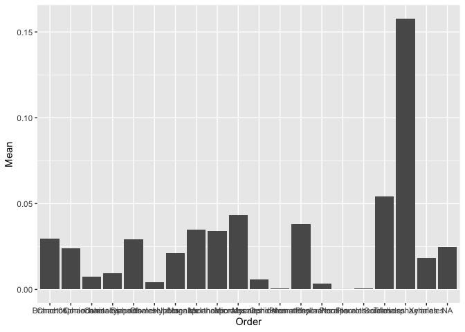
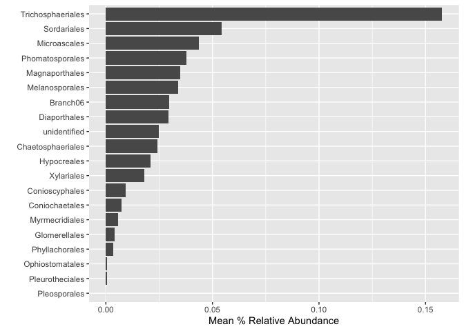
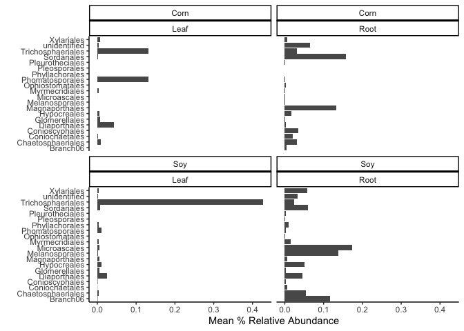
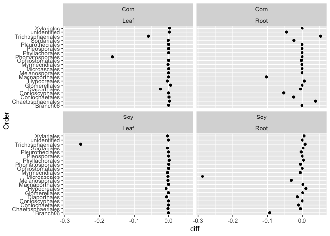

Tidyverse
================
Zachary Noel
2023-03-14

## Seemless data wrangeling

The tidyverse is a bunch of packages and functions written by the same
folks that manage Rstudio. The tidyverse builds upon base R to allow for
easier use of large datasets.

If you do not have the tidyverse installed please install it and load it
`install.pakcages("tidyverse")`

``` r
library(tidyverse)
```

    ## ── Attaching packages ─────────────────────────────────────── tidyverse 1.3.2 ──
    ## ✔ ggplot2 3.4.1      ✔ purrr   0.3.5 
    ## ✔ tibble  3.1.8      ✔ dplyr   1.0.10
    ## ✔ tidyr   1.2.1      ✔ stringr 1.5.0 
    ## ✔ readr   2.1.3      ✔ forcats 0.5.2 
    ## ── Conflicts ────────────────────────────────────────── tidyverse_conflicts() ──
    ## ✖ dplyr::filter() masks stats::filter()
    ## ✖ dplyr::lag()    masks stats::lag()

When you load in the tidyverse notice that it loads in 8 different
packages. You will not have to load these individually.

More info and cheet sheets can be found here:
<https://tidyr.tidyverse.org/index.html>

Lets demonstrate some of the most useful functionality of some tidyverse
functions. **Note** that this tutorial does not cover everything and
**self-learning** may be required for specific functionality. We will
cover the following:

- Data wrangling & manipulation
  - mutate()
  - select()
  - filter()
  - the pipe %\>%
  - summarise()
  - group_by()
- Joining & pivotting
- Integration with plotting & statistics

For this tutorial I will use the same microbiome dataset we used in
previous classes for `ggplot`, except this dataset includes all fungi in
the Phylum Ascomycota, not just one family.

``` r
microbiome.fungi <- read.csv("Microbiome.csv")
```

If we look at the structure of the data we can see that the dataset is
1,353,422 rows. This is too large for excel to handle. So we literally
cannot use it in excel.

``` r
str(microbiome.fungi)
```

    ## 'data.frame':    1353422 obs. of  42 variables:
    ##  $ X                   : int  1242826 1320150 794589 1242688 1320170 1243099 1319917 1242871 1243075 1242973 ...
    ##  $ OTU                 : chr  "FOTU_7" "FOTU_9" "FOTU_44" "FOTU_7" ...
    ##  $ Sample              : chr  "Corn2017RootObjective2Collection2T2R5BFE1" "Corn2017RootObjective2Collection1T1R1ACD10" "Corn2017RootObjective2Collection1T1R2BFC12" "Corn2017RootObjective2Collection2T2R6BFB4" ...
    ##  $ Abundance           : num  0.997 0.996 0.993 0.989 0.984 ...
    ##  $ SampleID            : chr  "Corn2017RootObjective2Collection2T2R5BFE1" "Corn2017RootObjective2Collection1T1R1ACD10" "Corn2017RootObjective2Collection1T1R2BFC12" "Corn2017RootObjective2Collection2T2R6BFB4" ...
    ##  $ BarcodeSequence     : chr  "ATCGTCCGCG" "CAACGTGCTC" "CCTGTCCTAT" "ACTGCTATCG" ...
    ##  $ LinkerPrimerSequence: chr  "CAAGCAGAAGACGGCATACGAGAT" "CAAGCAGAAGACGGCATACGAGAT" "CAAGCAGAAGACGGCATACGAGAT" "CAAGCAGAAGACGGCATACGAGAT" ...
    ##  $ Region              : chr  "ITS" "ITS" "ITS" "ITS" ...
    ##  $ BC_plate            : int  1 3 3 1 3 1 3 3 3 1 ...
    ##  $ BC_name             : chr  "PCR_R_bc5" "PCR_R_bc268" "PCR_R_bc283" "PCR_R_bc26" ...
    ##  $ Crop                : chr  "Corn" "Corn" "Corn" "Corn" ...
    ##  $ Objective           : chr  "Objective 2" "Objective 2" "Objective 2" "Objective 2" ...
    ##  $ Collection          : int  2 1 1 2 2 2 2 2 2 2 ...
    ##  $ Compartment         : chr  "Root" "Root" "Root" "Root" ...
    ##  $ DateSampled         : chr  "5-Jul-17" "26-Jun-17" "26-Jun-17" "5-Jul-17" ...
    ##  $ GrowthStage         : chr  "V8" "V6" "V6" "V8" ...
    ##  $ Treatment           : chr  "T2" "T1" "T1" "T2" ...
    ##  $ Rep                 : chr  "R5" "R1" "R2" "R6" ...
    ##  $ sample_Sample       : chr  "B" "A" "B" "B" ...
    ##  $ Fungicide           : chr  "F" "C" "F" "F" ...
    ##  $ Target_organism     : chr  "Fungi" "Fungi" "Fungi" "Fungi" ...
    ##  $ Location            : chr  "Kellogg Biological Station" "Kellogg Biological Station" "Kellogg Biological Station" "Kellogg Biological Station" ...
    ##  $ Experiment          : chr  "LTER" "LTER" "LTER" "LTER" ...
    ##  $ Year                : int  2017 2017 2017 2017 2017 2017 2017 2017 2017 2017 ...
    ##  $ Phi2                : logi  NA NA NA NA NA NA ...
    ##  $ PhiNO               : logi  NA NA NA NA NA NA ...
    ##  $ PhiNPQ              : logi  NA NA NA NA NA NA ...
    ##  $ Relative.Chlorophyll: logi  NA NA NA NA NA NA ...
    ##  $ Sample_or_Control   : chr  "True Sample" "True Sample" "True Sample" "True Sample" ...
    ##  $ is.neg              : logi  FALSE FALSE FALSE FALSE FALSE FALSE ...
    ##  $ OTU_ID              : chr  "FOTU_7" "FOTU_9" "FOTU_44" "FOTU_7" ...
    ##  $ Kingdom             : chr  "Fungi" "Fungi" "Fungi" "Fungi" ...
    ##  $ Phylum              : chr  "Ascomycota" "Ascomycota" "Ascomycota" "Ascomycota" ...
    ##  $ Class               : chr  "Sordariomycetes" "Dothideomycetes" "Dothideomycetes" "Sordariomycetes" ...
    ##  $ Order               : chr  "Sordariales" "Pleosporales" "Pleosporales" "Sordariales" ...
    ##  $ Family              : chr  "Chaetomiaceae" "Didymellaceae" "Sporormiaceae" "Chaetomiaceae" ...
    ##  $ Genus               : chr  NA "Didymella" "Preussia" NA ...
    ##  $ Species             : chr  NA "Didymella sp." "Preussia sp." NA ...
    ##  $ Isolate             : chr  NA NA NA NA ...
    ##  $ Isolate_percent_id  : num  0 0 0 0 0 0 0 0 0 0 ...
    ##  $ BestMatch           : chr  "Chaetomiaceae" "Didymella sp." "Preussia sp." "Chaetomiaceae" ...
    ##  $ Taxonomy            : chr  "FOTU_7-Chaetomiaceae" "FOTU_9-Didymella sp." "FOTU_44-Preussia sp." "FOTU_7-Chaetomiaceae" ...

Lets start exploring the data.

the first thing we can do is select only the columns we need since it
seems that there are lots of columns that we may not need.

#### `select()`

``` r
microbiome.fungi2 <- select(microbiome.fungi, OTU, SampleID, Abundance, Crop, Compartment, DateSampled, GrowthStage, Treatment, Rep, Fungicide, Kingdom:Taxonomy)
```

Note the syntax. I listed all the column headers I wanted, but at the
end I used `Kingdom:Taxonomy` because all these were in order and I can
use the column to select them all.

#### `filter()`

this is a convenient function that allows you to subset data fairly
easily. However, I’m not sure how its much easier than other subset
function

``` r
head(filter(microbiome.fungi2, Class == "Sordariomycetes"))
```

    ##      OTU                                   SampleID Abundance Crop Compartment
    ## 1 FOTU_7  Corn2017RootObjective2Collection2T2R5BFE1 0.9970508 Corn        Root
    ## 2 FOTU_7  Corn2017RootObjective2Collection2T2R6BFB4 0.9886459 Corn        Root
    ## 3 FOTU_7 Corn2017RootObjective2Collection2T2R5ACD11 0.9786059 Corn        Root
    ## 4 FOTU_7  Corn2017RootObjective2Collection2T2R2BCA8 0.9634735 Corn        Root
    ## 5 FOTU_7  Corn2017RootObjective2Collection2T2R1CFB6 0.9592154 Corn        Root
    ## 6 FOTU_7 Corn2017RootObjective2Collection2T2R5CFD12 0.9567938 Corn        Root
    ##   DateSampled GrowthStage Treatment Rep Fungicide Kingdom     Phylum
    ## 1    5-Jul-17          V8        T2  R5         F   Fungi Ascomycota
    ## 2    5-Jul-17          V8        T2  R6         F   Fungi Ascomycota
    ## 3    5-Jul-17          V8        T2  R5         C   Fungi Ascomycota
    ## 4    5-Jul-17          V8        T2  R2         C   Fungi Ascomycota
    ## 5    5-Jul-17          V8        T2  R1         F   Fungi Ascomycota
    ## 6    5-Jul-17          V8        T2  R5         F   Fungi Ascomycota
    ##             Class       Order        Family Genus Species Isolate
    ## 1 Sordariomycetes Sordariales Chaetomiaceae  <NA>    <NA>    <NA>
    ## 2 Sordariomycetes Sordariales Chaetomiaceae  <NA>    <NA>    <NA>
    ## 3 Sordariomycetes Sordariales Chaetomiaceae  <NA>    <NA>    <NA>
    ## 4 Sordariomycetes Sordariales Chaetomiaceae  <NA>    <NA>    <NA>
    ## 5 Sordariomycetes Sordariales Chaetomiaceae  <NA>    <NA>    <NA>
    ## 6 Sordariomycetes Sordariales Chaetomiaceae  <NA>    <NA>    <NA>
    ##   Isolate_percent_id     BestMatch             Taxonomy
    ## 1                  0 Chaetomiaceae FOTU_7-Chaetomiaceae
    ## 2                  0 Chaetomiaceae FOTU_7-Chaetomiaceae
    ## 3                  0 Chaetomiaceae FOTU_7-Chaetomiaceae
    ## 4                  0 Chaetomiaceae FOTU_7-Chaetomiaceae
    ## 5                  0 Chaetomiaceae FOTU_7-Chaetomiaceae
    ## 6                  0 Chaetomiaceae FOTU_7-Chaetomiaceae

#### `mutate()`

Mutate allows us to quickly create new columns. Say we wanted to
transform the Abundance column into a percentage by multiplying by 100.

``` r
head(mutate(microbiome.fungi2, Percent = Abundance*100))
```

    ##       OTU                                   SampleID Abundance Crop Compartment
    ## 1  FOTU_7  Corn2017RootObjective2Collection2T2R5BFE1 0.9970508 Corn        Root
    ## 2  FOTU_9 Corn2017RootObjective2Collection1T1R1ACD10 0.9955440 Corn        Root
    ## 3 FOTU_44 Corn2017RootObjective2Collection1T1R2BFC12 0.9927446 Corn        Root
    ## 4  FOTU_7  Corn2017RootObjective2Collection2T2R6BFB4 0.9886459 Corn        Root
    ## 5  FOTU_9  Corn2017RootObjective2Collection2T1R5BCC2 0.9835863 Corn        Root
    ## 6  FOTU_7 Corn2017RootObjective2Collection2T2R5ACD11 0.9786059 Corn        Root
    ##   DateSampled GrowthStage Treatment Rep Fungicide Kingdom     Phylum
    ## 1    5-Jul-17          V8        T2  R5         F   Fungi Ascomycota
    ## 2   26-Jun-17          V6        T1  R1         C   Fungi Ascomycota
    ## 3   26-Jun-17          V6        T1  R2         F   Fungi Ascomycota
    ## 4    5-Jul-17          V8        T2  R6         F   Fungi Ascomycota
    ## 5    5-Jul-17          V8        T1  R5         C   Fungi Ascomycota
    ## 6    5-Jul-17          V8        T2  R5         C   Fungi Ascomycota
    ##             Class        Order        Family     Genus       Species Isolate
    ## 1 Sordariomycetes  Sordariales Chaetomiaceae      <NA>          <NA>    <NA>
    ## 2 Dothideomycetes Pleosporales Didymellaceae Didymella Didymella sp.    <NA>
    ## 3 Dothideomycetes Pleosporales Sporormiaceae  Preussia  Preussia sp.    <NA>
    ## 4 Sordariomycetes  Sordariales Chaetomiaceae      <NA>          <NA>    <NA>
    ## 5 Dothideomycetes Pleosporales Didymellaceae Didymella Didymella sp.    <NA>
    ## 6 Sordariomycetes  Sordariales Chaetomiaceae      <NA>          <NA>    <NA>
    ##   Isolate_percent_id     BestMatch             Taxonomy  Percent
    ## 1                  0 Chaetomiaceae FOTU_7-Chaetomiaceae 99.70508
    ## 2                  0 Didymella sp. FOTU_9-Didymella sp. 99.55440
    ## 3                  0  Preussia sp. FOTU_44-Preussia sp. 99.27446
    ## 4                  0 Chaetomiaceae FOTU_7-Chaetomiaceae 98.86459
    ## 5                  0 Didymella sp. FOTU_9-Didymella sp. 98.35863
    ## 6                  0 Chaetomiaceae FOTU_7-Chaetomiaceae 97.86059

#### the pipe `%>%`

We can also combine multiple functions together. This is an important
concept and is very powerful. It helps to try to visualize what you are
doing to your data at each step.

We will combine all previous steps into one large string of functions.

When we do this we do not have to specify the data in each function. The
data from the previous step is transfered to the next step.

``` r
microbiome.fungi %>%
  select(OTU, SampleID, Abundance, Crop, Compartment, DateSampled, GrowthStage, Treatment, Rep, Fungicide, Kingdom:Taxonomy) %>%
  filter(Class == "Sordariomycetes") %>%
  mutate(Percent = Abundance*100) %>%
  head()
```

    ##      OTU                                   SampleID Abundance Crop Compartment
    ## 1 FOTU_7  Corn2017RootObjective2Collection2T2R5BFE1 0.9970508 Corn        Root
    ## 2 FOTU_7  Corn2017RootObjective2Collection2T2R6BFB4 0.9886459 Corn        Root
    ## 3 FOTU_7 Corn2017RootObjective2Collection2T2R5ACD11 0.9786059 Corn        Root
    ## 4 FOTU_7  Corn2017RootObjective2Collection2T2R2BCA8 0.9634735 Corn        Root
    ## 5 FOTU_7  Corn2017RootObjective2Collection2T2R1CFB6 0.9592154 Corn        Root
    ## 6 FOTU_7 Corn2017RootObjective2Collection2T2R5CFD12 0.9567938 Corn        Root
    ##   DateSampled GrowthStage Treatment Rep Fungicide Kingdom     Phylum
    ## 1    5-Jul-17          V8        T2  R5         F   Fungi Ascomycota
    ## 2    5-Jul-17          V8        T2  R6         F   Fungi Ascomycota
    ## 3    5-Jul-17          V8        T2  R5         C   Fungi Ascomycota
    ## 4    5-Jul-17          V8        T2  R2         C   Fungi Ascomycota
    ## 5    5-Jul-17          V8        T2  R1         F   Fungi Ascomycota
    ## 6    5-Jul-17          V8        T2  R5         F   Fungi Ascomycota
    ##             Class       Order        Family Genus Species Isolate
    ## 1 Sordariomycetes Sordariales Chaetomiaceae  <NA>    <NA>    <NA>
    ## 2 Sordariomycetes Sordariales Chaetomiaceae  <NA>    <NA>    <NA>
    ## 3 Sordariomycetes Sordariales Chaetomiaceae  <NA>    <NA>    <NA>
    ## 4 Sordariomycetes Sordariales Chaetomiaceae  <NA>    <NA>    <NA>
    ## 5 Sordariomycetes Sordariales Chaetomiaceae  <NA>    <NA>    <NA>
    ## 6 Sordariomycetes Sordariales Chaetomiaceae  <NA>    <NA>    <NA>
    ##   Isolate_percent_id     BestMatch             Taxonomy  Percent
    ## 1                  0 Chaetomiaceae FOTU_7-Chaetomiaceae 99.70508
    ## 2                  0 Chaetomiaceae FOTU_7-Chaetomiaceae 98.86459
    ## 3                  0 Chaetomiaceae FOTU_7-Chaetomiaceae 97.86059
    ## 4                  0 Chaetomiaceae FOTU_7-Chaetomiaceae 96.34735
    ## 5                  0 Chaetomiaceae FOTU_7-Chaetomiaceae 95.92154
    ## 6                  0 Chaetomiaceae FOTU_7-Chaetomiaceae 95.67938

#### `summarise()`

We can use the `summarise()` function to find things like means and
standard deviations/errors.

``` r
microbiome.fungi %>%
  select(OTU, SampleID, Abundance, Crop, Compartment, DateSampled, GrowthStage, Treatment, Rep, Fungicide, Kingdom:Taxonomy) %>%
  filter(Class == "Sordariomycetes") %>%
  mutate(Percent = Abundance*100) %>%
  summarise(Mean = mean(Percent)) %>%
  head()
```

    ##         Mean
    ## 1 0.02803439

So on average, Ascomycota makes up about 0.02% of the microbiome.

We can also connect multiple summary statistics here.

``` r
microbiome.fungi %>%
  select(OTU, SampleID, Abundance, Crop, Compartment, DateSampled, GrowthStage, Treatment, Rep, Fungicide, Kingdom:Taxonomy) %>%
  filter(Class == "Sordariomycetes") %>%
  mutate(Percent = Abundance*100) %>%
  summarise(Mean = mean(Percent), 
            n = n(), 
            sd.dev = sd(Percent)) %>%
  mutate(std.err = sd.dev/sqrt(n))
```

    ##         Mean      n   sd.dev     std.err
    ## 1 0.02803439 382260 0.854294 0.001381745

This is useful, but maybe we want to have summary statistics by group!
We can also do this very easily using the `group_by()` function.

``` r
microbiome.fungi %>%
  select(OTU, SampleID, Abundance, Crop, Compartment, DateSampled, GrowthStage, Treatment, Rep, Fungicide, Kingdom:Taxonomy) %>%
  filter(Class == "Sordariomycetes") %>%
  group_by(Order) %>%
  mutate(Percent = Abundance*100) %>%
  summarise(Mean = mean(Percent), 
            n = n(), 
            sd.dev = sd(Percent)) %>%
  mutate(std.err = sd.dev/sqrt(n))
```

    ## # A tibble: 20 × 5
    ##    Order                  Mean      n   sd.dev   std.err
    ##    <chr>                 <dbl>  <int>    <dbl>     <dbl>
    ##  1 Branch06          0.0295      6094 0.477    0.00611  
    ##  2 Chaetosphaeriales 0.0241      7756 0.445    0.00505  
    ##  3 Coniochaetales    0.00747    16620 0.375    0.00291  
    ##  4 Conioscyphales    0.00936     2770 0.257    0.00489  
    ##  5 Diaporthales      0.0293     40996 0.715    0.00353  
    ##  6 Glomerellales     0.00400    12742 0.0920   0.000815 
    ##  7 Hypocreales       0.0210    119110 0.524    0.00152  
    ##  8 Magnaporthales    0.0348      8864 0.808    0.00859  
    ##  9 Melanosporales    0.0339      1108 0.637    0.0191   
    ## 10 Microascales      0.0435      5540 1.19     0.0160   
    ## 11 Myrmecridiales    0.00562     3324 0.0722   0.00125  
    ## 12 Ophiostomatales   0.000563    1662 0.0133   0.000325 
    ## 13 Phomatosporales   0.0379       554 0.549    0.0233   
    ## 14 Phyllachorales    0.00350     1662 0.0222   0.000546 
    ## 15 Pleosporales      0.0000400    554 0.000942 0.0000400
    ## 16 Pleurotheciales   0.000443    1108 0.0136   0.000409 
    ## 17 Sordariales       0.0543     73682 1.56     0.00573  
    ## 18 Trichosphaeriales 0.158       1108 0.609    0.0183   
    ## 19 Xylariales        0.0181     40442 0.417    0.00208  
    ## 20 <NA>              0.0248     36564 0.735    0.00384

We could also use the `arrange()` function to quickly sort our resultant
data by a specific column

``` r
# arrange from least to most
microbiome.fungi %>%
  select(OTU, SampleID, Abundance, Crop, Compartment, DateSampled, GrowthStage, Treatment, Rep, Fungicide, Kingdom:Taxonomy) %>%
  filter(Class == "Sordariomycetes") %>%
  group_by(Order) %>%
  mutate(Percent = Abundance*100) %>%
  summarise(Mean = mean(Percent), 
            n = n(), 
            sd.dev = sd(Percent)) %>%
  mutate(std.err = sd.dev/sqrt(n)) %>%
  arrange(Mean)
```

    ## # A tibble: 20 × 5
    ##    Order                  Mean      n   sd.dev   std.err
    ##    <chr>                 <dbl>  <int>    <dbl>     <dbl>
    ##  1 Pleosporales      0.0000400    554 0.000942 0.0000400
    ##  2 Pleurotheciales   0.000443    1108 0.0136   0.000409 
    ##  3 Ophiostomatales   0.000563    1662 0.0133   0.000325 
    ##  4 Phyllachorales    0.00350     1662 0.0222   0.000546 
    ##  5 Glomerellales     0.00400    12742 0.0920   0.000815 
    ##  6 Myrmecridiales    0.00562     3324 0.0722   0.00125  
    ##  7 Coniochaetales    0.00747    16620 0.375    0.00291  
    ##  8 Conioscyphales    0.00936     2770 0.257    0.00489  
    ##  9 Xylariales        0.0181     40442 0.417    0.00208  
    ## 10 Hypocreales       0.0210    119110 0.524    0.00152  
    ## 11 Chaetosphaeriales 0.0241      7756 0.445    0.00505  
    ## 12 <NA>              0.0248     36564 0.735    0.00384  
    ## 13 Diaporthales      0.0293     40996 0.715    0.00353  
    ## 14 Branch06          0.0295      6094 0.477    0.00611  
    ## 15 Melanosporales    0.0339      1108 0.637    0.0191   
    ## 16 Magnaporthales    0.0348      8864 0.808    0.00859  
    ## 17 Phomatosporales   0.0379       554 0.549    0.0233   
    ## 18 Microascales      0.0435      5540 1.19     0.0160   
    ## 19 Sordariales       0.0543     73682 1.56     0.00573  
    ## 20 Trichosphaeriales 0.158       1108 0.609    0.0183

``` r
# arrange from most to least
microbiome.fungi %>%
  select(OTU, SampleID, Abundance, Crop, Compartment, DateSampled, GrowthStage, Treatment, Rep, Fungicide, Kingdom:Taxonomy) %>%
  filter(Class == "Sordariomycetes") %>%
  group_by(Order) %>%
  mutate(Percent = Abundance*100) %>%
  summarise(Mean = mean(Percent), 
            n = n(), 
            sd.dev = sd(Percent)) %>%
  mutate(std.err = sd.dev/sqrt(n)) %>%
  arrange(-Mean)
```

    ## # A tibble: 20 × 5
    ##    Order                  Mean      n   sd.dev   std.err
    ##    <chr>                 <dbl>  <int>    <dbl>     <dbl>
    ##  1 Trichosphaeriales 0.158       1108 0.609    0.0183   
    ##  2 Sordariales       0.0543     73682 1.56     0.00573  
    ##  3 Microascales      0.0435      5540 1.19     0.0160   
    ##  4 Phomatosporales   0.0379       554 0.549    0.0233   
    ##  5 Magnaporthales    0.0348      8864 0.808    0.00859  
    ##  6 Melanosporales    0.0339      1108 0.637    0.0191   
    ##  7 Branch06          0.0295      6094 0.477    0.00611  
    ##  8 Diaporthales      0.0293     40996 0.715    0.00353  
    ##  9 <NA>              0.0248     36564 0.735    0.00384  
    ## 10 Chaetosphaeriales 0.0241      7756 0.445    0.00505  
    ## 11 Hypocreales       0.0210    119110 0.524    0.00152  
    ## 12 Xylariales        0.0181     40442 0.417    0.00208  
    ## 13 Conioscyphales    0.00936     2770 0.257    0.00489  
    ## 14 Coniochaetales    0.00747    16620 0.375    0.00291  
    ## 15 Myrmecridiales    0.00562     3324 0.0722   0.00125  
    ## 16 Glomerellales     0.00400    12742 0.0920   0.000815 
    ## 17 Phyllachorales    0.00350     1662 0.0222   0.000546 
    ## 18 Ophiostomatales   0.000563    1662 0.0133   0.000325 
    ## 19 Pleurotheciales   0.000443    1108 0.0136   0.000409 
    ## 20 Pleosporales      0.0000400    554 0.000942 0.0000400

#### Connecting to plotting

These groups of functions and packages also all work together very
nicely. For example, direct input into ggplot is possible. In which case
you would not have to enter the data statement, you just need to start
inputing your aesthetics.

``` r
microbiome.fungi %>%
  select(OTU, SampleID, Abundance, Crop, Compartment, DateSampled, GrowthStage, Treatment, Rep, Fungicide, Kingdom:Taxonomy) %>%
  filter(Class == "Sordariomycetes") %>%
  group_by(Order) %>%
  mutate(Percent = Abundance*100) %>%
  summarise(Mean = mean(Percent), 
            n = n(), 
            sd.dev = sd(Percent)) %>%
  mutate(std.err = sd.dev/sqrt(n)) %>%
  ggplot(aes(x = Order, y = Mean)) +
  geom_bar(stat="identity")
```

<!-- -->

#### Dealing with NA values

This dataset the NA value means an unidenfied fungus. So for plotting we
would want to change that to unidentified. We can deal with NA values
nicely within the tidyverse.

``` r
microbiome.fungi %>%
  select(OTU, SampleID, Abundance, Crop, Compartment, DateSampled, GrowthStage, Treatment, Rep, Fungicide, Kingdom:Taxonomy) %>%
  filter(Class == "Sordariomycetes") %>%
  group_by(Order) %>%
  mutate(Percent = Abundance*100) %>%
  summarise(Mean = mean(Percent), 
            n = n(), 
            sd.dev = sd(Percent)) %>%
  
  mutate(std.err = sd.dev/sqrt(n)) %>%
  replace_na(list(Order = "unidentified")) %>%
  ggplot(aes(x = Order, y = Mean)) +
  geom_bar(stat="identity")
```

<!-- -->

Arrange for `ggplot()` using `fct_reorder()`

``` r
microbiome.fungi %>%
  select(OTU, SampleID, Abundance, Crop, Compartment, DateSampled, GrowthStage, Treatment, Rep, Fungicide, Kingdom:Taxonomy) %>%
  filter(Class == "Sordariomycetes") %>%
  group_by(Order) %>%
  mutate(Percent = Abundance*100) %>%
  summarise(Mean = mean(Percent), 
            n = n(), 
            sd.dev = sd(Percent)) %>%
  
  mutate(std.err = sd.dev/sqrt(n)) %>%
  replace_na(list(Order = "unidentified")) %>%
  mutate(Order2 = fct_reorder(Order, desc(-Mean))) %>%
  ggplot(aes(x = Mean, y = Order2)) +
  geom_bar(stat="identity") + 
  xlab("Mean % Relative Abundance") +
  ylab("")
```

<!-- -->

Making it really sofisticated now by separating by crop and compartment
and faceting

``` r
microbiome.fungi %>%
  select(OTU, SampleID, Abundance, Crop, Compartment, DateSampled, GrowthStage, Treatment, Rep, Fungicide, Kingdom:Taxonomy) %>%
  filter(Class == "Sordariomycetes") %>%
  group_by(Order, Crop, Compartment) %>%
  mutate(Percent = Abundance*100) %>%
  summarise(Mean = mean(Percent), 
            n = n(), 
            sd.dev = sd(Percent)) %>%
  mutate(std.err = sd.dev/sqrt(n)) %>%
  replace_na(list(Order = "unidentified")) %>%
  mutate(Order2 = fct_reorder(Order, desc(-Mean))) %>%
  ggplot(aes(x = Mean, y = Order2)) +
  geom_bar(stat="identity") + 
  xlab("Mean % Relative Abundance") +
  ylab("") + 
  facet_wrap(~Crop*Compartment) +
  theme_classic()
```

    ## `summarise()` has grouped output by 'Order', 'Crop'. You can override using the
    ## `.groups` argument.

<!-- -->

#### Joining

The join group of functions are super useful. Have you ever tried to
match up data by rows based on some criteria? Its almost impossible
without messing up over 10-15 rows of data.

More info can be found here:
<https://dplyr.tidyverse.org/reference/mutate-joins.html>

But we can easily do this with the joining functions. They include:

-left_join() - Keep all rows of X and add matching rows from Y. Any rows
in Y that don’t match X are excluded. -right_join() - reverse of
left_join() -inner_join() - only keep rows that are common to both X AND
Y, remove everything else. -full_join() - Keep any columns that are in
either X or Y

To try these out lets split our data into separate sets including
taxonomy and metadata.

Here we are also sampling 100 random rows of our dataset using the
`sample_n()` function

``` r
taxonomy <- microbiome.fungi2 %>%
  select(OTU, Kingdom:Taxonomy) %>%
  sample_n(size = 100)

metadata <- microbiome.fungi2 %>% 
  select(OTU:Fungicide) %>%
  sample_n(size = 100)

left_join(taxonomy, metadata, by = "OTU") # notice the NAs in the metadata since some OTUs did not appear in the random sample. 
```

    ##           OTU Kingdom     Phylum           Class             Order
    ## 1   FOTU_1160   Fungi Ascomycota  Eurotiomycetes   Chaetothyriales
    ## 2   FOTU_4062   Fungi Ascomycota  Eurotiomycetes   Chaetothyriales
    ## 3    FOTU_712   Fungi Ascomycota Dothideomycetes      Pleosporales
    ## 4   FOTU_1104   Fungi Ascomycota Dothideomycetes      Pleosporales
    ## 5   FOTU_3687   Fungi Ascomycota Dothideomycetes      Pleosporales
    ## 6   FOTU_5397   Fungi Ascomycota Dothideomycetes      Pleosporales
    ## 7   FOTU_6853   Fungi Ascomycota   Pezizomycetes         Pezizales
    ## 8   FOTU_5119   Fungi Ascomycota Dothideomycetes      Pleosporales
    ## 9     FOTU_77   Fungi Ascomycota Sordariomycetes       Sordariales
    ## 10  FOTU_3814   Fungi Ascomycota Lecanoromycetes       Lecanorales
    ## 11  FOTU_2363   Fungi Ascomycota Dothideomycetes      Pleosporales
    ## 12  FOTU_1475   Fungi Ascomycota Dothideomycetes      Pleosporales
    ## 13   FOTU_258   Fungi Ascomycota            <NA>              <NA>
    ## 14  FOTU_4078   Fungi Ascomycota   Leotiomycetes        Helotiales
    ## 15  FOTU_5602   Fungi Ascomycota Sordariomycetes       Sordariales
    ## 16   FOTU_879   Fungi Ascomycota Dothideomycetes       Tubeufiales
    ## 17  FOTU_5224   Fungi Ascomycota  Eurotiomycetes        Eurotiales
    ## 18  FOTU_2837   Fungi Ascomycota Dothideomycetes      Pleosporales
    ## 19  FOTU_1608   Fungi Ascomycota Dothideomycetes      Pleosporales
    ## 20  FOTU_3367   Fungi Ascomycota Dothideomycetes      Pleosporales
    ## 21  FOTU_2599   Fungi Ascomycota Dothideomycetes      Pleosporales
    ## 22  FOTU_3137   Fungi Ascomycota Dothideomycetes      Pleosporales
    ## 23  FOTU_5493   Fungi Ascomycota  Orbiliomycetes        Orbiliales
    ## 24   FOTU_412   Fungi Ascomycota   Leotiomycetes        Helotiales
    ## 25  FOTU_6634   Fungi Ascomycota Dothideomycetes              <NA>
    ## 26  FOTU_6825   Fungi Ascomycota            <NA>              <NA>
    ## 27  FOTU_1645   Fungi Ascomycota Dothideomycetes              <NA>
    ## 28  FOTU_1917   Fungi Ascomycota Sordariomycetes       Hypocreales
    ## 29  FOTU_7117   Fungi Ascomycota Dothideomycetes      Pleosporales
    ## 30  FOTU_1666   Fungi Ascomycota Sordariomycetes     Glomerellales
    ## 31  FOTU_3428   Fungi Ascomycota Sordariomycetes       Sordariales
    ## 32  FOTU_3731   Fungi Ascomycota   Leotiomycetes        Helotiales
    ## 33  FOTU_6705   Fungi Ascomycota Dothideomycetes      Pleosporales
    ## 34   FOTU_789   Fungi Ascomycota Dothideomycetes      Pleosporales
    ## 35  FOTU_5359   Fungi Ascomycota Dothideomycetes      Pleosporales
    ## 36  FOTU_5995   Fungi Ascomycota   Leotiomycetes        Helotiales
    ## 37  FOTU_2857   Fungi Ascomycota Dothideomycetes      Pleosporales
    ## 38  FOTU_2018   Fungi Ascomycota Dothideomycetes       Capnodiales
    ## 39   FOTU_139   Fungi Ascomycota Sordariomycetes       Sordariales
    ## 40   FOTU_205   Fungi Ascomycota Sordariomycetes       Sordariales
    ## 41  FOTU_5764   Fungi Ascomycota            <NA>              <NA>
    ## 42  FOTU_4866   Fungi Ascomycota  Orbiliomycetes        Orbiliales
    ## 43  FOTU_3541   Fungi Ascomycota            <NA>              <NA>
    ## 44  FOTU_3122   Fungi Ascomycota Dothideomycetes      Pleosporales
    ## 45  FOTU_2704   Fungi Ascomycota Sordariomycetes          Branch06
    ## 46  FOTU_1370   Fungi Ascomycota            <NA>              <NA>
    ## 47  FOTU_3443   Fungi Ascomycota   Pezizomycetes         Pezizales
    ## 48  FOTU_4805   Fungi Ascomycota   Pezizomycetes         Pezizales
    ## 49  FOTU_2400   Fungi Ascomycota Dothideomycetes       Capnodiales
    ## 50  FOTU_7115   Fungi Ascomycota Dothideomycetes      Pleosporales
    ## 51   FOTU_128   Fungi Ascomycota Dothideomycetes      Pleosporales
    ## 52   FOTU_656   Fungi Ascomycota Saccharomycetes Saccharomycetales
    ## 53  FOTU_6333   Fungi Ascomycota  Orbiliomycetes        Orbiliales
    ## 54  FOTU_4664   Fungi Ascomycota            <NA>              <NA>
    ## 55  FOTU_7152   Fungi Ascomycota  Eurotiomycetes        Eurotiales
    ## 56  FOTU_6429   Fungi Ascomycota  Eurotiomycetes   Chaetothyriales
    ## 57  FOTU_6293   Fungi Ascomycota Dothideomycetes      Pleosporales
    ## 58  FOTU_3530   Fungi Ascomycota   Leotiomycetes        Helotiales
    ## 59  FOTU_2572   Fungi Ascomycota Dothideomycetes Botryosphaeriales
    ## 60  FOTU_5001   Fungi Ascomycota   Leotiomycetes        Helotiales
    ## 61   FOTU_973   Fungi Ascomycota Dothideomycetes      Pleosporales
    ## 62  FOTU_2299   Fungi Ascomycota            <NA>              <NA>
    ## 63  FOTU_1119   Fungi Ascomycota            <NA>              <NA>
    ## 64  FOTU_4909   Fungi Ascomycota            <NA>              <NA>
    ## 65   FOTU_342   Fungi Ascomycota Dothideomycetes      Pleosporales
    ## 66   FOTU_841   Fungi Ascomycota Sordariomycetes Chaetosphaeriales
    ## 67  FOTU_6909   Fungi Ascomycota Dothideomycetes      Pleosporales
    ## 68  FOTU_1922   Fungi Ascomycota Sordariomycetes        Xylariales
    ## 69  FOTU_3075   Fungi Ascomycota Dothideomycetes      Pleosporales
    ## 70  FOTU_1257   Fungi Ascomycota            <NA>              <NA>
    ## 71  FOTU_2839   Fungi Ascomycota            <NA>              <NA>
    ## 72  FOTU_1063   Fungi Ascomycota Dothideomycetes      Pleosporales
    ## 73  FOTU_2042   Fungi Ascomycota   Leotiomycetes        Helotiales
    ## 74  FOTU_6308   Fungi Ascomycota            <NA>              <NA>
    ## 75  FOTU_3056   Fungi Ascomycota Dothideomycetes      Pleosporales
    ## 76  FOTU_3372   Fungi Ascomycota   Leotiomycetes       Erysiphales
    ## 77  FOTU_2889   Fungi Ascomycota Dothideomycetes       Capnodiales
    ## 78  FOTU_3413   Fungi Ascomycota Dothideomycetes      Pleosporales
    ## 79  FOTU_2170   Fungi Ascomycota Dothideomycetes      Pleosporales
    ## 80  FOTU_1534   Fungi Ascomycota Sordariomycetes       Hypocreales
    ## 81   FOTU_613   Fungi Ascomycota Taphrinomycetes       Taphrinales
    ## 82   FOTU_175   Fungi Ascomycota Dothideomycetes      Pleosporales
    ## 83  FOTU_1565   Fungi Ascomycota Sordariomycetes    Coniochaetales
    ## 84  FOTU_3480   Fungi Ascomycota Dothideomycetes              <NA>
    ## 85  FOTU_1214   Fungi Ascomycota   Leotiomycetes        Helotiales
    ## 86  FOTU_2665   Fungi Ascomycota   Pezizomycetes         Pezizales
    ## 87    FOTU_38   Fungi Ascomycota Dothideomycetes      Pleosporales
    ## 88  FOTU_6430   Fungi Ascomycota Dothideomycetes       Dothideales
    ## 89   FOTU_839   Fungi Ascomycota            <NA>              <NA>
    ## 90  FOTU_5405   Fungi Ascomycota Dothideomycetes      Pleosporales
    ## 91  FOTU_5465   Fungi Ascomycota Dothideomycetes      Pleosporales
    ## 92  FOTU_2109   Fungi Ascomycota Dothideomycetes      Pleosporales
    ## 93  FOTU_2210   Fungi Ascomycota Dothideomycetes      Pleosporales
    ## 94  FOTU_1950   Fungi Ascomycota   Leotiomycetes        Helotiales
    ## 95  FOTU_5990   Fungi Ascomycota Dothideomycetes      Pleosporales
    ## 96   FOTU_731   Fungi Ascomycota Sordariomycetes       Hypocreales
    ## 97   FOTU_991   Fungi Ascomycota Sordariomycetes       Hypocreales
    ## 98  FOTU_4088   Fungi Ascomycota Sordariomycetes       Hypocreales
    ## 99  FOTU_3866   Fungi Ascomycota Sordariomycetes       Hypocreales
    ## 100  FOTU_122   Fungi Ascomycota Sordariomycetes      Diaporthales
    ##                  Family            Genus              Species
    ## 1   Herpotrichiellaceae Cladophialophora Cladophialophora sp.
    ## 2                  <NA>             <NA>                 <NA>
    ## 3                  <NA>             <NA>                 <NA>
    ## 4         Sporormiaceae             <NA>                 <NA>
    ## 5                  <NA>             <NA>                 <NA>
    ## 6         Didymellaceae             <NA>                 <NA>
    ## 7            Pezizaceae             <NA>                 <NA>
    ## 8                  <NA>             <NA>                 <NA>
    ## 9     Lasiosphaeriaceae             <NA>                 <NA>
    ## 10                 <NA>             <NA>                 <NA>
    ## 11        Pleosporaceae             <NA>                 <NA>
    ## 12                 <NA>             <NA>                 <NA>
    ## 13                 <NA>             <NA>                 <NA>
    ## 14      Hyaloscyphaceae             <NA>                 <NA>
    ## 15    Lasiosphaeriaceae             <NA>                 <NA>
    ## 16         Tubeufiaceae   Neohelicomyces   Neohelicomyces sp.
    ## 17       Trichocomaceae      Talaromyces      Talaromyces sp.
    ## 18        Didymellaceae        Didymella        Didymella sp.
    ## 19                 <NA>             <NA>                 <NA>
    ## 20                 <NA>             <NA>                 <NA>
    ## 21     Cucurbitariaceae  Neocucurbitaria  Neocucurbitaria sp.
    ## 22   Didymosphaeriaceae Paraconiothyrium Paraconiothyrium sp.
    ## 23       Incertae_sedis       Vermispora       Vermispora sp.
    ## 24                 <NA>             <NA>                 <NA>
    ## 25                 <NA>             <NA>                 <NA>
    ## 26                 <NA>             <NA>                 <NA>
    ## 27                 <NA>             <NA>                 <NA>
    ## 28                 <NA>             <NA>                 <NA>
    ## 29        Didymellaceae             <NA>                 <NA>
    ## 30       Glomerellaceae   Colletotrichum   Colletotrichum sp.
    ## 31                 <NA>             <NA>                 <NA>
    ## 32      Hyaloscyphaceae          Lachnum          Lachnum sp.
    ## 33      Teichosporaceae      Teichospora      Teichospora sp.
    ## 34        Pleosporaceae      Pyrenophora      Pyrenophora sp.
    ## 35                 <NA>             <NA>                 <NA>
    ## 36                 <NA>             <NA>                 <NA>
    ## 37    Leptosphaeriaceae   Sphaerellopsis   Sphaerellopsis sp.
    ## 38   Teratosphaeriaceae   Catenulostroma   Catenulostroma sp.
    ## 39    Lasiosphaeriaceae             <NA>                 <NA>
    ## 40        Chaetomiaceae         Humicola         Humicola sp.
    ## 41                 <NA>             <NA>                 <NA>
    ## 42          Orbiliaceae             <NA>                 <NA>
    ## 43                 <NA>             <NA>                 <NA>
    ## 44    Lophiostomataceae      Lophiostoma      Lophiostoma sp.
    ## 45                 <NA>             <NA>                 <NA>
    ## 46                 <NA>             <NA>                 <NA>
    ## 47       Pyronemataceae             <NA>                 <NA>
    ## 48           Tuberaceae            Tuber            Tuber sp.
    ## 49   Mycosphaerellaceae    Cercosporella    Cercosporella sp.
    ## 50        Didymellaceae             <NA>                 <NA>
    ## 51                 <NA>             <NA>                 <NA>
    ## 52                 <NA>             <NA>                 <NA>
    ## 53          Orbiliaceae             <NA>                 <NA>
    ## 54                 <NA>             <NA>                 <NA>
    ## 55       Trichocomaceae      Talaromyces      Talaromyces sp.
    ## 56                 <NA>             <NA>                 <NA>
    ## 57                 <NA>             <NA>                 <NA>
    ## 58                 <NA>             <NA>                 <NA>
    ## 59   Botryosphaeriaceae         Diplodia         Diplodia sp.
    ## 60                 <NA>             <NA>                 <NA>
    ## 61                 <NA>             <NA>                 <NA>
    ## 62                 <NA>             <NA>                 <NA>
    ## 63                 <NA>             <NA>                 <NA>
    ## 64                 <NA>             <NA>                 <NA>
    ## 65        Massarinaceae     Stagonospora     Stagonospora sp.
    ## 66   Chaetosphaeriaceae   Chaetosphaeria   Chaetosphaeria sp.
    ## 67                 <NA>             <NA>                 <NA>
    ## 68                 <NA>             <NA>                 <NA>
    ## 69       Thyridariaceae   Parathyridaria   Parathyridaria sp.
    ## 70                 <NA>             <NA>                 <NA>
    ## 71                 <NA>             <NA>                 <NA>
    ## 72   Didymosphaeriaceae Paraconiothyrium Paraconiothyrium sp.
    ## 73         Dermateaceae        Helgardia        Helgardia sp.
    ## 74                 <NA>             <NA>                 <NA>
    ## 75                 <NA>             <NA>                 <NA>
    ## 76         Erysiphaceae         Erysiphe         Erysiphe sp.
    ## 77   Mycosphaerellaceae  Scleroramularia  Scleroramularia sp.
    ## 78                 <NA>             <NA>                 <NA>
    ## 79    Phaeosphaeriaceae    Wojnowiciella    Wojnowiciella sp.
    ## 80                 <NA>             <NA>                 <NA>
    ## 81         Taphrinaceae         Taphrina         Taphrina sp.
    ## 82                 <NA>             <NA>                 <NA>
    ## 83      Coniochaetaceae      Coniochaeta      Coniochaeta sp.
    ## 84                 <NA>             <NA>                 <NA>
    ## 85         Dermateaceae         Calloria         Calloria sp.
    ## 86       Pyronemataceae             <NA>                 <NA>
    ## 87        Pleosporaceae       Alternaria       Alternaria sp.
    ## 88         Dothioraceae             <NA>                 <NA>
    ## 89                 <NA>             <NA>                 <NA>
    ## 90                 <NA>             <NA>                 <NA>
    ## 91                 <NA>             <NA>                 <NA>
    ## 92        Didymellaceae        Calophoma        Calophoma sp.
    ## 93      Teichosporaceae      Teichospora      Teichospora sp.
    ## 94          Helotiaceae             <NA>                 <NA>
    ## 95                 <NA>             <NA>                 <NA>
    ## 96       Bionectriaceae             <NA>                 <NA>
    ## 97                 <NA>             <NA>                 <NA>
    ## 98                 <NA>             <NA>                 <NA>
    ## 99                 <NA>             <NA>                 <NA>
    ## 100           Valsaceae             <NA>                 <NA>
    ##                        Isolate Isolate_percent_id            BestMatch
    ## 1                         <NA>              0.000 Cladophialophora sp.
    ## 2                         <NA>              0.000      Chaetothyriales
    ## 3                         <NA>              0.000         Pleosporales
    ## 4                         <NA>              0.000        Sporormiaceae
    ## 5                         <NA>              0.000         Pleosporales
    ## 6                         <NA>              0.000        Didymellaceae
    ## 7                         <NA>              0.000           Pezizaceae
    ## 8                         <NA>              0.000         Pleosporales
    ## 9                         <NA>              0.000    Lasiosphaeriaceae
    ## 10                        <NA>              0.000          Lecanorales
    ## 11                        <NA>              0.000        Pleosporaceae
    ## 12                        <NA>              0.000         Pleosporales
    ## 13                        <NA>              0.000           Ascomycota
    ## 14                        <NA>              0.000      Hyaloscyphaceae
    ## 15                        <NA>              0.000    Lasiosphaeriaceae
    ## 16                        <NA>              0.000   Neohelicomyces sp.
    ## 17                      CK1355             93.035      Talaromyces sp.
    ## 18                        <NA>              0.000        Didymella sp.
    ## 19                        <NA>              0.000         Pleosporales
    ## 20                        <NA>              0.000         Pleosporales
    ## 21                        <NA>              0.000  Neocucurbitaria sp.
    ## 22                        <NA>              0.000 Paraconiothyrium sp.
    ## 23                        <NA>              0.000       Vermispora sp.
    ## 24                        <NA>              0.000           Helotiales
    ## 25                        <NA>              0.000      Dothideomycetes
    ## 26                        <NA>              0.000           Ascomycota
    ## 27                        <NA>              0.000      Dothideomycetes
    ## 28                        <NA>              0.000          Hypocreales
    ## 29                        <NA>              0.000        Didymellaceae
    ## 30                        <NA>              0.000   Colletotrichum sp.
    ## 31                        <NA>              0.000          Sordariales
    ## 32                        <NA>              0.000          Lachnum sp.
    ## 33                        <NA>              0.000      Teichospora sp.
    ## 34                        <NA>              0.000      Pyrenophora sp.
    ## 35                        <NA>              0.000         Pleosporales
    ## 36                        <NA>              0.000           Helotiales
    ## 37                        <NA>              0.000   Sphaerellopsis sp.
    ## 38                        <NA>              0.000   Catenulostroma sp.
    ## 39                        <NA>              0.000    Lasiosphaeriaceae
    ## 40         MISO_9-11_[len=564]             79.167         Humicola sp.
    ## 41                        <NA>              0.000           Ascomycota
    ## 42                        <NA>              0.000          Orbiliaceae
    ## 43                        <NA>              0.000           Ascomycota
    ## 44                        <NA>              0.000      Lophiostoma sp.
    ## 45                        <NA>              0.000             Branch06
    ## 46                        <NA>              0.000           Ascomycota
    ## 47                        <NA>              0.000       Pyronemataceae
    ## 48                        <NA>              0.000            Tuber sp.
    ## 49                        <NA>              0.000    Cercosporella sp.
    ## 50                        <NA>              0.000        Didymellaceae
    ## 51                        <NA>              0.000         Pleosporales
    ## 52                        <NA>              0.000    Saccharomycetales
    ## 53                        <NA>              0.000          Orbiliaceae
    ## 54                        <NA>              0.000           Ascomycota
    ## 55                      CK1355             91.045      Talaromyces sp.
    ## 56                        <NA>              0.000      Chaetothyriales
    ## 57                        <NA>              0.000         Pleosporales
    ## 58                        <NA>              0.000           Helotiales
    ## 59                        <NA>              0.000         Diplodia sp.
    ## 60                        <NA>              0.000           Helotiales
    ## 61                        <NA>              0.000         Pleosporales
    ## 62                        <NA>              0.000           Ascomycota
    ## 63                        <NA>              0.000           Ascomycota
    ## 64                        <NA>              0.000           Ascomycota
    ## 65                        <NA>              0.000     Stagonospora sp.
    ## 66     V-MISO2L_3-8b_[len=587]             78.191   Chaetosphaeria sp.
    ## 67                        <NA>              0.000         Pleosporales
    ## 68                        <NA>              0.000           Xylariales
    ## 69                        <NA>              0.000   Parathyridaria sp.
    ## 70                        <NA>              0.000           Ascomycota
    ## 71                        <NA>              0.000           Ascomycota
    ## 72                        <NA>              0.000 Paraconiothyrium sp.
    ## 73                        <NA>              0.000        Helgardia sp.
    ## 74                        <NA>              0.000           Ascomycota
    ## 75                        <NA>              0.000         Pleosporales
    ## 76                        <NA>              0.000         Erysiphe sp.
    ## 77                        <NA>              0.000  Scleroramularia sp.
    ## 78                        <NA>              0.000         Pleosporales
    ## 79                        <NA>              0.000    Wojnowiciella sp.
    ## 80                        <NA>              0.000          Hypocreales
    ## 81                        <NA>              0.000         Taphrina sp.
    ## 82                        <NA>              0.000         Pleosporales
    ## 83                        <NA>              0.000      Coniochaeta sp.
    ## 84                        <NA>              0.000      Dothideomycetes
    ## 85                        <NA>              0.000         Calloria sp.
    ## 86                        <NA>              0.000       Pyronemataceae
    ## 87                        <NA>              0.000       Alternaria sp.
    ## 88                        <NA>              0.000         Dothioraceae
    ## 89                        <NA>              0.000           Ascomycota
    ## 90                        <NA>              0.000         Pleosporales
    ## 91                        <NA>              0.000         Pleosporales
    ## 92                        <NA>              0.000        Calophoma sp.
    ## 93                        <NA>              0.000      Teichospora sp.
    ## 94                        <NA>              0.000          Helotiaceae
    ## 95                        <NA>              0.000         Pleosporales
    ## 96         MISO_9-11_[len=564]             86.634       Bionectriaceae
    ## 97  Entomortierella_parvispora             77.670          Hypocreales
    ## 98                        <NA>              0.000          Hypocreales
    ## 99                        <NA>              0.000          Hypocreales
    ## 100                       <NA>              0.000            Valsaceae
    ##                           Taxonomy  SampleID Abundance Crop Compartment
    ## 1   FOTU_1160-Cladophialophora sp.      <NA>        NA <NA>        <NA>
    ## 2        FOTU_4062-Chaetothyriales      <NA>        NA <NA>        <NA>
    ## 3            FOTU_712-Pleosporales      <NA>        NA <NA>        <NA>
    ## 4          FOTU_1104-Sporormiaceae      <NA>        NA <NA>        <NA>
    ## 5           FOTU_3687-Pleosporales      <NA>        NA <NA>        <NA>
    ## 6          FOTU_5397-Didymellaceae      <NA>        NA <NA>        <NA>
    ## 7             FOTU_6853-Pezizaceae      <NA>        NA <NA>        <NA>
    ## 8           FOTU_5119-Pleosporales      <NA>        NA <NA>        <NA>
    ## 9        FOTU_77-Lasiosphaeriaceae      <NA>        NA <NA>        <NA>
    ## 10           FOTU_3814-Lecanorales      <NA>        NA <NA>        <NA>
    ## 11         FOTU_2363-Pleosporaceae      <NA>        NA <NA>        <NA>
    ## 12          FOTU_1475-Pleosporales      <NA>        NA <NA>        <NA>
    ## 13             FOTU_258-Ascomycota      <NA>        NA <NA>        <NA>
    ## 14       FOTU_4078-Hyaloscyphaceae      <NA>        NA <NA>        <NA>
    ## 15     FOTU_5602-Lasiosphaeriaceae      <NA>        NA <NA>        <NA>
    ## 16     FOTU_879-Neohelicomyces sp.      <NA>        NA <NA>        <NA>
    ## 17       FOTU_5224-Talaromyces sp.      <NA>        NA <NA>        <NA>
    ## 18         FOTU_2837-Didymella sp.      <NA>        NA <NA>        <NA>
    ## 19          FOTU_1608-Pleosporales      <NA>        NA <NA>        <NA>
    ## 20          FOTU_3367-Pleosporales      <NA>        NA <NA>        <NA>
    ## 21   FOTU_2599-Neocucurbitaria sp.      <NA>        NA <NA>        <NA>
    ## 22  FOTU_3137-Paraconiothyrium sp.      <NA>        NA <NA>        <NA>
    ## 23        FOTU_5493-Vermispora sp.      <NA>        NA <NA>        <NA>
    ## 24             FOTU_412-Helotiales      <NA>        NA <NA>        <NA>
    ## 25       FOTU_6634-Dothideomycetes      <NA>        NA <NA>        <NA>
    ## 26            FOTU_6825-Ascomycota      <NA>        NA <NA>        <NA>
    ## 27       FOTU_1645-Dothideomycetes      <NA>        NA <NA>        <NA>
    ## 28           FOTU_1917-Hypocreales      <NA>        NA <NA>        <NA>
    ## 29         FOTU_7117-Didymellaceae      <NA>        NA <NA>        <NA>
    ## 30    FOTU_1666-Colletotrichum sp.      <NA>        NA <NA>        <NA>
    ## 31           FOTU_3428-Sordariales      <NA>        NA <NA>        <NA>
    ## 32           FOTU_3731-Lachnum sp.      <NA>        NA <NA>        <NA>
    ## 33       FOTU_6705-Teichospora sp.      <NA>        NA <NA>        <NA>
    ## 34        FOTU_789-Pyrenophora sp.      <NA>        NA <NA>        <NA>
    ## 35          FOTU_5359-Pleosporales      <NA>        NA <NA>        <NA>
    ## 36            FOTU_5995-Helotiales      <NA>        NA <NA>        <NA>
    ## 37    FOTU_2857-Sphaerellopsis sp.      <NA>        NA <NA>        <NA>
    ## 38    FOTU_2018-Catenulostroma sp.      <NA>        NA <NA>        <NA>
    ## 39      FOTU_139-Lasiosphaeriaceae      <NA>        NA <NA>        <NA>
    ## 40           FOTU_205-Humicola sp.      <NA>        NA <NA>        <NA>
    ## 41            FOTU_5764-Ascomycota      <NA>        NA <NA>        <NA>
    ## 42           FOTU_4866-Orbiliaceae      <NA>        NA <NA>        <NA>
    ## 43            FOTU_3541-Ascomycota      <NA>        NA <NA>        <NA>
    ## 44       FOTU_3122-Lophiostoma sp.      <NA>        NA <NA>        <NA>
    ## 45              FOTU_2704-Branch06      <NA>        NA <NA>        <NA>
    ## 46            FOTU_1370-Ascomycota      <NA>        NA <NA>        <NA>
    ## 47        FOTU_3443-Pyronemataceae      <NA>        NA <NA>        <NA>
    ## 48             FOTU_4805-Tuber sp.      <NA>        NA <NA>        <NA>
    ## 49     FOTU_2400-Cercosporella sp.      <NA>        NA <NA>        <NA>
    ## 50         FOTU_7115-Didymellaceae      <NA>        NA <NA>        <NA>
    ## 51           FOTU_128-Pleosporales      <NA>        NA <NA>        <NA>
    ## 52      FOTU_656-Saccharomycetales      <NA>        NA <NA>        <NA>
    ## 53           FOTU_6333-Orbiliaceae      <NA>        NA <NA>        <NA>
    ## 54            FOTU_4664-Ascomycota      <NA>        NA <NA>        <NA>
    ## 55       FOTU_7152-Talaromyces sp.      <NA>        NA <NA>        <NA>
    ## 56       FOTU_6429-Chaetothyriales      <NA>        NA <NA>        <NA>
    ## 57          FOTU_6293-Pleosporales      <NA>        NA <NA>        <NA>
    ## 58            FOTU_3530-Helotiales      <NA>        NA <NA>        <NA>
    ## 59          FOTU_2572-Diplodia sp.      <NA>        NA <NA>        <NA>
    ## 60            FOTU_5001-Helotiales      <NA>        NA <NA>        <NA>
    ## 61           FOTU_973-Pleosporales      <NA>        NA <NA>        <NA>
    ## 62            FOTU_2299-Ascomycota      <NA>        NA <NA>        <NA>
    ## 63            FOTU_1119-Ascomycota      <NA>        NA <NA>        <NA>
    ## 64            FOTU_4909-Ascomycota      <NA>        NA <NA>        <NA>
    ## 65       FOTU_342-Stagonospora sp.      <NA>        NA <NA>        <NA>
    ## 66     FOTU_841-Chaetosphaeria sp.      <NA>        NA <NA>        <NA>
    ## 67          FOTU_6909-Pleosporales      <NA>        NA <NA>        <NA>
    ## 68            FOTU_1922-Xylariales      <NA>        NA <NA>        <NA>
    ## 69    FOTU_3075-Parathyridaria sp.      <NA>        NA <NA>        <NA>
    ## 70            FOTU_1257-Ascomycota      <NA>        NA <NA>        <NA>
    ## 71            FOTU_2839-Ascomycota      <NA>        NA <NA>        <NA>
    ## 72  FOTU_1063-Paraconiothyrium sp.      <NA>        NA <NA>        <NA>
    ## 73         FOTU_2042-Helgardia sp.      <NA>        NA <NA>        <NA>
    ## 74            FOTU_6308-Ascomycota      <NA>        NA <NA>        <NA>
    ## 75          FOTU_3056-Pleosporales      <NA>        NA <NA>        <NA>
    ## 76          FOTU_3372-Erysiphe sp.      <NA>        NA <NA>        <NA>
    ## 77   FOTU_2889-Scleroramularia sp.      <NA>        NA <NA>        <NA>
    ## 78          FOTU_3413-Pleosporales      <NA>        NA <NA>        <NA>
    ## 79     FOTU_2170-Wojnowiciella sp.      <NA>        NA <NA>        <NA>
    ## 80           FOTU_1534-Hypocreales      <NA>        NA <NA>        <NA>
    ## 81           FOTU_613-Taphrina sp.      <NA>        NA <NA>        <NA>
    ## 82           FOTU_175-Pleosporales      <NA>        NA <NA>        <NA>
    ## 83       FOTU_1565-Coniochaeta sp.      <NA>        NA <NA>        <NA>
    ## 84       FOTU_3480-Dothideomycetes      <NA>        NA <NA>        <NA>
    ## 85          FOTU_1214-Calloria sp.      <NA>        NA <NA>        <NA>
    ## 86        FOTU_2665-Pyronemataceae      <NA>        NA <NA>        <NA>
    ## 87          FOTU_38-Alternaria sp.      <NA>        NA <NA>        <NA>
    ## 88          FOTU_6430-Dothioraceae      <NA>        NA <NA>        <NA>
    ## 89             FOTU_839-Ascomycota      <NA>        NA <NA>        <NA>
    ## 90          FOTU_5405-Pleosporales      <NA>        NA <NA>        <NA>
    ## 91          FOTU_5465-Pleosporales      <NA>        NA <NA>        <NA>
    ## 92         FOTU_2109-Calophoma sp.      <NA>        NA <NA>        <NA>
    ## 93       FOTU_2210-Teichospora sp.      <NA>        NA <NA>        <NA>
    ## 94           FOTU_1950-Helotiaceae      <NA>        NA <NA>        <NA>
    ## 95          FOTU_5990-Pleosporales      <NA>        NA <NA>        <NA>
    ## 96         FOTU_731-Bionectriaceae      <NA>        NA <NA>        <NA>
    ## 97            FOTU_991-Hypocreales      <NA>        NA <NA>        <NA>
    ## 98           FOTU_4088-Hypocreales      <NA>        NA <NA>        <NA>
    ## 99           FOTU_3866-Hypocreales      <NA>        NA <NA>        <NA>
    ## 100             FOTU_122-Valsaceae T2R1FCR3L         0  Soy        Leaf
    ##     DateSampled GrowthStage Treatment  Rep Fungicide
    ## 1          <NA>        <NA>      <NA> <NA>      <NA>
    ## 2          <NA>        <NA>      <NA> <NA>      <NA>
    ## 3          <NA>        <NA>      <NA> <NA>      <NA>
    ## 4          <NA>        <NA>      <NA> <NA>      <NA>
    ## 5          <NA>        <NA>      <NA> <NA>      <NA>
    ## 6          <NA>        <NA>      <NA> <NA>      <NA>
    ## 7          <NA>        <NA>      <NA> <NA>      <NA>
    ## 8          <NA>        <NA>      <NA> <NA>      <NA>
    ## 9          <NA>        <NA>      <NA> <NA>      <NA>
    ## 10         <NA>        <NA>      <NA> <NA>      <NA>
    ## 11         <NA>        <NA>      <NA> <NA>      <NA>
    ## 12         <NA>        <NA>      <NA> <NA>      <NA>
    ## 13         <NA>        <NA>      <NA> <NA>      <NA>
    ## 14         <NA>        <NA>      <NA> <NA>      <NA>
    ## 15         <NA>        <NA>      <NA> <NA>      <NA>
    ## 16         <NA>        <NA>      <NA> <NA>      <NA>
    ## 17         <NA>        <NA>      <NA> <NA>      <NA>
    ## 18         <NA>        <NA>      <NA> <NA>      <NA>
    ## 19         <NA>        <NA>      <NA> <NA>      <NA>
    ## 20         <NA>        <NA>      <NA> <NA>      <NA>
    ## 21         <NA>        <NA>      <NA> <NA>      <NA>
    ## 22         <NA>        <NA>      <NA> <NA>      <NA>
    ## 23         <NA>        <NA>      <NA> <NA>      <NA>
    ## 24         <NA>        <NA>      <NA> <NA>      <NA>
    ## 25         <NA>        <NA>      <NA> <NA>      <NA>
    ## 26         <NA>        <NA>      <NA> <NA>      <NA>
    ## 27         <NA>        <NA>      <NA> <NA>      <NA>
    ## 28         <NA>        <NA>      <NA> <NA>      <NA>
    ## 29         <NA>        <NA>      <NA> <NA>      <NA>
    ## 30         <NA>        <NA>      <NA> <NA>      <NA>
    ## 31         <NA>        <NA>      <NA> <NA>      <NA>
    ## 32         <NA>        <NA>      <NA> <NA>      <NA>
    ## 33         <NA>        <NA>      <NA> <NA>      <NA>
    ## 34         <NA>        <NA>      <NA> <NA>      <NA>
    ## 35         <NA>        <NA>      <NA> <NA>      <NA>
    ## 36         <NA>        <NA>      <NA> <NA>      <NA>
    ## 37         <NA>        <NA>      <NA> <NA>      <NA>
    ## 38         <NA>        <NA>      <NA> <NA>      <NA>
    ## 39         <NA>        <NA>      <NA> <NA>      <NA>
    ## 40         <NA>        <NA>      <NA> <NA>      <NA>
    ## 41         <NA>        <NA>      <NA> <NA>      <NA>
    ## 42         <NA>        <NA>      <NA> <NA>      <NA>
    ## 43         <NA>        <NA>      <NA> <NA>      <NA>
    ## 44         <NA>        <NA>      <NA> <NA>      <NA>
    ## 45         <NA>        <NA>      <NA> <NA>      <NA>
    ## 46         <NA>        <NA>      <NA> <NA>      <NA>
    ## 47         <NA>        <NA>      <NA> <NA>      <NA>
    ## 48         <NA>        <NA>      <NA> <NA>      <NA>
    ## 49         <NA>        <NA>      <NA> <NA>      <NA>
    ## 50         <NA>        <NA>      <NA> <NA>      <NA>
    ## 51         <NA>        <NA>      <NA> <NA>      <NA>
    ## 52         <NA>        <NA>      <NA> <NA>      <NA>
    ## 53         <NA>        <NA>      <NA> <NA>      <NA>
    ## 54         <NA>        <NA>      <NA> <NA>      <NA>
    ## 55         <NA>        <NA>      <NA> <NA>      <NA>
    ## 56         <NA>        <NA>      <NA> <NA>      <NA>
    ## 57         <NA>        <NA>      <NA> <NA>      <NA>
    ## 58         <NA>        <NA>      <NA> <NA>      <NA>
    ## 59         <NA>        <NA>      <NA> <NA>      <NA>
    ## 60         <NA>        <NA>      <NA> <NA>      <NA>
    ## 61         <NA>        <NA>      <NA> <NA>      <NA>
    ## 62         <NA>        <NA>      <NA> <NA>      <NA>
    ## 63         <NA>        <NA>      <NA> <NA>      <NA>
    ## 64         <NA>        <NA>      <NA> <NA>      <NA>
    ## 65         <NA>        <NA>      <NA> <NA>      <NA>
    ## 66         <NA>        <NA>      <NA> <NA>      <NA>
    ## 67         <NA>        <NA>      <NA> <NA>      <NA>
    ## 68         <NA>        <NA>      <NA> <NA>      <NA>
    ## 69         <NA>        <NA>      <NA> <NA>      <NA>
    ## 70         <NA>        <NA>      <NA> <NA>      <NA>
    ## 71         <NA>        <NA>      <NA> <NA>      <NA>
    ## 72         <NA>        <NA>      <NA> <NA>      <NA>
    ## 73         <NA>        <NA>      <NA> <NA>      <NA>
    ## 74         <NA>        <NA>      <NA> <NA>      <NA>
    ## 75         <NA>        <NA>      <NA> <NA>      <NA>
    ## 76         <NA>        <NA>      <NA> <NA>      <NA>
    ## 77         <NA>        <NA>      <NA> <NA>      <NA>
    ## 78         <NA>        <NA>      <NA> <NA>      <NA>
    ## 79         <NA>        <NA>      <NA> <NA>      <NA>
    ## 80         <NA>        <NA>      <NA> <NA>      <NA>
    ## 81         <NA>        <NA>      <NA> <NA>      <NA>
    ## 82         <NA>        <NA>      <NA> <NA>      <NA>
    ## 83         <NA>        <NA>      <NA> <NA>      <NA>
    ## 84         <NA>        <NA>      <NA> <NA>      <NA>
    ## 85         <NA>        <NA>      <NA> <NA>      <NA>
    ## 86         <NA>        <NA>      <NA> <NA>      <NA>
    ## 87         <NA>        <NA>      <NA> <NA>      <NA>
    ## 88         <NA>        <NA>      <NA> <NA>      <NA>
    ## 89         <NA>        <NA>      <NA> <NA>      <NA>
    ## 90         <NA>        <NA>      <NA> <NA>      <NA>
    ## 91         <NA>        <NA>      <NA> <NA>      <NA>
    ## 92         <NA>        <NA>      <NA> <NA>      <NA>
    ## 93         <NA>        <NA>      <NA> <NA>      <NA>
    ## 94         <NA>        <NA>      <NA> <NA>      <NA>
    ## 95         <NA>        <NA>      <NA> <NA>      <NA>
    ## 96         <NA>        <NA>      <NA> <NA>      <NA>
    ## 97         <NA>        <NA>      <NA> <NA>      <NA>
    ## 98         <NA>        <NA>      <NA> <NA>      <NA>
    ## 99         <NA>        <NA>      <NA> <NA>      <NA>
    ## 100    3-Aug-18          R3        T2   R1         F

``` r
# to take the common set of both datasets you can use inner_join()
inner_join(taxonomy, metadata, by = "OTU")
```

    ##        OTU Kingdom     Phylum           Class        Order    Family Genus
    ## 1 FOTU_122   Fungi Ascomycota Sordariomycetes Diaporthales Valsaceae  <NA>
    ##   Species Isolate Isolate_percent_id BestMatch           Taxonomy  SampleID
    ## 1    <NA>    <NA>                  0 Valsaceae FOTU_122-Valsaceae T2R1FCR3L
    ##   Abundance Crop Compartment DateSampled GrowthStage Treatment Rep Fungicide
    ## 1         0  Soy        Leaf    3-Aug-18          R3        T2  R1         F

``` r
# or full join to keep everything 
full_join(taxonomy, metadata, by = "OTU")
```

    ##           OTU Kingdom     Phylum           Class             Order
    ## 1   FOTU_1160   Fungi Ascomycota  Eurotiomycetes   Chaetothyriales
    ## 2   FOTU_4062   Fungi Ascomycota  Eurotiomycetes   Chaetothyriales
    ## 3    FOTU_712   Fungi Ascomycota Dothideomycetes      Pleosporales
    ## 4   FOTU_1104   Fungi Ascomycota Dothideomycetes      Pleosporales
    ## 5   FOTU_3687   Fungi Ascomycota Dothideomycetes      Pleosporales
    ## 6   FOTU_5397   Fungi Ascomycota Dothideomycetes      Pleosporales
    ## 7   FOTU_6853   Fungi Ascomycota   Pezizomycetes         Pezizales
    ## 8   FOTU_5119   Fungi Ascomycota Dothideomycetes      Pleosporales
    ## 9     FOTU_77   Fungi Ascomycota Sordariomycetes       Sordariales
    ## 10  FOTU_3814   Fungi Ascomycota Lecanoromycetes       Lecanorales
    ## 11  FOTU_2363   Fungi Ascomycota Dothideomycetes      Pleosporales
    ## 12  FOTU_1475   Fungi Ascomycota Dothideomycetes      Pleosporales
    ## 13   FOTU_258   Fungi Ascomycota            <NA>              <NA>
    ## 14  FOTU_4078   Fungi Ascomycota   Leotiomycetes        Helotiales
    ## 15  FOTU_5602   Fungi Ascomycota Sordariomycetes       Sordariales
    ## 16   FOTU_879   Fungi Ascomycota Dothideomycetes       Tubeufiales
    ## 17  FOTU_5224   Fungi Ascomycota  Eurotiomycetes        Eurotiales
    ## 18  FOTU_2837   Fungi Ascomycota Dothideomycetes      Pleosporales
    ## 19  FOTU_1608   Fungi Ascomycota Dothideomycetes      Pleosporales
    ## 20  FOTU_3367   Fungi Ascomycota Dothideomycetes      Pleosporales
    ## 21  FOTU_2599   Fungi Ascomycota Dothideomycetes      Pleosporales
    ## 22  FOTU_3137   Fungi Ascomycota Dothideomycetes      Pleosporales
    ## 23  FOTU_5493   Fungi Ascomycota  Orbiliomycetes        Orbiliales
    ## 24   FOTU_412   Fungi Ascomycota   Leotiomycetes        Helotiales
    ## 25  FOTU_6634   Fungi Ascomycota Dothideomycetes              <NA>
    ## 26  FOTU_6825   Fungi Ascomycota            <NA>              <NA>
    ## 27  FOTU_1645   Fungi Ascomycota Dothideomycetes              <NA>
    ## 28  FOTU_1917   Fungi Ascomycota Sordariomycetes       Hypocreales
    ## 29  FOTU_7117   Fungi Ascomycota Dothideomycetes      Pleosporales
    ## 30  FOTU_1666   Fungi Ascomycota Sordariomycetes     Glomerellales
    ## 31  FOTU_3428   Fungi Ascomycota Sordariomycetes       Sordariales
    ## 32  FOTU_3731   Fungi Ascomycota   Leotiomycetes        Helotiales
    ## 33  FOTU_6705   Fungi Ascomycota Dothideomycetes      Pleosporales
    ## 34   FOTU_789   Fungi Ascomycota Dothideomycetes      Pleosporales
    ## 35  FOTU_5359   Fungi Ascomycota Dothideomycetes      Pleosporales
    ## 36  FOTU_5995   Fungi Ascomycota   Leotiomycetes        Helotiales
    ## 37  FOTU_2857   Fungi Ascomycota Dothideomycetes      Pleosporales
    ## 38  FOTU_2018   Fungi Ascomycota Dothideomycetes       Capnodiales
    ## 39   FOTU_139   Fungi Ascomycota Sordariomycetes       Sordariales
    ## 40   FOTU_205   Fungi Ascomycota Sordariomycetes       Sordariales
    ## 41  FOTU_5764   Fungi Ascomycota            <NA>              <NA>
    ## 42  FOTU_4866   Fungi Ascomycota  Orbiliomycetes        Orbiliales
    ## 43  FOTU_3541   Fungi Ascomycota            <NA>              <NA>
    ## 44  FOTU_3122   Fungi Ascomycota Dothideomycetes      Pleosporales
    ## 45  FOTU_2704   Fungi Ascomycota Sordariomycetes          Branch06
    ## 46  FOTU_1370   Fungi Ascomycota            <NA>              <NA>
    ## 47  FOTU_3443   Fungi Ascomycota   Pezizomycetes         Pezizales
    ## 48  FOTU_4805   Fungi Ascomycota   Pezizomycetes         Pezizales
    ## 49  FOTU_2400   Fungi Ascomycota Dothideomycetes       Capnodiales
    ## 50  FOTU_7115   Fungi Ascomycota Dothideomycetes      Pleosporales
    ## 51   FOTU_128   Fungi Ascomycota Dothideomycetes      Pleosporales
    ## 52   FOTU_656   Fungi Ascomycota Saccharomycetes Saccharomycetales
    ## 53  FOTU_6333   Fungi Ascomycota  Orbiliomycetes        Orbiliales
    ## 54  FOTU_4664   Fungi Ascomycota            <NA>              <NA>
    ## 55  FOTU_7152   Fungi Ascomycota  Eurotiomycetes        Eurotiales
    ## 56  FOTU_6429   Fungi Ascomycota  Eurotiomycetes   Chaetothyriales
    ## 57  FOTU_6293   Fungi Ascomycota Dothideomycetes      Pleosporales
    ## 58  FOTU_3530   Fungi Ascomycota   Leotiomycetes        Helotiales
    ## 59  FOTU_2572   Fungi Ascomycota Dothideomycetes Botryosphaeriales
    ## 60  FOTU_5001   Fungi Ascomycota   Leotiomycetes        Helotiales
    ## 61   FOTU_973   Fungi Ascomycota Dothideomycetes      Pleosporales
    ## 62  FOTU_2299   Fungi Ascomycota            <NA>              <NA>
    ## 63  FOTU_1119   Fungi Ascomycota            <NA>              <NA>
    ## 64  FOTU_4909   Fungi Ascomycota            <NA>              <NA>
    ## 65   FOTU_342   Fungi Ascomycota Dothideomycetes      Pleosporales
    ## 66   FOTU_841   Fungi Ascomycota Sordariomycetes Chaetosphaeriales
    ## 67  FOTU_6909   Fungi Ascomycota Dothideomycetes      Pleosporales
    ## 68  FOTU_1922   Fungi Ascomycota Sordariomycetes        Xylariales
    ## 69  FOTU_3075   Fungi Ascomycota Dothideomycetes      Pleosporales
    ## 70  FOTU_1257   Fungi Ascomycota            <NA>              <NA>
    ## 71  FOTU_2839   Fungi Ascomycota            <NA>              <NA>
    ## 72  FOTU_1063   Fungi Ascomycota Dothideomycetes      Pleosporales
    ## 73  FOTU_2042   Fungi Ascomycota   Leotiomycetes        Helotiales
    ## 74  FOTU_6308   Fungi Ascomycota            <NA>              <NA>
    ## 75  FOTU_3056   Fungi Ascomycota Dothideomycetes      Pleosporales
    ## 76  FOTU_3372   Fungi Ascomycota   Leotiomycetes       Erysiphales
    ## 77  FOTU_2889   Fungi Ascomycota Dothideomycetes       Capnodiales
    ## 78  FOTU_3413   Fungi Ascomycota Dothideomycetes      Pleosporales
    ## 79  FOTU_2170   Fungi Ascomycota Dothideomycetes      Pleosporales
    ## 80  FOTU_1534   Fungi Ascomycota Sordariomycetes       Hypocreales
    ## 81   FOTU_613   Fungi Ascomycota Taphrinomycetes       Taphrinales
    ## 82   FOTU_175   Fungi Ascomycota Dothideomycetes      Pleosporales
    ## 83  FOTU_1565   Fungi Ascomycota Sordariomycetes    Coniochaetales
    ## 84  FOTU_3480   Fungi Ascomycota Dothideomycetes              <NA>
    ## 85  FOTU_1214   Fungi Ascomycota   Leotiomycetes        Helotiales
    ## 86  FOTU_2665   Fungi Ascomycota   Pezizomycetes         Pezizales
    ## 87    FOTU_38   Fungi Ascomycota Dothideomycetes      Pleosporales
    ## 88  FOTU_6430   Fungi Ascomycota Dothideomycetes       Dothideales
    ## 89   FOTU_839   Fungi Ascomycota            <NA>              <NA>
    ## 90  FOTU_5405   Fungi Ascomycota Dothideomycetes      Pleosporales
    ## 91  FOTU_5465   Fungi Ascomycota Dothideomycetes      Pleosporales
    ## 92  FOTU_2109   Fungi Ascomycota Dothideomycetes      Pleosporales
    ## 93  FOTU_2210   Fungi Ascomycota Dothideomycetes      Pleosporales
    ## 94  FOTU_1950   Fungi Ascomycota   Leotiomycetes        Helotiales
    ## 95  FOTU_5990   Fungi Ascomycota Dothideomycetes      Pleosporales
    ## 96   FOTU_731   Fungi Ascomycota Sordariomycetes       Hypocreales
    ## 97   FOTU_991   Fungi Ascomycota Sordariomycetes       Hypocreales
    ## 98  FOTU_4088   Fungi Ascomycota Sordariomycetes       Hypocreales
    ## 99  FOTU_3866   Fungi Ascomycota Sordariomycetes       Hypocreales
    ## 100  FOTU_122   Fungi Ascomycota Sordariomycetes      Diaporthales
    ## 101  FOTU_397    <NA>       <NA>            <NA>              <NA>
    ## 102 FOTU_6327    <NA>       <NA>            <NA>              <NA>
    ## 103 FOTU_6834    <NA>       <NA>            <NA>              <NA>
    ## 104 FOTU_1090    <NA>       <NA>            <NA>              <NA>
    ## 105  FOTU_867    <NA>       <NA>            <NA>              <NA>
    ## 106  FOTU_645    <NA>       <NA>            <NA>              <NA>
    ## 107 FOTU_5991    <NA>       <NA>            <NA>              <NA>
    ## 108 FOTU_4856    <NA>       <NA>            <NA>              <NA>
    ## 109 FOTU_5779    <NA>       <NA>            <NA>              <NA>
    ## 110 FOTU_2364    <NA>       <NA>            <NA>              <NA>
    ## 111 FOTU_2353    <NA>       <NA>            <NA>              <NA>
    ## 112 FOTU_1349    <NA>       <NA>            <NA>              <NA>
    ## 113 FOTU_7137    <NA>       <NA>            <NA>              <NA>
    ## 114 FOTU_1653    <NA>       <NA>            <NA>              <NA>
    ## 115 FOTU_1044    <NA>       <NA>            <NA>              <NA>
    ## 116 FOTU_2137    <NA>       <NA>            <NA>              <NA>
    ## 117 FOTU_1443    <NA>       <NA>            <NA>              <NA>
    ## 118 FOTU_2841    <NA>       <NA>            <NA>              <NA>
    ## 119 FOTU_1024    <NA>       <NA>            <NA>              <NA>
    ## 120 FOTU_6100    <NA>       <NA>            <NA>              <NA>
    ## 121 FOTU_6685    <NA>       <NA>            <NA>              <NA>
    ## 122 FOTU_6147    <NA>       <NA>            <NA>              <NA>
    ## 123 FOTU_3920    <NA>       <NA>            <NA>              <NA>
    ## 124 FOTU_2744    <NA>       <NA>            <NA>              <NA>
    ## 125 FOTU_2182    <NA>       <NA>            <NA>              <NA>
    ## 126  FOTU_579    <NA>       <NA>            <NA>              <NA>
    ## 127 FOTU_1452    <NA>       <NA>            <NA>              <NA>
    ## 128  FOTU_194    <NA>       <NA>            <NA>              <NA>
    ## 129 FOTU_6723    <NA>       <NA>            <NA>              <NA>
    ## 130 FOTU_5684    <NA>       <NA>            <NA>              <NA>
    ## 131 FOTU_4412    <NA>       <NA>            <NA>              <NA>
    ## 132 FOTU_2567    <NA>       <NA>            <NA>              <NA>
    ## 133 FOTU_6525    <NA>       <NA>            <NA>              <NA>
    ## 134   FOTU_12    <NA>       <NA>            <NA>              <NA>
    ## 135   FOTU_60    <NA>       <NA>            <NA>              <NA>
    ## 136 FOTU_2258    <NA>       <NA>            <NA>              <NA>
    ## 137 FOTU_6880    <NA>       <NA>            <NA>              <NA>
    ## 138  FOTU_240    <NA>       <NA>            <NA>              <NA>
    ## 139 FOTU_1585    <NA>       <NA>            <NA>              <NA>
    ## 140 FOTU_2136    <NA>       <NA>            <NA>              <NA>
    ## 141  FOTU_444    <NA>       <NA>            <NA>              <NA>
    ## 142 FOTU_2128    <NA>       <NA>            <NA>              <NA>
    ## 143 FOTU_6284    <NA>       <NA>            <NA>              <NA>
    ## 144 FOTU_1399    <NA>       <NA>            <NA>              <NA>
    ## 145 FOTU_6708    <NA>       <NA>            <NA>              <NA>
    ## 146 FOTU_5564    <NA>       <NA>            <NA>              <NA>
    ## 147 FOTU_4550    <NA>       <NA>            <NA>              <NA>
    ## 148 FOTU_1381    <NA>       <NA>            <NA>              <NA>
    ## 149 FOTU_4856    <NA>       <NA>            <NA>              <NA>
    ## 150 FOTU_3066    <NA>       <NA>            <NA>              <NA>
    ## 151 FOTU_2092    <NA>       <NA>            <NA>              <NA>
    ## 152 FOTU_2283    <NA>       <NA>            <NA>              <NA>
    ## 153 FOTU_1873    <NA>       <NA>            <NA>              <NA>
    ## 154  FOTU_875    <NA>       <NA>            <NA>              <NA>
    ## 155 FOTU_3177    <NA>       <NA>            <NA>              <NA>
    ## 156 FOTU_4969    <NA>       <NA>            <NA>              <NA>
    ## 157 FOTU_4057    <NA>       <NA>            <NA>              <NA>
    ## 158 FOTU_2659    <NA>       <NA>            <NA>              <NA>
    ## 159 FOTU_4059    <NA>       <NA>            <NA>              <NA>
    ## 160 FOTU_1301    <NA>       <NA>            <NA>              <NA>
    ## 161  FOTU_218    <NA>       <NA>            <NA>              <NA>
    ## 162 FOTU_3586    <NA>       <NA>            <NA>              <NA>
    ## 163 FOTU_3124    <NA>       <NA>            <NA>              <NA>
    ## 164 FOTU_5394    <NA>       <NA>            <NA>              <NA>
    ## 165 FOTU_1256    <NA>       <NA>            <NA>              <NA>
    ## 166 FOTU_2886    <NA>       <NA>            <NA>              <NA>
    ## 167 FOTU_1302    <NA>       <NA>            <NA>              <NA>
    ## 168 FOTU_1117    <NA>       <NA>            <NA>              <NA>
    ## 169 FOTU_5414    <NA>       <NA>            <NA>              <NA>
    ## 170 FOTU_4445    <NA>       <NA>            <NA>              <NA>
    ## 171  FOTU_531    <NA>       <NA>            <NA>              <NA>
    ## 172   FOTU_30    <NA>       <NA>            <NA>              <NA>
    ## 173 FOTU_2557    <NA>       <NA>            <NA>              <NA>
    ## 174  FOTU_788    <NA>       <NA>            <NA>              <NA>
    ## 175 FOTU_1193    <NA>       <NA>            <NA>              <NA>
    ## 176 FOTU_5860    <NA>       <NA>            <NA>              <NA>
    ## 177 FOTU_3857    <NA>       <NA>            <NA>              <NA>
    ## 178 FOTU_5665    <NA>       <NA>            <NA>              <NA>
    ## 179  FOTU_424    <NA>       <NA>            <NA>              <NA>
    ## 180   FOTU_20    <NA>       <NA>            <NA>              <NA>
    ## 181 FOTU_5195    <NA>       <NA>            <NA>              <NA>
    ## 182 FOTU_3272    <NA>       <NA>            <NA>              <NA>
    ## 183 FOTU_1193    <NA>       <NA>            <NA>              <NA>
    ## 184 FOTU_1591    <NA>       <NA>            <NA>              <NA>
    ## 185  FOTU_451    <NA>       <NA>            <NA>              <NA>
    ## 186 FOTU_6809    <NA>       <NA>            <NA>              <NA>
    ## 187 FOTU_2601    <NA>       <NA>            <NA>              <NA>
    ## 188 FOTU_3619    <NA>       <NA>            <NA>              <NA>
    ## 189 FOTU_5011    <NA>       <NA>            <NA>              <NA>
    ## 190 FOTU_5464    <NA>       <NA>            <NA>              <NA>
    ## 191  FOTU_153    <NA>       <NA>            <NA>              <NA>
    ## 192 FOTU_5846    <NA>       <NA>            <NA>              <NA>
    ## 193 FOTU_5008    <NA>       <NA>            <NA>              <NA>
    ## 194 FOTU_4908    <NA>       <NA>            <NA>              <NA>
    ## 195 FOTU_3951    <NA>       <NA>            <NA>              <NA>
    ## 196  FOTU_815    <NA>       <NA>            <NA>              <NA>
    ## 197 FOTU_3430    <NA>       <NA>            <NA>              <NA>
    ## 198 FOTU_3537    <NA>       <NA>            <NA>              <NA>
    ## 199 FOTU_5456    <NA>       <NA>            <NA>              <NA>
    ##                  Family            Genus              Species
    ## 1   Herpotrichiellaceae Cladophialophora Cladophialophora sp.
    ## 2                  <NA>             <NA>                 <NA>
    ## 3                  <NA>             <NA>                 <NA>
    ## 4         Sporormiaceae             <NA>                 <NA>
    ## 5                  <NA>             <NA>                 <NA>
    ## 6         Didymellaceae             <NA>                 <NA>
    ## 7            Pezizaceae             <NA>                 <NA>
    ## 8                  <NA>             <NA>                 <NA>
    ## 9     Lasiosphaeriaceae             <NA>                 <NA>
    ## 10                 <NA>             <NA>                 <NA>
    ## 11        Pleosporaceae             <NA>                 <NA>
    ## 12                 <NA>             <NA>                 <NA>
    ## 13                 <NA>             <NA>                 <NA>
    ## 14      Hyaloscyphaceae             <NA>                 <NA>
    ## 15    Lasiosphaeriaceae             <NA>                 <NA>
    ## 16         Tubeufiaceae   Neohelicomyces   Neohelicomyces sp.
    ## 17       Trichocomaceae      Talaromyces      Talaromyces sp.
    ## 18        Didymellaceae        Didymella        Didymella sp.
    ## 19                 <NA>             <NA>                 <NA>
    ## 20                 <NA>             <NA>                 <NA>
    ## 21     Cucurbitariaceae  Neocucurbitaria  Neocucurbitaria sp.
    ## 22   Didymosphaeriaceae Paraconiothyrium Paraconiothyrium sp.
    ## 23       Incertae_sedis       Vermispora       Vermispora sp.
    ## 24                 <NA>             <NA>                 <NA>
    ## 25                 <NA>             <NA>                 <NA>
    ## 26                 <NA>             <NA>                 <NA>
    ## 27                 <NA>             <NA>                 <NA>
    ## 28                 <NA>             <NA>                 <NA>
    ## 29        Didymellaceae             <NA>                 <NA>
    ## 30       Glomerellaceae   Colletotrichum   Colletotrichum sp.
    ## 31                 <NA>             <NA>                 <NA>
    ## 32      Hyaloscyphaceae          Lachnum          Lachnum sp.
    ## 33      Teichosporaceae      Teichospora      Teichospora sp.
    ## 34        Pleosporaceae      Pyrenophora      Pyrenophora sp.
    ## 35                 <NA>             <NA>                 <NA>
    ## 36                 <NA>             <NA>                 <NA>
    ## 37    Leptosphaeriaceae   Sphaerellopsis   Sphaerellopsis sp.
    ## 38   Teratosphaeriaceae   Catenulostroma   Catenulostroma sp.
    ## 39    Lasiosphaeriaceae             <NA>                 <NA>
    ## 40        Chaetomiaceae         Humicola         Humicola sp.
    ## 41                 <NA>             <NA>                 <NA>
    ## 42          Orbiliaceae             <NA>                 <NA>
    ## 43                 <NA>             <NA>                 <NA>
    ## 44    Lophiostomataceae      Lophiostoma      Lophiostoma sp.
    ## 45                 <NA>             <NA>                 <NA>
    ## 46                 <NA>             <NA>                 <NA>
    ## 47       Pyronemataceae             <NA>                 <NA>
    ## 48           Tuberaceae            Tuber            Tuber sp.
    ## 49   Mycosphaerellaceae    Cercosporella    Cercosporella sp.
    ## 50        Didymellaceae             <NA>                 <NA>
    ## 51                 <NA>             <NA>                 <NA>
    ## 52                 <NA>             <NA>                 <NA>
    ## 53          Orbiliaceae             <NA>                 <NA>
    ## 54                 <NA>             <NA>                 <NA>
    ## 55       Trichocomaceae      Talaromyces      Talaromyces sp.
    ## 56                 <NA>             <NA>                 <NA>
    ## 57                 <NA>             <NA>                 <NA>
    ## 58                 <NA>             <NA>                 <NA>
    ## 59   Botryosphaeriaceae         Diplodia         Diplodia sp.
    ## 60                 <NA>             <NA>                 <NA>
    ## 61                 <NA>             <NA>                 <NA>
    ## 62                 <NA>             <NA>                 <NA>
    ## 63                 <NA>             <NA>                 <NA>
    ## 64                 <NA>             <NA>                 <NA>
    ## 65        Massarinaceae     Stagonospora     Stagonospora sp.
    ## 66   Chaetosphaeriaceae   Chaetosphaeria   Chaetosphaeria sp.
    ## 67                 <NA>             <NA>                 <NA>
    ## 68                 <NA>             <NA>                 <NA>
    ## 69       Thyridariaceae   Parathyridaria   Parathyridaria sp.
    ## 70                 <NA>             <NA>                 <NA>
    ## 71                 <NA>             <NA>                 <NA>
    ## 72   Didymosphaeriaceae Paraconiothyrium Paraconiothyrium sp.
    ## 73         Dermateaceae        Helgardia        Helgardia sp.
    ## 74                 <NA>             <NA>                 <NA>
    ## 75                 <NA>             <NA>                 <NA>
    ## 76         Erysiphaceae         Erysiphe         Erysiphe sp.
    ## 77   Mycosphaerellaceae  Scleroramularia  Scleroramularia sp.
    ## 78                 <NA>             <NA>                 <NA>
    ## 79    Phaeosphaeriaceae    Wojnowiciella    Wojnowiciella sp.
    ## 80                 <NA>             <NA>                 <NA>
    ## 81         Taphrinaceae         Taphrina         Taphrina sp.
    ## 82                 <NA>             <NA>                 <NA>
    ## 83      Coniochaetaceae      Coniochaeta      Coniochaeta sp.
    ## 84                 <NA>             <NA>                 <NA>
    ## 85         Dermateaceae         Calloria         Calloria sp.
    ## 86       Pyronemataceae             <NA>                 <NA>
    ## 87        Pleosporaceae       Alternaria       Alternaria sp.
    ## 88         Dothioraceae             <NA>                 <NA>
    ## 89                 <NA>             <NA>                 <NA>
    ## 90                 <NA>             <NA>                 <NA>
    ## 91                 <NA>             <NA>                 <NA>
    ## 92        Didymellaceae        Calophoma        Calophoma sp.
    ## 93      Teichosporaceae      Teichospora      Teichospora sp.
    ## 94          Helotiaceae             <NA>                 <NA>
    ## 95                 <NA>             <NA>                 <NA>
    ## 96       Bionectriaceae             <NA>                 <NA>
    ## 97                 <NA>             <NA>                 <NA>
    ## 98                 <NA>             <NA>                 <NA>
    ## 99                 <NA>             <NA>                 <NA>
    ## 100           Valsaceae             <NA>                 <NA>
    ## 101                <NA>             <NA>                 <NA>
    ## 102                <NA>             <NA>                 <NA>
    ## 103                <NA>             <NA>                 <NA>
    ## 104                <NA>             <NA>                 <NA>
    ## 105                <NA>             <NA>                 <NA>
    ## 106                <NA>             <NA>                 <NA>
    ## 107                <NA>             <NA>                 <NA>
    ## 108                <NA>             <NA>                 <NA>
    ## 109                <NA>             <NA>                 <NA>
    ## 110                <NA>             <NA>                 <NA>
    ## 111                <NA>             <NA>                 <NA>
    ## 112                <NA>             <NA>                 <NA>
    ## 113                <NA>             <NA>                 <NA>
    ## 114                <NA>             <NA>                 <NA>
    ## 115                <NA>             <NA>                 <NA>
    ## 116                <NA>             <NA>                 <NA>
    ## 117                <NA>             <NA>                 <NA>
    ## 118                <NA>             <NA>                 <NA>
    ## 119                <NA>             <NA>                 <NA>
    ## 120                <NA>             <NA>                 <NA>
    ## 121                <NA>             <NA>                 <NA>
    ## 122                <NA>             <NA>                 <NA>
    ## 123                <NA>             <NA>                 <NA>
    ## 124                <NA>             <NA>                 <NA>
    ## 125                <NA>             <NA>                 <NA>
    ## 126                <NA>             <NA>                 <NA>
    ## 127                <NA>             <NA>                 <NA>
    ## 128                <NA>             <NA>                 <NA>
    ## 129                <NA>             <NA>                 <NA>
    ## 130                <NA>             <NA>                 <NA>
    ## 131                <NA>             <NA>                 <NA>
    ## 132                <NA>             <NA>                 <NA>
    ## 133                <NA>             <NA>                 <NA>
    ## 134                <NA>             <NA>                 <NA>
    ## 135                <NA>             <NA>                 <NA>
    ## 136                <NA>             <NA>                 <NA>
    ## 137                <NA>             <NA>                 <NA>
    ## 138                <NA>             <NA>                 <NA>
    ## 139                <NA>             <NA>                 <NA>
    ## 140                <NA>             <NA>                 <NA>
    ## 141                <NA>             <NA>                 <NA>
    ## 142                <NA>             <NA>                 <NA>
    ## 143                <NA>             <NA>                 <NA>
    ## 144                <NA>             <NA>                 <NA>
    ## 145                <NA>             <NA>                 <NA>
    ## 146                <NA>             <NA>                 <NA>
    ## 147                <NA>             <NA>                 <NA>
    ## 148                <NA>             <NA>                 <NA>
    ## 149                <NA>             <NA>                 <NA>
    ## 150                <NA>             <NA>                 <NA>
    ## 151                <NA>             <NA>                 <NA>
    ## 152                <NA>             <NA>                 <NA>
    ## 153                <NA>             <NA>                 <NA>
    ## 154                <NA>             <NA>                 <NA>
    ## 155                <NA>             <NA>                 <NA>
    ## 156                <NA>             <NA>                 <NA>
    ## 157                <NA>             <NA>                 <NA>
    ## 158                <NA>             <NA>                 <NA>
    ## 159                <NA>             <NA>                 <NA>
    ## 160                <NA>             <NA>                 <NA>
    ## 161                <NA>             <NA>                 <NA>
    ## 162                <NA>             <NA>                 <NA>
    ## 163                <NA>             <NA>                 <NA>
    ## 164                <NA>             <NA>                 <NA>
    ## 165                <NA>             <NA>                 <NA>
    ## 166                <NA>             <NA>                 <NA>
    ## 167                <NA>             <NA>                 <NA>
    ## 168                <NA>             <NA>                 <NA>
    ## 169                <NA>             <NA>                 <NA>
    ## 170                <NA>             <NA>                 <NA>
    ## 171                <NA>             <NA>                 <NA>
    ## 172                <NA>             <NA>                 <NA>
    ## 173                <NA>             <NA>                 <NA>
    ## 174                <NA>             <NA>                 <NA>
    ## 175                <NA>             <NA>                 <NA>
    ## 176                <NA>             <NA>                 <NA>
    ## 177                <NA>             <NA>                 <NA>
    ## 178                <NA>             <NA>                 <NA>
    ## 179                <NA>             <NA>                 <NA>
    ## 180                <NA>             <NA>                 <NA>
    ## 181                <NA>             <NA>                 <NA>
    ## 182                <NA>             <NA>                 <NA>
    ## 183                <NA>             <NA>                 <NA>
    ## 184                <NA>             <NA>                 <NA>
    ## 185                <NA>             <NA>                 <NA>
    ## 186                <NA>             <NA>                 <NA>
    ## 187                <NA>             <NA>                 <NA>
    ## 188                <NA>             <NA>                 <NA>
    ## 189                <NA>             <NA>                 <NA>
    ## 190                <NA>             <NA>                 <NA>
    ## 191                <NA>             <NA>                 <NA>
    ## 192                <NA>             <NA>                 <NA>
    ## 193                <NA>             <NA>                 <NA>
    ## 194                <NA>             <NA>                 <NA>
    ## 195                <NA>             <NA>                 <NA>
    ## 196                <NA>             <NA>                 <NA>
    ## 197                <NA>             <NA>                 <NA>
    ## 198                <NA>             <NA>                 <NA>
    ## 199                <NA>             <NA>                 <NA>
    ##                        Isolate Isolate_percent_id            BestMatch
    ## 1                         <NA>              0.000 Cladophialophora sp.
    ## 2                         <NA>              0.000      Chaetothyriales
    ## 3                         <NA>              0.000         Pleosporales
    ## 4                         <NA>              0.000        Sporormiaceae
    ## 5                         <NA>              0.000         Pleosporales
    ## 6                         <NA>              0.000        Didymellaceae
    ## 7                         <NA>              0.000           Pezizaceae
    ## 8                         <NA>              0.000         Pleosporales
    ## 9                         <NA>              0.000    Lasiosphaeriaceae
    ## 10                        <NA>              0.000          Lecanorales
    ## 11                        <NA>              0.000        Pleosporaceae
    ## 12                        <NA>              0.000         Pleosporales
    ## 13                        <NA>              0.000           Ascomycota
    ## 14                        <NA>              0.000      Hyaloscyphaceae
    ## 15                        <NA>              0.000    Lasiosphaeriaceae
    ## 16                        <NA>              0.000   Neohelicomyces sp.
    ## 17                      CK1355             93.035      Talaromyces sp.
    ## 18                        <NA>              0.000        Didymella sp.
    ## 19                        <NA>              0.000         Pleosporales
    ## 20                        <NA>              0.000         Pleosporales
    ## 21                        <NA>              0.000  Neocucurbitaria sp.
    ## 22                        <NA>              0.000 Paraconiothyrium sp.
    ## 23                        <NA>              0.000       Vermispora sp.
    ## 24                        <NA>              0.000           Helotiales
    ## 25                        <NA>              0.000      Dothideomycetes
    ## 26                        <NA>              0.000           Ascomycota
    ## 27                        <NA>              0.000      Dothideomycetes
    ## 28                        <NA>              0.000          Hypocreales
    ## 29                        <NA>              0.000        Didymellaceae
    ## 30                        <NA>              0.000   Colletotrichum sp.
    ## 31                        <NA>              0.000          Sordariales
    ## 32                        <NA>              0.000          Lachnum sp.
    ## 33                        <NA>              0.000      Teichospora sp.
    ## 34                        <NA>              0.000      Pyrenophora sp.
    ## 35                        <NA>              0.000         Pleosporales
    ## 36                        <NA>              0.000           Helotiales
    ## 37                        <NA>              0.000   Sphaerellopsis sp.
    ## 38                        <NA>              0.000   Catenulostroma sp.
    ## 39                        <NA>              0.000    Lasiosphaeriaceae
    ## 40         MISO_9-11_[len=564]             79.167         Humicola sp.
    ## 41                        <NA>              0.000           Ascomycota
    ## 42                        <NA>              0.000          Orbiliaceae
    ## 43                        <NA>              0.000           Ascomycota
    ## 44                        <NA>              0.000      Lophiostoma sp.
    ## 45                        <NA>              0.000             Branch06
    ## 46                        <NA>              0.000           Ascomycota
    ## 47                        <NA>              0.000       Pyronemataceae
    ## 48                        <NA>              0.000            Tuber sp.
    ## 49                        <NA>              0.000    Cercosporella sp.
    ## 50                        <NA>              0.000        Didymellaceae
    ## 51                        <NA>              0.000         Pleosporales
    ## 52                        <NA>              0.000    Saccharomycetales
    ## 53                        <NA>              0.000          Orbiliaceae
    ## 54                        <NA>              0.000           Ascomycota
    ## 55                      CK1355             91.045      Talaromyces sp.
    ## 56                        <NA>              0.000      Chaetothyriales
    ## 57                        <NA>              0.000         Pleosporales
    ## 58                        <NA>              0.000           Helotiales
    ## 59                        <NA>              0.000         Diplodia sp.
    ## 60                        <NA>              0.000           Helotiales
    ## 61                        <NA>              0.000         Pleosporales
    ## 62                        <NA>              0.000           Ascomycota
    ## 63                        <NA>              0.000           Ascomycota
    ## 64                        <NA>              0.000           Ascomycota
    ## 65                        <NA>              0.000     Stagonospora sp.
    ## 66     V-MISO2L_3-8b_[len=587]             78.191   Chaetosphaeria sp.
    ## 67                        <NA>              0.000         Pleosporales
    ## 68                        <NA>              0.000           Xylariales
    ## 69                        <NA>              0.000   Parathyridaria sp.
    ## 70                        <NA>              0.000           Ascomycota
    ## 71                        <NA>              0.000           Ascomycota
    ## 72                        <NA>              0.000 Paraconiothyrium sp.
    ## 73                        <NA>              0.000        Helgardia sp.
    ## 74                        <NA>              0.000           Ascomycota
    ## 75                        <NA>              0.000         Pleosporales
    ## 76                        <NA>              0.000         Erysiphe sp.
    ## 77                        <NA>              0.000  Scleroramularia sp.
    ## 78                        <NA>              0.000         Pleosporales
    ## 79                        <NA>              0.000    Wojnowiciella sp.
    ## 80                        <NA>              0.000          Hypocreales
    ## 81                        <NA>              0.000         Taphrina sp.
    ## 82                        <NA>              0.000         Pleosporales
    ## 83                        <NA>              0.000      Coniochaeta sp.
    ## 84                        <NA>              0.000      Dothideomycetes
    ## 85                        <NA>              0.000         Calloria sp.
    ## 86                        <NA>              0.000       Pyronemataceae
    ## 87                        <NA>              0.000       Alternaria sp.
    ## 88                        <NA>              0.000         Dothioraceae
    ## 89                        <NA>              0.000           Ascomycota
    ## 90                        <NA>              0.000         Pleosporales
    ## 91                        <NA>              0.000         Pleosporales
    ## 92                        <NA>              0.000        Calophoma sp.
    ## 93                        <NA>              0.000      Teichospora sp.
    ## 94                        <NA>              0.000          Helotiaceae
    ## 95                        <NA>              0.000         Pleosporales
    ## 96         MISO_9-11_[len=564]             86.634       Bionectriaceae
    ## 97  Entomortierella_parvispora             77.670          Hypocreales
    ## 98                        <NA>              0.000          Hypocreales
    ## 99                        <NA>              0.000          Hypocreales
    ## 100                       <NA>              0.000            Valsaceae
    ## 101                       <NA>                 NA                 <NA>
    ## 102                       <NA>                 NA                 <NA>
    ## 103                       <NA>                 NA                 <NA>
    ## 104                       <NA>                 NA                 <NA>
    ## 105                       <NA>                 NA                 <NA>
    ## 106                       <NA>                 NA                 <NA>
    ## 107                       <NA>                 NA                 <NA>
    ## 108                       <NA>                 NA                 <NA>
    ## 109                       <NA>                 NA                 <NA>
    ## 110                       <NA>                 NA                 <NA>
    ## 111                       <NA>                 NA                 <NA>
    ## 112                       <NA>                 NA                 <NA>
    ## 113                       <NA>                 NA                 <NA>
    ## 114                       <NA>                 NA                 <NA>
    ## 115                       <NA>                 NA                 <NA>
    ## 116                       <NA>                 NA                 <NA>
    ## 117                       <NA>                 NA                 <NA>
    ## 118                       <NA>                 NA                 <NA>
    ## 119                       <NA>                 NA                 <NA>
    ## 120                       <NA>                 NA                 <NA>
    ## 121                       <NA>                 NA                 <NA>
    ## 122                       <NA>                 NA                 <NA>
    ## 123                       <NA>                 NA                 <NA>
    ## 124                       <NA>                 NA                 <NA>
    ## 125                       <NA>                 NA                 <NA>
    ## 126                       <NA>                 NA                 <NA>
    ## 127                       <NA>                 NA                 <NA>
    ## 128                       <NA>                 NA                 <NA>
    ## 129                       <NA>                 NA                 <NA>
    ## 130                       <NA>                 NA                 <NA>
    ## 131                       <NA>                 NA                 <NA>
    ## 132                       <NA>                 NA                 <NA>
    ## 133                       <NA>                 NA                 <NA>
    ## 134                       <NA>                 NA                 <NA>
    ## 135                       <NA>                 NA                 <NA>
    ## 136                       <NA>                 NA                 <NA>
    ## 137                       <NA>                 NA                 <NA>
    ## 138                       <NA>                 NA                 <NA>
    ## 139                       <NA>                 NA                 <NA>
    ## 140                       <NA>                 NA                 <NA>
    ## 141                       <NA>                 NA                 <NA>
    ## 142                       <NA>                 NA                 <NA>
    ## 143                       <NA>                 NA                 <NA>
    ## 144                       <NA>                 NA                 <NA>
    ## 145                       <NA>                 NA                 <NA>
    ## 146                       <NA>                 NA                 <NA>
    ## 147                       <NA>                 NA                 <NA>
    ## 148                       <NA>                 NA                 <NA>
    ## 149                       <NA>                 NA                 <NA>
    ## 150                       <NA>                 NA                 <NA>
    ## 151                       <NA>                 NA                 <NA>
    ## 152                       <NA>                 NA                 <NA>
    ## 153                       <NA>                 NA                 <NA>
    ## 154                       <NA>                 NA                 <NA>
    ## 155                       <NA>                 NA                 <NA>
    ## 156                       <NA>                 NA                 <NA>
    ## 157                       <NA>                 NA                 <NA>
    ## 158                       <NA>                 NA                 <NA>
    ## 159                       <NA>                 NA                 <NA>
    ## 160                       <NA>                 NA                 <NA>
    ## 161                       <NA>                 NA                 <NA>
    ## 162                       <NA>                 NA                 <NA>
    ## 163                       <NA>                 NA                 <NA>
    ## 164                       <NA>                 NA                 <NA>
    ## 165                       <NA>                 NA                 <NA>
    ## 166                       <NA>                 NA                 <NA>
    ## 167                       <NA>                 NA                 <NA>
    ## 168                       <NA>                 NA                 <NA>
    ## 169                       <NA>                 NA                 <NA>
    ## 170                       <NA>                 NA                 <NA>
    ## 171                       <NA>                 NA                 <NA>
    ## 172                       <NA>                 NA                 <NA>
    ## 173                       <NA>                 NA                 <NA>
    ## 174                       <NA>                 NA                 <NA>
    ## 175                       <NA>                 NA                 <NA>
    ## 176                       <NA>                 NA                 <NA>
    ## 177                       <NA>                 NA                 <NA>
    ## 178                       <NA>                 NA                 <NA>
    ## 179                       <NA>                 NA                 <NA>
    ## 180                       <NA>                 NA                 <NA>
    ## 181                       <NA>                 NA                 <NA>
    ## 182                       <NA>                 NA                 <NA>
    ## 183                       <NA>                 NA                 <NA>
    ## 184                       <NA>                 NA                 <NA>
    ## 185                       <NA>                 NA                 <NA>
    ## 186                       <NA>                 NA                 <NA>
    ## 187                       <NA>                 NA                 <NA>
    ## 188                       <NA>                 NA                 <NA>
    ## 189                       <NA>                 NA                 <NA>
    ## 190                       <NA>                 NA                 <NA>
    ## 191                       <NA>                 NA                 <NA>
    ## 192                       <NA>                 NA                 <NA>
    ## 193                       <NA>                 NA                 <NA>
    ## 194                       <NA>                 NA                 <NA>
    ## 195                       <NA>                 NA                 <NA>
    ## 196                       <NA>                 NA                 <NA>
    ## 197                       <NA>                 NA                 <NA>
    ## 198                       <NA>                 NA                 <NA>
    ## 199                       <NA>                 NA                 <NA>
    ##                           Taxonomy                                   SampleID
    ## 1   FOTU_1160-Cladophialophora sp.                                       <NA>
    ## 2        FOTU_4062-Chaetothyriales                                       <NA>
    ## 3            FOTU_712-Pleosporales                                       <NA>
    ## 4          FOTU_1104-Sporormiaceae                                       <NA>
    ## 5           FOTU_3687-Pleosporales                                       <NA>
    ## 6          FOTU_5397-Didymellaceae                                       <NA>
    ## 7             FOTU_6853-Pezizaceae                                       <NA>
    ## 8           FOTU_5119-Pleosporales                                       <NA>
    ## 9        FOTU_77-Lasiosphaeriaceae                                       <NA>
    ## 10           FOTU_3814-Lecanorales                                       <NA>
    ## 11         FOTU_2363-Pleosporaceae                                       <NA>
    ## 12          FOTU_1475-Pleosporales                                       <NA>
    ## 13             FOTU_258-Ascomycota                                       <NA>
    ## 14       FOTU_4078-Hyaloscyphaceae                                       <NA>
    ## 15     FOTU_5602-Lasiosphaeriaceae                                       <NA>
    ## 16     FOTU_879-Neohelicomyces sp.                                       <NA>
    ## 17       FOTU_5224-Talaromyces sp.                                       <NA>
    ## 18         FOTU_2837-Didymella sp.                                       <NA>
    ## 19          FOTU_1608-Pleosporales                                       <NA>
    ## 20          FOTU_3367-Pleosporales                                       <NA>
    ## 21   FOTU_2599-Neocucurbitaria sp.                                       <NA>
    ## 22  FOTU_3137-Paraconiothyrium sp.                                       <NA>
    ## 23        FOTU_5493-Vermispora sp.                                       <NA>
    ## 24             FOTU_412-Helotiales                                       <NA>
    ## 25       FOTU_6634-Dothideomycetes                                       <NA>
    ## 26            FOTU_6825-Ascomycota                                       <NA>
    ## 27       FOTU_1645-Dothideomycetes                                       <NA>
    ## 28           FOTU_1917-Hypocreales                                       <NA>
    ## 29         FOTU_7117-Didymellaceae                                       <NA>
    ## 30    FOTU_1666-Colletotrichum sp.                                       <NA>
    ## 31           FOTU_3428-Sordariales                                       <NA>
    ## 32           FOTU_3731-Lachnum sp.                                       <NA>
    ## 33       FOTU_6705-Teichospora sp.                                       <NA>
    ## 34        FOTU_789-Pyrenophora sp.                                       <NA>
    ## 35          FOTU_5359-Pleosporales                                       <NA>
    ## 36            FOTU_5995-Helotiales                                       <NA>
    ## 37    FOTU_2857-Sphaerellopsis sp.                                       <NA>
    ## 38    FOTU_2018-Catenulostroma sp.                                       <NA>
    ## 39      FOTU_139-Lasiosphaeriaceae                                       <NA>
    ## 40           FOTU_205-Humicola sp.                                       <NA>
    ## 41            FOTU_5764-Ascomycota                                       <NA>
    ## 42           FOTU_4866-Orbiliaceae                                       <NA>
    ## 43            FOTU_3541-Ascomycota                                       <NA>
    ## 44       FOTU_3122-Lophiostoma sp.                                       <NA>
    ## 45              FOTU_2704-Branch06                                       <NA>
    ## 46            FOTU_1370-Ascomycota                                       <NA>
    ## 47        FOTU_3443-Pyronemataceae                                       <NA>
    ## 48             FOTU_4805-Tuber sp.                                       <NA>
    ## 49     FOTU_2400-Cercosporella sp.                                       <NA>
    ## 50         FOTU_7115-Didymellaceae                                       <NA>
    ## 51           FOTU_128-Pleosporales                                       <NA>
    ## 52      FOTU_656-Saccharomycetales                                       <NA>
    ## 53           FOTU_6333-Orbiliaceae                                       <NA>
    ## 54            FOTU_4664-Ascomycota                                       <NA>
    ## 55       FOTU_7152-Talaromyces sp.                                       <NA>
    ## 56       FOTU_6429-Chaetothyriales                                       <NA>
    ## 57          FOTU_6293-Pleosporales                                       <NA>
    ## 58            FOTU_3530-Helotiales                                       <NA>
    ## 59          FOTU_2572-Diplodia sp.                                       <NA>
    ## 60            FOTU_5001-Helotiales                                       <NA>
    ## 61           FOTU_973-Pleosporales                                       <NA>
    ## 62            FOTU_2299-Ascomycota                                       <NA>
    ## 63            FOTU_1119-Ascomycota                                       <NA>
    ## 64            FOTU_4909-Ascomycota                                       <NA>
    ## 65       FOTU_342-Stagonospora sp.                                       <NA>
    ## 66     FOTU_841-Chaetosphaeria sp.                                       <NA>
    ## 67          FOTU_6909-Pleosporales                                       <NA>
    ## 68            FOTU_1922-Xylariales                                       <NA>
    ## 69    FOTU_3075-Parathyridaria sp.                                       <NA>
    ## 70            FOTU_1257-Ascomycota                                       <NA>
    ## 71            FOTU_2839-Ascomycota                                       <NA>
    ## 72  FOTU_1063-Paraconiothyrium sp.                                       <NA>
    ## 73         FOTU_2042-Helgardia sp.                                       <NA>
    ## 74            FOTU_6308-Ascomycota                                       <NA>
    ## 75          FOTU_3056-Pleosporales                                       <NA>
    ## 76          FOTU_3372-Erysiphe sp.                                       <NA>
    ## 77   FOTU_2889-Scleroramularia sp.                                       <NA>
    ## 78          FOTU_3413-Pleosporales                                       <NA>
    ## 79     FOTU_2170-Wojnowiciella sp.                                       <NA>
    ## 80           FOTU_1534-Hypocreales                                       <NA>
    ## 81           FOTU_613-Taphrina sp.                                       <NA>
    ## 82           FOTU_175-Pleosporales                                       <NA>
    ## 83       FOTU_1565-Coniochaeta sp.                                       <NA>
    ## 84       FOTU_3480-Dothideomycetes                                       <NA>
    ## 85          FOTU_1214-Calloria sp.                                       <NA>
    ## 86        FOTU_2665-Pyronemataceae                                       <NA>
    ## 87          FOTU_38-Alternaria sp.                                       <NA>
    ## 88          FOTU_6430-Dothioraceae                                       <NA>
    ## 89             FOTU_839-Ascomycota                                       <NA>
    ## 90          FOTU_5405-Pleosporales                                       <NA>
    ## 91          FOTU_5465-Pleosporales                                       <NA>
    ## 92         FOTU_2109-Calophoma sp.                                       <NA>
    ## 93       FOTU_2210-Teichospora sp.                                       <NA>
    ## 94           FOTU_1950-Helotiaceae                                       <NA>
    ## 95          FOTU_5990-Pleosporales                                       <NA>
    ## 96         FOTU_731-Bionectriaceae                                       <NA>
    ## 97            FOTU_991-Hypocreales                                       <NA>
    ## 98           FOTU_4088-Hypocreales                                       <NA>
    ## 99           FOTU_3866-Hypocreales                                       <NA>
    ## 100             FOTU_122-Valsaceae                                  T2R1FCR3L
    ## 101                           <NA> Corn2017RootObjective2Collection2T1R6ACA11
    ## 102                           <NA>  Corn2017RootObjective2Collection1T1R5CFF1
    ## 103                           <NA>  Corn2017RootObjective2Collection3T2R2CCG9
    ## 104                           <NA>                                  T1R5CAR4R
    ## 105                           <NA> Corn2017RootObjective2Collection2T1R5CFD10
    ## 106                           <NA>  Corn2017RootObjective2Collection1T1R2CCD2
    ## 107                           <NA>  Corn2017LeafObjective2Collection1T1R1CAH2
    ## 108                           <NA>  Corn2017LeafObjective2Collection1T1R2CAF3
    ## 109                           <NA>                                  T1R6CCR3L
    ## 110                           <NA>                                  T1R2FCR3R
    ## 111                           <NA>                                  T2R6FBR4R
    ## 112                           <NA>                                  T1R6CCR3R
    ## 113                           <NA>  Corn2017LeafObjective2Collection1T2R1FCD6
    ## 114                           <NA>                                  T1R5FCR4L
    ## 115                           <NA>                                  T1R5CAR3L
    ## 116                           <NA>  Corn2017RootObjective2Collection2T2R2BCA8
    ## 117                           <NA>                                  T1R5FBR4L
    ## 118                           <NA>  Corn2017RootObjective2Collection1T2R2BFC4
    ## 119                           <NA>  Corn2017RootObjective2Collection1T2R1ACE6
    ## 120                           <NA>                                  T2R1FBR6L
    ## 121                           <NA> Corn2017LeafObjective2Collection2T1R5CCC11
    ## 122                           <NA>  Corn2017RootObjective2Collection3T1R1CCF3
    ## 123                           <NA>                                  T1R6CCR4L
    ## 124                           <NA>  Corn2017RootObjective2Collection3T1R6ACB7
    ## 125                           <NA>                                  T1R1FAR4L
    ## 126                           <NA>                                  T1R6FAR6L
    ## 127                           <NA> Corn2017RootObjective2Collection2T1R2CFG11
    ## 128                           <NA>                                  T2R6FAR3L
    ## 129                           <NA>                                  T1R6FCR3L
    ## 130                           <NA>                                  T1R6FCR6R
    ## 131                           <NA>  Corn2017RootObjective2Collection1T2R6CFC3
    ## 132                           <NA>  Corn2017RootObjective2Collection1T2R5ACD1
    ## 133                           <NA>                                  T1R5CCR3R
    ## 134                           <NA> Corn2017RootObjective2Collection2T2R5CFD12
    ## 135                           <NA>                                  T1R1CBR6L
    ## 136                           <NA>                                  T1R6FAR3R
    ## 137                           <NA>  Corn2017RootObjective2Collection3T1R5CFF6
    ## 138                           <NA>  Corn2017RootObjective2Collection3T1R2CCA5
    ## 139                           <NA>                                  T2R5FCR3L
    ## 140                           <NA>  Corn2017LeafObjective2Collection3T2R6CBE8
    ## 141                           <NA>  Corn2017LeafObjective2Collection3T1R1CCC3
    ## 142                           <NA>                                  T2R6FAR3R
    ## 143                           <NA>  Corn2017LeafObjective2Collection1T2R2CCH6
    ## 144                           <NA>                                  T2R5FBR4R
    ## 145                           <NA>                                  T2R5FAR4R
    ## 146                           <NA>  Corn2017RootObjective2Collection3T1R6AFE7
    ## 147                           <NA>  Corn2017LeafObjective2Collection1T2R5FCA8
    ## 148                           <NA>  Corn2017LeafObjective2Collection2T2R2CBC1
    ## 149                           <NA>  Corn2017RootObjective2Collection1T2R5CCF1
    ## 150                           <NA>                                  T2R6FBR4R
    ## 151                           <NA>  Corn2017LeafObjective2Collection1T2R6FCG8
    ## 152                           <NA>  Corn2017LeafObjective2Collection3T1R5CBF4
    ## 153                           <NA> Corn2017RootObjective2Collection3T2R6BFD12
    ## 154                           <NA>                                  T1R1CBR3L
    ## 155                           <NA>                                  T2R2FCR6R
    ## 156                           <NA>                                  T2R1CBR4R
    ## 157                           <NA>  Corn2017RootObjective2Collection1T2R5CFA2
    ## 158                           <NA>  Corn2017LeafObjective2Collection1T1R1CCB3
    ## 159                           <NA> Corn2017RootObjective2Collection2T1R6AFB12
    ## 160                           <NA>  Corn2017RootObjective2Collection1T1R2ACD4
    ## 161                           <NA> Corn2017RootObjective2Collection1T1R2CFC11
    ## 162                           <NA>  Corn2017RootObjective2Collection1T2R6BCG2
    ## 163                           <NA>  Corn2017RootObjective2Collection1T2R5AFG1
    ## 164                           <NA>  Corn2017RootObjective2Collection1T2R2CCC6
    ## 165                           <NA>                                  T1R6CBR6L
    ## 166                           <NA> Corn2017RootObjective2Collection1T1R1ACD10
    ## 167                           <NA>  Corn2017RootObjective2Collection1T1R2CCD2
    ## 168                           <NA> Corn2017RootObjective2Collection2T1R2BFF12
    ## 169                           <NA>  Corn2017LeafObjective2Collection3T1R1CBB3
    ## 170                           <NA>                                  T1R2FBR4L
    ## 171                           <NA>                                  T1R5CAR6R
    ## 172                           <NA> Corn2017RootObjective2Collection3T2R5BCH10
    ## 173                           <NA>                                  T1R6CCR3R
    ## 174                           <NA>  Corn2017RootObjective2Collection1T2R1BFE2
    ## 175                           <NA> Corn2017RootObjective2Collection2T2R5ACD11
    ## 176                           <NA>                                  T2R5CAR6R
    ## 177                           <NA>                                  T2R2CBR6R
    ## 178                           <NA>                                  T1R1FBR4L
    ## 179                           <NA>                                  T2R5CAR3R
    ## 180                           <NA>  Corn2017RootObjective2Collection2T2R5CCB2
    ## 181                           <NA>  Corn2017RootObjective2Collection3T2R2ACE9
    ## 182                           <NA>                                  T2R6FBR6L
    ## 183                           <NA>                                  T2R5FAR4L
    ## 184                           <NA>  Corn2017RootObjective2Collection3T1R1BCE3
    ## 185                           <NA> Corn2017RootObjective2Collection1T1R6ACE12
    ## 186                           <NA> Corn2017LeafObjective2Collection2T2R1CAD12
    ## 187                           <NA>                                  T1R1CBR6R
    ## 188                           <NA>                                  T1R6CAR4L
    ## 189                           <NA>  Corn2017LeafObjective2Collection2T2R5CAH1
    ## 190                           <NA>                                  T2R1FCR6R
    ## 191                           <NA> Corn2017RootObjective2Collection3T2R6ACH11
    ## 192                           <NA>                                  T1R2FCR6L
    ## 193                           <NA>                                  T2R1FBR4L
    ## 194                           <NA>  Corn2017LeafObjective2Collection3T2R1FBF6
    ## 195                           <NA>                                  T2R1FAR4R
    ## 196                           <NA>                                  T2R1FAR3L
    ## 197                           <NA>                                  T1R5CAR6L
    ## 198                           <NA>  Corn2017LeafObjective2Collection2T1R1FCB9
    ## 199                           <NA>  Corn2017LeafObjective2Collection3T1R6FAF5
    ##        Abundance Crop Compartment DateSampled GrowthStage Treatment  Rep
    ## 1             NA <NA>        <NA>        <NA>        <NA>      <NA> <NA>
    ## 2             NA <NA>        <NA>        <NA>        <NA>      <NA> <NA>
    ## 3             NA <NA>        <NA>        <NA>        <NA>      <NA> <NA>
    ## 4             NA <NA>        <NA>        <NA>        <NA>      <NA> <NA>
    ## 5             NA <NA>        <NA>        <NA>        <NA>      <NA> <NA>
    ## 6             NA <NA>        <NA>        <NA>        <NA>      <NA> <NA>
    ## 7             NA <NA>        <NA>        <NA>        <NA>      <NA> <NA>
    ## 8             NA <NA>        <NA>        <NA>        <NA>      <NA> <NA>
    ## 9             NA <NA>        <NA>        <NA>        <NA>      <NA> <NA>
    ## 10            NA <NA>        <NA>        <NA>        <NA>      <NA> <NA>
    ## 11            NA <NA>        <NA>        <NA>        <NA>      <NA> <NA>
    ## 12            NA <NA>        <NA>        <NA>        <NA>      <NA> <NA>
    ## 13            NA <NA>        <NA>        <NA>        <NA>      <NA> <NA>
    ## 14            NA <NA>        <NA>        <NA>        <NA>      <NA> <NA>
    ## 15            NA <NA>        <NA>        <NA>        <NA>      <NA> <NA>
    ## 16            NA <NA>        <NA>        <NA>        <NA>      <NA> <NA>
    ## 17            NA <NA>        <NA>        <NA>        <NA>      <NA> <NA>
    ## 18            NA <NA>        <NA>        <NA>        <NA>      <NA> <NA>
    ## 19            NA <NA>        <NA>        <NA>        <NA>      <NA> <NA>
    ## 20            NA <NA>        <NA>        <NA>        <NA>      <NA> <NA>
    ## 21            NA <NA>        <NA>        <NA>        <NA>      <NA> <NA>
    ## 22            NA <NA>        <NA>        <NA>        <NA>      <NA> <NA>
    ## 23            NA <NA>        <NA>        <NA>        <NA>      <NA> <NA>
    ## 24            NA <NA>        <NA>        <NA>        <NA>      <NA> <NA>
    ## 25            NA <NA>        <NA>        <NA>        <NA>      <NA> <NA>
    ## 26            NA <NA>        <NA>        <NA>        <NA>      <NA> <NA>
    ## 27            NA <NA>        <NA>        <NA>        <NA>      <NA> <NA>
    ## 28            NA <NA>        <NA>        <NA>        <NA>      <NA> <NA>
    ## 29            NA <NA>        <NA>        <NA>        <NA>      <NA> <NA>
    ## 30            NA <NA>        <NA>        <NA>        <NA>      <NA> <NA>
    ## 31            NA <NA>        <NA>        <NA>        <NA>      <NA> <NA>
    ## 32            NA <NA>        <NA>        <NA>        <NA>      <NA> <NA>
    ## 33            NA <NA>        <NA>        <NA>        <NA>      <NA> <NA>
    ## 34            NA <NA>        <NA>        <NA>        <NA>      <NA> <NA>
    ## 35            NA <NA>        <NA>        <NA>        <NA>      <NA> <NA>
    ## 36            NA <NA>        <NA>        <NA>        <NA>      <NA> <NA>
    ## 37            NA <NA>        <NA>        <NA>        <NA>      <NA> <NA>
    ## 38            NA <NA>        <NA>        <NA>        <NA>      <NA> <NA>
    ## 39            NA <NA>        <NA>        <NA>        <NA>      <NA> <NA>
    ## 40            NA <NA>        <NA>        <NA>        <NA>      <NA> <NA>
    ## 41            NA <NA>        <NA>        <NA>        <NA>      <NA> <NA>
    ## 42            NA <NA>        <NA>        <NA>        <NA>      <NA> <NA>
    ## 43            NA <NA>        <NA>        <NA>        <NA>      <NA> <NA>
    ## 44            NA <NA>        <NA>        <NA>        <NA>      <NA> <NA>
    ## 45            NA <NA>        <NA>        <NA>        <NA>      <NA> <NA>
    ## 46            NA <NA>        <NA>        <NA>        <NA>      <NA> <NA>
    ## 47            NA <NA>        <NA>        <NA>        <NA>      <NA> <NA>
    ## 48            NA <NA>        <NA>        <NA>        <NA>      <NA> <NA>
    ## 49            NA <NA>        <NA>        <NA>        <NA>      <NA> <NA>
    ## 50            NA <NA>        <NA>        <NA>        <NA>      <NA> <NA>
    ## 51            NA <NA>        <NA>        <NA>        <NA>      <NA> <NA>
    ## 52            NA <NA>        <NA>        <NA>        <NA>      <NA> <NA>
    ## 53            NA <NA>        <NA>        <NA>        <NA>      <NA> <NA>
    ## 54            NA <NA>        <NA>        <NA>        <NA>      <NA> <NA>
    ## 55            NA <NA>        <NA>        <NA>        <NA>      <NA> <NA>
    ## 56            NA <NA>        <NA>        <NA>        <NA>      <NA> <NA>
    ## 57            NA <NA>        <NA>        <NA>        <NA>      <NA> <NA>
    ## 58            NA <NA>        <NA>        <NA>        <NA>      <NA> <NA>
    ## 59            NA <NA>        <NA>        <NA>        <NA>      <NA> <NA>
    ## 60            NA <NA>        <NA>        <NA>        <NA>      <NA> <NA>
    ## 61            NA <NA>        <NA>        <NA>        <NA>      <NA> <NA>
    ## 62            NA <NA>        <NA>        <NA>        <NA>      <NA> <NA>
    ## 63            NA <NA>        <NA>        <NA>        <NA>      <NA> <NA>
    ## 64            NA <NA>        <NA>        <NA>        <NA>      <NA> <NA>
    ## 65            NA <NA>        <NA>        <NA>        <NA>      <NA> <NA>
    ## 66            NA <NA>        <NA>        <NA>        <NA>      <NA> <NA>
    ## 67            NA <NA>        <NA>        <NA>        <NA>      <NA> <NA>
    ## 68            NA <NA>        <NA>        <NA>        <NA>      <NA> <NA>
    ## 69            NA <NA>        <NA>        <NA>        <NA>      <NA> <NA>
    ## 70            NA <NA>        <NA>        <NA>        <NA>      <NA> <NA>
    ## 71            NA <NA>        <NA>        <NA>        <NA>      <NA> <NA>
    ## 72            NA <NA>        <NA>        <NA>        <NA>      <NA> <NA>
    ## 73            NA <NA>        <NA>        <NA>        <NA>      <NA> <NA>
    ## 74            NA <NA>        <NA>        <NA>        <NA>      <NA> <NA>
    ## 75            NA <NA>        <NA>        <NA>        <NA>      <NA> <NA>
    ## 76            NA <NA>        <NA>        <NA>        <NA>      <NA> <NA>
    ## 77            NA <NA>        <NA>        <NA>        <NA>      <NA> <NA>
    ## 78            NA <NA>        <NA>        <NA>        <NA>      <NA> <NA>
    ## 79            NA <NA>        <NA>        <NA>        <NA>      <NA> <NA>
    ## 80            NA <NA>        <NA>        <NA>        <NA>      <NA> <NA>
    ## 81            NA <NA>        <NA>        <NA>        <NA>      <NA> <NA>
    ## 82            NA <NA>        <NA>        <NA>        <NA>      <NA> <NA>
    ## 83            NA <NA>        <NA>        <NA>        <NA>      <NA> <NA>
    ## 84            NA <NA>        <NA>        <NA>        <NA>      <NA> <NA>
    ## 85            NA <NA>        <NA>        <NA>        <NA>      <NA> <NA>
    ## 86            NA <NA>        <NA>        <NA>        <NA>      <NA> <NA>
    ## 87            NA <NA>        <NA>        <NA>        <NA>      <NA> <NA>
    ## 88            NA <NA>        <NA>        <NA>        <NA>      <NA> <NA>
    ## 89            NA <NA>        <NA>        <NA>        <NA>      <NA> <NA>
    ## 90            NA <NA>        <NA>        <NA>        <NA>      <NA> <NA>
    ## 91            NA <NA>        <NA>        <NA>        <NA>      <NA> <NA>
    ## 92            NA <NA>        <NA>        <NA>        <NA>      <NA> <NA>
    ## 93            NA <NA>        <NA>        <NA>        <NA>      <NA> <NA>
    ## 94            NA <NA>        <NA>        <NA>        <NA>      <NA> <NA>
    ## 95            NA <NA>        <NA>        <NA>        <NA>      <NA> <NA>
    ## 96            NA <NA>        <NA>        <NA>        <NA>      <NA> <NA>
    ## 97            NA <NA>        <NA>        <NA>        <NA>      <NA> <NA>
    ## 98            NA <NA>        <NA>        <NA>        <NA>      <NA> <NA>
    ## 99            NA <NA>        <NA>        <NA>        <NA>      <NA> <NA>
    ## 100 0.000000e+00  Soy        Leaf    3-Aug-18          R3        T2   R1
    ## 101 1.268762e-05 Corn        Root    5-Jul-17          V8        T1   R6
    ## 102 0.000000e+00 Corn        Root   26-Jun-17          V6        T1   R5
    ## 103 0.000000e+00 Corn        Root   31-Jul-17         V15        T2   R2
    ## 104 0.000000e+00  Soy        Root   16-Aug-18          R4        T1   R5
    ## 105 0.000000e+00 Corn        Root    5-Jul-17          V8        T1   R5
    ## 106 0.000000e+00 Corn        Root   26-Jun-17          V6        T1   R2
    ## 107 0.000000e+00 Corn        Leaf   26-Jun-17          V6        T1   R1
    ## 108 0.000000e+00 Corn        Leaf   26-Jun-17          V6        T1   R2
    ## 109 6.396929e-04  Soy        Leaf    3-Aug-18          R3        T1   R6
    ## 110 0.000000e+00  Soy        Root    3-Aug-18          R3        T1   R2
    ## 111 0.000000e+00  Soy        Root   16-Aug-18          R4        T2   R6
    ## 112 0.000000e+00  Soy        Root    3-Aug-18          R3        T1   R6
    ## 113 0.000000e+00 Corn        Leaf   26-Jun-17          V6        T2   R1
    ## 114 0.000000e+00  Soy        Leaf   16-Aug-18          R4        T1   R5
    ## 115 0.000000e+00  Soy        Leaf    3-Aug-18          R3        T1   R5
    ## 116 0.000000e+00 Corn        Root    5-Jul-17          V8        T2   R2
    ## 117 0.000000e+00  Soy        Leaf   16-Aug-18          R4        T1   R5
    ## 118 0.000000e+00 Corn        Root   26-Jun-17          V6        T2   R2
    ## 119 0.000000e+00 Corn        Root   26-Jun-17          V6        T2   R1
    ## 120 0.000000e+00  Soy        Leaf   27-Aug-18          R6        T2   R1
    ## 121 0.000000e+00 Corn        Leaf    5-Jul-17          V8        T1   R5
    ## 122 0.000000e+00 Corn        Root   31-Jul-17         V15        T1   R1
    ## 123 0.000000e+00  Soy        Leaf   16-Aug-18          R4        T1   R6
    ## 124 0.000000e+00 Corn        Root   31-Jul-17         V15        T1   R6
    ## 125 0.000000e+00  Soy        Leaf   16-Aug-18          R4        T1   R1
    ## 126 1.724187e-04  Soy        Leaf   27-Aug-18          R6        T1   R6
    ## 127 0.000000e+00 Corn        Root    5-Jul-17          V8        T1   R2
    ## 128 0.000000e+00  Soy        Leaf    3-Aug-18          R3        T2   R6
    ## 129 0.000000e+00  Soy        Leaf    3-Aug-18          R3        T1   R6
    ## 130 0.000000e+00  Soy        Root   27-Aug-18          R6        T1   R6
    ## 131 0.000000e+00 Corn        Root   26-Jun-17          V6        T2   R6
    ## 132 0.000000e+00 Corn        Root   26-Jun-17          V6        T2   R5
    ## 133 0.000000e+00  Soy        Root    3-Aug-18          R3        T1   R5
    ## 134 6.424286e-03 Corn        Root    5-Jul-17          V8        T2   R5
    ## 135 0.000000e+00  Soy        Leaf   27-Aug-18          R6        T1   R1
    ## 136 0.000000e+00  Soy        Root    3-Aug-18          R3        T1   R6
    ## 137 0.000000e+00 Corn        Root   31-Jul-17         V15        T1   R5
    ## 138 5.533575e-05 Corn        Root   31-Jul-17         V15        T1   R2
    ## 139 0.000000e+00  Soy        Leaf    3-Aug-18          R3        T2   R5
    ## 140 0.000000e+00 Corn        Leaf   31-Jul-17         V15        T2   R6
    ## 141 0.000000e+00 Corn        Leaf   31-Jul-17         V15        T1   R1
    ## 142 0.000000e+00  Soy        Root    3-Aug-18          R3        T2   R6
    ## 143 0.000000e+00 Corn        Leaf   26-Jun-17          V6        T2   R2
    ## 144 7.071636e-05  Soy        Root   16-Aug-18          R4        T2   R5
    ## 145 0.000000e+00  Soy        Root   16-Aug-18          R4        T2   R5
    ## 146 0.000000e+00 Corn        Root   31-Jul-17         V15        T1   R6
    ## 147 0.000000e+00 Corn        Leaf   26-Jun-17          V6        T2   R5
    ## 148 0.000000e+00 Corn        Leaf    5-Jul-17          V8        T2   R2
    ## 149 0.000000e+00 Corn        Root   26-Jun-17          V6        T2   R5
    ## 150 0.000000e+00  Soy        Root   16-Aug-18          R4        T2   R6
    ## 151 0.000000e+00 Corn        Leaf   26-Jun-17          V6        T2   R6
    ## 152 0.000000e+00 Corn        Leaf   31-Jul-17         V15        T1   R5
    ## 153 0.000000e+00 Corn        Root   31-Jul-17         V15        T2   R6
    ## 154 0.000000e+00  Soy        Leaf    3-Aug-18          R3        T1   R1
    ## 155 0.000000e+00  Soy        Root   27-Aug-18          R6        T2   R2
    ## 156 0.000000e+00  Soy        Root   16-Aug-18          R4        T2   R1
    ## 157 0.000000e+00 Corn        Root   26-Jun-17          V6        T2   R5
    ## 158 0.000000e+00 Corn        Leaf   26-Jun-17          V6        T1   R1
    ## 159 0.000000e+00 Corn        Root    5-Jul-17          V8        T1   R6
    ## 160 0.000000e+00 Corn        Root   26-Jun-17          V6        T1   R2
    ## 161 0.000000e+00 Corn        Root   26-Jun-17          V6        T1   R2
    ## 162 0.000000e+00 Corn        Root   26-Jun-17          V6        T2   R6
    ## 163 0.000000e+00 Corn        Root   26-Jun-17          V6        T2   R5
    ## 164 0.000000e+00 Corn        Root   26-Jun-17          V6        T2   R2
    ## 165 0.000000e+00  Soy        Leaf   27-Aug-18          R6        T1   R6
    ## 166 0.000000e+00 Corn        Root   26-Jun-17          V6        T1   R1
    ## 167 0.000000e+00 Corn        Root   26-Jun-17          V6        T1   R2
    ## 168 0.000000e+00 Corn        Root    5-Jul-17          V8        T1   R2
    ## 169 0.000000e+00 Corn        Leaf   31-Jul-17         V15        T1   R1
    ## 170 0.000000e+00  Soy        Leaf   16-Aug-18          R4        T1   R2
    ## 171 3.943218e-03  Soy        Root   27-Aug-18          R6        T1   R5
    ## 172 0.000000e+00 Corn        Root   31-Jul-17         V15        T2   R5
    ## 173 0.000000e+00  Soy        Root    3-Aug-18          R3        T1   R6
    ## 174 0.000000e+00 Corn        Root   26-Jun-17          V6        T2   R1
    ## 175 0.000000e+00 Corn        Root    5-Jul-17          V8        T2   R5
    ## 176 0.000000e+00  Soy        Root   27-Aug-18          R6        T2   R5
    ## 177 0.000000e+00  Soy        Root   27-Aug-18          R6        T2   R2
    ## 178 0.000000e+00  Soy        Leaf   16-Aug-18          R4        T1   R1
    ## 179 0.000000e+00  Soy        Root    3-Aug-18          R3        T2   R5
    ## 180 0.000000e+00 Corn        Root    5-Jul-17          V8        T2   R5
    ## 181 0.000000e+00 Corn        Root   31-Jul-17         V15        T2   R2
    ## 182 0.000000e+00  Soy        Leaf   27-Aug-18          R6        T2   R6
    ## 183 0.000000e+00  Soy        Leaf   16-Aug-18          R4        T2   R5
    ## 184 0.000000e+00 Corn        Root   31-Jul-17         V15        T1   R1
    ## 185 0.000000e+00 Corn        Root   26-Jun-17          V6        T1   R6
    ## 186 0.000000e+00 Corn        Leaf    5-Jul-17          V8        T2   R1
    ## 187 0.000000e+00  Soy        Root   27-Aug-18          R6        T1   R1
    ## 188 0.000000e+00  Soy        Leaf   16-Aug-18          R4        T1   R6
    ## 189 0.000000e+00 Corn        Leaf    5-Jul-17          V8        T2   R5
    ## 190 0.000000e+00  Soy        Root   27-Aug-18          R6        T2   R1
    ## 191 0.000000e+00 Corn        Root   31-Jul-17         V15        T2   R6
    ## 192 0.000000e+00  Soy        Leaf   27-Aug-18          R6        T1   R2
    ## 193 0.000000e+00  Soy        Leaf   16-Aug-18          R4        T2   R1
    ## 194 0.000000e+00 Corn        Leaf   31-Jul-17         V15        T2   R1
    ## 195 0.000000e+00  Soy        Root   16-Aug-18          R4        T2   R1
    ## 196 0.000000e+00  Soy        Leaf    3-Aug-18          R3        T2   R1
    ## 197 0.000000e+00  Soy        Leaf   27-Aug-18          R6        T1   R5
    ## 198 0.000000e+00 Corn        Leaf    5-Jul-17          V8        T1   R1
    ## 199 0.000000e+00 Corn        Leaf   31-Jul-17         V15        T1   R6
    ##     Fungicide
    ## 1        <NA>
    ## 2        <NA>
    ## 3        <NA>
    ## 4        <NA>
    ## 5        <NA>
    ## 6        <NA>
    ## 7        <NA>
    ## 8        <NA>
    ## 9        <NA>
    ## 10       <NA>
    ## 11       <NA>
    ## 12       <NA>
    ## 13       <NA>
    ## 14       <NA>
    ## 15       <NA>
    ## 16       <NA>
    ## 17       <NA>
    ## 18       <NA>
    ## 19       <NA>
    ## 20       <NA>
    ## 21       <NA>
    ## 22       <NA>
    ## 23       <NA>
    ## 24       <NA>
    ## 25       <NA>
    ## 26       <NA>
    ## 27       <NA>
    ## 28       <NA>
    ## 29       <NA>
    ## 30       <NA>
    ## 31       <NA>
    ## 32       <NA>
    ## 33       <NA>
    ## 34       <NA>
    ## 35       <NA>
    ## 36       <NA>
    ## 37       <NA>
    ## 38       <NA>
    ## 39       <NA>
    ## 40       <NA>
    ## 41       <NA>
    ## 42       <NA>
    ## 43       <NA>
    ## 44       <NA>
    ## 45       <NA>
    ## 46       <NA>
    ## 47       <NA>
    ## 48       <NA>
    ## 49       <NA>
    ## 50       <NA>
    ## 51       <NA>
    ## 52       <NA>
    ## 53       <NA>
    ## 54       <NA>
    ## 55       <NA>
    ## 56       <NA>
    ## 57       <NA>
    ## 58       <NA>
    ## 59       <NA>
    ## 60       <NA>
    ## 61       <NA>
    ## 62       <NA>
    ## 63       <NA>
    ## 64       <NA>
    ## 65       <NA>
    ## 66       <NA>
    ## 67       <NA>
    ## 68       <NA>
    ## 69       <NA>
    ## 70       <NA>
    ## 71       <NA>
    ## 72       <NA>
    ## 73       <NA>
    ## 74       <NA>
    ## 75       <NA>
    ## 76       <NA>
    ## 77       <NA>
    ## 78       <NA>
    ## 79       <NA>
    ## 80       <NA>
    ## 81       <NA>
    ## 82       <NA>
    ## 83       <NA>
    ## 84       <NA>
    ## 85       <NA>
    ## 86       <NA>
    ## 87       <NA>
    ## 88       <NA>
    ## 89       <NA>
    ## 90       <NA>
    ## 91       <NA>
    ## 92       <NA>
    ## 93       <NA>
    ## 94       <NA>
    ## 95       <NA>
    ## 96       <NA>
    ## 97       <NA>
    ## 98       <NA>
    ## 99       <NA>
    ## 100         F
    ## 101         C
    ## 102         F
    ## 103         C
    ## 104         C
    ## 105         F
    ## 106         C
    ## 107         C
    ## 108         C
    ## 109         C
    ## 110         F
    ## 111         F
    ## 112         C
    ## 113         F
    ## 114         F
    ## 115         C
    ## 116         C
    ## 117         F
    ## 118         F
    ## 119         C
    ## 120         F
    ## 121         C
    ## 122         C
    ## 123         C
    ## 124         C
    ## 125         F
    ## 126         F
    ## 127         F
    ## 128         F
    ## 129         F
    ## 130         F
    ## 131         F
    ## 132         C
    ## 133         C
    ## 134         F
    ## 135         C
    ## 136         F
    ## 137         F
    ## 138         C
    ## 139         F
    ## 140         C
    ## 141         C
    ## 142         F
    ## 143         C
    ## 144         F
    ## 145         F
    ## 146         F
    ## 147         F
    ## 148         C
    ## 149         C
    ## 150         F
    ## 151         F
    ## 152         C
    ## 153         F
    ## 154         C
    ## 155         F
    ## 156         C
    ## 157         F
    ## 158         C
    ## 159         F
    ## 160         C
    ## 161         F
    ## 162         C
    ## 163         F
    ## 164         C
    ## 165         C
    ## 166         C
    ## 167         C
    ## 168         F
    ## 169         C
    ## 170         F
    ## 171         C
    ## 172         C
    ## 173         C
    ## 174         F
    ## 175         C
    ## 176         C
    ## 177         C
    ## 178         F
    ## 179         C
    ## 180         C
    ## 181         C
    ## 182         F
    ## 183         F
    ## 184         C
    ## 185         C
    ## 186         C
    ## 187         C
    ## 188         C
    ## 189         C
    ## 190         F
    ## 191         C
    ## 192         F
    ## 193         F
    ## 194         F
    ## 195         F
    ## 196         F
    ## 197         C
    ## 198         F
    ## 199         F

Now this is kind of a silly example because we already had the dataset
joined how we wanted it and split it appart. But you can immagine if you
have two separate datasets with one column in common and you wanted to
combine them into one, instead of taking days to do this by hand you
could simply load into R and do it.

#### Pivoting

Pivoting is also useful for converting from wide to long format and back
again. We can do this with `pivot_longer()` and `pivot_wider()`

More info can be found here:
<https://tidyr.tidyverse.org/reference/pivot_wider.html>

I will demonstrate `pivot_wider()` assuming that most data is already
formatted as long data. Lets explore turning our dataset into a wide
format, since its in long format.

``` r
microbiome.fungi %>%
  select(OTU, SampleID, Abundance, Crop, Compartment, DateSampled, GrowthStage, Treatment, Rep, Fungicide, Kingdom:Taxonomy) %>%
  filter(Class == "Sordariomycetes") %>%
  group_by(Order, Crop, Compartment, Fungicide) %>%
  mutate(Percent = Abundance*100) %>%
  summarise(Mean = mean(Percent)) %>%
  replace_na(list(Order = "unidentified")) %>%
  pivot_wider(names_from = Fungicide, values_from = Mean) %>%
  head()
```

    ## `summarise()` has grouped output by 'Order', 'Crop', 'Compartment'. You can
    ## override using the `.groups` argument.

    ## # A tibble: 6 × 5
    ## # Groups:   Order, Crop, Compartment [6]
    ##   Order             Crop  Compartment        C       F
    ##   <chr>             <chr> <chr>          <dbl>   <dbl>
    ## 1 Branch06          Corn  Leaf        0        0      
    ## 2 Branch06          Corn  Root        0.00368  0.00423
    ## 3 Branch06          Soy   Leaf        0.000744 0.00103
    ## 4 Branch06          Soy   Root        0.0717   0.166  
    ## 5 Chaetosphaeriales Corn  Leaf        0.0109   0.00856
    ## 6 Chaetosphaeriales Corn  Root        0.0500   0.0111

Now we can easily calculate the difference between fungicide and control
and plot it.

``` r
microbiome.fungi %>%
  select(OTU, SampleID, Abundance, Crop, Compartment, DateSampled, GrowthStage, Treatment, Rep, Fungicide, Kingdom:Taxonomy) %>%
  filter(Class == "Sordariomycetes") %>%
  group_by(Order, Crop, Compartment, Fungicide) %>%
  mutate(Percent = Abundance*100) %>%
  summarise(Mean = mean(Percent)) %>%
  replace_na(list(Order = "unidentified")) %>%
  pivot_wider(names_from = Fungicide, values_from = Mean, values_fill = 0) %>%
  mutate(diff = C - F) %>%
  ggplot(aes(y = Order, x = diff)) +
  geom_point() +
  facet_wrap(~Crop*Compartment)
```

    ## `summarise()` has grouped output by 'Order', 'Crop', 'Compartment'. You can
    ## override using the `.groups` argument.

<!-- -->
