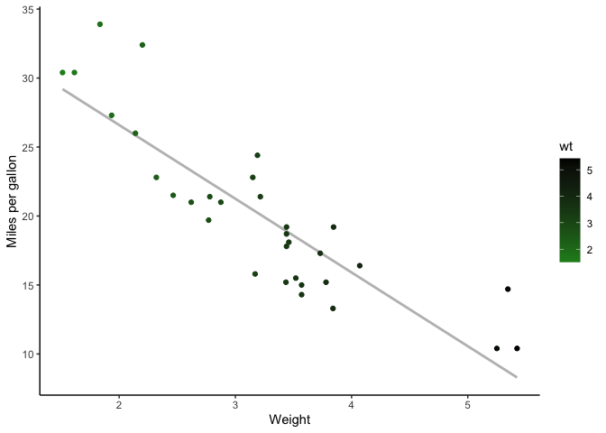
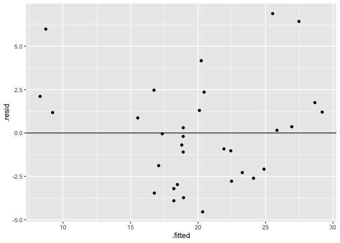
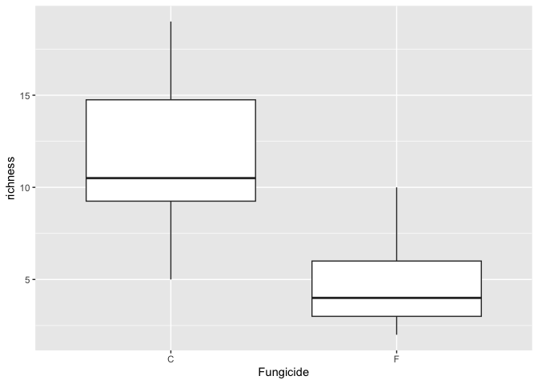
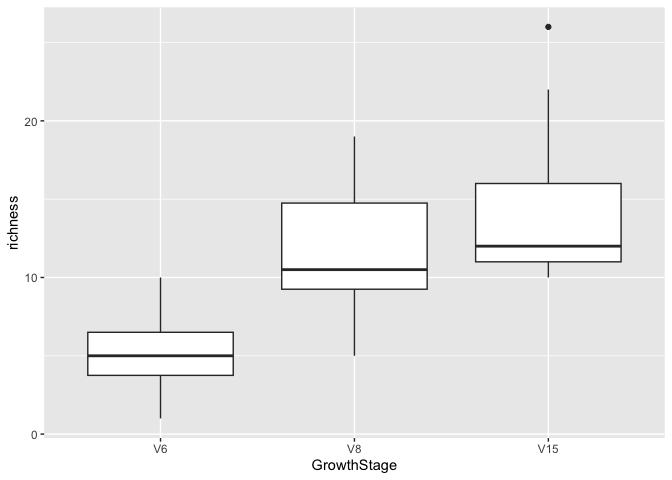
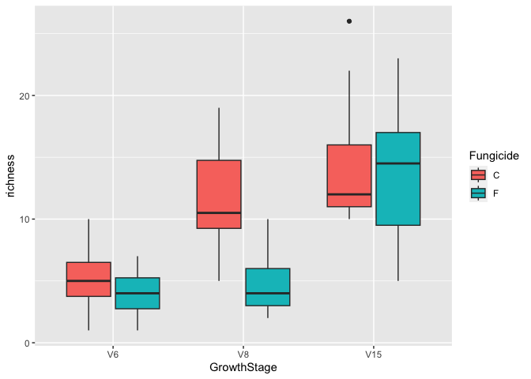

``` r
library(tidyverse)
```

    ## ── Attaching packages ─────────────────────────────────────── tidyverse 1.3.2 ──
    ## ✔ ggplot2 3.4.1      ✔ purrr   0.3.5 
    ## ✔ tibble  3.1.8      ✔ dplyr   1.0.10
    ## ✔ tidyr   1.2.1      ✔ stringr 1.5.0 
    ## ✔ readr   2.1.3      ✔ forcats 0.5.2 
    ## ── Conflicts ────────────────────────────────────────── tidyverse_conflicts() ──
    ## ✖ dplyr::filter() masks stats::filter()
    ## ✖ dplyr::lag()    masks stats::lag()

``` r
library(lme4)
```

    ## Loading required package: Matrix
    ## 
    ## Attaching package: 'Matrix'
    ## 
    ## The following objects are masked from 'package:tidyr':
    ## 
    ##     expand, pack, unpack

``` r
library(emmeans)
library(multcomp)
```

    ## Loading required package: mvtnorm
    ## Loading required package: survival
    ## Loading required package: TH.data
    ## Loading required package: MASS
    ## 
    ## Attaching package: 'MASS'
    ## 
    ## The following object is masked from 'package:dplyr':
    ## 
    ##     select
    ## 
    ## 
    ## Attaching package: 'TH.data'
    ## 
    ## The following object is masked from 'package:MASS':
    ## 
    ##     geyser

# Introduction to regression analysis in R

In this tutorial we will learn the basics of R’s capabilities in
statistical tests from the view of the linear model. If you understand
the linear model you should understand other tests like ANOVA. And other
concepts in advanced statistical tests are simliar.

In all of this tutorial we are concerned with the basic linear equation.

In a standard math class we would write this as

y = mx + b

Where y is our response and m is our slope and x is the other variable
and b is the intercept.

In statistics we write this as

y(hat) = β0 + β1x

where y(hat) = equation - β0 = intercept - β1 = slope - x = x points

The actual modeled line is equal to the equation adds on the error term.
yi = β0 + β1xi + ε\~N(0,σ)

where yi (y sub i) = each point on the y axis - β0 = intercept - β1 =
slope - xi = each x point - then ε = error - and N(0,σ) = normal
distribution with a mean 0 and standard deviation = sigma

The goal of all of this is to estimate three terms. - slope -
intercept - standard deviation

The goal is to minimize the distance from each point to the line. In
statistical terms we want to minimize what is called the sum of squared
errors or SSE. The sum of squares of the regression (SSR), that is the
distance between the best fit line and the average. Adding these
together equals the total sum of squares. Partitioning this into SSR and
SSE is related to pvalue. The smaller the SSE and higher the SSR the
smaller the pvalue.

Then we want to know if it is statistically significant. What is the
chance we get the result by chance? - that is your pvalue.

The null hypothesis is that H0 = No slope or that β1 = 0

In general: - as slope goes up pvalue goes down - as sample size goes up
pvalue goes down - as noise (error) goes down pvalue goes down

Lets load in our mtcars dataset to demonstrate some basic linear
regression.

``` r
data("mtcars")
```

The variables inside the cars dataset include:

-   mpg = the mpg
-   cyl = number of cylinders
-   disp = displacement
-   hp = gross horsepower
-   drat = rear axle ratio
-   wt = weight
-   qsec = quarter mile time
-   vs = engine shape V = 0 or Straight = 1
-   am = Transmission type; 0 = auto, 1 = manual
-   gear = number of forward gears
-   carb = number of carburetors

Remember our plot. The first step is always to visualize your data.

If you have two continuous variables you will want a scatter plot

``` r
ggplot(mtcars, aes(x = wt, y = mpg)) +
  geom_smooth(method = lm, se = FALSE, color = "grey") +
  geom_point(aes(color = wt)) +
  xlab("Weight") + 
  ylab("Miles per gallon") +
  scale_colour_gradient(low = "forestgreen", high = "black") +
  theme_classic()
```

    ## `geom_smooth()` using formula = 'y ~ x'



Does it look like there is a relationship? Absolutly! But how do we
know?

We run a linear model - or if its a continuous x variable and a
continuous y variable we would call it a regression. If we are looking
to call it a cause and effect relationship we may call it a correlation.

The simplest way to do this is with the function `lm()`

``` r
lm(mpg~wt, data = mtcars)
```

    ## 
    ## Call:
    ## lm(formula = mpg ~ wt, data = mtcars)
    ## 
    ## Coefficients:
    ## (Intercept)           wt  
    ##      37.285       -5.344

When we run this it gives us an output of the predicted Intercept or our
β0 parameter.

We can now run summary of this linear model to output some summary
statistics

``` r
summary(lm(mpg~wt, data = mtcars))
```

    ## 
    ## Call:
    ## lm(formula = mpg ~ wt, data = mtcars)
    ## 
    ## Residuals:
    ##     Min      1Q  Median      3Q     Max 
    ## -4.5432 -2.3647 -0.1252  1.4096  6.8727 
    ## 
    ## Coefficients:
    ##             Estimate Std. Error t value Pr(>|t|)    
    ## (Intercept)  37.2851     1.8776  19.858  < 2e-16 ***
    ## wt           -5.3445     0.5591  -9.559 1.29e-10 ***
    ## ---
    ## Signif. codes:  0 '***' 0.001 '**' 0.01 '*' 0.05 '.' 0.1 ' ' 1
    ## 
    ## Residual standard error: 3.046 on 30 degrees of freedom
    ## Multiple R-squared:  0.7528, Adjusted R-squared:  0.7446 
    ## F-statistic: 91.38 on 1 and 30 DF,  p-value: 1.294e-10

Now we have a pretty good idea that the slope is not equal to 0 and the
estimate of the intercept is pretty good.

Other things to pay attention to are the R squared. This tells you the
variation in y explained by x. So in our case about 74% of the variation
in y is explained by x variable.

[SSR & SSE](ss.jpg)

Ok what if we wanted an ANOVA table from this. We could run an ANOVA.

``` r
anova(lm(mpg~wt, data = mtcars))
```

    ## Analysis of Variance Table
    ## 
    ## Response: mpg
    ##           Df Sum Sq Mean Sq F value    Pr(>F)    
    ## wt         1 847.73  847.73  91.375 1.294e-10 ***
    ## Residuals 30 278.32    9.28                      
    ## ---
    ## Signif. codes:  0 '***' 0.001 '**' 0.01 '*' 0.05 '.' 0.1 ' ' 1

Hey the pvalue is the same!!! Whoa… it means that a linear model and an
ANOVA are essentially the same thing and the pvalue reported in the
ANOVA is the pvalue of the linear regression or our slope parameter.
Meaning that wt has a significant effect on the variance of Miles per
gallon.

Perhaps we wanted to view this in a correlation.

``` r
cor.test(mtcars$wt, mtcars$mpg)
```

    ## 
    ##  Pearson's product-moment correlation
    ## 
    ## data:  mtcars$wt and mtcars$mpg
    ## t = -9.559, df = 30, p-value = 1.294e-10
    ## alternative hypothesis: true correlation is not equal to 0
    ## 95 percent confidence interval:
    ##  -0.9338264 -0.7440872
    ## sample estimates:
    ##        cor 
    ## -0.8676594

Holy smokes! the pvalue is the same again! This gives you a different r
value which is the correlation statistic. The closer to -1 or 1 means
the stronger the correlation between the two variables.

### Assumptions

In general there are several assumptions in a regression, linear model,
ANOVA, whatever you want to call it.

They are: - y is continuous - error is normally distributed -
relationship is linear - homoskedasticity - sigma is consistent -
independent samples

However, in general regression/anovas/linear models are robust to
moderate departures from the assumptions. So do the assumptions matter…
yeah, but only if really terrible. However, in most cases if one
assumption is violated, its not going to change the result too much. If
anything it will make the pvalue go up and your conclusion is more
conservative at that point.

Yes there are assumption tests, but we will not do them. You really just
need to know how to read your data and if you want look at the residual
plot to diagnose your violated assumptions.

In our example above we can simply get the residuals from our linear
model like this

``` r
model <- lm(mpg~wt, data = mtcars)

ggplot(model, aes(y = .resid, x = .fitted)) +
  geom_point() +
  geom_hline(yintercept = 0)
```



### Categorical variables

Now if we have a categorial x variable and a continuous y variable we
would perform a t-test.

lets take our fungicide study bull richness dataset.

``` r
bull.rich <- read.csv("Bull_richness.csv")
```

Filter our dataset to include one treatment and growth stage for
demonstration of a t-test.

``` r
bull.rich %>%
  filter(GrowthStage == "V8" & Treatment == "Conv.") %>%
  ggplot(aes(x = Fungicide, y = richness)) + 
  geom_boxplot()
```


Does it look like there is a difference, yeah! But how do we know?

We can do a t-test

Where the null hypothesis is that there is no difference in group means

``` r
bull.rich.sub <- bull.rich %>%
  filter(GrowthStage == "V8" & Treatment == "Conv.")

t.test(richness~Fungicide, data = bull.rich.sub)
```

    ## 
    ##  Welch Two Sample t-test
    ## 
    ## data:  richness by Fungicide
    ## t = 4.8759, df = 17.166, p-value = 0.0001384
    ## alternative hypothesis: true difference in means between group C and group F is not equal to 0
    ## 95 percent confidence interval:
    ##   4.067909 10.265425
    ## sample estimates:
    ## mean in group C mean in group F 
    ##       11.750000        4.583333

What is actually happening mathematically here?

Remember our equation? yi = β0 + β1xi + ε\~N(0,σ)

If we code Control (C) as a 0 and fungicide (F) as 1 and plug it into
the equation as x we end up with:

richness = β0 + 0 + ε\~N(0,σ) and richness = β0 + β1 + ε\~N(0,σ)

β0 is still the intercept but it turns into the distance between the
mean of the Control group and 0 and the slope β1 is equal to the
difference between groups.

Visually this is what we are looking at. The t-test is a regression!
[t-test](Ttest.jpg)

We can plug this into our linear model and get the same results.

``` r
t.test(richness~Fungicide, data = bull.rich.sub, var.equal = TRUE)
```

    ## 
    ##  Two Sample t-test
    ## 
    ## data:  richness by Fungicide
    ## t = 4.8759, df = 22, p-value = 7.118e-05
    ## alternative hypothesis: true difference in means between group C and group F is not equal to 0
    ## 95 percent confidence interval:
    ##   4.118459 10.214875
    ## sample estimates:
    ## mean in group C mean in group F 
    ##       11.750000        4.583333

``` r
summary(lm(richness~Fungicide, data = bull.rich.sub))
```

    ## 
    ## Call:
    ## lm(formula = richness ~ Fungicide, data = bull.rich.sub)
    ## 
    ## Residuals:
    ##     Min      1Q  Median      3Q     Max 
    ## -6.7500 -1.7500 -0.6667  2.2500  7.2500 
    ## 
    ## Coefficients:
    ##             Estimate Std. Error t value Pr(>|t|)    
    ## (Intercept)   11.750      1.039  11.306 1.24e-10 ***
    ## FungicideF    -7.167      1.470  -4.876 7.12e-05 ***
    ## ---
    ## Signif. codes:  0 '***' 0.001 '**' 0.01 '*' 0.05 '.' 0.1 ' ' 1
    ## 
    ## Residual standard error: 3.6 on 22 degrees of freedom
    ## Multiple R-squared:  0.5194, Adjusted R-squared:  0.4975 
    ## F-statistic: 23.77 on 1 and 22 DF,  p-value: 7.118e-05

``` r
anova(lm(richness~Fungicide, data = bull.rich.sub))
```

    ## Analysis of Variance Table
    ## 
    ## Response: richness
    ##           Df Sum Sq Mean Sq F value    Pr(>F)    
    ## Fungicide  1 308.17 308.167  23.774 7.118e-05 ***
    ## Residuals 22 285.17  12.962                      
    ## ---
    ## Signif. codes:  0 '***' 0.001 '**' 0.01 '*' 0.05 '.' 0.1 ' ' 1

If we assume equal variance in groups and perform a two sample t-test it
is the same result as a linear model and anova on the linear model. The
pvalue is telling us that the slope of the line is different than 0.

### ANOVAs

ANOVAs would have continuous y and multinomial categorical x. In other
words multiple groups.

Lets filter our dataset to have only richness in different crop growth
stages in the control samples in soybean in conventional management.
Here we have three growth stages.

``` r
bull.rich.sub2 <- bull.rich %>%
  filter(Fungicide == "C" & Treatment == "Conv." & Crop == "Corn")
```

Lets visualize our data

``` r
bull.rich.sub2$GrowthStage <- factor(bull.rich.sub2$GrowthStage, levels = c("V6", "V8", "V15"))

ggplot(bull.rich.sub2, aes(x = GrowthStage, y = richness)) +
  geom_boxplot()
```


Well there clearly looks to be a difference between the groups.

Mathematically we again can think of this as a regression analysis where
we have β0 is the intercept, or the difference between the mean of V6
and 0, and V8 as β1, and V15 as β2.

Full equation: y = β0 + β1(V8) + β1(V15) + ε\~N(0,σ)

Coding each term as 1 or 0 we get the following equations.

richness(V6) = β0 + 0 + ε\~N(0,σ) and richness(V8) = β0 + β1 + ε\~N(0,σ)
richness(V15) = β0 + β2 + ε\~N(0,σ)

Visually it looks like this and guess what, its a regression!

[ANOVA](anova.jpg)

To show you lets do the actual test.

Set up the linear model and run various ANOVAs… holy smokes they all
have the same information. Thats because an ANOVA is a regression!

``` r
lm.growth <- lm(richness ~ GrowthStage, data = bull.rich.sub2)
summary(lm.growth)
```

    ## 
    ## Call:
    ## lm(formula = richness ~ GrowthStage, data = bull.rich.sub2)
    ## 
    ## Residuals:
    ##    Min     1Q Median     3Q    Max 
    ## -6.750 -2.625 -1.000  2.250 11.583 
    ## 
    ## Coefficients:
    ##                Estimate Std. Error t value Pr(>|t|)    
    ## (Intercept)       5.250      1.208   4.348 0.000124 ***
    ## GrowthStageV8     6.500      1.708   3.806 0.000581 ***
    ## GrowthStageV15    9.167      1.708   5.368 6.23e-06 ***
    ## ---
    ## Signif. codes:  0 '***' 0.001 '**' 0.01 '*' 0.05 '.' 0.1 ' ' 1
    ## 
    ## Residual standard error: 4.183 on 33 degrees of freedom
    ## Multiple R-squared:  0.4803, Adjusted R-squared:  0.4488 
    ## F-statistic: 15.25 on 2 and 33 DF,  p-value: 2.044e-05

``` r
anova(lm.growth)
```

    ## Analysis of Variance Table
    ## 
    ## Response: richness
    ##             Df Sum Sq Mean Sq F value    Pr(>F)    
    ## GrowthStage  2 533.56 266.778  15.247 2.044e-05 ***
    ## Residuals   33 577.42  17.497                      
    ## ---
    ## Signif. codes:  0 '***' 0.001 '**' 0.01 '*' 0.05 '.' 0.1 ' ' 1

``` r
summary(aov(richness ~ GrowthStage, data = bull.rich.sub2))
```

    ##             Df Sum Sq Mean Sq F value   Pr(>F)    
    ## GrowthStage  2  533.6   266.8   15.25 2.04e-05 ***
    ## Residuals   33  577.4    17.5                     
    ## ---
    ## Signif. codes:  0 '***' 0.001 '**' 0.01 '*' 0.05 '.' 0.1 ' ' 1

But now how do we know which is different from the the other group?

We can do post-hoc tests to find out. The simplest way to think of this
is individual t-tests across groups. The most versitile way to do this
is with the packages `emmeans`, and `multcomp`.

The lsmeans are the least squared means - they are the means estimated
by the linear model. This is in contrast to the arethmatic means which
are the means calculated or the average.

``` r
lsmeans <- emmeans(lm.growth, ~GrowthStage) # estimate lsmeans of variety within siteXyear
Results_lsmeans <- cld(lsmeans, alpha = 0.05, reversed = TRUE, details = TRUE) # contrast with Tukey ajustment by default. 
Results_lsmeans
```

    ## $emmeans
    ##  GrowthStage emmean   SE df lower.CL upper.CL .group
    ##  V15          14.42 1.21 33    11.96    16.87  1    
    ##  V8           11.75 1.21 33     9.29    14.21  1    
    ##  V6            5.25 1.21 33     2.79     7.71   2   
    ## 
    ## Confidence level used: 0.95 
    ## P value adjustment: tukey method for comparing a family of 3 estimates 
    ## significance level used: alpha = 0.05 
    ## NOTE: If two or more means share the same grouping symbol,
    ##       then we cannot show them to be different.
    ##       But we also did not show them to be the same. 
    ## 
    ## $comparisons
    ##  contrast estimate   SE df t.ratio p.value
    ##  V8 - V6      6.50 1.71 33   3.806  0.0016
    ##  V15 - V6     9.17 1.71 33   5.368  <.0001
    ##  V15 - V8     2.67 1.71 33   1.562  0.2763
    ## 
    ## P value adjustment: tukey method for comparing a family of 3 estimates

### Interaction terms

So far we have done one variable, but what if we care about the
interactions between factors. In other words what if we care about if
the effect of one factor depends on the other.

In our example, maybe we care about if the effect of fungicide depends
on time.

We can do this within a linear model as well using the `*` between
factors.

Lets filter our dataset to include fungicide term.

``` r
bull.rich.sub3 <- bull.rich %>%
  filter(Treatment == "Conv." & Crop == "Corn")

bull.rich.sub3$GrowthStage <- factor(bull.rich.sub3$GrowthStage, levels = c("V6", "V8", "V15"))
```

Now lets set up our linear model with fungicide interaction factor

``` r
# write it like this
lm.inter <- lm(richness ~ GrowthStage + Fungicide + GrowthStage:Fungicide, data = bull.rich.sub3)

# or like this
lm(richness ~ GrowthStage*Fungicide, data = bull.rich.sub3)
```

    ## 
    ## Call:
    ## lm(formula = richness ~ GrowthStage * Fungicide, data = bull.rich.sub3)
    ## 
    ## Coefficients:
    ##               (Intercept)              GrowthStageV8  
    ##                    5.2500                     6.5000  
    ##            GrowthStageV15                 FungicideF  
    ##                    9.1667                    -1.2500  
    ##  GrowthStageV8:FungicideF  GrowthStageV15:FungicideF  
    ##                   -5.9167                     0.3333

Overall if we look at the summary we can see that there are significant
terms and the overall p value is significant. If we want to look at the
ANOVA table we can do this.

``` r
summary(lm.inter) # significant terms
```

    ## 
    ## Call:
    ## lm(formula = richness ~ GrowthStage + Fungicide + GrowthStage:Fungicide, 
    ##     data = bull.rich.sub3)
    ## 
    ## Residuals:
    ##     Min      1Q  Median      3Q     Max 
    ## -8.5000 -2.4167 -0.4167  2.0625 11.5833 
    ## 
    ## Coefficients:
    ##                           Estimate Std. Error t value Pr(>|t|)    
    ## (Intercept)                 5.2500     1.1029   4.760 1.10e-05 ***
    ## GrowthStageV8               6.5000     1.5597   4.167 9.15e-05 ***
    ## GrowthStageV15              9.1667     1.5597   5.877 1.51e-07 ***
    ## FungicideF                 -1.2500     1.5597  -0.801  0.42575    
    ## GrowthStageV8:FungicideF   -5.9167     2.2057  -2.682  0.00923 ** 
    ## GrowthStageV15:FungicideF   0.3333     2.2057   0.151  0.88034    
    ## ---
    ## Signif. codes:  0 '***' 0.001 '**' 0.01 '*' 0.05 '.' 0.1 ' ' 1
    ## 
    ## Residual standard error: 3.82 on 66 degrees of freedom
    ## Multiple R-squared:  0.5903, Adjusted R-squared:  0.5593 
    ## F-statistic: 19.02 on 5 and 66 DF,  p-value: 1.144e-11

``` r
anova(lm.inter) # The interaction term is signifant. 
```

    ## Analysis of Variance Table
    ## 
    ## Response: richness
    ##                       Df  Sum Sq Mean Sq F value    Pr(>F)    
    ## GrowthStage            2 1065.58  532.79 36.5027 2.113e-11 ***
    ## Fungicide              1  174.22  174.22 11.9363 0.0009668 ***
    ## GrowthStage:Fungicide  2  148.36   74.18  5.0823 0.0088534 ** 
    ## Residuals             66  963.33   14.60                      
    ## ---
    ## Signif. codes:  0 '***' 0.001 '**' 0.01 '*' 0.05 '.' 0.1 ' ' 1

So the interaction term is significant. In general you want to look at
the most complex interaction that is significant and look at that first.
But this means that the effect of fungicide is dependent on the
growthstage, or in other words at least one comparison of fungicide
within growthstage or growthstage within fungicide is significant.

For this study we more care about the effect of fungicide over the
levels of growthstage so we can plot that easily.

``` r
bull.rich.sub3 %>%
  ggplot(aes(x = GrowthStage, y = richness, fill = Fungicide)) +
  geom_boxplot()
```



So by visualization we can see that it looks like V8 fungicide affected
richness more than others and by V15 they recovered.

But how do we know? In this case we have to do a post-hoc test within
the levels of growthstage.

``` r
lsmeans <- emmeans(lm.inter, ~Fungicide|GrowthStage) # estimate lsmeans of variety within siteXyear
Results_lsmeans <- cld(lsmeans, alpha = 0.05, reversed = TRUE, details = TRUE) # contrast with Tukey ajustment
Results_lsmeans
```

    ## $emmeans
    ## GrowthStage = V6:
    ##  Fungicide emmean  SE df lower.CL upper.CL .group
    ##  C           5.25 1.1 66     3.05     7.45  1    
    ##  F           4.00 1.1 66     1.80     6.20  1    
    ## 
    ## GrowthStage = V8:
    ##  Fungicide emmean  SE df lower.CL upper.CL .group
    ##  C          11.75 1.1 66     9.55    13.95  1    
    ##  F           4.58 1.1 66     2.38     6.79   2   
    ## 
    ## GrowthStage = V15:
    ##  Fungicide emmean  SE df lower.CL upper.CL .group
    ##  C          14.42 1.1 66    12.21    16.62  1    
    ##  F          13.50 1.1 66    11.30    15.70  1    
    ## 
    ## Confidence level used: 0.95 
    ## significance level used: alpha = 0.05 
    ## NOTE: If two or more means share the same grouping symbol,
    ##       then we cannot show them to be different.
    ##       But we also did not show them to be the same. 
    ## 
    ## $comparisons
    ## GrowthStage = V6:
    ##  contrast estimate   SE df t.ratio p.value
    ##  C - F       1.250 1.56 66   0.801  0.4258
    ## 
    ## GrowthStage = V8:
    ##  contrast estimate   SE df t.ratio p.value
    ##  C - F       7.167 1.56 66   4.595  <.0001
    ## 
    ## GrowthStage = V15:
    ##  contrast estimate   SE df t.ratio p.value
    ##  C - F       0.917 1.56 66   0.588  0.5587

This cheat sheet gives you all kinds of tests that are all based around
the linear model concept.

[The cheat sheet](linear_tests_cheat_sheet.jpg)

#### Mixed effects models

In mixed effects models we have fixed and random effects term. The
random effects term is something that affects the variation in y. A
fixed effect is something that affects the mean of y. There are NO rules
that determine what is a fixed or random effect. You have to justify
that in your experimental design. Another way to think about this would
be factors that you do not really care about them affecting the mean,
but still want to account for that variation in your model so you can
generalize over that factor. A common way that random effects are
included in experimental designs is called the blocking factor.

However, there are common fixed and random effects that will apply to
folks in this class.

Common fixed effects

-   Treatment
-   Species
-   gene

Common random effects (blocking factor)

-   Year
-   replicate
-   trial
-   Individuals
-   Fields

Lets see some random effects models in action.

Lets use our interaction model from above.

``` r
lme0 <- lm(richness ~ GrowthStage*Fungicide, data = bull.rich.sub3)
```

How do we include a random effect in this? Well… first we have to use a
different package, and for this we are going to use the package lme4.

``` r
lme1 <- lmer(richness ~ GrowthStage*Fungicide + (1|Rep), data = bull.rich.sub3)
summary(lme1)
```

    ## Linear mixed model fit by REML ['lmerMod']
    ## Formula: richness ~ GrowthStage * Fungicide + (1 | Rep)
    ##    Data: bull.rich.sub3
    ## 
    ## REML criterion at convergence: 378.3
    ## 
    ## Scaled residuals: 
    ##     Min      1Q  Median      3Q     Max 
    ## -2.4664 -0.5966 -0.1788  0.6257  2.9101 
    ## 
    ## Random effects:
    ##  Groups   Name        Variance Std.Dev.
    ##  Rep      (Intercept)  0.7855  0.8863  
    ##  Residual             13.9533  3.7354  
    ## Number of obs: 72, groups:  Rep, 4
    ## 
    ## Fixed effects:
    ##                           Estimate Std. Error t value
    ## (Intercept)                 5.2500     1.1658   4.503
    ## GrowthStageV8               6.5000     1.5250   4.262
    ## GrowthStageV15              9.1667     1.5250   6.011
    ## FungicideF                 -1.2500     1.5250  -0.820
    ## GrowthStageV8:FungicideF   -5.9167     2.1566  -2.743
    ## GrowthStageV15:FungicideF   0.3333     2.1566   0.155
    ## 
    ## Correlation of Fixed Effects:
    ##             (Intr) GrwSV8 GrSV15 FngcdF GSV8:F
    ## GrowthStgV8 -0.654                            
    ## GrwthStgV15 -0.654  0.500                     
    ## FungicideF  -0.654  0.500  0.500              
    ## GrwthSV8:FF  0.462 -0.707 -0.354 -0.707       
    ## GrwtSV15:FF  0.462 -0.354 -0.707 -0.707  0.500

Here we are including the between replicate variation (spatial field
variation) as an error term and estimate the sigma (standard deviation)
due to the error associated with Rep. 

What does this actually do? Well lets look at what it does to our Betas
in our original model.

``` r
summary(lme0)
```

    ## 
    ## Call:
    ## lm(formula = richness ~ GrowthStage * Fungicide, data = bull.rich.sub3)
    ## 
    ## Residuals:
    ##     Min      1Q  Median      3Q     Max 
    ## -8.5000 -2.4167 -0.4167  2.0625 11.5833 
    ## 
    ## Coefficients:
    ##                           Estimate Std. Error t value Pr(>|t|)    
    ## (Intercept)                 5.2500     1.1029   4.760 1.10e-05 ***
    ## GrowthStageV8               6.5000     1.5597   4.167 9.15e-05 ***
    ## GrowthStageV15              9.1667     1.5597   5.877 1.51e-07 ***
    ## FungicideF                 -1.2500     1.5597  -0.801  0.42575    
    ## GrowthStageV8:FungicideF   -5.9167     2.2057  -2.682  0.00923 ** 
    ## GrowthStageV15:FungicideF   0.3333     2.2057   0.151  0.88034    
    ## ---
    ## Signif. codes:  0 '***' 0.001 '**' 0.01 '*' 0.05 '.' 0.1 ' ' 1
    ## 
    ## Residual standard error: 3.82 on 66 degrees of freedom
    ## Multiple R-squared:  0.5903, Adjusted R-squared:  0.5593 
    ## F-statistic: 19.02 on 5 and 66 DF,  p-value: 1.144e-11

``` r
summary(lme1)
```

    ## Linear mixed model fit by REML ['lmerMod']
    ## Formula: richness ~ GrowthStage * Fungicide + (1 | Rep)
    ##    Data: bull.rich.sub3
    ## 
    ## REML criterion at convergence: 378.3
    ## 
    ## Scaled residuals: 
    ##     Min      1Q  Median      3Q     Max 
    ## -2.4664 -0.5966 -0.1788  0.6257  2.9101 
    ## 
    ## Random effects:
    ##  Groups   Name        Variance Std.Dev.
    ##  Rep      (Intercept)  0.7855  0.8863  
    ##  Residual             13.9533  3.7354  
    ## Number of obs: 72, groups:  Rep, 4
    ## 
    ## Fixed effects:
    ##                           Estimate Std. Error t value
    ## (Intercept)                 5.2500     1.1658   4.503
    ## GrowthStageV8               6.5000     1.5250   4.262
    ## GrowthStageV15              9.1667     1.5250   6.011
    ## FungicideF                 -1.2500     1.5250  -0.820
    ## GrowthStageV8:FungicideF   -5.9167     2.1566  -2.743
    ## GrowthStageV15:FungicideF   0.3333     2.1566   0.155
    ## 
    ## Correlation of Fixed Effects:
    ##             (Intr) GrwSV8 GrSV15 FngcdF GSV8:F
    ## GrowthStgV8 -0.654                            
    ## GrwthStgV15 -0.654  0.500                     
    ## FungicideF  -0.654  0.500  0.500              
    ## GrwthSV8:FF  0.462 -0.707 -0.354 -0.707       
    ## GrwtSV15:FF  0.462 -0.354 -0.707 -0.707  0.500

For some terms it actually makes the standard error of our betas go
down, which means we have better estimates of our betas and we are more
confident that we are estimating them correctly in our linear models,
which means we have more power to detect differences.

How can we test if there is a significan random effect? Well we can do
an ANOVA between the two models.

``` r
anova(lme1,lme0)
```

    ## refitting model(s) with ML (instead of REML)

    ## Data: bull.rich.sub3
    ## Models:
    ## lme0: richness ~ GrowthStage * Fungicide
    ## lme1: richness ~ GrowthStage * Fungicide + (1 | Rep)
    ##      npar    AIC    BIC  logLik deviance  Chisq Df Pr(>Chisq)
    ## lme0    7 405.08 421.01 -195.54   391.08                     
    ## lme1    8 406.55 424.77 -195.28   390.55 0.5224  1     0.4698

In this case the Rep random variable does not significantly improve the
fit of the model and therefore you may conclude that you can go with the
simpler model lme0. But it also does not hurt with the random term in
there.

What if we gave it a different random factor like Growth Stage? We know
that GrowthStage significanlty altered the mean and there was an
interaction between growth stage and fungal richness. So, logically it
doesn’t make sense to include it as a random factor. But we could, the
model would still be valid.

``` r
lm1 <- lm(richness ~ Fungicide, data = bull.rich.sub3)
lme2 <- lmer(richness ~ Fungicide + (1|GrowthStage), data = bull.rich.sub3)

summary(lm1)
```

    ## 
    ## Call:
    ## lm(formula = richness ~ Fungicide, data = bull.rich.sub3)
    ## 
    ## Residuals:
    ##     Min      1Q  Median      3Q     Max 
    ## -9.4722 -4.3611 -0.9167  2.8611 15.6389 
    ## 
    ## Coefficients:
    ##             Estimate Std. Error t value Pr(>|t|)    
    ## (Intercept)  10.4722     0.9295  11.266   <2e-16 ***
    ## FungicideF   -3.1111     1.3145  -2.367   0.0207 *  
    ## ---
    ## Signif. codes:  0 '***' 0.001 '**' 0.01 '*' 0.05 '.' 0.1 ' ' 1
    ## 
    ## Residual standard error: 5.577 on 70 degrees of freedom
    ## Multiple R-squared:  0.07409,    Adjusted R-squared:  0.06086 
    ## F-statistic: 5.601 on 1 and 70 DF,  p-value: 0.02072

``` r
summary(lme2)
```

    ## Linear mixed model fit by REML ['lmerMod']
    ## Formula: richness ~ Fungicide + (1 | GrowthStage)
    ##    Data: bull.rich.sub3
    ## 
    ## REML criterion at convergence: 408.4
    ## 
    ## Scaled residuals: 
    ##      Min       1Q   Median       3Q      Max 
    ## -1.79260 -0.82209 -0.07722  0.66871  2.65918 
    ## 
    ## Random effects:
    ##  Groups      Name        Variance Std.Dev.
    ##  GrowthStage (Intercept) 21.52    4.639   
    ##  Residual                16.35    4.043   
    ## Number of obs: 72, groups:  GrowthStage, 3
    ## 
    ## Fixed effects:
    ##             Estimate Std. Error t value
    ## (Intercept)   10.472      2.762   3.792
    ## FungicideF    -3.111      0.953  -3.264
    ## 
    ## Correlation of Fixed Effects:
    ##            (Intr)
    ## FungicideF -0.173

``` r
anova(lme2, lm1)
```

    ## refitting model(s) with ML (instead of REML)

    ## Data: bull.rich.sub3
    ## Models:
    ## lm1: richness ~ Fungicide
    ## lme2: richness ~ Fungicide + (1 | GrowthStage)
    ##      npar    AIC    BIC  logLik deviance  Chisq Df Pr(>Chisq)    
    ## lm1     3 455.79 462.62 -224.89   449.79                         
    ## lme2    4 421.73 430.84 -206.87   413.73 36.054  1  1.919e-09 ***
    ## ---
    ## Signif. codes:  0 '***' 0.001 '**' 0.01 '*' 0.05 '.' 0.1 ' ' 1

So, in this case we took something that probably should be a fixed
effect and included it as a random effect. We still have a significant
result, but modeling the random effect means that we are better able to
estimate the betas. When we do an anova between the two models it is
significant meaning that the within growthstage variation is important.
