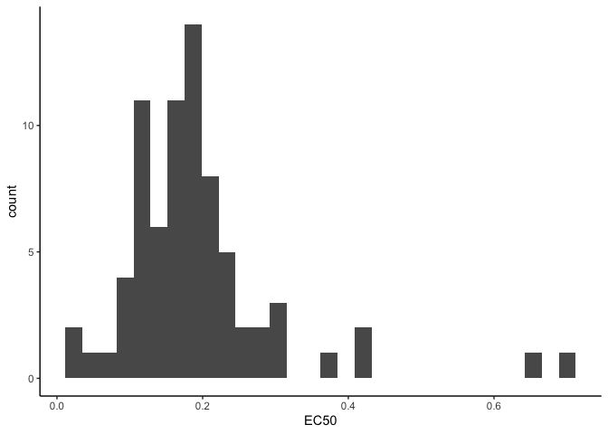

This exercise is based partially on the data and iterations presented
here:
<a href="https://github.com/noelzach/fungalEC/blob/master/DoseResponseAnalysis.md" class="uri">https://github.com/noelzach/fungalEC/blob/master/DoseResponseAnalysis.md</a>

The data this analysis performs is published here:
<a href="https://apsjournals.apsnet.org/doi/full/10.1094/PDIS-06-17-0873-SR" class="uri">https://apsjournals.apsnet.org/doi/full/10.1094/PDIS-06-17-0873-SR</a>

In this exercise we will explore ways of iteration in R and writing
functions.

These are not exactly straight forward to learn and can be challenging,
but once mastered you will start seeing data differently, and you will
start to realize that thousands, hundreds of thousands, or even millions
of datapoints are manageable.

You will need the following packages for this excersize.

``` r
library(ggplot2)
```

    ## Warning: replacing previous import 'lifecycle::last_warnings' by
    ## 'rlang::last_warnings' when loading 'tibble'

    ## Warning: replacing previous import 'lifecycle::last_warnings' by
    ## 'rlang::last_warnings' when loading 'pillar'

``` r
library(drc) 
```

    ## Loading required package: MASS

    ## 
    ## 'drc' has been loaded.

    ## Please cite R and 'drc' if used for a publication,

    ## for references type 'citation()' and 'citation('drc')'.

    ## 
    ## Attaching package: 'drc'

    ## The following objects are masked from 'package:stats':
    ## 
    ##     gaussian, getInitial

``` r
library(tidyverse)
```

    ## ── Attaching packages ─────────────────────────────────────── tidyverse 1.3.0 ──

    ## ✔ tibble  3.1.4     ✔ dplyr   1.0.7
    ## ✔ tidyr   1.1.3     ✔ stringr 1.4.0
    ## ✔ readr   1.4.0     ✔ forcats 0.5.1
    ## ✔ purrr   0.3.4

    ## ── Conflicts ────────────────────────────────────────── tidyverse_conflicts() ──
    ## ✖ dplyr::filter() masks stats::filter()
    ## ✖ dplyr::lag()    masks stats::lag()
    ## ✖ dplyr::select() masks MASS::select()

``` r
library(dplyr)
#install.packages("drc")
library(drc)
```

Functions
=========

Functions are like those written into packages. They are useful when you
need to perform the same code on different data and you want to avoid
copy and paste errors.

If you find yourself coding and you keep copy and pasting certain code.
Maybe its time to convert it to a function.

Functions are useful to simplify your code, and make your data
management as reproducible as possible.

Lets show an example

Say I wanted to make a function to convert Fahrenheit to Celsius

The formula is

$$
(ºF - 32) \* \\frac{5}{9}
$$
I could write it in R like this, where degree\_f = our degrees in
Fahrenheit I want to convert

``` r
(5*(degree_f - 32)/9)
```

So if we input 32 degrees Fahrenheit that would equal 0

``` r
# (5*(32 - 32)/9)
(5*(32 - 32)/9)
```

    ## [1] 0

But now we want to input a different number, say 80ºF and we have to
copy and paste the formula below or overwrite what we just wrote. This
is not very reproducible because it is susceptible to copy and paste
errors, and not remembering what we did if we overwrite previous code.

``` r
# (5*(80 - 32)/9)
(5*(80 - 32)/9)
```

    ## [1] 26.66667

We can solve this by converting it to a function.

``` r
F_to_C <- function(fahrenheit_temp){
  celsius <- (5*(fahrenheit_temp - 32)/9)
  return(celsius)
}

# these do the same thing
F_to_C(32)
```

    ## [1] 0

Now that wasn’t super complicated to write. But we can get much more
complex and our variable can be whole datasets or columns within
datasets.

Anatomy of a function
=====================

We first start with naming the function something using the backwards
arrow. Then we type “function()”.

After opening a new function we type the curly brackets. We will type
the code we want to perform within the curly brackets.

Inside the parentheses after function is where we put our variables
separated by commas.

``` r
sample.function <- function(... variable goes here ...){
  .... code goes here.... 
  return(... output ...)
}
```

*So, in the example above we want to put the variable inside the
parentheses. This is what we are going to input into the function. *Then
we input what we want to do to the variable inside the brackets  
\*Then all functions need a return() - this is what we want the output
of the function to be

Make sense?

Now you try
===========

####### Write a function to convert celsius to fahrenheiht using the conversion of F = C x (9/5)+32

More complicated function usage
===============================

Lets use a function to return multiple R elements. We can do this to
return different R objects such as a dataframe, a ggplot, and others.

In this example we are going to write a function to do perform a
specific test on multiple variables within a dataset and generate a plot
for them.

Iterations
==========

Iterations are something you do over and over again. They are useful for
multiple reasons. In terms of reproducibility, it again, helps reduce
copy and paste errors for something we would like to do over and over
again. It can also helpful for sanity checks through data simulation.

In this example we will cover iterations in the following functions
*rep() *seq() & seq\_along() *for loops *map() \*nested map()

#### the rep() function

The rep() function allows you to repeat elements easily

``` r
rep("A", 3) # repeats A three times 
```

    ## [1] "A" "A" "A"

``` r
rep(c("A", "B"), 5) # repeats A and B, times 
```

    ##  [1] "A" "B" "A" "B" "A" "B" "A" "B" "A" "B"

``` r
rep(c(1,2,3,4), times = 4) # repeats 1,2,3,4, 4 times 
```

    ##  [1] 1 2 3 4 1 2 3 4 1 2 3 4 1 2 3 4

``` r
rep(c(1,2,5,2), times = 4, each = 4) # repeats 1 four times, 2 four times, 5 four times, and 2 four times. 
```

    ##  [1] 1 1 1 1 2 2 2 2 5 5 5 5 2 2 2 2 1 1 1 1 2 2 2 2 5 5 5 5 2 2 2 2 1 1 1 1 2 2
    ## [39] 2 2 5 5 5 5 2 2 2 2 1 1 1 1 2 2 2 2 5 5 5 5 2 2 2 2

The seq() command allows you to write sequences of numbers easily

``` r
seq(from = 1, to = 7) # sequence of numbers 1 to 7
```

    ## [1] 1 2 3 4 5 6 7

``` r
seq(from = 0, to = 10, by = 2) # sequence of numbers from 0 to 10 by 2s 
```

    ## [1]  0  2  4  6  8 10

``` r
# combined seq() and rep()
rep(seq(from = 0, to = 10, by = 2), times = 3, each = 2)
```

    ##  [1]  0  0  2  2  4  4  6  6  8  8 10 10  0  0  2  2  4  4  6  6  8  8 10 10  0
    ## [26]  0  2  2  4  4  6  6  8  8 10 10

The seq\_along() function allows you to generate a sequence of numbers
based on non-integer values. This will become very useful when we want
to loop over elements within a dataframe.

``` r
# use the built in LETTERS vector for an example. 
LETTERS
```

    ##  [1] "A" "B" "C" "D" "E" "F" "G" "H" "I" "J" "K" "L" "M" "N" "O" "P" "Q" "R" "S"
    ## [20] "T" "U" "V" "W" "X" "Y" "Z"

``` r
seq_along(LETTERS[1:5]) # will return 1,2,3,4,5 not the actual letters. 
```

    ## [1] 1 2 3 4 5

The for loop
============

The for loop is classic coding. Almost every coding language has a
version of a for loop.

It is based on the following algorithm: 

Lets see a very basic example of how a for loop works

``` r
for (i in 1:10) {
print(i*2)  
}
```

    ## [1] 2
    ## [1] 4
    ## [1] 6
    ## [1] 8
    ## [1] 10
    ## [1] 12
    ## [1] 14
    ## [1] 16
    ## [1] 18
    ## [1] 20

Describe in your own words what is happening.

lets see a more complicated example where we subset a dataset based on
isolate within our fungicide sensitivity dataset and we perform a
function on it and extract some results.

For this example we will use the package ‘drc’ and the dataset
EC50.all.csv

``` r
# read in the data
EC50.data <- read.csv("EC50.all.csv")
```

Within this dataset is a list of isolates and fungicide sensitivity
data.

We want to find something called an EC50 or the concentration of a
fungicide that reduces growth by 50% relative to the non-amended
control.

We do this using non-linear modeling with the DRC package with a model
called the LL.4 The specifics of the model are not that important. What
is important is that in order to use this model we have to model each
isolate individually and gather the EC50 data.

An example is shown here where we do this on isolate ILSO\_5-41c

``` r
isolate1 <- drm(100 * EC50.data$relgrowth[EC50.data$is == "ILSO_5-41c"] ~ 
        EC50.data$conc[EC50.data$is == "ILSO_5-41c"], 
                       fct = LL.4(fixed = c(NA, NA, NA, NA), 
                                  names = c("Slope", "Lower", "Upper", "EC50")), 
                       na.action = na.omit)
    # outputs the summary of the paramters including the estimate, standard
    # error, t-value, and p-value outputs it into a data frame called
    # summary.mef.fit for 'summary of fit'
    summary.fit <- data.frame(summary(isolate1)[[3]])
    # outputs the summary of just the EC50 data including the estimate, standard
    # error, upper and lower bounds of the 95% confidence intervals around the
    # EC50
    EC50 <- ED(isolate1, respLev = c(50), type = "relative", 
        interval = "delta")[[1]]
```

    ## 
    ## Estimated effective doses
    ## 
    ##         Estimate Std. Error     Lower     Upper
    ## e:1:50 0.1070318  0.0055365 0.0957543 0.1183094

``` r
    EC50
```

    ## [1] 0.1070318

It would not be reproducible to do copy and paste each isolate into the
code above to run the model for every isolate. It would also not be very
reproducible to copy and paste the code below since this is prone to
errors.

There are then two options: *a loop that iterates over isolate names *a
newer way using the function map()

I will demonstrate how to do each option.

First the loop

First we need to create a vector to loop over containing the names of
our isolates. We will call this ‘nm’ using the function ‘unique’.

``` r
nm <- unique(EC50.data$is)
```

Then we can write a loop using the code above and input our list of
isolates, ‘nm’ by using ‘seq\_along’

Then when ever we want to input our isolate name we will put
nm\[\[i\]\].

So, as the loop goes along the list of isolate names it will input the
name of the isolate, calculate EC50 and run the model and output EC50.

``` r
for (i in seq_along(nm)) {
  isolate1 <- drm(100 * EC50.data$relgrowth[EC50.data$is == nm[[i]]] ~ 
        EC50.data$conc[EC50.data$is == nm[[i]]], 
                       fct = LL.4(fixed = c(NA, NA, NA, NA), 
                                  names = c("Slope", "Lower", "Upper", "EC50")), 
                       na.action = na.omit)
    # outputs the summary of the paramters including the estimate, standard
    # error, t-value, and p-value outputs it into a data frame called
    # summary.mef.fit for 'summary of fit'
    summary.fit <- data.frame(summary(isolate1)[[3]])
    # outputs the summary of just the EC50 data including the estimate, standard
    # error, upper and lower bounds of the 95% confidence intervals around the
    # EC50
    EC50 <- ED(isolate1, respLev = c(50), type = "relative", 
        interval = "delta")[[1]]
    EC50
}
```

    ## 
    ## Estimated effective doses
    ## 
    ##         Estimate Std. Error     Lower     Upper
    ## e:1:50 0.1070318  0.0055365 0.0957543 0.1183094
    ## 
    ## Estimated effective doses
    ## 
    ##        Estimate Std. Error    Lower    Upper
    ## e:1:50 0.248655   0.028485 0.190633 0.306678
    ## 
    ## Estimated effective doses
    ## 
    ##        Estimate Std. Error    Lower    Upper
    ## e:1:50 0.167592   0.010197 0.146821 0.188362
    ## 
    ## Estimated effective doses
    ## 
    ##         Estimate Std. Error     Lower     Upper
    ## e:1:50 0.1082677  0.0051459 0.0977858 0.1187495
    ## 
    ## Estimated effective doses
    ## 
    ##        Estimate Std. Error    Lower    Upper
    ## e:1:50 0.184271   0.036047 0.110846 0.257695
    ## 
    ## Estimated effective doses
    ## 
    ##        Estimate Std. Error    Lower    Upper
    ## e:1:50 0.227432   0.040614 0.144704 0.310160
    ## 
    ## Estimated effective doses
    ## 
    ##        Estimate Std. Error    Lower    Upper
    ## e:1:50 0.101863   0.003487 0.094760 0.108965
    ## 
    ## Estimated effective doses
    ## 
    ##         Estimate Std. Error     Lower     Upper
    ## e:1:50 0.1102721  0.0033354 0.1034780 0.1170661
    ## 
    ## Estimated effective doses
    ## 
    ##        Estimate Std. Error    Lower    Upper
    ## e:1:50 0.123288   0.014018 0.094735 0.151841
    ## 
    ## Estimated effective doses
    ## 
    ##         Estimate Std. Error     Lower     Upper
    ## e:1:50 0.0998727  0.0044787 0.0907498 0.1089956
    ## 
    ## Estimated effective doses
    ## 
    ##        Estimate Std. Error    Lower    Upper
    ## e:1:50  0.69465    0.39164 -0.10310  1.49240
    ## 
    ## Estimated effective doses
    ## 
    ##        Estimate Std. Error    Lower    Upper
    ## e:1:50 0.113975   0.012773 0.087958 0.139993
    ## 
    ## Estimated effective doses
    ## 
    ##        Estimate Std. Error    Lower    Upper
    ## e:1:50 0.217436   0.027934 0.160536 0.274335
    ## 
    ## Estimated effective doses
    ## 
    ##         Estimate Std. Error     Lower     Upper
    ## e:1:50 0.1432333  0.0093132 0.1242629 0.1622036
    ## 
    ## Estimated effective doses
    ## 
    ##        Estimate Std. Error   Lower   Upper
    ## e:1:50  0.18336    0.01293 0.15695 0.20977
    ## 
    ## Estimated effective doses
    ## 
    ##        Estimate Std. Error    Lower    Upper
    ## e:1:50 0.186929   0.034023 0.117626 0.256232
    ## 
    ## Estimated effective doses
    ## 
    ##         Estimate Std. Error     Lower     Upper
    ## e:1:50 0.0299288  0.0017812 0.0263007 0.0335569
    ## 
    ## Estimated effective doses
    ## 
    ##        Estimate Std. Error    Lower    Upper
    ## e:1:50 0.200379   0.020104 0.159429 0.241329
    ## 
    ## Estimated effective doses
    ## 
    ##        Estimate Std. Error    Lower    Upper
    ## e:1:50  0.30812    0.24033 -0.18142  0.79765
    ## 
    ## Estimated effective doses
    ## 
    ##        Estimate Std. Error    Lower    Upper
    ## e:1:50 0.227103   0.019697 0.186983 0.267224
    ## 
    ## Estimated effective doses
    ## 
    ##        Estimate Std. Error   Lower   Upper
    ## e:1:50  0.20009    0.01448 0.17059 0.22958
    ## 
    ## Estimated effective doses
    ## 
    ##        Estimate Std. Error    Lower    Upper
    ## e:1:50 0.223966   0.058089 0.105642 0.342290
    ## 
    ## Estimated effective doses
    ## 
    ##        Estimate Std. Error    Lower    Upper
    ## e:1:50 0.288001   0.074597 0.136052 0.439951
    ## 
    ## Estimated effective doses
    ## 
    ##        Estimate Std. Error    Lower    Upper
    ## e:1:50 0.369422   0.077015 0.212549 0.526296
    ## 
    ## Estimated effective doses
    ## 
    ##        Estimate Std. Error    Lower    Upper
    ## e:1:50 0.118335   0.011733 0.094404 0.142265
    ## 
    ## Estimated effective doses
    ## 
    ##        Estimate Std. Error    Lower    Upper
    ## e:1:50 0.189945   0.013146 0.163097 0.216793
    ## 
    ## Estimated effective doses
    ## 
    ##         Estimate Std. Error     Lower     Upper
    ## e:1:50 0.0483296  0.0022658 0.0437143 0.0529448
    ## 
    ## Estimated effective doses
    ## 
    ##        Estimate Std. Error    Lower    Upper
    ## e:1:50 0.190146   0.027182 0.134779 0.245514
    ## 
    ## Estimated effective doses
    ## 
    ##        Estimate Std. Error   Lower   Upper
    ## e:1:50  0.16580    0.01082 0.14376 0.18784
    ## 
    ## Estimated effective doses
    ## 
    ##        Estimate Std. Error    Lower    Upper
    ## e:1:50 0.183297   0.017237 0.148187 0.218407
    ## 
    ## Estimated effective doses
    ## 
    ##        Estimate Std. Error    Lower    Upper
    ## e:1:50 0.130147   0.010705 0.108342 0.151951
    ## 
    ## Estimated effective doses
    ## 
    ##         Estimate Std. Error     Lower     Upper
    ## e:1:50 0.1915200  0.0077369 0.1757605 0.2072795
    ## 
    ## Estimated effective doses
    ## 
    ##        Estimate Std. Error    Lower    Upper
    ## e:1:50 0.123034   0.006696 0.109395 0.136673
    ## 
    ## Estimated effective doses
    ## 
    ##         Estimate Std. Error     Lower     Upper
    ## e:1:50 0.1935594  0.0094277 0.1743559 0.2127629
    ## 
    ## Estimated effective doses
    ## 
    ##        Estimate Std. Error    Lower    Upper
    ## e:1:50 0.198000   0.019219 0.158853 0.237148
    ## 
    ## Estimated effective doses
    ## 
    ##         Estimate Std. Error     Lower     Upper
    ## e:1:50 0.1114482  0.0070542 0.0970793 0.1258172
    ## 
    ## Estimated effective doses
    ## 
    ##        Estimate Std. Error    Lower    Upper
    ## e:1:50 0.159440   0.010423 0.138209 0.180671
    ## 
    ## Estimated effective doses
    ## 
    ##         Estimate Std. Error     Lower     Upper
    ## e:1:50 0.1372654  0.0070847 0.1228343 0.1516965
    ## 
    ## Estimated effective doses
    ## 
    ##         Estimate Std. Error     Lower     Upper
    ## e:1:50  0.427766   0.230327 -0.041395  0.896926
    ## 
    ## Estimated effective doses
    ## 
    ##         Estimate Std. Error     Lower     Upper
    ## e:1:50 0.0991738  0.0040323 0.0909603 0.1073874
    ## 
    ## Estimated effective doses
    ## 
    ##        Estimate Std. Error    Lower    Upper
    ## e:1:50 0.106855   0.022010 0.062022 0.151687
    ## 
    ## Estimated effective doses
    ## 
    ##        Estimate Std. Error    Lower    Upper
    ## e:1:50 0.156127   0.021551 0.112229 0.200025
    ## 
    ## Estimated effective doses
    ## 
    ##        Estimate Std. Error    Lower    Upper
    ## e:1:50 0.308127   0.019233 0.268951 0.347304
    ## 
    ## Estimated effective doses
    ## 
    ##        Estimate Std. Error    Lower    Upper
    ## e:1:50 0.117014   0.012255 0.092052 0.141977
    ## 
    ## Estimated effective doses
    ## 
    ##        Estimate Std. Error    Lower    Upper
    ## e:1:50 0.177036   0.011915 0.152767 0.201305
    ## 
    ## Estimated effective doses
    ## 
    ##        Estimate Std. Error    Lower    Upper
    ## e:1:50 0.234268   0.017095 0.199447 0.269088
    ## 
    ## Estimated effective doses
    ## 
    ##         Estimate Std. Error     Lower     Upper
    ## e:1:50 0.0172659  0.0012838 0.0146508 0.0198809
    ## 
    ## Estimated effective doses
    ## 
    ##        Estimate Std. Error    Lower    Upper
    ## e:1:50 0.201737   0.012113 0.176998 0.226476
    ## 
    ## Estimated effective doses
    ## 
    ##        Estimate Std. Error    Lower    Upper
    ## e:1:50 0.306968   0.078617 0.146831 0.467105
    ## 
    ## Estimated effective doses
    ## 
    ##        Estimate Std. Error    Lower    Upper
    ## e:1:50 0.289597   0.081347 0.123464 0.455730
    ## 
    ## Estimated effective doses
    ## 
    ##        Estimate Std. Error    Lower    Upper
    ## e:1:50 0.213191   0.024013 0.164278 0.262104
    ## 
    ## Estimated effective doses
    ## 
    ##        Estimate Std. Error    Lower    Upper
    ## e:1:50  0.42728    0.28840 -0.16017  1.01472
    ## 
    ## Estimated effective doses
    ## 
    ##         Estimate Std. Error     Lower     Upper
    ## e:1:50 0.0900834  0.0021351 0.0857344 0.0944324
    ## 
    ## Estimated effective doses
    ## 
    ##         Estimate Std. Error     Lower     Upper
    ## e:1:50 0.1573077  0.0065037 0.1440602 0.1705553
    ## 
    ## Estimated effective doses
    ## 
    ##        Estimate Std. Error   Lower   Upper
    ## e:1:50  0.16319    0.01761 0.12732 0.19906
    ## 
    ## Estimated effective doses
    ## 
    ##        Estimate Std. Error   Lower   Upper
    ## e:1:50  0.20914    0.01403 0.18056 0.23772
    ## 
    ## Estimated effective doses
    ## 
    ##        Estimate Std. Error   Lower   Upper
    ## e:1:50  0.17905    0.00849 0.16171 0.19639
    ## 
    ## Estimated effective doses
    ## 
    ##         Estimate Std. Error     Lower     Upper
    ## e:1:50 0.1587569  0.0098007 0.1387411 0.1787727
    ## 
    ## Estimated effective doses
    ## 
    ##         Estimate Std. Error     Lower     Upper
    ## e:1:50 0.1352667  0.0074545 0.1200824 0.1504511
    ## 
    ## Estimated effective doses
    ## 
    ##        Estimate Std. Error    Lower    Upper
    ## e:1:50 0.247784   0.036714 0.173000 0.322567
    ## 
    ## Estimated effective doses
    ## 
    ##        Estimate Std. Error    Lower    Upper
    ## e:1:50 0.235268   0.026532 0.181223 0.289313
    ## 
    ## Estimated effective doses
    ## 
    ##        Estimate Std. Error    Lower    Upper
    ## e:1:50 0.066926   0.010213 0.046123 0.087728
    ## 
    ## Estimated effective doses
    ## 
    ##        Estimate Std. Error    Lower    Upper
    ## e:1:50 0.174492   0.010501 0.153102 0.195882
    ## 
    ## Estimated effective doses
    ## 
    ##        Estimate Std. Error    Lower    Upper
    ## e:1:50 0.181951   0.028336 0.124233 0.239669
    ## 
    ## Estimated effective doses
    ## 
    ##        Estimate Std. Error    Lower    Upper
    ## e:1:50 0.195576   0.013476 0.168125 0.223027
    ## 
    ## Estimated effective doses
    ## 
    ##        Estimate Std. Error    Lower    Upper
    ## e:1:50 0.168410   0.010795 0.146421 0.190399
    ## 
    ## Estimated effective doses
    ## 
    ##         Estimate Std. Error     Lower     Upper
    ## e:1:50 0.1546980  0.0093702 0.1354373 0.1739588
    ## 
    ## Estimated effective doses
    ## 
    ##        Estimate Std. Error    Lower    Upper
    ## e:1:50 0.162666   0.011066 0.140126 0.185206
    ## 
    ## Estimated effective doses
    ## 
    ##        Estimate Std. Error    Lower    Upper
    ## e:1:50 0.147113   0.008233 0.130343 0.163883
    ## 
    ## Estimated effective doses
    ## 
    ##         Estimate Std. Error     Lower     Upper
    ## e:1:50 0.1376907  0.0077899 0.1218232 0.1535582
    ## 
    ## Estimated effective doses
    ## 
    ##        Estimate Std. Error    Lower    Upper
    ## e:1:50 0.118886   0.004502 0.109716 0.128057
    ## 
    ## Estimated effective doses
    ## 
    ##        Estimate Std. Error    Lower    Upper
    ## e:1:50 0.206342   0.016866 0.171988 0.240696
    ## 
    ## Estimated effective doses
    ## 
    ##        Estimate Std. Error    Lower    Upper
    ## e:1:50 0.175509   0.013954 0.147086 0.203932
    ## 
    ## Estimated effective doses
    ## 
    ##        Estimate Std. Error    Lower    Upper
    ## e:1:50  0.65376    0.63282 -0.63525  1.94277
    ## 
    ## Estimated effective doses
    ## 
    ##        Estimate Std. Error    Lower    Upper
    ## e:1:50 0.211026   0.012571 0.185419 0.236633

Awesome! we have all of our EC50 values very quickly.

But this is still not super helpful because the output is not saved and
we cant use it in a plot or something. So, we now need to save the
output of a loop into a dataframe.

The way we do this is to create the dataframe row by row in the loop.

To do this we first need to creat a null dataframe and add to it each
iteration.

``` r
EC50.ll4 <- NULL # create a null object 
for (i in seq_along(nm)) {
  isolate1 <- drm(100 * EC50.data$relgrowth[EC50.data$is == nm[[i]]] ~ 
        EC50.data$conc[EC50.data$is == nm[[i]]], 
                       fct = LL.4(fixed = c(NA, NA, NA, NA), 
                                  names = c("Slope", "Lower", "Upper", "EC50")), 
                       na.action = na.omit)
    # outputs the summary of the paramters including the estimate, standard
    # error, t-value, and p-value outputs it into a data frame called
    # summary.mef.fit for 'summary of fit'
    summary.fit <- data.frame(summary(isolate1)[[3]])
    # outputs the summary of just the EC50 data including the estimate, standard
    # error, upper and lower bounds of the 95% confidence intervals around the
    # EC50
    EC50 <- ED(isolate1, respLev = c(50), type = "relative", 
        interval = "delta")[[1]]
    EC50
    isolate.ec_i <- data.frame(nm[[i]], EC50) # create a one row dataframe containing just the isolate name and the EC50
    colnames(isolate.ec_i) <- c("Isolate", "EC50") # change the column names
    
    # Then we need to append our one row dataframe to our null dataframe we created before
    # and save it as EC50.ll4. 
    EC50.ll4 <- rbind.data.frame(EC50.ll4, isolate.ec_i)
}
```

    ## 
    ## Estimated effective doses
    ## 
    ##         Estimate Std. Error     Lower     Upper
    ## e:1:50 0.1070318  0.0055365 0.0957543 0.1183094
    ## 
    ## Estimated effective doses
    ## 
    ##        Estimate Std. Error    Lower    Upper
    ## e:1:50 0.248655   0.028485 0.190633 0.306678
    ## 
    ## Estimated effective doses
    ## 
    ##        Estimate Std. Error    Lower    Upper
    ## e:1:50 0.167592   0.010197 0.146821 0.188362
    ## 
    ## Estimated effective doses
    ## 
    ##         Estimate Std. Error     Lower     Upper
    ## e:1:50 0.1082677  0.0051459 0.0977858 0.1187495
    ## 
    ## Estimated effective doses
    ## 
    ##        Estimate Std. Error    Lower    Upper
    ## e:1:50 0.184271   0.036047 0.110846 0.257695
    ## 
    ## Estimated effective doses
    ## 
    ##        Estimate Std. Error    Lower    Upper
    ## e:1:50 0.227432   0.040614 0.144704 0.310160
    ## 
    ## Estimated effective doses
    ## 
    ##        Estimate Std. Error    Lower    Upper
    ## e:1:50 0.101863   0.003487 0.094760 0.108965
    ## 
    ## Estimated effective doses
    ## 
    ##         Estimate Std. Error     Lower     Upper
    ## e:1:50 0.1102721  0.0033354 0.1034780 0.1170661
    ## 
    ## Estimated effective doses
    ## 
    ##        Estimate Std. Error    Lower    Upper
    ## e:1:50 0.123288   0.014018 0.094735 0.151841
    ## 
    ## Estimated effective doses
    ## 
    ##         Estimate Std. Error     Lower     Upper
    ## e:1:50 0.0998727  0.0044787 0.0907498 0.1089956
    ## 
    ## Estimated effective doses
    ## 
    ##        Estimate Std. Error    Lower    Upper
    ## e:1:50  0.69465    0.39164 -0.10310  1.49240
    ## 
    ## Estimated effective doses
    ## 
    ##        Estimate Std. Error    Lower    Upper
    ## e:1:50 0.113975   0.012773 0.087958 0.139993
    ## 
    ## Estimated effective doses
    ## 
    ##        Estimate Std. Error    Lower    Upper
    ## e:1:50 0.217436   0.027934 0.160536 0.274335
    ## 
    ## Estimated effective doses
    ## 
    ##         Estimate Std. Error     Lower     Upper
    ## e:1:50 0.1432333  0.0093132 0.1242629 0.1622036
    ## 
    ## Estimated effective doses
    ## 
    ##        Estimate Std. Error   Lower   Upper
    ## e:1:50  0.18336    0.01293 0.15695 0.20977
    ## 
    ## Estimated effective doses
    ## 
    ##        Estimate Std. Error    Lower    Upper
    ## e:1:50 0.186929   0.034023 0.117626 0.256232
    ## 
    ## Estimated effective doses
    ## 
    ##         Estimate Std. Error     Lower     Upper
    ## e:1:50 0.0299288  0.0017812 0.0263007 0.0335569
    ## 
    ## Estimated effective doses
    ## 
    ##        Estimate Std. Error    Lower    Upper
    ## e:1:50 0.200379   0.020104 0.159429 0.241329
    ## 
    ## Estimated effective doses
    ## 
    ##        Estimate Std. Error    Lower    Upper
    ## e:1:50  0.30812    0.24033 -0.18142  0.79765
    ## 
    ## Estimated effective doses
    ## 
    ##        Estimate Std. Error    Lower    Upper
    ## e:1:50 0.227103   0.019697 0.186983 0.267224
    ## 
    ## Estimated effective doses
    ## 
    ##        Estimate Std. Error   Lower   Upper
    ## e:1:50  0.20009    0.01448 0.17059 0.22958
    ## 
    ## Estimated effective doses
    ## 
    ##        Estimate Std. Error    Lower    Upper
    ## e:1:50 0.223966   0.058089 0.105642 0.342290
    ## 
    ## Estimated effective doses
    ## 
    ##        Estimate Std. Error    Lower    Upper
    ## e:1:50 0.288001   0.074597 0.136052 0.439951
    ## 
    ## Estimated effective doses
    ## 
    ##        Estimate Std. Error    Lower    Upper
    ## e:1:50 0.369422   0.077015 0.212549 0.526296
    ## 
    ## Estimated effective doses
    ## 
    ##        Estimate Std. Error    Lower    Upper
    ## e:1:50 0.118335   0.011733 0.094404 0.142265
    ## 
    ## Estimated effective doses
    ## 
    ##        Estimate Std. Error    Lower    Upper
    ## e:1:50 0.189945   0.013146 0.163097 0.216793
    ## 
    ## Estimated effective doses
    ## 
    ##         Estimate Std. Error     Lower     Upper
    ## e:1:50 0.0483296  0.0022658 0.0437143 0.0529448
    ## 
    ## Estimated effective doses
    ## 
    ##        Estimate Std. Error    Lower    Upper
    ## e:1:50 0.190146   0.027182 0.134779 0.245514
    ## 
    ## Estimated effective doses
    ## 
    ##        Estimate Std. Error   Lower   Upper
    ## e:1:50  0.16580    0.01082 0.14376 0.18784
    ## 
    ## Estimated effective doses
    ## 
    ##        Estimate Std. Error    Lower    Upper
    ## e:1:50 0.183297   0.017237 0.148187 0.218407
    ## 
    ## Estimated effective doses
    ## 
    ##        Estimate Std. Error    Lower    Upper
    ## e:1:50 0.130147   0.010705 0.108342 0.151951
    ## 
    ## Estimated effective doses
    ## 
    ##         Estimate Std. Error     Lower     Upper
    ## e:1:50 0.1915200  0.0077369 0.1757605 0.2072795
    ## 
    ## Estimated effective doses
    ## 
    ##        Estimate Std. Error    Lower    Upper
    ## e:1:50 0.123034   0.006696 0.109395 0.136673
    ## 
    ## Estimated effective doses
    ## 
    ##         Estimate Std. Error     Lower     Upper
    ## e:1:50 0.1935594  0.0094277 0.1743559 0.2127629
    ## 
    ## Estimated effective doses
    ## 
    ##        Estimate Std. Error    Lower    Upper
    ## e:1:50 0.198000   0.019219 0.158853 0.237148
    ## 
    ## Estimated effective doses
    ## 
    ##         Estimate Std. Error     Lower     Upper
    ## e:1:50 0.1114482  0.0070542 0.0970793 0.1258172
    ## 
    ## Estimated effective doses
    ## 
    ##        Estimate Std. Error    Lower    Upper
    ## e:1:50 0.159440   0.010423 0.138209 0.180671
    ## 
    ## Estimated effective doses
    ## 
    ##         Estimate Std. Error     Lower     Upper
    ## e:1:50 0.1372654  0.0070847 0.1228343 0.1516965
    ## 
    ## Estimated effective doses
    ## 
    ##         Estimate Std. Error     Lower     Upper
    ## e:1:50  0.427766   0.230327 -0.041395  0.896926
    ## 
    ## Estimated effective doses
    ## 
    ##         Estimate Std. Error     Lower     Upper
    ## e:1:50 0.0991738  0.0040323 0.0909603 0.1073874
    ## 
    ## Estimated effective doses
    ## 
    ##        Estimate Std. Error    Lower    Upper
    ## e:1:50 0.106855   0.022010 0.062022 0.151687
    ## 
    ## Estimated effective doses
    ## 
    ##        Estimate Std. Error    Lower    Upper
    ## e:1:50 0.156127   0.021551 0.112229 0.200025
    ## 
    ## Estimated effective doses
    ## 
    ##        Estimate Std. Error    Lower    Upper
    ## e:1:50 0.308127   0.019233 0.268951 0.347304
    ## 
    ## Estimated effective doses
    ## 
    ##        Estimate Std. Error    Lower    Upper
    ## e:1:50 0.117014   0.012255 0.092052 0.141977
    ## 
    ## Estimated effective doses
    ## 
    ##        Estimate Std. Error    Lower    Upper
    ## e:1:50 0.177036   0.011915 0.152767 0.201305
    ## 
    ## Estimated effective doses
    ## 
    ##        Estimate Std. Error    Lower    Upper
    ## e:1:50 0.234268   0.017095 0.199447 0.269088
    ## 
    ## Estimated effective doses
    ## 
    ##         Estimate Std. Error     Lower     Upper
    ## e:1:50 0.0172659  0.0012838 0.0146508 0.0198809
    ## 
    ## Estimated effective doses
    ## 
    ##        Estimate Std. Error    Lower    Upper
    ## e:1:50 0.201737   0.012113 0.176998 0.226476
    ## 
    ## Estimated effective doses
    ## 
    ##        Estimate Std. Error    Lower    Upper
    ## e:1:50 0.306968   0.078617 0.146831 0.467105
    ## 
    ## Estimated effective doses
    ## 
    ##        Estimate Std. Error    Lower    Upper
    ## e:1:50 0.289597   0.081347 0.123464 0.455730
    ## 
    ## Estimated effective doses
    ## 
    ##        Estimate Std. Error    Lower    Upper
    ## e:1:50 0.213191   0.024013 0.164278 0.262104
    ## 
    ## Estimated effective doses
    ## 
    ##        Estimate Std. Error    Lower    Upper
    ## e:1:50  0.42728    0.28840 -0.16017  1.01472
    ## 
    ## Estimated effective doses
    ## 
    ##         Estimate Std. Error     Lower     Upper
    ## e:1:50 0.0900834  0.0021351 0.0857344 0.0944324
    ## 
    ## Estimated effective doses
    ## 
    ##         Estimate Std. Error     Lower     Upper
    ## e:1:50 0.1573077  0.0065037 0.1440602 0.1705553
    ## 
    ## Estimated effective doses
    ## 
    ##        Estimate Std. Error   Lower   Upper
    ## e:1:50  0.16319    0.01761 0.12732 0.19906
    ## 
    ## Estimated effective doses
    ## 
    ##        Estimate Std. Error   Lower   Upper
    ## e:1:50  0.20914    0.01403 0.18056 0.23772
    ## 
    ## Estimated effective doses
    ## 
    ##        Estimate Std. Error   Lower   Upper
    ## e:1:50  0.17905    0.00849 0.16171 0.19639
    ## 
    ## Estimated effective doses
    ## 
    ##         Estimate Std. Error     Lower     Upper
    ## e:1:50 0.1587569  0.0098007 0.1387411 0.1787727
    ## 
    ## Estimated effective doses
    ## 
    ##         Estimate Std. Error     Lower     Upper
    ## e:1:50 0.1352667  0.0074545 0.1200824 0.1504511
    ## 
    ## Estimated effective doses
    ## 
    ##        Estimate Std. Error    Lower    Upper
    ## e:1:50 0.247784   0.036714 0.173000 0.322567
    ## 
    ## Estimated effective doses
    ## 
    ##        Estimate Std. Error    Lower    Upper
    ## e:1:50 0.235268   0.026532 0.181223 0.289313
    ## 
    ## Estimated effective doses
    ## 
    ##        Estimate Std. Error    Lower    Upper
    ## e:1:50 0.066926   0.010213 0.046123 0.087728
    ## 
    ## Estimated effective doses
    ## 
    ##        Estimate Std. Error    Lower    Upper
    ## e:1:50 0.174492   0.010501 0.153102 0.195882
    ## 
    ## Estimated effective doses
    ## 
    ##        Estimate Std. Error    Lower    Upper
    ## e:1:50 0.181951   0.028336 0.124233 0.239669
    ## 
    ## Estimated effective doses
    ## 
    ##        Estimate Std. Error    Lower    Upper
    ## e:1:50 0.195576   0.013476 0.168125 0.223027
    ## 
    ## Estimated effective doses
    ## 
    ##        Estimate Std. Error    Lower    Upper
    ## e:1:50 0.168410   0.010795 0.146421 0.190399
    ## 
    ## Estimated effective doses
    ## 
    ##         Estimate Std. Error     Lower     Upper
    ## e:1:50 0.1546980  0.0093702 0.1354373 0.1739588
    ## 
    ## Estimated effective doses
    ## 
    ##        Estimate Std. Error    Lower    Upper
    ## e:1:50 0.162666   0.011066 0.140126 0.185206
    ## 
    ## Estimated effective doses
    ## 
    ##        Estimate Std. Error    Lower    Upper
    ## e:1:50 0.147113   0.008233 0.130343 0.163883
    ## 
    ## Estimated effective doses
    ## 
    ##         Estimate Std. Error     Lower     Upper
    ## e:1:50 0.1376907  0.0077899 0.1218232 0.1535582
    ## 
    ## Estimated effective doses
    ## 
    ##        Estimate Std. Error    Lower    Upper
    ## e:1:50 0.118886   0.004502 0.109716 0.128057
    ## 
    ## Estimated effective doses
    ## 
    ##        Estimate Std. Error    Lower    Upper
    ## e:1:50 0.206342   0.016866 0.171988 0.240696
    ## 
    ## Estimated effective doses
    ## 
    ##        Estimate Std. Error    Lower    Upper
    ## e:1:50 0.175509   0.013954 0.147086 0.203932
    ## 
    ## Estimated effective doses
    ## 
    ##        Estimate Std. Error    Lower    Upper
    ## e:1:50  0.65376    0.63282 -0.63525  1.94277
    ## 
    ## Estimated effective doses
    ## 
    ##        Estimate Std. Error    Lower    Upper
    ## e:1:50 0.211026   0.012571 0.185419 0.236633

Now we have a final dataset with EC50 data contained within EC50.ll4
that was appended with each isolate upon each iteration. Something we
can use in a graph for example for publication. Like this.

``` r
ggplot(EC50.ll4, aes(x = EC50)) +
  geom_histogram() +
  theme_classic() 
```

    ## `stat_bin()` using `bins = 30`. Pick better value with `binwidth`.



However, just like everything else in R, there are multiple ways to do
the same thing.

Lets demonstrate this example with the function map() and nested
dataframes within the tidyr package.

The concept is that loops are combersome and hard to read. So, the map()
function was created and everything is contained within the same R
object.

Here is the example of how to do this:

``` r
EC50.data %>%
  group_by(is) %>%
  nest() %>%
  mutate(ll.4.mod = map(data, ~drm(.$relgrowth ~ .$conc, 
                              fct = LL.4(fixed = c(NA, NA, NA, NA), 
                                         names = c("Slope", "Lower", "Upper", "EC50"))))) %>%
  mutate(ec50 = map(ll.4.mod, ~ED(., 
                              respLev = c(50), 
                              type = "relative",
                              interval = "delta")[[1]])) %>%
  unnest(ec50)
```

    ## 
    ## Estimated effective doses
    ## 
    ##        Estimate Std. Error    Lower    Upper
    ## e:1:50 0.106855   0.022010 0.062022 0.151687
    ## 
    ## Estimated effective doses
    ## 
    ##        Estimate Std. Error    Lower    Upper
    ## e:1:50 0.117014   0.012255 0.092052 0.141977
    ## 
    ## Estimated effective doses
    ## 
    ##        Estimate Std. Error    Lower    Upper
    ## e:1:50 0.177036   0.011915 0.152767 0.201305
    ## 
    ## Estimated effective doses
    ## 
    ##        Estimate Std. Error    Lower    Upper
    ## e:1:50 0.234268   0.017095 0.199447 0.269088
    ## 
    ## Estimated effective doses
    ## 
    ##         Estimate Std. Error     Lower     Upper
    ## e:1:50 0.0172659  0.0012838 0.0146508 0.0198809
    ## 
    ## Estimated effective doses
    ## 
    ##        Estimate Std. Error    Lower    Upper
    ## e:1:50 0.147113   0.008233 0.130343 0.163883
    ## 
    ## Estimated effective doses
    ## 
    ##         Estimate Std. Error     Lower     Upper
    ## e:1:50 0.1376907  0.0077899 0.1218232 0.1535582
    ## 
    ## Estimated effective doses
    ## 
    ##        Estimate Std. Error    Lower    Upper
    ## e:1:50 0.118886   0.004502 0.109716 0.128057
    ## 
    ## Estimated effective doses
    ## 
    ##        Estimate Std. Error    Lower    Upper
    ## e:1:50 0.206342   0.016866 0.171988 0.240696
    ## 
    ## Estimated effective doses
    ## 
    ##        Estimate Std. Error    Lower    Upper
    ## e:1:50 0.175509   0.013954 0.147086 0.203932
    ## 
    ## Estimated effective doses
    ## 
    ##        Estimate Std. Error    Lower    Upper
    ## e:1:50  0.65376    0.63282 -0.63525  1.94277
    ## 
    ## Estimated effective doses
    ## 
    ##        Estimate Std. Error    Lower    Upper
    ## e:1:50 0.118335   0.011733 0.094404 0.142265
    ## 
    ## Estimated effective doses
    ## 
    ##        Estimate Std. Error    Lower    Upper
    ## e:1:50 0.189945   0.013146 0.163097 0.216793
    ## 
    ## Estimated effective doses
    ## 
    ##         Estimate Std. Error     Lower     Upper
    ## e:1:50 0.0483296  0.0022658 0.0437143 0.0529448
    ## 
    ## Estimated effective doses
    ## 
    ##        Estimate Std. Error    Lower    Upper
    ## e:1:50 0.190146   0.027182 0.134779 0.245514
    ## 
    ## Estimated effective doses
    ## 
    ##        Estimate Std. Error   Lower   Upper
    ## e:1:50  0.16580    0.01082 0.14376 0.18784
    ## 
    ## Estimated effective doses
    ## 
    ##        Estimate Std. Error    Lower    Upper
    ## e:1:50 0.183297   0.017237 0.148187 0.218407
    ## 
    ## Estimated effective doses
    ## 
    ##        Estimate Std. Error    Lower    Upper
    ## e:1:50 0.130147   0.010705 0.108342 0.151951
    ## 
    ## Estimated effective doses
    ## 
    ##         Estimate Std. Error     Lower     Upper
    ## e:1:50 0.1915200  0.0077369 0.1757605 0.2072795
    ## 
    ## Estimated effective doses
    ## 
    ##        Estimate Std. Error    Lower    Upper
    ## e:1:50 0.123034   0.006696 0.109395 0.136673
    ## 
    ## Estimated effective doses
    ## 
    ##         Estimate Std. Error     Lower     Upper
    ## e:1:50 0.1935594  0.0094277 0.1743559 0.2127629
    ## 
    ## Estimated effective doses
    ## 
    ##        Estimate Std. Error    Lower    Upper
    ## e:1:50 0.198000   0.019219 0.158853 0.237148
    ## 
    ## Estimated effective doses
    ## 
    ##         Estimate Std. Error     Lower     Upper
    ## e:1:50 0.1114482  0.0070542 0.0970793 0.1258172
    ## 
    ## Estimated effective doses
    ## 
    ##        Estimate Std. Error    Lower    Upper
    ## e:1:50 0.159440   0.010423 0.138209 0.180671
    ## 
    ## Estimated effective doses
    ## 
    ##         Estimate Std. Error     Lower     Upper
    ## e:1:50 0.1372654  0.0070847 0.1228343 0.1516965
    ## 
    ## Estimated effective doses
    ## 
    ##         Estimate Std. Error     Lower     Upper
    ## e:1:50 0.1070318  0.0055365 0.0957543 0.1183094
    ## 
    ## Estimated effective doses
    ## 
    ##        Estimate Std. Error    Lower    Upper
    ## e:1:50 0.248655   0.028485 0.190633 0.306678
    ## 
    ## Estimated effective doses
    ## 
    ##        Estimate Std. Error    Lower    Upper
    ## e:1:50 0.167592   0.010197 0.146821 0.188362
    ## 
    ## Estimated effective doses
    ## 
    ##         Estimate Std. Error     Lower     Upper
    ## e:1:50 0.1082677  0.0051459 0.0977858 0.1187495
    ## 
    ## Estimated effective doses
    ## 
    ##        Estimate Std. Error    Lower    Upper
    ## e:1:50 0.184271   0.036047 0.110846 0.257695
    ## 
    ## Estimated effective doses
    ## 
    ##        Estimate Std. Error    Lower    Upper
    ## e:1:50 0.123288   0.014018 0.094735 0.151841
    ## 
    ## Estimated effective doses
    ## 
    ##         Estimate Std. Error     Lower     Upper
    ## e:1:50 0.0998727  0.0044787 0.0907498 0.1089956
    ## 
    ## Estimated effective doses
    ## 
    ##        Estimate Std. Error    Lower    Upper
    ## e:1:50 0.227432   0.040614 0.144704 0.310160
    ## 
    ## Estimated effective doses
    ## 
    ##        Estimate Std. Error    Lower    Upper
    ## e:1:50 0.101863   0.003487 0.094760 0.108965
    ## 
    ## Estimated effective doses
    ## 
    ##        Estimate Std. Error    Lower    Upper
    ## e:1:50  0.69465    0.39164 -0.10310  1.49240
    ## 
    ## Estimated effective doses
    ## 
    ##        Estimate Std. Error    Lower    Upper
    ## e:1:50 0.113975   0.012773 0.087958 0.139993
    ## 
    ## Estimated effective doses
    ## 
    ##        Estimate Std. Error    Lower    Upper
    ## e:1:50 0.217436   0.027934 0.160536 0.274335
    ## 
    ## Estimated effective doses
    ## 
    ##         Estimate Std. Error     Lower     Upper
    ## e:1:50 0.1102721  0.0033354 0.1034780 0.1170661
    ## 
    ## Estimated effective doses
    ## 
    ##         Estimate Std. Error     Lower     Upper
    ## e:1:50 0.1432333  0.0093132 0.1242629 0.1622036
    ## 
    ## Estimated effective doses
    ## 
    ##        Estimate Std. Error   Lower   Upper
    ## e:1:50  0.18336    0.01293 0.15695 0.20977
    ## 
    ## Estimated effective doses
    ## 
    ##        Estimate Std. Error    Lower    Upper
    ## e:1:50 0.186929   0.034023 0.117626 0.256232
    ## 
    ## Estimated effective doses
    ## 
    ##         Estimate Std. Error     Lower     Upper
    ## e:1:50 0.0299288  0.0017812 0.0263007 0.0335569
    ## 
    ## Estimated effective doses
    ## 
    ##        Estimate Std. Error    Lower    Upper
    ## e:1:50 0.200379   0.020104 0.159429 0.241329
    ## 
    ## Estimated effective doses
    ## 
    ##        Estimate Std. Error    Lower    Upper
    ## e:1:50  0.30812    0.24033 -0.18142  0.79765
    ## 
    ## Estimated effective doses
    ## 
    ##        Estimate Std. Error    Lower    Upper
    ## e:1:50 0.227103   0.019697 0.186983 0.267224
    ## 
    ## Estimated effective doses
    ## 
    ##        Estimate Std. Error   Lower   Upper
    ## e:1:50  0.20009    0.01448 0.17059 0.22958
    ## 
    ## Estimated effective doses
    ## 
    ##        Estimate Std. Error    Lower    Upper
    ## e:1:50 0.223966   0.058089 0.105642 0.342290
    ## 
    ## Estimated effective doses
    ## 
    ##        Estimate Std. Error    Lower    Upper
    ## e:1:50 0.288001   0.074597 0.136052 0.439951
    ## 
    ## Estimated effective doses
    ## 
    ##        Estimate Std. Error    Lower    Upper
    ## e:1:50 0.369422   0.077015 0.212549 0.526296
    ## 
    ## Estimated effective doses
    ## 
    ##         Estimate Std. Error     Lower     Upper
    ## e:1:50  0.427766   0.230326 -0.041393  0.896925
    ## 
    ## Estimated effective doses
    ## 
    ##         Estimate Std. Error     Lower     Upper
    ## e:1:50 0.0991738  0.0040323 0.0909603 0.1073874
    ## 
    ## Estimated effective doses
    ## 
    ##        Estimate Std. Error    Lower    Upper
    ## e:1:50 0.156127   0.021551 0.112229 0.200025
    ## 
    ## Estimated effective doses
    ## 
    ##        Estimate Std. Error    Lower    Upper
    ## e:1:50 0.308127   0.019233 0.268951 0.347304
    ## 
    ## Estimated effective doses
    ## 
    ##        Estimate Std. Error    Lower    Upper
    ## e:1:50 0.201737   0.012113 0.176998 0.226476
    ## 
    ## Estimated effective doses
    ## 
    ##        Estimate Std. Error    Lower    Upper
    ## e:1:50 0.306968   0.078617 0.146831 0.467105
    ## 
    ## Estimated effective doses
    ## 
    ##        Estimate Std. Error    Lower    Upper
    ## e:1:50 0.289597   0.081347 0.123464 0.455730
    ## 
    ## Estimated effective doses
    ## 
    ##        Estimate Std. Error    Lower    Upper
    ## e:1:50 0.213191   0.024013 0.164278 0.262104
    ## 
    ## Estimated effective doses
    ## 
    ##         Estimate Std. Error     Lower     Upper
    ## e:1:50 0.1352667  0.0074545 0.1200824 0.1504511
    ## 
    ## Estimated effective doses
    ## 
    ##        Estimate Std. Error    Lower    Upper
    ## e:1:50 0.247784   0.036714 0.173000 0.322567
    ## 
    ## Estimated effective doses
    ## 
    ##        Estimate Std. Error    Lower    Upper
    ## e:1:50 0.235268   0.026532 0.181223 0.289313
    ## 
    ## Estimated effective doses
    ## 
    ##        Estimate Std. Error    Lower    Upper
    ## e:1:50 0.066926   0.010213 0.046123 0.087728
    ## 
    ## Estimated effective doses
    ## 
    ##        Estimate Std. Error    Lower    Upper
    ## e:1:50 0.174492   0.010501 0.153102 0.195882
    ## 
    ## Estimated effective doses
    ## 
    ##        Estimate Std. Error    Lower    Upper
    ## e:1:50 0.181951   0.028336 0.124233 0.239669
    ## 
    ## Estimated effective doses
    ## 
    ##        Estimate Std. Error    Lower    Upper
    ## e:1:50 0.195576   0.013476 0.168125 0.223027
    ## 
    ## Estimated effective doses
    ## 
    ##        Estimate Std. Error    Lower    Upper
    ## e:1:50 0.168410   0.010795 0.146421 0.190399
    ## 
    ## Estimated effective doses
    ## 
    ##         Estimate Std. Error     Lower     Upper
    ## e:1:50 0.1546980  0.0093702 0.1354373 0.1739588
    ## 
    ## Estimated effective doses
    ## 
    ##        Estimate Std. Error    Lower    Upper
    ## e:1:50 0.162666   0.011066 0.140126 0.185206
    ## 
    ## Estimated effective doses
    ## 
    ##        Estimate Std. Error    Lower    Upper
    ## e:1:50  0.42728    0.28840 -0.16016  1.01472
    ## 
    ## Estimated effective doses
    ## 
    ##         Estimate Std. Error     Lower     Upper
    ## e:1:50 0.0900834  0.0021351 0.0857344 0.0944324
    ## 
    ## Estimated effective doses
    ## 
    ##         Estimate Std. Error     Lower     Upper
    ## e:1:50 0.1573077  0.0065037 0.1440602 0.1705553
    ## 
    ## Estimated effective doses
    ## 
    ##        Estimate Std. Error   Lower   Upper
    ## e:1:50  0.16319    0.01761 0.12732 0.19906
    ## 
    ## Estimated effective doses
    ## 
    ##        Estimate Std. Error   Lower   Upper
    ## e:1:50  0.20914    0.01403 0.18056 0.23772
    ## 
    ## Estimated effective doses
    ## 
    ##        Estimate Std. Error   Lower   Upper
    ## e:1:50  0.17905    0.00849 0.16171 0.19639
    ## 
    ## Estimated effective doses
    ## 
    ##         Estimate Std. Error     Lower     Upper
    ## e:1:50 0.1587569  0.0098007 0.1387411 0.1787727
    ## 
    ## Estimated effective doses
    ## 
    ##        Estimate Std. Error    Lower    Upper
    ## e:1:50 0.211026   0.012571 0.185419 0.236633

    ## # A tibble: 75 × 4
    ## # Groups:   is [75]
    ##    is         data               ll.4.mod   ec50
    ##    <chr>      <list>             <list>    <dbl>
    ##  1 ILSO_5-41c <tibble [36 × 11]> <drc>    0.107 
    ##  2 ILSO_5-42c <tibble [36 × 11]> <drc>    0.249 
    ##  3 ILSO_5-49b <tibble [36 × 11]> <drc>    0.168 
    ##  4 ILSO_6-1   <tibble [36 × 11]> <drc>    0.108 
    ##  5 ILSO_6-12B <tibble [36 × 11]> <drc>    0.184 
    ##  6 ILSO_6-2b  <tibble [36 × 11]> <drc>    0.227 
    ##  7 ILSO_6-33C <tibble [36 × 11]> <drc>    0.102 
    ##  8 ILSO_6-39C <tibble [36 × 11]> <drc>    0.110 
    ##  9 ILSO_6-15b <tibble [36 × 11]> <drc>    0.123 
    ## 10 ILSO_6-28C <tibble [36 × 11]> <drc>    0.0999
    ## # … with 65 more rows

Ok, how the heck does this work. First the %\>% symbol is called a
‘pipe’. These connect different functions together to wrangle data. We
will or have seen more of this in data wrangling labs. 

So lets break down what each step does after the pipe. Step 1. All we
are doing is setting a grouping variable. This is what we want to loop
over. The grouping variable can be multiple variables, but in this case
we just want isolate as the grouping variable. When running the code
below, it wont look like much has happened other than you will notice a
Groups header at the top of the table.

``` r
EC50.data %>%
  group_by(is)
```

    ## # A tibble: 2,681 × 12
    ## # Groups:   is [75]
    ##    is         location trial   set batch   lat  conc   rep measure coldiam
    ##    <chr>      <chr>    <int> <int> <int> <dbl> <dbl> <int>   <int>   <dbl>
    ##  1 ILSO_5-41c Illinois     1     1     2  39.1  0        1       1    71.5
    ##  2 ILSO_5-41c Illinois     1     1     2  39.1  0        1       2    70.0
    ##  3 ILSO_5-41c Illinois     1     1     2  39.1  0        2       1    72.9
    ##  4 ILSO_5-41c Illinois     1     1     2  39.1  0        2       2    70.5
    ##  5 ILSO_5-41c Illinois     1     1     2  39.1  0        3       1    68.5
    ##  6 ILSO_5-41c Illinois     1     1     2  39.1  0        3       2    69.1
    ##  7 ILSO_5-41c Illinois     1     1     2  39.1  0.01     1       1    65.4
    ##  8 ILSO_5-41c Illinois     1     1     2  39.1  0.01     1       2    64.3
    ##  9 ILSO_5-41c Illinois     1     1     2  39.1  0.01     2       1    65.3
    ## 10 ILSO_5-41c Illinois     1     1     2  39.1  0.01     2       2    65.7
    ## # … with 2,671 more rows, and 2 more variables: coldiamplug <dbl>,
    ## #   relgrowth <dbl>

Next we are going to "nest’. This says that for all the data for each
isolate we want to collapse that into a column called data.

``` r
EC50.data %>%
  group_by(is) %>%
  nest()
```

    ## # A tibble: 75 × 2
    ## # Groups:   is [75]
    ##    is         data              
    ##    <chr>      <list>            
    ##  1 ILSO_5-41c <tibble [36 × 11]>
    ##  2 ILSO_5-42c <tibble [36 × 11]>
    ##  3 ILSO_5-49b <tibble [36 × 11]>
    ##  4 ILSO_6-1   <tibble [36 × 11]>
    ##  5 ILSO_6-12B <tibble [36 × 11]>
    ##  6 ILSO_6-2b  <tibble [36 × 11]>
    ##  7 ILSO_6-33C <tibble [36 × 11]>
    ##  8 ILSO_6-39C <tibble [36 × 11]>
    ##  9 ILSO_6-15b <tibble [36 × 11]>
    ## 10 ILSO_6-28C <tibble [36 × 11]>
    ## # … with 65 more rows

Next we can enter our formula to iterate over for each set of data for
each isolate. Now this is alot. So lets break it down. The function
mutate tells R to create a new column. We are going to call it ll.4.mod.
This column is going to be equal to our output of our function from drm.
The map function tells R to iterate over the grouped variable, isolate.
We will use data within the data column for the mapping. The ‘.’ tells R
that we are considering all the data. Then a $ followed by the column
headers in the data as the input into our drm function. The rest of the
options are consistent with the loop above. The output will contain a
new column with ll.4.mod column which contains a drm model for each
isolate.

``` r
EC50.data %>%
  group_by(is) %>%
  nest() %>%
  mutate(ll.4.mod = map(data, ~drm(.$relgrowth ~ .$conc, 
                              fct = LL.4(fixed = c(NA, NA, NA, NA), 
                                         names = c("Slope", "Lower", "Upper", "EC50")))))
```

    ## # A tibble: 75 × 3
    ## # Groups:   is [75]
    ##    is         data               ll.4.mod
    ##    <chr>      <list>             <list>  
    ##  1 ILSO_5-41c <tibble [36 × 11]> <drc>   
    ##  2 ILSO_5-42c <tibble [36 × 11]> <drc>   
    ##  3 ILSO_5-49b <tibble [36 × 11]> <drc>   
    ##  4 ILSO_6-1   <tibble [36 × 11]> <drc>   
    ##  5 ILSO_6-12B <tibble [36 × 11]> <drc>   
    ##  6 ILSO_6-2b  <tibble [36 × 11]> <drc>   
    ##  7 ILSO_6-33C <tibble [36 × 11]> <drc>   
    ##  8 ILSO_6-39C <tibble [36 × 11]> <drc>   
    ##  9 ILSO_6-15b <tibble [36 × 11]> <drc>   
    ## 10 ILSO_6-28C <tibble [36 × 11]> <drc>   
    ## # … with 65 more rows

Next we just want to estimate the EC50 for each fitted model contained
within the ll.4.mod column. So we apply another mutate to create another
column we iwll name ec50 and we want to map over the ll.4.mod column
because we want to apply the function ED to each model fit. The brackets
after the ED function \[\[1\]\] means we want the first element in that
output, which is the EC50. I know this because I’ve looked at the output
for one isolate and figured out how to get just the EC50 data output.

``` r
EC50.data %>%
  group_by(is) %>%
  nest() %>%
  mutate(ll.4.mod = map(data, ~drm(.$relgrowth ~ .$conc, 
                              fct = LL.4(fixed = c(NA, NA, NA, NA), 
                                         names = c("Slope", "Lower", "Upper", "EC50"))))) %>%
  mutate(ec50 = map(ll.4.mod, ~ED(., 
                              respLev = c(50), 
                              type = "relative",
                              interval = "delta")[[1]]))
```

    ## 
    ## Estimated effective doses
    ## 
    ##        Estimate Std. Error    Lower    Upper
    ## e:1:50 0.106855   0.022010 0.062022 0.151687
    ## 
    ## Estimated effective doses
    ## 
    ##        Estimate Std. Error    Lower    Upper
    ## e:1:50 0.117014   0.012255 0.092052 0.141977
    ## 
    ## Estimated effective doses
    ## 
    ##        Estimate Std. Error    Lower    Upper
    ## e:1:50 0.177036   0.011915 0.152767 0.201305
    ## 
    ## Estimated effective doses
    ## 
    ##        Estimate Std. Error    Lower    Upper
    ## e:1:50 0.234268   0.017095 0.199447 0.269088
    ## 
    ## Estimated effective doses
    ## 
    ##         Estimate Std. Error     Lower     Upper
    ## e:1:50 0.0172659  0.0012838 0.0146508 0.0198809
    ## 
    ## Estimated effective doses
    ## 
    ##        Estimate Std. Error    Lower    Upper
    ## e:1:50 0.147113   0.008233 0.130343 0.163883
    ## 
    ## Estimated effective doses
    ## 
    ##         Estimate Std. Error     Lower     Upper
    ## e:1:50 0.1376907  0.0077899 0.1218232 0.1535582
    ## 
    ## Estimated effective doses
    ## 
    ##        Estimate Std. Error    Lower    Upper
    ## e:1:50 0.118886   0.004502 0.109716 0.128057
    ## 
    ## Estimated effective doses
    ## 
    ##        Estimate Std. Error    Lower    Upper
    ## e:1:50 0.206342   0.016866 0.171988 0.240696
    ## 
    ## Estimated effective doses
    ## 
    ##        Estimate Std. Error    Lower    Upper
    ## e:1:50 0.175509   0.013954 0.147086 0.203932
    ## 
    ## Estimated effective doses
    ## 
    ##        Estimate Std. Error    Lower    Upper
    ## e:1:50  0.65376    0.63282 -0.63525  1.94277
    ## 
    ## Estimated effective doses
    ## 
    ##        Estimate Std. Error    Lower    Upper
    ## e:1:50 0.118335   0.011733 0.094404 0.142265
    ## 
    ## Estimated effective doses
    ## 
    ##        Estimate Std. Error    Lower    Upper
    ## e:1:50 0.189945   0.013146 0.163097 0.216793
    ## 
    ## Estimated effective doses
    ## 
    ##         Estimate Std. Error     Lower     Upper
    ## e:1:50 0.0483296  0.0022658 0.0437143 0.0529448
    ## 
    ## Estimated effective doses
    ## 
    ##        Estimate Std. Error    Lower    Upper
    ## e:1:50 0.190146   0.027182 0.134779 0.245514
    ## 
    ## Estimated effective doses
    ## 
    ##        Estimate Std. Error   Lower   Upper
    ## e:1:50  0.16580    0.01082 0.14376 0.18784
    ## 
    ## Estimated effective doses
    ## 
    ##        Estimate Std. Error    Lower    Upper
    ## e:1:50 0.183297   0.017237 0.148187 0.218407
    ## 
    ## Estimated effective doses
    ## 
    ##        Estimate Std. Error    Lower    Upper
    ## e:1:50 0.130147   0.010705 0.108342 0.151951
    ## 
    ## Estimated effective doses
    ## 
    ##         Estimate Std. Error     Lower     Upper
    ## e:1:50 0.1915200  0.0077369 0.1757605 0.2072795
    ## 
    ## Estimated effective doses
    ## 
    ##        Estimate Std. Error    Lower    Upper
    ## e:1:50 0.123034   0.006696 0.109395 0.136673
    ## 
    ## Estimated effective doses
    ## 
    ##         Estimate Std. Error     Lower     Upper
    ## e:1:50 0.1935594  0.0094277 0.1743559 0.2127629
    ## 
    ## Estimated effective doses
    ## 
    ##        Estimate Std. Error    Lower    Upper
    ## e:1:50 0.198000   0.019219 0.158853 0.237148
    ## 
    ## Estimated effective doses
    ## 
    ##         Estimate Std. Error     Lower     Upper
    ## e:1:50 0.1114482  0.0070542 0.0970793 0.1258172
    ## 
    ## Estimated effective doses
    ## 
    ##        Estimate Std. Error    Lower    Upper
    ## e:1:50 0.159440   0.010423 0.138209 0.180671
    ## 
    ## Estimated effective doses
    ## 
    ##         Estimate Std. Error     Lower     Upper
    ## e:1:50 0.1372654  0.0070847 0.1228343 0.1516965
    ## 
    ## Estimated effective doses
    ## 
    ##         Estimate Std. Error     Lower     Upper
    ## e:1:50 0.1070318  0.0055365 0.0957543 0.1183094
    ## 
    ## Estimated effective doses
    ## 
    ##        Estimate Std. Error    Lower    Upper
    ## e:1:50 0.248655   0.028485 0.190633 0.306678
    ## 
    ## Estimated effective doses
    ## 
    ##        Estimate Std. Error    Lower    Upper
    ## e:1:50 0.167592   0.010197 0.146821 0.188362
    ## 
    ## Estimated effective doses
    ## 
    ##         Estimate Std. Error     Lower     Upper
    ## e:1:50 0.1082677  0.0051459 0.0977858 0.1187495
    ## 
    ## Estimated effective doses
    ## 
    ##        Estimate Std. Error    Lower    Upper
    ## e:1:50 0.184271   0.036047 0.110846 0.257695
    ## 
    ## Estimated effective doses
    ## 
    ##        Estimate Std. Error    Lower    Upper
    ## e:1:50 0.123288   0.014018 0.094735 0.151841
    ## 
    ## Estimated effective doses
    ## 
    ##         Estimate Std. Error     Lower     Upper
    ## e:1:50 0.0998727  0.0044787 0.0907498 0.1089956
    ## 
    ## Estimated effective doses
    ## 
    ##        Estimate Std. Error    Lower    Upper
    ## e:1:50 0.227432   0.040614 0.144704 0.310160
    ## 
    ## Estimated effective doses
    ## 
    ##        Estimate Std. Error    Lower    Upper
    ## e:1:50 0.101863   0.003487 0.094760 0.108965
    ## 
    ## Estimated effective doses
    ## 
    ##        Estimate Std. Error    Lower    Upper
    ## e:1:50  0.69465    0.39164 -0.10310  1.49240
    ## 
    ## Estimated effective doses
    ## 
    ##        Estimate Std. Error    Lower    Upper
    ## e:1:50 0.113975   0.012773 0.087958 0.139993
    ## 
    ## Estimated effective doses
    ## 
    ##        Estimate Std. Error    Lower    Upper
    ## e:1:50 0.217436   0.027934 0.160536 0.274335
    ## 
    ## Estimated effective doses
    ## 
    ##         Estimate Std. Error     Lower     Upper
    ## e:1:50 0.1102721  0.0033354 0.1034780 0.1170661
    ## 
    ## Estimated effective doses
    ## 
    ##         Estimate Std. Error     Lower     Upper
    ## e:1:50 0.1432333  0.0093132 0.1242629 0.1622036
    ## 
    ## Estimated effective doses
    ## 
    ##        Estimate Std. Error   Lower   Upper
    ## e:1:50  0.18336    0.01293 0.15695 0.20977
    ## 
    ## Estimated effective doses
    ## 
    ##        Estimate Std. Error    Lower    Upper
    ## e:1:50 0.186929   0.034023 0.117626 0.256232
    ## 
    ## Estimated effective doses
    ## 
    ##         Estimate Std. Error     Lower     Upper
    ## e:1:50 0.0299288  0.0017812 0.0263007 0.0335569
    ## 
    ## Estimated effective doses
    ## 
    ##        Estimate Std. Error    Lower    Upper
    ## e:1:50 0.200379   0.020104 0.159429 0.241329
    ## 
    ## Estimated effective doses
    ## 
    ##        Estimate Std. Error    Lower    Upper
    ## e:1:50  0.30812    0.24033 -0.18142  0.79765
    ## 
    ## Estimated effective doses
    ## 
    ##        Estimate Std. Error    Lower    Upper
    ## e:1:50 0.227103   0.019697 0.186983 0.267224
    ## 
    ## Estimated effective doses
    ## 
    ##        Estimate Std. Error   Lower   Upper
    ## e:1:50  0.20009    0.01448 0.17059 0.22958
    ## 
    ## Estimated effective doses
    ## 
    ##        Estimate Std. Error    Lower    Upper
    ## e:1:50 0.223966   0.058089 0.105642 0.342290
    ## 
    ## Estimated effective doses
    ## 
    ##        Estimate Std. Error    Lower    Upper
    ## e:1:50 0.288001   0.074597 0.136052 0.439951
    ## 
    ## Estimated effective doses
    ## 
    ##        Estimate Std. Error    Lower    Upper
    ## e:1:50 0.369422   0.077015 0.212549 0.526296
    ## 
    ## Estimated effective doses
    ## 
    ##         Estimate Std. Error     Lower     Upper
    ## e:1:50  0.427766   0.230326 -0.041393  0.896925
    ## 
    ## Estimated effective doses
    ## 
    ##         Estimate Std. Error     Lower     Upper
    ## e:1:50 0.0991738  0.0040323 0.0909603 0.1073874
    ## 
    ## Estimated effective doses
    ## 
    ##        Estimate Std. Error    Lower    Upper
    ## e:1:50 0.156127   0.021551 0.112229 0.200025
    ## 
    ## Estimated effective doses
    ## 
    ##        Estimate Std. Error    Lower    Upper
    ## e:1:50 0.308127   0.019233 0.268951 0.347304
    ## 
    ## Estimated effective doses
    ## 
    ##        Estimate Std. Error    Lower    Upper
    ## e:1:50 0.201737   0.012113 0.176998 0.226476
    ## 
    ## Estimated effective doses
    ## 
    ##        Estimate Std. Error    Lower    Upper
    ## e:1:50 0.306968   0.078617 0.146831 0.467105
    ## 
    ## Estimated effective doses
    ## 
    ##        Estimate Std. Error    Lower    Upper
    ## e:1:50 0.289597   0.081347 0.123464 0.455730
    ## 
    ## Estimated effective doses
    ## 
    ##        Estimate Std. Error    Lower    Upper
    ## e:1:50 0.213191   0.024013 0.164278 0.262104
    ## 
    ## Estimated effective doses
    ## 
    ##         Estimate Std. Error     Lower     Upper
    ## e:1:50 0.1352667  0.0074545 0.1200824 0.1504511
    ## 
    ## Estimated effective doses
    ## 
    ##        Estimate Std. Error    Lower    Upper
    ## e:1:50 0.247784   0.036714 0.173000 0.322567
    ## 
    ## Estimated effective doses
    ## 
    ##        Estimate Std. Error    Lower    Upper
    ## e:1:50 0.235268   0.026532 0.181223 0.289313
    ## 
    ## Estimated effective doses
    ## 
    ##        Estimate Std. Error    Lower    Upper
    ## e:1:50 0.066926   0.010213 0.046123 0.087728
    ## 
    ## Estimated effective doses
    ## 
    ##        Estimate Std. Error    Lower    Upper
    ## e:1:50 0.174492   0.010501 0.153102 0.195882
    ## 
    ## Estimated effective doses
    ## 
    ##        Estimate Std. Error    Lower    Upper
    ## e:1:50 0.181951   0.028336 0.124233 0.239669
    ## 
    ## Estimated effective doses
    ## 
    ##        Estimate Std. Error    Lower    Upper
    ## e:1:50 0.195576   0.013476 0.168125 0.223027
    ## 
    ## Estimated effective doses
    ## 
    ##        Estimate Std. Error    Lower    Upper
    ## e:1:50 0.168410   0.010795 0.146421 0.190399
    ## 
    ## Estimated effective doses
    ## 
    ##         Estimate Std. Error     Lower     Upper
    ## e:1:50 0.1546980  0.0093702 0.1354373 0.1739588
    ## 
    ## Estimated effective doses
    ## 
    ##        Estimate Std. Error    Lower    Upper
    ## e:1:50 0.162666   0.011066 0.140126 0.185206
    ## 
    ## Estimated effective doses
    ## 
    ##        Estimate Std. Error    Lower    Upper
    ## e:1:50  0.42728    0.28840 -0.16016  1.01472
    ## 
    ## Estimated effective doses
    ## 
    ##         Estimate Std. Error     Lower     Upper
    ## e:1:50 0.0900834  0.0021351 0.0857344 0.0944324
    ## 
    ## Estimated effective doses
    ## 
    ##         Estimate Std. Error     Lower     Upper
    ## e:1:50 0.1573077  0.0065037 0.1440602 0.1705553
    ## 
    ## Estimated effective doses
    ## 
    ##        Estimate Std. Error   Lower   Upper
    ## e:1:50  0.16319    0.01761 0.12732 0.19906
    ## 
    ## Estimated effective doses
    ## 
    ##        Estimate Std. Error   Lower   Upper
    ## e:1:50  0.20914    0.01403 0.18056 0.23772
    ## 
    ## Estimated effective doses
    ## 
    ##        Estimate Std. Error   Lower   Upper
    ## e:1:50  0.17905    0.00849 0.16171 0.19639
    ## 
    ## Estimated effective doses
    ## 
    ##         Estimate Std. Error     Lower     Upper
    ## e:1:50 0.1587569  0.0098007 0.1387411 0.1787727
    ## 
    ## Estimated effective doses
    ## 
    ##        Estimate Std. Error    Lower    Upper
    ## e:1:50 0.211026   0.012571 0.185419 0.236633

    ## # A tibble: 75 × 4
    ## # Groups:   is [75]
    ##    is         data               ll.4.mod ec50     
    ##    <chr>      <list>             <list>   <list>   
    ##  1 ILSO_5-41c <tibble [36 × 11]> <drc>    <dbl [1]>
    ##  2 ILSO_5-42c <tibble [36 × 11]> <drc>    <dbl [1]>
    ##  3 ILSO_5-49b <tibble [36 × 11]> <drc>    <dbl [1]>
    ##  4 ILSO_6-1   <tibble [36 × 11]> <drc>    <dbl [1]>
    ##  5 ILSO_6-12B <tibble [36 × 11]> <drc>    <dbl [1]>
    ##  6 ILSO_6-2b  <tibble [36 × 11]> <drc>    <dbl [1]>
    ##  7 ILSO_6-33C <tibble [36 × 11]> <drc>    <dbl [1]>
    ##  8 ILSO_6-39C <tibble [36 × 11]> <drc>    <dbl [1]>
    ##  9 ILSO_6-15b <tibble [36 × 11]> <drc>    <dbl [1]>
    ## 10 ILSO_6-28C <tibble [36 × 11]> <drc>    <dbl [1]>
    ## # … with 65 more rows

Now last thing we do is to unnest the ec50 column. This should just be a
single number so it will esentailly ‘extract’ the value from the
nesting.

``` r
EC50.data %>%
  group_by(is) %>%
  nest() %>%
  mutate(ll.4.mod = map(data, ~drm(.$relgrowth ~ .$conc, 
                              fct = LL.4(fixed = c(NA, NA, NA, NA), 
                                         names = c("Slope", "Lower", "Upper", "EC50"))))) %>%
  mutate(ec50 = map(ll.4.mod, ~ED(., 
                              respLev = c(50), 
                              type = "relative",
                              interval = "delta")[[1]])) %>%
  unnest(ec50)
```

    ## 
    ## Estimated effective doses
    ## 
    ##        Estimate Std. Error    Lower    Upper
    ## e:1:50 0.106855   0.022010 0.062022 0.151687
    ## 
    ## Estimated effective doses
    ## 
    ##        Estimate Std. Error    Lower    Upper
    ## e:1:50 0.117014   0.012255 0.092052 0.141977
    ## 
    ## Estimated effective doses
    ## 
    ##        Estimate Std. Error    Lower    Upper
    ## e:1:50 0.177036   0.011915 0.152767 0.201305
    ## 
    ## Estimated effective doses
    ## 
    ##        Estimate Std. Error    Lower    Upper
    ## e:1:50 0.234268   0.017095 0.199447 0.269088
    ## 
    ## Estimated effective doses
    ## 
    ##         Estimate Std. Error     Lower     Upper
    ## e:1:50 0.0172659  0.0012838 0.0146508 0.0198809
    ## 
    ## Estimated effective doses
    ## 
    ##        Estimate Std. Error    Lower    Upper
    ## e:1:50 0.147113   0.008233 0.130343 0.163883
    ## 
    ## Estimated effective doses
    ## 
    ##         Estimate Std. Error     Lower     Upper
    ## e:1:50 0.1376907  0.0077899 0.1218232 0.1535582
    ## 
    ## Estimated effective doses
    ## 
    ##        Estimate Std. Error    Lower    Upper
    ## e:1:50 0.118886   0.004502 0.109716 0.128057
    ## 
    ## Estimated effective doses
    ## 
    ##        Estimate Std. Error    Lower    Upper
    ## e:1:50 0.206342   0.016866 0.171988 0.240696
    ## 
    ## Estimated effective doses
    ## 
    ##        Estimate Std. Error    Lower    Upper
    ## e:1:50 0.175509   0.013954 0.147086 0.203932
    ## 
    ## Estimated effective doses
    ## 
    ##        Estimate Std. Error    Lower    Upper
    ## e:1:50  0.65376    0.63282 -0.63525  1.94277
    ## 
    ## Estimated effective doses
    ## 
    ##        Estimate Std. Error    Lower    Upper
    ## e:1:50 0.118335   0.011733 0.094404 0.142265
    ## 
    ## Estimated effective doses
    ## 
    ##        Estimate Std. Error    Lower    Upper
    ## e:1:50 0.189945   0.013146 0.163097 0.216793
    ## 
    ## Estimated effective doses
    ## 
    ##         Estimate Std. Error     Lower     Upper
    ## e:1:50 0.0483296  0.0022658 0.0437143 0.0529448
    ## 
    ## Estimated effective doses
    ## 
    ##        Estimate Std. Error    Lower    Upper
    ## e:1:50 0.190146   0.027182 0.134779 0.245514
    ## 
    ## Estimated effective doses
    ## 
    ##        Estimate Std. Error   Lower   Upper
    ## e:1:50  0.16580    0.01082 0.14376 0.18784
    ## 
    ## Estimated effective doses
    ## 
    ##        Estimate Std. Error    Lower    Upper
    ## e:1:50 0.183297   0.017237 0.148187 0.218407
    ## 
    ## Estimated effective doses
    ## 
    ##        Estimate Std. Error    Lower    Upper
    ## e:1:50 0.130147   0.010705 0.108342 0.151951
    ## 
    ## Estimated effective doses
    ## 
    ##         Estimate Std. Error     Lower     Upper
    ## e:1:50 0.1915200  0.0077369 0.1757605 0.2072795
    ## 
    ## Estimated effective doses
    ## 
    ##        Estimate Std. Error    Lower    Upper
    ## e:1:50 0.123034   0.006696 0.109395 0.136673
    ## 
    ## Estimated effective doses
    ## 
    ##         Estimate Std. Error     Lower     Upper
    ## e:1:50 0.1935594  0.0094277 0.1743559 0.2127629
    ## 
    ## Estimated effective doses
    ## 
    ##        Estimate Std. Error    Lower    Upper
    ## e:1:50 0.198000   0.019219 0.158853 0.237148
    ## 
    ## Estimated effective doses
    ## 
    ##         Estimate Std. Error     Lower     Upper
    ## e:1:50 0.1114482  0.0070542 0.0970793 0.1258172
    ## 
    ## Estimated effective doses
    ## 
    ##        Estimate Std. Error    Lower    Upper
    ## e:1:50 0.159440   0.010423 0.138209 0.180671
    ## 
    ## Estimated effective doses
    ## 
    ##         Estimate Std. Error     Lower     Upper
    ## e:1:50 0.1372654  0.0070847 0.1228343 0.1516965
    ## 
    ## Estimated effective doses
    ## 
    ##         Estimate Std. Error     Lower     Upper
    ## e:1:50 0.1070318  0.0055365 0.0957543 0.1183094
    ## 
    ## Estimated effective doses
    ## 
    ##        Estimate Std. Error    Lower    Upper
    ## e:1:50 0.248655   0.028485 0.190633 0.306678
    ## 
    ## Estimated effective doses
    ## 
    ##        Estimate Std. Error    Lower    Upper
    ## e:1:50 0.167592   0.010197 0.146821 0.188362
    ## 
    ## Estimated effective doses
    ## 
    ##         Estimate Std. Error     Lower     Upper
    ## e:1:50 0.1082677  0.0051459 0.0977858 0.1187495
    ## 
    ## Estimated effective doses
    ## 
    ##        Estimate Std. Error    Lower    Upper
    ## e:1:50 0.184271   0.036047 0.110846 0.257695
    ## 
    ## Estimated effective doses
    ## 
    ##        Estimate Std. Error    Lower    Upper
    ## e:1:50 0.123288   0.014018 0.094735 0.151841
    ## 
    ## Estimated effective doses
    ## 
    ##         Estimate Std. Error     Lower     Upper
    ## e:1:50 0.0998727  0.0044787 0.0907498 0.1089956
    ## 
    ## Estimated effective doses
    ## 
    ##        Estimate Std. Error    Lower    Upper
    ## e:1:50 0.227432   0.040614 0.144704 0.310160
    ## 
    ## Estimated effective doses
    ## 
    ##        Estimate Std. Error    Lower    Upper
    ## e:1:50 0.101863   0.003487 0.094760 0.108965
    ## 
    ## Estimated effective doses
    ## 
    ##        Estimate Std. Error    Lower    Upper
    ## e:1:50  0.69465    0.39164 -0.10310  1.49240
    ## 
    ## Estimated effective doses
    ## 
    ##        Estimate Std. Error    Lower    Upper
    ## e:1:50 0.113975   0.012773 0.087958 0.139993
    ## 
    ## Estimated effective doses
    ## 
    ##        Estimate Std. Error    Lower    Upper
    ## e:1:50 0.217436   0.027934 0.160536 0.274335
    ## 
    ## Estimated effective doses
    ## 
    ##         Estimate Std. Error     Lower     Upper
    ## e:1:50 0.1102721  0.0033354 0.1034780 0.1170661
    ## 
    ## Estimated effective doses
    ## 
    ##         Estimate Std. Error     Lower     Upper
    ## e:1:50 0.1432333  0.0093132 0.1242629 0.1622036
    ## 
    ## Estimated effective doses
    ## 
    ##        Estimate Std. Error   Lower   Upper
    ## e:1:50  0.18336    0.01293 0.15695 0.20977
    ## 
    ## Estimated effective doses
    ## 
    ##        Estimate Std. Error    Lower    Upper
    ## e:1:50 0.186929   0.034023 0.117626 0.256232
    ## 
    ## Estimated effective doses
    ## 
    ##         Estimate Std. Error     Lower     Upper
    ## e:1:50 0.0299288  0.0017812 0.0263007 0.0335569
    ## 
    ## Estimated effective doses
    ## 
    ##        Estimate Std. Error    Lower    Upper
    ## e:1:50 0.200379   0.020104 0.159429 0.241329
    ## 
    ## Estimated effective doses
    ## 
    ##        Estimate Std. Error    Lower    Upper
    ## e:1:50  0.30812    0.24033 -0.18142  0.79765
    ## 
    ## Estimated effective doses
    ## 
    ##        Estimate Std. Error    Lower    Upper
    ## e:1:50 0.227103   0.019697 0.186983 0.267224
    ## 
    ## Estimated effective doses
    ## 
    ##        Estimate Std. Error   Lower   Upper
    ## e:1:50  0.20009    0.01448 0.17059 0.22958
    ## 
    ## Estimated effective doses
    ## 
    ##        Estimate Std. Error    Lower    Upper
    ## e:1:50 0.223966   0.058089 0.105642 0.342290
    ## 
    ## Estimated effective doses
    ## 
    ##        Estimate Std. Error    Lower    Upper
    ## e:1:50 0.288001   0.074597 0.136052 0.439951
    ## 
    ## Estimated effective doses
    ## 
    ##        Estimate Std. Error    Lower    Upper
    ## e:1:50 0.369422   0.077015 0.212549 0.526296
    ## 
    ## Estimated effective doses
    ## 
    ##         Estimate Std. Error     Lower     Upper
    ## e:1:50  0.427766   0.230326 -0.041393  0.896925
    ## 
    ## Estimated effective doses
    ## 
    ##         Estimate Std. Error     Lower     Upper
    ## e:1:50 0.0991738  0.0040323 0.0909603 0.1073874
    ## 
    ## Estimated effective doses
    ## 
    ##        Estimate Std. Error    Lower    Upper
    ## e:1:50 0.156127   0.021551 0.112229 0.200025
    ## 
    ## Estimated effective doses
    ## 
    ##        Estimate Std. Error    Lower    Upper
    ## e:1:50 0.308127   0.019233 0.268951 0.347304
    ## 
    ## Estimated effective doses
    ## 
    ##        Estimate Std. Error    Lower    Upper
    ## e:1:50 0.201737   0.012113 0.176998 0.226476
    ## 
    ## Estimated effective doses
    ## 
    ##        Estimate Std. Error    Lower    Upper
    ## e:1:50 0.306968   0.078617 0.146831 0.467105
    ## 
    ## Estimated effective doses
    ## 
    ##        Estimate Std. Error    Lower    Upper
    ## e:1:50 0.289597   0.081347 0.123464 0.455730
    ## 
    ## Estimated effective doses
    ## 
    ##        Estimate Std. Error    Lower    Upper
    ## e:1:50 0.213191   0.024013 0.164278 0.262104
    ## 
    ## Estimated effective doses
    ## 
    ##         Estimate Std. Error     Lower     Upper
    ## e:1:50 0.1352667  0.0074545 0.1200824 0.1504511
    ## 
    ## Estimated effective doses
    ## 
    ##        Estimate Std. Error    Lower    Upper
    ## e:1:50 0.247784   0.036714 0.173000 0.322567
    ## 
    ## Estimated effective doses
    ## 
    ##        Estimate Std. Error    Lower    Upper
    ## e:1:50 0.235268   0.026532 0.181223 0.289313
    ## 
    ## Estimated effective doses
    ## 
    ##        Estimate Std. Error    Lower    Upper
    ## e:1:50 0.066926   0.010213 0.046123 0.087728
    ## 
    ## Estimated effective doses
    ## 
    ##        Estimate Std. Error    Lower    Upper
    ## e:1:50 0.174492   0.010501 0.153102 0.195882
    ## 
    ## Estimated effective doses
    ## 
    ##        Estimate Std. Error    Lower    Upper
    ## e:1:50 0.181951   0.028336 0.124233 0.239669
    ## 
    ## Estimated effective doses
    ## 
    ##        Estimate Std. Error    Lower    Upper
    ## e:1:50 0.195576   0.013476 0.168125 0.223027
    ## 
    ## Estimated effective doses
    ## 
    ##        Estimate Std. Error    Lower    Upper
    ## e:1:50 0.168410   0.010795 0.146421 0.190399
    ## 
    ## Estimated effective doses
    ## 
    ##         Estimate Std. Error     Lower     Upper
    ## e:1:50 0.1546980  0.0093702 0.1354373 0.1739588
    ## 
    ## Estimated effective doses
    ## 
    ##        Estimate Std. Error    Lower    Upper
    ## e:1:50 0.162666   0.011066 0.140126 0.185206
    ## 
    ## Estimated effective doses
    ## 
    ##        Estimate Std. Error    Lower    Upper
    ## e:1:50  0.42728    0.28840 -0.16016  1.01472
    ## 
    ## Estimated effective doses
    ## 
    ##         Estimate Std. Error     Lower     Upper
    ## e:1:50 0.0900834  0.0021351 0.0857344 0.0944324
    ## 
    ## Estimated effective doses
    ## 
    ##         Estimate Std. Error     Lower     Upper
    ## e:1:50 0.1573077  0.0065037 0.1440602 0.1705553
    ## 
    ## Estimated effective doses
    ## 
    ##        Estimate Std. Error   Lower   Upper
    ## e:1:50  0.16319    0.01761 0.12732 0.19906
    ## 
    ## Estimated effective doses
    ## 
    ##        Estimate Std. Error   Lower   Upper
    ## e:1:50  0.20914    0.01403 0.18056 0.23772
    ## 
    ## Estimated effective doses
    ## 
    ##        Estimate Std. Error   Lower   Upper
    ## e:1:50  0.17905    0.00849 0.16171 0.19639
    ## 
    ## Estimated effective doses
    ## 
    ##         Estimate Std. Error     Lower     Upper
    ## e:1:50 0.1587569  0.0098007 0.1387411 0.1787727
    ## 
    ## Estimated effective doses
    ## 
    ##        Estimate Std. Error    Lower    Upper
    ## e:1:50 0.211026   0.012571 0.185419 0.236633

    ## # A tibble: 75 × 4
    ## # Groups:   is [75]
    ##    is         data               ll.4.mod   ec50
    ##    <chr>      <list>             <list>    <dbl>
    ##  1 ILSO_5-41c <tibble [36 × 11]> <drc>    0.107 
    ##  2 ILSO_5-42c <tibble [36 × 11]> <drc>    0.249 
    ##  3 ILSO_5-49b <tibble [36 × 11]> <drc>    0.168 
    ##  4 ILSO_6-1   <tibble [36 × 11]> <drc>    0.108 
    ##  5 ILSO_6-12B <tibble [36 × 11]> <drc>    0.184 
    ##  6 ILSO_6-2b  <tibble [36 × 11]> <drc>    0.227 
    ##  7 ILSO_6-33C <tibble [36 × 11]> <drc>    0.102 
    ##  8 ILSO_6-39C <tibble [36 × 11]> <drc>    0.110 
    ##  9 ILSO_6-15b <tibble [36 × 11]> <drc>    0.123 
    ## 10 ILSO_6-28C <tibble [36 × 11]> <drc>    0.0999
    ## # … with 65 more rows

This is a nice example of how to convert likely hundreds of lines of
code into 10 to perform model fits for 75 isolates worth of fungicide
sensitivity data. Now you can go forth and report fungicide resistance
and make pretty graphs and publish your graphs!
