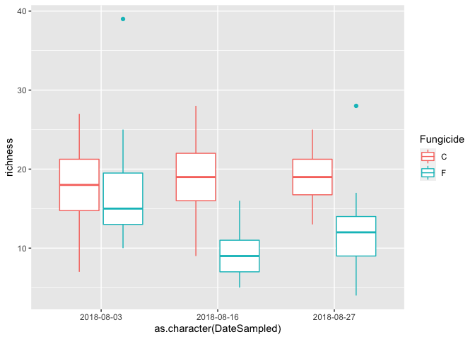
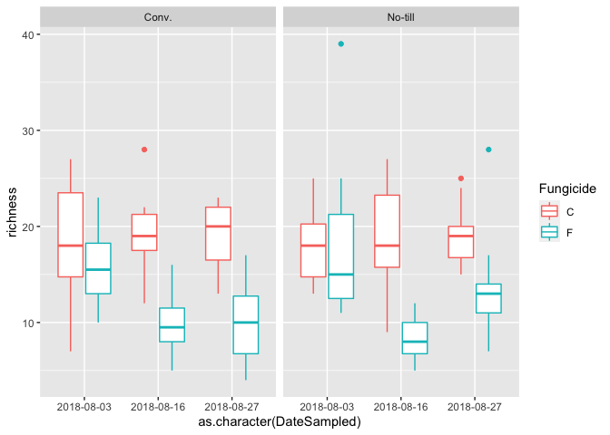
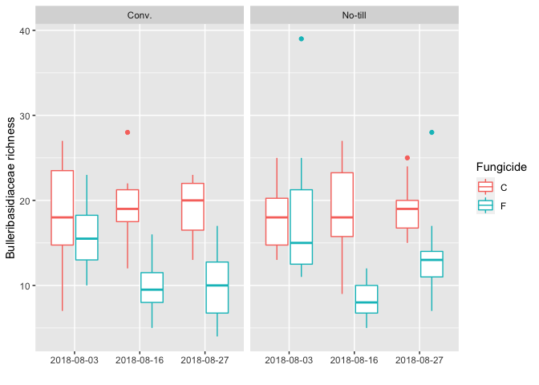
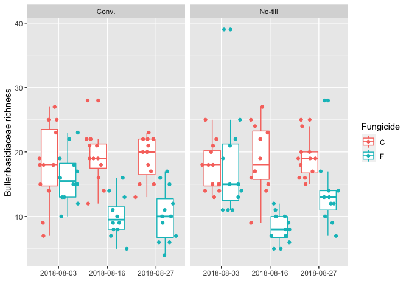
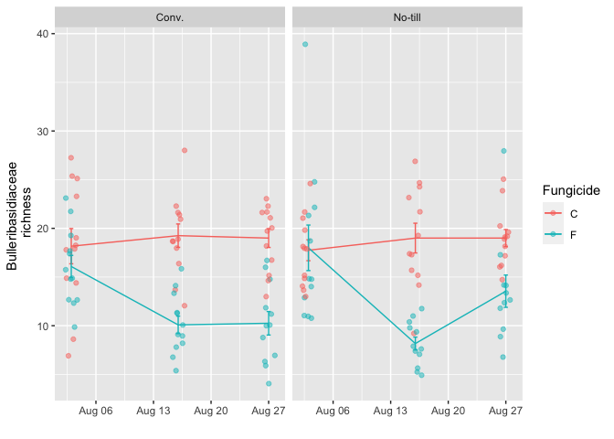
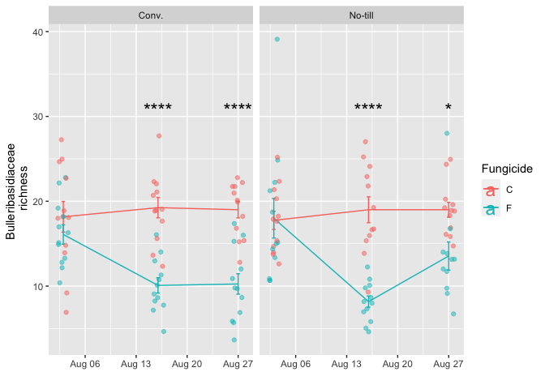
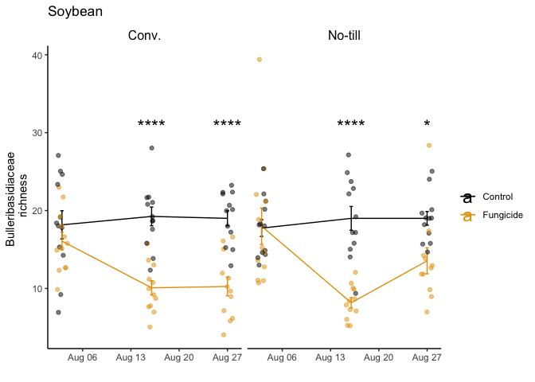
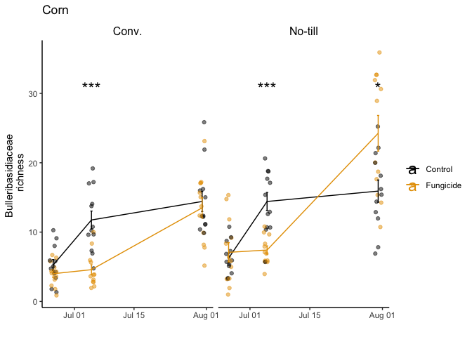
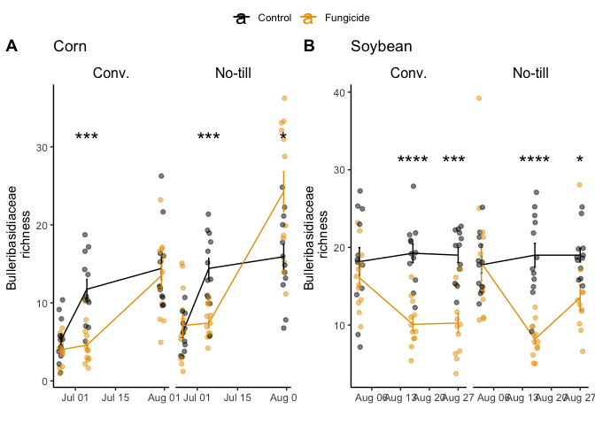

Load in packages you need
=========================

``` r
library(ggplot2)
```

    ## Warning: replacing previous import 'lifecycle::last_warnings' by
    ## 'rlang::last_warnings' when loading 'tibble'

    ## Warning: replacing previous import 'lifecycle::last_warnings' by
    ## 'rlang::last_warnings' when loading 'pillar'

``` r
library(tidyverse)
```

    ## ── Attaching packages ─────────────────────────────────────── tidyverse 1.3.0 ──

    ## ✔ tibble  3.1.4     ✔ dplyr   1.0.7
    ## ✔ tidyr   1.1.3     ✔ stringr 1.4.0
    ## ✔ readr   1.4.0     ✔ forcats 0.5.1
    ## ✔ purrr   0.3.4

    ## ── Conflicts ────────────────────────────────────────── tidyverse_conflicts() ──
    ## ✖ dplyr::filter() masks stats::filter()
    ## ✖ dplyr::lag()    masks stats::lag()

``` r
library(ggpubr)
```

Read in the data
================

``` r
bull.richness <- readRDS("Bull_richness.RDS")
```

Lets look at the data
=====================

``` r
str(bull.richness)
```

    ## 'data.frame':    287 obs. of  27 variables:
    ##  $ SampleID            : chr  "Corn2017LeafObjective2Collection1T1R1CAH2" "Corn2017LeafObjective2Collection1T1R1CBA3" "Corn2017LeafObjective2Collection1T1R1CCB3" "Corn2017LeafObjective2Collection1T1R1FAC3" ...
    ##  $ BarcodeSequence     : chr  "GGTTGAGAAG" "TATGTTGACG" "CGAGTATACA" "CGTTCAAGCT" ...
    ##  $ LinkerPrimerSequence: chr  "CAAGCAGAAGACGGCATACGAGAT" "CAAGCAGAAGACGGCATACGAGAT" "CAAGCAGAAGACGGCATACGAGAT" "CAAGCAGAAGACGGCATACGAGAT" ...
    ##  $ Region              : chr  "ITS" "ITS" "ITS" "ITS" ...
    ##  $ BC_plate            : int  3 3 3 3 3 3 3 3 3 3 ...
    ##  $ BC_name             : chr  "PCR_R_bc208" "PCR_R_bc209" "PCR_R_bc210" "PCR_R_bc211" ...
    ##  $ Crop                : chr  "Corn" "Corn" "Corn" "Corn" ...
    ##  $ Objective           : chr  "Objective 2" "Objective 2" "Objective 2" "Objective 2" ...
    ##  $ Collection          : chr  "1" "1" "1" "1" ...
    ##  $ Compartment         : chr  "Leaf" "Leaf" "Leaf" "Leaf" ...
    ##  $ DateSampled         : Date, format: "2017-06-26" "2017-06-26" ...
    ##  $ GrowthStage         : chr  "V6" "V6" "V6" "V6" ...
    ##  $ Treatment           : chr  "Conv." "Conv." "Conv." "Conv." ...
    ##  $ Rep                 : chr  "R1" "R1" "R1" "R1" ...
    ##  $ Sample              : chr  "A" "B" "C" "A" ...
    ##  $ Fungicide           : chr  "C" "C" "C" "F" ...
    ##  $ Target_organism     : chr  "Fungi" "Fungi" "Fungi" "Fungi" ...
    ##  $ Location            : chr  "Kellogg Biological Station" "Kellogg Biological Station" "Kellogg Biological Station" "Kellogg Biological Station" ...
    ##  $ Experiment          : chr  "LTER" "LTER" "LTER" "LTER" ...
    ##  $ Year                : int  2017 2017 2017 2017 2017 2017 2017 2017 2017 2017 ...
    ##  $ Phi2                : num  NA NA NA NA NA NA NA NA NA NA ...
    ##  $ PhiNO               : num  NA NA NA NA NA NA NA NA NA NA ...
    ##  $ PhiNPQ              : num  NA NA NA NA NA NA NA NA NA NA ...
    ##  $ Relative.Chlorophyll: num  NA NA NA NA NA NA NA NA NA NA ...
    ##  $ Sample_or_Control   : chr  "True Sample" "True Sample" "True Sample" "True Sample" ...
    ##  $ is.neg              : logi  FALSE FALSE FALSE FALSE FALSE FALSE ...
    ##  $ richness            : num  9 6 5 7 4 2 3 8 4 4 ...

These data contain data from a microbiome project where fungicides were
applied to corn and soybean that have been managed under no-till or
conventionally tillage. We sequenced the leaf microbiome before
fungicides were applied, one week following fungicide applicaiton, and
one month following fungicides. We also sequenced non-sprayed plots as
controls. Then using the sequence data we counted the number of species
of fungi in the Bulleribasidiaceae family.

In this dataset we are interested to know if the number of
Bulleribasidiaceae species was reduced by the fungicide sprays, and how
crop management influenced the disturbance.

So we have the following variables to express on the plot: -Date
Sampled: (i.e., before, one week, and one month after fungicide) -Crop:
Corn or soybean -richness (i.e., number of species) - RESPONSE (Y)
VARIABLE -Fungicide: Control vs. Fungicide sprayed -Treatment or crop
management: Conventional, or No-till

Set up a color blind friendly color pallete
===========================================

``` r
cbbPalette <- c("#000000", "#E69F00", "#56B4E9", "#009E73", "#F0E442", "#0072B2", "#D55E00", "#CC79A7")
```

Lets plot the data
==================

we will start with soybean

``` r
bull.richness.soy <- bull.richness[bull.richness$Crop == "Soy",] # subset to soy data

ggplot(bull.richness.soy, aes(x = as.character(DateSampled), y = richness, color = Fungicide)) + 
  geom_boxplot() 
```


Woo! you made your first ggplot. But… its not quite what we want. Since
it still doesn’t show the different crop managements. And, well its kind
of boring.

Lets make two plots for different managements using facet

``` r
ggplot(bull.richness.soy, aes(x = as.character(DateSampled), y = richness, color = Fungicide)) + 
  geom_boxplot() + 
  facet_wrap(~Treatment)
```



Lets give the plot custom x and y labels we can do that using xlab() and
ylab()

``` r
ggplot(bull.richness.soy, aes(x = as.character(DateSampled), y = richness, color = Fungicide)) + 
  geom_boxplot() + 
  facet_wrap(~Treatment) + 
  xlab("") + 
  ylab("Bulleribasidiaceae richness") 
```



Maybe we want to actually show all of the datapoints to really show the
distribution of the data. We can do that using geom\_point(), which adds
points to the plot, then we can tell it we want to “jitter” the points
to make a distribution of the points over the boxplot.

``` r
ggplot(bull.richness.soy, aes(x = as.character(DateSampled), y = richness, color = Fungicide)) + 
  geom_boxplot() + 
  facet_wrap(~Treatment) + 
  xlab("") + 
  ylab("Bulleribasidiaceae richness") +
  geom_point(position=position_jitterdodge(dodge.width=0.9)) 
```



Now, that’s not half bad! Except this really is a time series, and I
want to display the X axis as a nice date format. Also, I want to
connect the time points with a line, while still showing the
distribution of data. We can do that using the stat\_summary function of
ggplot. This is a very useful function, since it will plot the mean as
the point, or bar, or line etc. Then you can also use it to plot the SE
error bars.

``` r
ggplot(bull.richness.soy, aes(x = DateSampled, y = richness, color = Fungicide)) + 
  stat_summary(fun.y=mean,geom="line") +
  stat_summary(fun.data = mean_se, geom = "errorbar", width = 0.5) +
  ylab("Bulleribasidiaceae \n richness") + 
  xlab("") + 
  facet_wrap(~Treatment) + 
  geom_jitter(width = 0.8, alpha = 0.5)
```

    ## Warning: `fun.y` is deprecated. Use `fun` instead.



Great! Now let’s actually test to see if this is significant. We can use
the package ggpubr to put significance right on the plot. Of course, you
would already have done an ANOVA to show that the interaction of crop
management and fungicide treatment was significant… and test the
assumptions of heteroskedasticity… but this is visual exploratory
analysis.

``` r
ggplot(bull.richness.soy, aes(x = DateSampled, y = richness, color = Fungicide)) + 
  stat_summary(fun.y=mean,geom="line") +
  stat_summary(fun.data = mean_se, geom = "errorbar", width = 0.5) +
  ylab("Bulleribasidiaceae \n richness") + 
  xlab("") + 
  facet_wrap(~Treatment) + 
  geom_jitter(width = 0.8, alpha = 0.5) +
  stat_compare_means(method = "t.test", aes(label = ..p.signif..), hide.ns = TRUE, size = 6, label.y = 30) 
```

    ## Warning: `fun.y` is deprecated. Use `fun` instead.



Now we’ve got something! lets make it pretty. With some colors from our
color blind friendly pallete and change the legend text. Then I don’t
really like the boxes around the facets. So we can turn those white.
Finally we can give it a title. I will save the plot as an object for
displaying.

``` r
soy.bull <- ggplot(bull.richness.soy, aes(x = DateSampled, y = richness, color = Fungicide)) + 
  stat_summary(fun.y=mean,geom="line") +
  stat_summary(fun.data = mean_se, geom = "errorbar", width = 0.5) +
  ylab("Bulleribasidiaceae \n richness") + 
  xlab("") + 
  facet_wrap(~Treatment) + 
  geom_jitter(width = 0.8, alpha = 0.5) +
  stat_compare_means(method = "t.test", aes(label = ..p.signif..), hide.ns = TRUE, size = 6, label.y = 30) +
  theme_classic() +
  scale_color_manual(values=cbbPalette, label = c("Control", "Fungicide"), name = "") +
  theme(
   strip.background = element_rect(color="white"), 
   strip.text.x = element_text(size = 12, color = "black")) +
  ggtitle("Soybean") 
```

    ## Warning: `fun.y` is deprecated. Use `fun` instead.

``` r
soy.bull
```



Great! now lets apply this same plot to the corn.

``` r
bull.richness.corn <- bull.richness[bull.richness$Crop == "Corn",] # subset to corn data

corn.bull <- ggplot(bull.richness.corn, aes(x = DateSampled, y = richness, group = interaction(Fungicide, Treatment), color = Fungicide)) + 
  geom_jitter(width = 0.8, alpha = 0.5) +
  stat_summary(fun.y=mean,geom="line") +
  stat_summary(fun.data = mean_se, geom = "errorbar", width = 0.5) +
  ylab("Bulleribasidiaceae \n richness") + 
  xlab("")+
  scale_color_manual(values=cbbPalette, label = c("Control", "Fungicide"), name = "") +
  stat_compare_means(method = "wilcox", aes(label = ..p.signif..), hide.ns = TRUE, size = 6, label.y = 30) +
  theme_classic() +
  facet_wrap(~Treatment, scales = "free_x") +
  theme(
   strip.background = element_rect(color="white", fill="white", size=1.5, linetype="solid"),
   strip.text.x = element_text(size = 12, color = "black"),
   legend.position="right",
   legend.title = element_blank()) + 
  ggtitle("Corn") 
```

    ## Warning: `fun.y` is deprecated. Use `fun` instead.

``` r
corn.bull
```



Now we can put the two plots together into one using ggarage function in
the ggpubr package

``` r
ggarrange(corn.bull, soy.bull, common.legend = T, nrow = 1, ncol = 2, labels = c("A", "B"))
```



``` r
ggsave("Corn_Soy_Bull_Richness.pdf", dpi = 300) #save a pdf
```

    ## Saving 7 x 5 in image

ggarrange() has nice option to have a common legend between the two
plots. This is useful in this case, so I turned that to “T” for true.
You can also specify how you want the plots to be stuck together. I
wanted them side-by-side so I put them in 1 row and 2 columns. Then I
want a label as A and B for the two figures for the paper, so I can do
that with the labels option.

Next you can output the figure in several ways. You can ggsave() and
specify the DPI, which is useful for publication. The resulting figure
will be the same size as the panel figure. You can also specify the
height and width in the function if you want.

Alternatively, you can simply choose the export option on the figure
panel and chose what you want to do.
